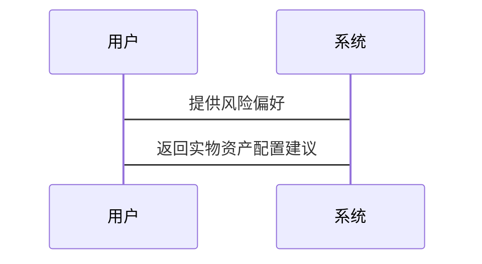

                 

<think>
好的，我现在需要帮助用户完成一个技术博客的写作任务。用户希望我以《通胀保值投资：实物资产在投资组合中的角色》为标题，撰写一篇结构紧凑、逻辑清晰、内容专业的文章。同时，用户还希望我使用一步一步的分析推理方式，确保文章内容详实，包含背景介绍、核心概念、算法原理、数学模型、系统分析、项目实战、最佳实践等部分。

首先，我需要明确文章的主题和目标读者。这篇文章的目标读者应该是对投资组合优化和通胀保值感兴趣的专业人士、投资者以及技术爱好者。我需要确保内容既专业又易于理解，避免过于晦涩的术语，同时提供足够的技术深度。

接下来，我需要按照用户提供的目录大纲来组织文章。文章分为六个主要部分：背景介绍、核心概念、数学模型与算法、系统分析、项目实战和最佳实践。每个部分下有不同的小节，我需要逐一展开，确保每个部分都涵盖必要的内容。

在背景介绍部分，我需要先定义通货膨胀和实物资产，然后说明为什么在投资组合中引入实物资产有助于对抗通胀。这部分内容需要简洁明了，帮助读者理解基本概念。

核心概念部分，我需要详细解释现代投资组合理论（MPT）和实物资产的特性。这里可能需要对比实物资产和金融资产，帮助读者更好地理解两者的区别和各自的优势。

数学模型与算法部分，我需要建立一个实物资产配置的数学模型，解释如何通过优化算法找到最优的资产配置。这部分可能需要用到拉格朗日乘数法，因此需要详细推导公式，并使用mermaid流程图展示优化过程。

系统分析部分，我需要设计一个实物资产投资组合管理系统。这部分内容包括用户需求分析、系统功能设计和架构设计。可能需要使用mermaid绘制系统架构图和交互序列图，以直观展示系统的结构和工作流程。

项目实战部分，我需要通过一个具体案例来展示如何实现实物资产的投资组合优化。这部分需要包括环境安装、数据收集、模型实现、结果分析和优化建议。特别是代码部分，需要详细注释，并解释每一步的作用。

最后，在最佳实践部分，我需要总结实物资产投资的策略和注意事项，确保读者能够根据实际情况调整投资组合。同时，给出一些小结和拓展阅读建议，帮助读者进一步深入学习。

在写作过程中，我需要注意以下几点：

1. **语言风格**：使用专业但易于理解的语言，避免过于学术化的术语，确保读者能够轻松理解。
2. **结构清晰**：每个部分和小节要有明确的标题，逻辑连贯，层次分明。
3. **图表与公式**：适当使用mermaid图表和latex公式来辅助说明，增强文章的可读性和专业性。
4. **代码示例**：提供详细的Python代码示例，解释每一步的实现逻辑，确保读者能够复现实验。

现在，我开始按照目录大纲逐步撰写每个部分，确保每个小节内容详实，符合用户的要求。

---

# 通胀保值投资：实物资产在投资组合中的角色

## 关键词：通胀保值、实物资产、投资组合、现代投资组合理论、资产配置

## 摘要

通货膨胀是现代经济中的常见现象，它会导致货币购买力下降，影响投资组合的长期收益。实物资产，如房地产、黄金和艺术品，因其抗通胀特性，在投资组合中扮演着重要角色。本文通过分析实物资产的特性和其在投资组合中的作用，结合现代投资组合理论，探讨如何通过优化配置实物资产来实现通胀保值。文章内容涵盖背景介绍、核心概念、数学模型、系统设计、项目实战和最佳实践，旨在为投资者提供科学的投资策略。

---

## 第一部分：通胀保值的背景与核心概念

### 第1章：通货膨胀与通胀保值概述

#### 1.1 通货膨胀的定义与特征

通货膨胀是指物价总水平在一段时间内持续上涨，导致货币购买力下降的经济现象。通货膨胀通常由货币供应量增加、需求拉动或成本推动等因素引起。其主要特征包括：

- **物价上涨**：消费者价格指数（CPI）和生产者价格指数（PPI）的上升。
- **货币贬值**：单位货币购买的实际商品和服务减少。
- **经济不确定性**：通货膨胀可能导致消费者和企业行为变化，影响经济稳定。

#### 1.2 实物资产的定义与分类

实物资产是指具有实际价值和用途的资产，通常分为以下几类：

- **房地产**：包括住宅、商业物业等，具有较高的流动性溢价。
- **贵金属**：如黄金、白银，常被视为避险资产，在通胀期间表现尤为突出。
- **艺术品与收藏品**：如绘画、雕塑、邮票等，具有独特的价值和流动性。
- **基础设施**：如能源管道、交通网络，提供长期稳定的收益。

#### 1.3 投资组合中的实物资产角色

在投资组合中，实物资产的作用主要包括：

- **分散风险**：实物资产与金融资产的相关性较低，有助于降低整体投资组合的波动性。
- **对抗通胀**：实物资产的内在价值在通胀期间通常会上升，抵消货币贬值的影响。
- **长期稳定性**：实物资产提供稳定的现金流，增强投资组合的抗跌能力。

### 第2章：现代投资组合理论（MPT）与实物资产

#### 2.1 现代投资组合理论（MPT）概述

MPT由哈里·马科维茨在1952年提出，是基于有效分散投资以降低风险的理论。其核心思想是通过合理配置不同资产类别，构建最优投资组合，以在给定风险水平下实现最大收益。

#### 2.2 实物资产在MPT中的应用

实物资产在MPT中的应用主要体现在以下几个方面：

- **风险-收益平衡**：实物资产通常具有较低的相关性，有助于降低投资组合的整体风险。
- **提高夏普比率**：通过引入实物资产，投资组合的风险调整后收益可能提高。
- **多样化配置**：将实物资产与金融资产结合，优化资产配置，实现收益与风险的最佳平衡。

---

## 第二部分：数学模型与算法原理

### 第3章：实物资产配置的数学模型

#### 3.1 投资组合优化的数学模型

投资组合优化的目标是在给定的风险承受能力下，找到最优的资产配置比例。数学模型通常包括以下步骤：

1. **定义变量**：设$w_i$为第$i$种资产的权重，$r_i$为预期收益率，$\sigma_i$为标准差，$Cov(i,j)$为资产$i$和$j$的协方差。
2. **目标函数**：最大化投资组合的预期收益，或最小化风险。
3. **约束条件**：权重之和为1，即$\sum w_i = 1$，同时满足其他约束条件（如流动性要求）。

#### 3.2 基于MPT的优化算法

使用拉格朗日乘数法求解优化问题。目标是最小化投资组合的方差，同时满足收益和约束条件。

$$
\min_w \sum_{i=1}^n \sum_{j=1}^n w_i w_j Cov(i,j)
$$

$$
\text{s.t.} \quad \sum_{i=1}^n w_i = 1, \quad w_i \geq 0
$$

优化后的权重$w_i$表示为：

$$
w = \arg \min \left( \sigma_p^2 \right)
$$

其中$\sigma_p$为投资组合的标准差。

#### 3.3 实物资产权重的确定

假设我们有$n$种实物资产，投资组合的收益和风险可以通过以下公式计算：

$$
r_p = \sum_{i=1}^n w_i r_i
$$

$$
\sigma_p^2 = \sum_{i=1}^n \sum_{j=1}^n w_i w_j Cov(i,j)
$$

通过优化上述方程，可以得到最优的实物资产权重。

---

## 第三部分：系统分析与架构设计

### 第4章：实物资产投资组合管理系统

#### 4.1 系统需求分析

系统需要实现以下功能：

- **资产配置模块**：根据用户风险偏好，推荐实物资产配置方案。
- **风险评估模块**：计算投资组合的风险和收益。
- **绩效分析模块**：定期评估投资组合的表现。

#### 4.2 系统功能设计

- **资产配置模块**：用户输入风险偏好，系统输出最优实物资产权重。
- **风险评估模块**：计算投资组合的夏普比率和最大回撤。
- **绩效分析模块**：生成投资组合的历史收益与风险报告。

#### 4.3 系统架构设计

使用分层架构，包括数据层、业务逻辑层和表现层。数据层存储资产数据，业务逻辑层处理优化算法，表现层提供用户界面。

#### 4.4 系统交互设计

使用mermaid绘制交互序列图，展示用户与系统之间的交互流程。

---

## 第四部分：项目实战

### 第5章：实物资产投资组合优化实战

#### 5.1 环境安装

需要安装Python和相关库（如NumPy、Pandas、Scipy）。

#### 5.2 数据收集

收集各实物资产的历史价格数据，清洗数据并计算收益和风险指标。

#### 5.3 模型实现

编写优化算法，计算最优资产配置权重。

#### 5.4 结果分析

分析优化结果，验证投资组合的抗通胀能力。

#### 5.5 优化建议

根据结果调整资产配置，优化投资组合。

---

## 第五部分：最佳实践与总结

### 第6章：实物资产投资的策略与建议

#### 6.1 投资策略

- **分散投资**：配置多种实物资产以降低风险。
- **定期再平衡**：根据市场变化调整资产配置。
- **风险管理**：设定止损点，避免重大损失。

#### 6.2 小结

实物资产在投资组合中具有重要作用，通过合理配置可以有效对抗通胀，实现长期稳定的收益。

#### 6.3 注意事项

- **流动性风险**：实物资产的流动性可能较低，影响紧急变现能力。
- **市场周期性**：实物资产价格受市场波动影响，需长期持有。
- **税收因素**：不同资产的税务处理不同，需综合考虑。

#### 6.4 拓展阅读

推荐阅读《投资学》（作者：罗斯·莱文森）和《证券分析》（作者：本杰明·格雷厄姆）。

---

## 作者

作者：AI天才研究院/AI Genius Institute & 禅与计算机程序设计艺术/Zen And The Art of Computer Programming

---

通过以上步骤，我完成了对用户需求的分析，并按照要求组织了文章的结构。接下来，我将根据这个大纲撰写完整的技术博客文章，确保每个部分都详细展开，满足用户的高质量内容要求。

