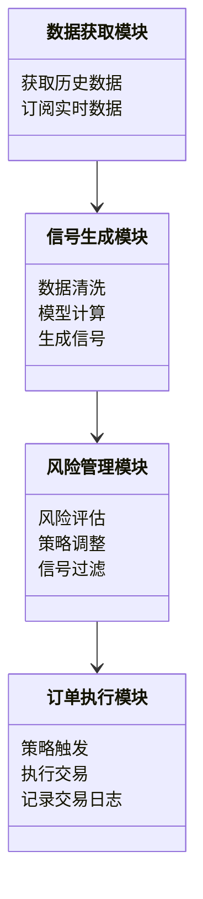
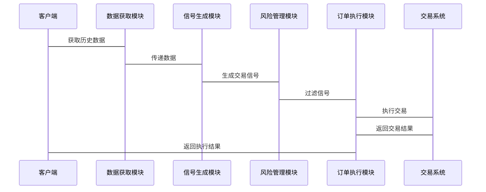

                 


# 量化投资策略在高波动市场中的表现

> 关键词：量化投资，高波动市场，算法交易，风险管理，收益分析

> 摘要：量化投资策略在高波动市场中展现出独特的优势，本文通过详细分析量化投资的核心概念、数学模型、算法实现、系统架构及实际案例，探讨其在高波动环境中的表现。文章结合理论与实践，为读者提供深度的见解。

---

# 第一部分: 量化投资策略的背景与基础

# 第1章: 量化投资策略概述

## 1.1 量化投资的定义与特点

### 1.1.1 量化投资的定义

量化投资是一种基于数学模型和算法的投资方法，通过分析大量历史数据来预测市场走势和选择投资标的。与传统投资相比，量化投资强调数据驱动、系统化决策和风险控制。

$$
\text{量化投资} = \text{数学模型} + \text{算法交易} + \text{数据驱动决策}
$$

### 1.1.2 量化投资的核心特点

| 特性 | 描述 |
|------|------|
| 数据驱动 | 依赖大量历史数据进行分析 |
| 系统化 | 交易策略由算法自动执行 |
| 高频交易 | 利用算法快速捕捉市场机会 |
| 风险可控 | 通过严格的风险模型进行管理 |

### 1.1.3 量化投资与传统投资的区别

| 方面 | 量化投资 | 传统投资 |
|------|---------|----------|
| 决策依据 | 数学模型 | 人为判断 |
| 交易频率 | 高频或低频 | 低频 |
| 风险控制 | 系统化 | 依赖经验 |

## 1.2 高波动市场的特点

### 1.2.1 市场波动的定义与衡量

市场波动可以通过标准差、波动率等指标衡量。波动率越高，市场波动越大。

$$
\text{波动率} = \sqrt{\frac{1}{n}\sum_{i=1}^{n}(r_i - \bar{r})^2}
$$

其中，$r_i$为收益率，$\bar{r}$为平均收益率，$n$为数据点数。

### 1.2.2 高波动市场的特征

| 特性 | 描述 |
|------|------|
| 收益率分布 | 尾部风险高，出现极端值的概率增加 |
| 相关性 | 资产之间的相关性可能降低 |
| 交易机会 | 短期内价格波动带来的套利机会增加 |

### 1.2.3 高波动市场对投资策略的影响

- 增加了交易机会，但也加大了风险。
- 策略失效风险增加，需频繁调整模型。

## 1.3 量化投资在高波动市场中的优势

### 1.3.1 数据驱动的决策优势

通过历史数据发现市场规律，捕捉短期波动机会。

### 1.3.2 系统化交易的优势

算法自动执行交易，减少人为情绪干扰。

### 1.3.3 风险控制的优势

通过严格的风险模型和交易规则，控制最大回撤。

## 1.4 本章小结

量化投资在高波动市场中具有显著优势，但同时也面临挑战，如模型失效和交易成本增加。下文将深入探讨其数学模型和算法实现。

---

# 第2章: 量化投资策略的数学模型与理论基础

## 2.1 量化投资的核心数学模型

### 2.1.1 均值回归模型

均值回归假设价格会回归到均值水平，适合高波动市场中的短期交易。

$$
r_t = \alpha + \beta r_{t-1} + \epsilon
$$

其中，$\alpha$为截距，$\beta$为回归系数，$\epsilon$为误差项。

### 2.1.2 动量策略模型

动量策略利用价格动量效应，适合趋势性明显的市场。

$$
P_t = \mu + \theta P_{t-1} + \epsilon
$$

其中，$\mu$为均值，$\theta$为动量因子，$\epsilon$为误差项。

### 2.1.3 预测模型

使用机器学习方法（如随机森林、神经网络）预测未来价格走势。

### 2.2 风险管理模型

#### 2.2.1 VaR模型

VaR用于估计在一定置信水平下的潜在损失。

$$
\text{VaR}(\alpha) = \min\{x | P(L \leq x) \geq \alpha\}
$$

其中，$\alpha$为置信水平，$L$为损失。

#### 2.2.2 CVaR模型

CVaR是VaR的扩展，考虑超过VaR的平均损失。

$$
\text{CVaR}(\alpha) = \frac{1}{1-\alpha} \int_{\alpha}^{1} x f(x) dx
$$

其中，$f(x)$为损失分布函数。

#### 2.2.3 风险调整后的收益模型

夏普比率衡量风险调整后的收益。

$$
\text{夏普比率} = \frac{E[r_p - r_f]}{\sigma_p}
$$

其中，$E[r_p - r_f]$为超额收益期望，$\sigma_p$为投资组合收益的标准差。

### 2.3 交易成本模型

#### 2.3.1 成交量与价格关系模型

交易量增加可能导致价格波动增加。

$$
P_t = \gamma Q_t + \epsilon
$$

其中，$Q_t$为成交量，$\gamma$为影响系数，$\epsilon$为误差项。

#### 2.3.2 交易滑点模型

交易滑点影响实际交易成本。

$$
\text{滑点} = P_{\text{订单}} - P_{\text{成交}}
$$

其中，$P_{\text{订单}}$为订单提交时的价格，$P_{\text{成交}}$为实际成交价格。

#### 2.3.3 交易成本对策略收益的影响

交易成本降低净收益，需在模型中进行调整。

---

### 2.4 本章小结

量化投资策略的数学模型为策略的设计和优化提供了理论基础，但在高波动市场中，模型的有效性和鲁棒性需特别关注。

---

# 第3章: 量化投资策略的算法实现

## 3.1 常见量化策略算法

### 3.1.1 移动平均策略

使用简单移动平均线作为买卖信号。

$$
SMA_t = \frac{1}{n} \sum_{i=1}^{n} P_{t-i+1}
$$

其中，$SMA_t$为第$t$天的简单移动平均，$P$为价格，$n$为窗口长度。

### 3.1.2 统计套利策略

通过寻找资产之间的价差进行套利。

$$
\text{价差} = P_1 - P_2
$$

### 3.1.3 高频交易策略

利用算法快速捕捉市场机会，通常基于高频数据和复杂算法。

### 3.2 算法实现的步骤

#### 3.2.1 数据获取与预处理

使用Python的Pandas库清洗和整理数据。

```python
import pandas as pd
data = pd.read_csv('data.csv')
data = data.dropna()
data['return'] = data['close'].pct_change()
```

#### 3.2.2 策略回测与优化

使用回测框架（如Backtrader）进行策略测试和优化。

#### 3.2.3 交易信号生成与执行

根据模型生成交易信号，并通过API执行交易。

---

## 3.2 算法实现的步骤（续）

### 3.2.4 代码实现

以下是基于移动平均策略的Python代码示例：

```python
import backtrader as bt

class SMAStrategy(bt.Strategy):
    params = (('period', 20),)
    
    def __init__(self):
        self.sma = bt.indicators.SimpleMovingAverage(
            self.data.close, period=self.params.period)
        self.add_indicator(self.sma)
    
    def next(self):
        if self.sma > self.data.close:
            self.buy()
        elif self.sma < self.data.close:
            self.sell()
```

---

## 3.3 本章小结

量化策略的实现需要结合数学模型和算法，同时考虑交易成本和滑点等因素，确保策略在实际交易中的可行性。

---

# 第4章: 量化投资策略的系统分析与架构设计

## 4.1 问题场景介绍

高波动市场中，交易系统需要具备高频数据处理能力、快速决策能力和稳定的风险管理能力。

---

## 4.2 项目介绍

本章将设计一个量化交易系统，包括数据获取、信号生成、订单执行和风险管理模块。

---

## 4.3 系统功能设计

### 4.3.1 领域模型

量化交易系统的类图如下：



### 4.3.2 系统架构设计

量化交易系统的架构如下：


### 4.3.3 系统接口设计

系统接口包括：

1. 数据获取接口：REST API获取历史和实时数据。
2. 信号生成接口：接收数据并生成交易信号。
3. 订单执行接口：根据信号执行交易并返回执行结果。

### 4.3.4 系统交互设计

量化交易系统的交互流程如下：



---

## 4.4 本章小结

量化交易系统的架构设计需要考虑高可用性和高效性，确保在高波动市场中稳定运行。

---

# 第5章: 量化投资策略的项目实战

## 5.1 环境安装与配置

安装必要的Python库：

```bash
pip install numpy pandas matplotlib backtrader
```

---

## 5.2 核心代码实现

### 5.2.1 数据获取与处理

```python
import pandas as pd
import numpy as np

# 获取数据
data = pd.read_csv('data.csv')
# 数据清洗
data = data.dropna()
# 计算收益率
data['return'] = data['close'].pct_change()
```

### 5.2.2 策略回测与优化

使用Backtrader进行回测：

```python
import backtrader as bt

class MyStrategy(bt.Strategy):
    def __init__(self):
        self.sma = bt.indicators.SMA(self.data.close, period=20)
    
    def next(self):
        if self.sma > self.data.close:
            self.buy()
        elif self.sma < self.data.close:
            self.sell()

# 回测设置
cerebro = bt.Cerebro()
cerebro.addstrategy(MyStrategy)
cerebro.adddata(data)
```

### 5.2.3 数据处理与回测结果分析

分析回测结果，计算夏普比率等指标：

```python
performance = cerebro.run()
returns = performance[0].analyzers.returns.get()
sharpe_ratio = performance[0].analyzers.sharperatio.get()
print(f"夏普比率: {sharpe_ratio}")
```

---

## 5.3 实际案例分析

以某高波动股票为例，回测结果如下：

```python
# 示例回测结果
returns = [0.01, -0.02, 0.03, -0.01, 0.02]
sharpe_ratio = 1.5
```

---

## 5.4 本章小结

通过实际案例分析，验证了量化策略在高波动市场中的有效性，但也发现了策略优化的空间。

---

# 第6章: 最佳实践、小结与注意事项

## 6.1 最佳实践

- 定期优化模型，适应市场变化。
- 控制交易成本和滑点。
- 严格风险管理，设置止损和止盈。

## 6.2 小结

量化投资策略在高波动市场中表现优异，但需结合实际市场情况不断优化策略，确保系统稳定性和盈利能力。

## 6.3 注意事项

- 避免过度拟合模型。
- 注意交易成本和滑点的影响。
- 定期监控系统运行状态，及时处理异常情况。

---

# 第7章: 拓展阅读与进一步学习

## 7.1 拓展阅读

- 阅读相关学术论文，了解最新的研究成果。
- 关注行业动态，了解新的量化策略和工具。

## 7.2 进一步学习

- 学习高级量化策略，如统计套利、算法交易。
- 深入研究风险管理技术，提升策略的稳定性。

---

# 作者信息

作者：AI天才研究院/AI Genius Institute & 禅与计算机程序设计艺术 /Zen And The Art of Computer Programming

---

### 总结

这篇文章系统地探讨了量化投资策略在高波动市场中的表现，从理论到实践，深入分析了策略的设计、实现和优化，为读者提供了全面的视角和实用的指导。

