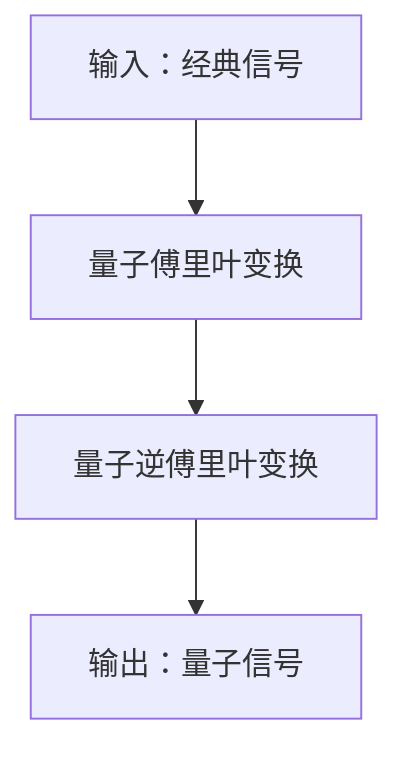
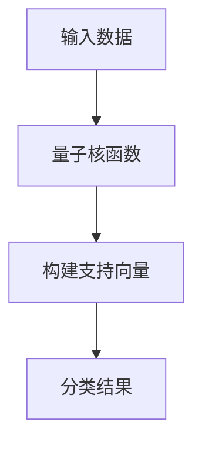
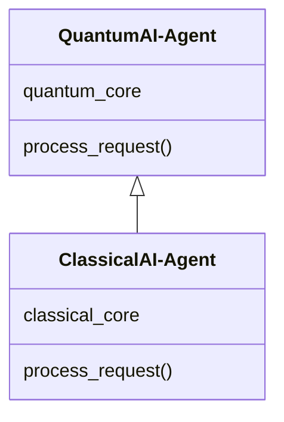

                 


# 量子计算+AI：未来AI Agent的计算范式

## 关键词：
量子计算, 人工智能, AI Agent, 量子算法, 量子优化, 量子机器学习

## 摘要：
本文探讨了量子计算与人工智能的结合，特别是其对未来AI Agent计算范式的影响。通过分析量子计算的基本原理、AI的核心概念，以及它们在算法设计、系统架构和项目实现中的应用，展示了如何利用量子计算提升AI Agent的性能和效率，为未来的AI技术发展提供了新的思路。

---

# 引言

## 1. 量子计算与AI概述

### 1.1 量子计算的基本概念

#### 1.1.1 从经典计算到量子计算的演进
经典计算基于二进制位，每个位独立且互不影响。量子计算则引入了量子位(qubits)，利用叠加态和纠缠态实现并行计算，极大地提升了计算效率。

#### 1.1.2 量子计算的核心特点
- **叠加态**：量子位可以同时处于0和1的状态。
- **纠缠态**：多个量子位之间形成强关联，操作其中一个会影响另一个。
- **量子并行**：利用叠加态同时处理多个问题。

#### 1.1.3 量子计算与经典计算的对比分析
| 特性       | 经典计算       | 量子计算       |
|------------|----------------|----------------|
| 基础单位   | 二进制位       | 量子位(qubits)  |
| 并行性      | 串行处理       | 并行处理         |
| 处理速度    | 线性增长        | 指数级增长       |

### 1.2 AI的基本概念

#### 1.2.1 人工智能的定义与特点
AI是指模拟人类智能的系统，具备学习、推理和自适应能力。

#### 1.2.2 传统AI与现代AI的发展
- 传统AI依赖规则和逻辑推理。
- 现代AI（如机器学习）通过数据训练模型，实现自动分类和预测。

---

## 2. 量子计算与AI的核心概念

### 2.1 量子计算的核心原理

#### 2.1.1 量子叠加
量子位的状态可以表示为：
$$ |q\rangle = \alpha|0\rangle + \beta|1\rangle $$
其中，$|\alpha|^2 + |\beta|^2 = 1$。

#### 2.1.2 量子纠缠
两个量子位的纠缠态表示为：
$$ |q_1 q_2\rangle = \frac{1}{\sqrt{2}}(|01\rangle + |10\rangle) $$

### 2.2 AI的核心原理

#### 2.2.1 机器学习模型
- **监督学习**：通过标记数据训练模型。
- **无监督学习**：通过未标记数据发现模式。

### 2.3 量子计算与AI的联系与对比

| 特性       | 量子计算       | AI             |
|------------|----------------|----------------|
| 数据处理   | 高效处理复杂问题| 依赖大量数据     |
| 并行性      | 强大并行能力     | 串行处理为主     |

---

## 3. 量子计算在AI中的应用算法

### 3.1 量子傅里叶变换

#### 3.1.1 量子傅里叶变换的流程图


#### 3.1.2 量子傅里叶变换的数学模型
$$ F = \sum_{k=0}^{N-1} f_k e^{2\pi i j k / N} $$
其中，$F$为变换结果，$f_k$为输入信号。

### 3.2 量子支持向量机

#### 3.2.1 量子支持向量机的流程图


---

## 4. 系统分析与架构设计

### 4.1 系统功能设计

#### 4.1.1 功能模块
- 数据预处理
- 量子算法实现
- 结果分析

### 4.2 系统架构图


---

## 5. 项目实战

### 5.1 环境安装

```bash
pip install qiskit
pip install numpy
pip install scikit-learn
```

### 5.2 核心代码实现

```python
from qiskit import QuantumCircuit, Aer, execute
from qiskit.circuit import QuantumRegister, ClassicalRegister

def quantum_ai_circuit(n):
    qr = QuantumRegister(n)
    cr = ClassicalRegister(n)
    qc = QuantumCircuit(qr, cr)
    qc.h(qr)
    qc.measure(qr, cr)
    return qc

circuit = quantum_ai_circuit(2)
backend = Aer.get_backend('qasm_simulator')
job = execute(circuit, backend)
result = job.result()
```

### 5.3 实例分析

```python
result.get_counts()
```

---

## 6. 总结与展望

### 6.1 内容总结
量子计算与AI的结合为AI Agent提供了更高效的计算范式，特别是在数据处理和模式识别方面。

### 6.2 最佳实践
- 结合经典与量子计算，充分利用两者优势。
- 定期更新算法和模型，保持系统的先进性。

### 6.3 未来展望
随着量子计算技术的进步，AI Agent将在更多领域实现突破，如药物发现和金融分析。

---

作者：AI天才研究院 & 禅与计算机程序设计艺术

