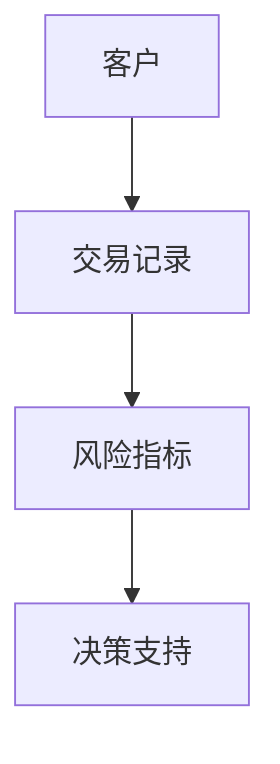
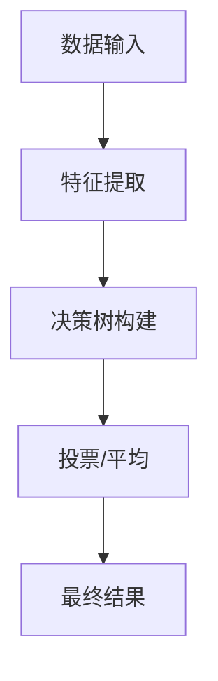
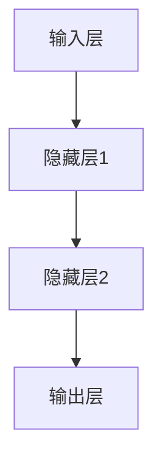
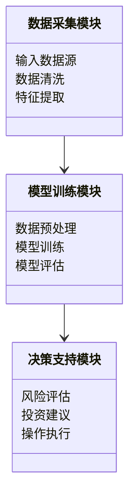
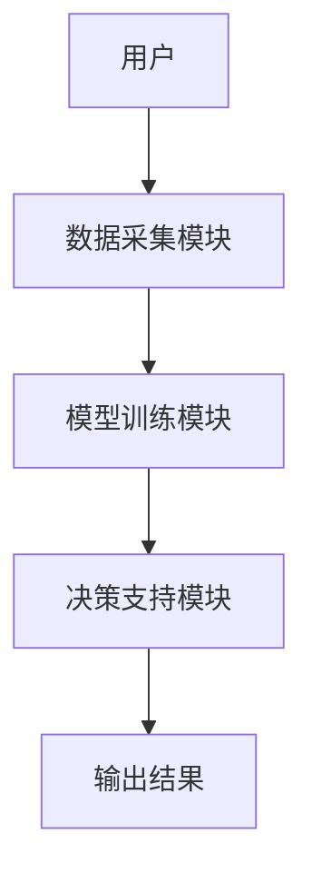

                 

# 金融AI Agent：风险评估与决策支持

## 关键词：金融AI Agent，风险评估，决策支持，机器学习，深度学习，自然语言处理

## 摘要：  
本文深入探讨了金融AI Agent在风险评估与决策支持中的应用，结合实际案例和技术细节，分析了AI Agent在金融领域的核心原理、算法实现和系统架构设计，为读者提供从理论到实践的全面解析。

---

## 第一部分：金融AI Agent概述

### 第1章：金融AI Agent的背景与概念

#### 1.1 传统金融风险评估的局限性
传统金融风险评估方法主要依赖于统计分析和经验判断，存在以下问题：
- 数据维度有限，难以捕捉非结构化信息
- 模型静态化，难以应对动态市场变化
- 人工干预较多，效率低下且主观性强

AI技术的引入弥补了这些不足，通过自动化数据处理和智能决策，显著提升了风险评估的精度和效率。

#### 1.2 金融AI Agent的核心定义与特点
金融AI Agent是一种具备感知、决策和执行能力的智能系统，其特点包括：
- **自主性**：能够在无外部干预的情况下独立运行
- **反应性**：能够实时感知市场变化并做出响应
- **学习能力**：通过机器学习算法不断优化自身模型

#### 1.3 金融AI Agent的应用场景
AI Agent在金融领域的应用主要集中在以下几个方面：
1. **风险评估**：通过分析海量数据，识别潜在风险点
2. **投资决策支持**：为投资者提供智能化的决策支持
3. **欺诈检测**：利用AI技术实时监控交易行为，识别欺诈交易

---

## 第二部分：金融AI Agent的核心原理

### 第2章：金融AI Agent的核心概念与联系

#### 2.1 核心概念原理
金融AI Agent的工作流程包括以下几个模块：
- **感知模块**：通过数据采集和特征提取，获取市场数据和相关信息
- **决策模块**：基于感知到的数据，利用机器学习算法进行风险评估和决策
- **执行模块**：根据决策结果，执行相应的操作（如调整投资组合）

#### 2.2 核心概念对比表
以下是金融AI Agent与传统算法的核心区别：

| **特性**       | **传统算法**               | **金融AI Agent**              |
|----------------|----------------------------|-------------------------------|
| 数据来源       | 结构化数据为主              | 结构化数据 + 非结构化数据     |
| 模型类型       | 单一模型为主                | 组合模型（监督 + 无监督）      |
| 应用目标       | 风险评估                    | 风险评估 + 决策支持           |
| 自适应能力     | 较低                       | 较高                          |

#### 2.3 ER实体关系图
以下是金融AI Agent涉及的实体关系图：

---

## 第三部分：金融AI Agent的算法原理

### 第3章：金融AI Agent的算法原理

#### 3.1 算法原理概述
金融AI Agent的核心算法包括随机森林和神经网络。

##### 3.1.1 随机森林在风险评估中的应用
随机森林是一种基于决策树的集成学习算法，适用于金融风险评估中的分类和回归问题。以下是其实现流程：

##### 3.1.2 神经网络在决策支持中的作用
神经网络通过多层非线性变换，能够捕捉复杂的市场规律。以下是其实现流程：

##### 3.1.3 时间序列分析的数学模型
时间序列分析常用于金融市场的预测。其核心模型包括ARIMA和LSTM，以下是LSTM的数学表达式：

$$
f_t = \sigma(W_{f} \cdot [h_{t-1}, x_t] + b_f)
$$

$$
i_t = \sigma(W_{i} \cdot [h_{t-1}, x_t] + b_i)
$$

$$
o_t = \sigma(W_{o} \cdot [h_{t-1}, x_t] + b_o)
$$

$$
h_t = f_t \cdot c_t + i_t \cdot c_{t-1}
$$

$$
c_t = o_t \cdot h_t
$$

---

## 第四部分：金融AI Agent的系统分析与架构设计

### 第4章：系统分析与架构设计方案

#### 4.1 系统功能设计
以下是金融AI Agent的系统功能模块设计：

#### 4.2 系统架构设计
以下是金融AI Agent的系统架构设计：

---

## 总结与展望

金融AI Agent作为一种新兴的技术工具，正在逐步改变金融行业的运作方式。通过结合机器学习、深度学习和自然语言处理，AI Agent能够为金融机构提供更精准的风险评估和决策支持。然而，其应用仍面临数据隐私、模型解释性等挑战。未来，随着技术的不断进步，金融AI Agent将在更多领域发挥重要作用。

---

## 作者：AI天才研究院 & 禅与计算机程序设计艺术

---

以上是《金融AI Agent：风险评估与决策支持》的技术博客文章的完整目录大纲和部分内容示例，您可以根据需要扩展每一部分的内容。

