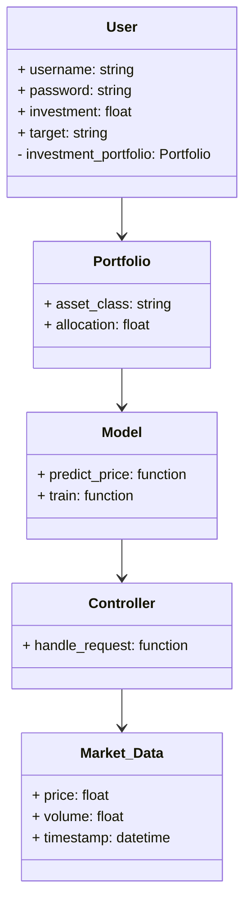
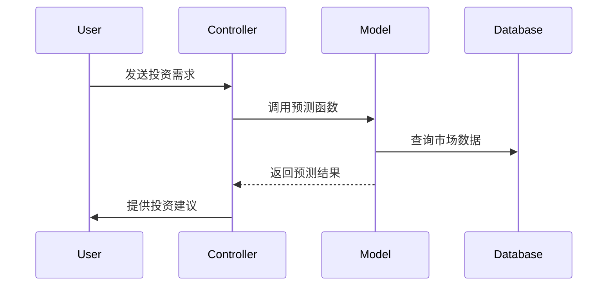

                 


# 金融AI应用的全面测试与质量保证策略

## 关键词：金融AI、测试策略、质量保证、系统架构、机器学习、深度学习

## 摘要：本文系统地探讨了金融AI应用的全面测试与质量保证策略，从核心概念、技术原理到实际项目案例，详细分析了如何确保金融AI系统的性能、安全和可靠性。文章结合理论与实践，提出了有效的质量保证框架和最佳实践，为金融AI项目的成功实施提供了指导。

---

## 第一部分：金融AI应用的背景与概述

### 第1章：金融AI应用的背景与现状

#### 1.1 金融AI应用的背景

金融行业正经历数字化转型的浪潮，人工智能（AI）技术的引入极大地改变了传统金融业务的运作方式。AI在金融中的应用不仅提高了效率，还增强了决策的准确性。例如，AI驱动的算法交易可以在毫秒级别完成交易决策，显著提高了交易速度和市场响应能力。

**问题背景**：
传统金融业务依赖于人工分析和经验判断，存在效率低、误差大等问题。尤其是在风险管理、欺诈检测和投资决策等领域，传统方法难以应对日益复杂的市场环境。AI技术的应用能够帮助金融机构更快地识别市场趋势，优化投资组合，并降低风险。

**问题解决**：
AI技术，尤其是机器学习和深度学习，能够处理海量数据，提取复杂模式，并做出实时决策。这些技术的应用使金融机构能够更精准地预测市场走势，评估客户信用，识别欺诈行为，从而提高业务效率和决策质量。

**边界与外延**：
金融AI的应用范围涵盖证券分析、风险管理、信用评分、欺诈检测等多个领域。外延则扩展到智能投顾、金融新闻分析和客户行为预测等方面，形成一个全面的金融智能生态系统。

**核心要素**：
- 数据：高质量的金融数据是AI模型的基础。
- 模型：适用的机器学习或深度学习算法。
- 计算能力：强大的计算资源支持模型训练和推理。
- 业务理解：对金融业务的深刻理解以确保模型应用的有效性。

#### 1.2 人工智能技术的金融应用现状

当前，金融AI应用主要集中在以下几个方面：

1. **算法交易**：利用AI快速分析市场数据，执行高频交易。
2. **风险管理**：通过AI模型预测市场波动，评估投资组合风险。
3. **客户画像与营销**：基于AI分析客户行为，制定精准营销策略。
4. **欺诈检测**：利用AI实时监控交易，识别异常行为。

**发展趋势**：
随着技术进步，金融AI将更加智能化和个性化。未来的趋势包括：
- 自动化投资顾问：根据客户需求自动调整投资组合。
- 实时风险评估：基于实时数据，动态调整风险管理策略。
- 多模态数据融合：结合文本、语音等多种数据源进行分析。

---

## 第二部分：金融AI应用的核心概念与技术原理

### 第2章：金融AI的核心概念与技术原理

#### 2.1 金融AI的核心概念

**智能投顾**：AI驱动的投资顾问服务，根据客户需求自动制定投资策略。例如，用户的风险承受能力和财务目标决定了投资组合的构成。

**信用评分**：利用机器学习模型评估客户的信用风险，帮助金融机构做出贷款决策。

**欺诈检测**：通过分析交易数据，识别异常交易行为，预防欺诈行为。

#### 2.2 金融AI的关键技术原理

**机器学习在金融中的应用**：
- **监督学习**：用于分类任务，如欺诈检测和信用评分。
- **无监督学习**：用于聚类分析，如客户分群和异常检测。

**深度学习在金融中的应用**：
- **神经网络**：用于复杂模式识别，如股票价格预测和新闻情感分析。
- **循环神经网络（RNN）**：处理时间序列数据，如汇率预测。

**自然语言处理（NLP）在金融中的应用**：
- **情感分析**：分析金融新闻和社交媒体的情绪，预测市场走势。
- **实体识别**：从金融文本中提取关键信息，如公司名称和交易金额。

---

## 第三部分：金融AI应用的测试与质量保证策略

### 第3章：金融AI应用测试的理论基础

#### 3.1 金融AI测试的基本概念

**测试目标**：
确保AI模型在实际应用中的准确性和稳定性，避免因模型错误导致的经济损失。

**测试原则**：
- **全面性**：覆盖所有可能的输入和场景。
- **及时性**：发现问题并及时修复。
- **可重复性**：测试过程和结果必须可重复。

**测试挑战**：
- **数据依赖性**：模型性能高度依赖数据质量。
- **模型解释性**：需要理解模型的决策过程，以便定位问题。
- **实时性要求**：金融应用往往需要实时响应，测试必须高效。

#### 3.2 金融AI测试的核心技术

**测试指标**：
- **准确率**：模型预测的正确比例。
- **召回率**：模型识别的正例比例。
- **F1分数**：综合准确率和召回率的指标。

**测试工具**：
- **自动化测试工具**：如Selenium，用于测试交易系统界面。
- **性能测试工具**：如JMeter，用于测试系统的负载能力。

### 第4章：金融AI应用的质量保证策略

#### 4.1 金融AI应用的质量保证框架

**框架目标**：
建立从开发到部署的全生命周期质量保证体系，确保模型的稳定性和可靠性。

**实施步骤**：
1. **需求分析**：明确质量目标和关键性能指标（KPI）。
2. **开发阶段质量控制**：确保数据预处理和模型设计符合规范。
3. **测试阶段质量控制**：执行单元测试、集成测试和性能测试。
4. **部署阶段质量控制**：监控模型在实际环境中的表现。

#### 4.2 金融AI应用的质量控制措施

**开发阶段**：
- **数据清洗**：处理缺失值、异常值和重复数据。
- **模型验证**：通过交叉验证评估模型的泛化能力。

**测试阶段**：
- **单元测试**：测试单个功能模块的正确性。
- **集成测试**：测试系统各组件的协同工作。
- **性能测试**：评估系统在高负载下的表现。

**部署阶段**：
- **实时监控**：跟踪模型的运行状态，及时发现异常。
- **A/B测试**：在真实环境中比较新旧模型的效果。

---

## 第四部分：金融AI应用的系统架构与测试实践

### 第5章：金融AI应用的系统架构设计

#### 5.1 问题场景介绍

假设我们开发一个智能投顾系统，帮助用户根据市场变化自动调整投资组合。系统需要处理大量的市场数据，并实时响应用户的查询。

#### 5.2 系统功能设计

**领域模型（Mermaid类图）**：


**系统架构设计（Mermaid架构图）**：


**系统交互（Mermaid序列图）**：


---

## 第五部分：项目实战：股票价格预测系统

### 第6章：项目实战

#### 6.1 环境安装与代码实现

**环境安装**：
```bash
pip install numpy pandas scikit-learn tensorflow
```

**核心代码实现**：
```python
import numpy as np
import pandas as pd
from sklearn.model_selection import train_test_split
from tensorflow.keras.models import Sequential
from tensorflow.keras.layers import Dense

# 数据加载与预处理
data = pd.read_csv('stock_prices.csv')
X = data[['open', 'high', 'low', 'volume']]
y = data['close']

# 划分训练集和测试集
X_train, X_test, y_train, y_test = train_test_split(X, y, test_size=0.2)

# 模型构建
model = Sequential()
model.add(Dense(64, activation='relu', input_dim=X.shape[1]))
model.add(Dense(1, activation='linear'))
model.compile(optimizer='adam', loss='mean_squared_error')

# 模型训练
model.fit(X_train, y_train, epochs=100, batch_size=32, verbose=1)

# 模型评估
loss = model.evaluate(X_test, y_test)
print(f"损失函数值: {loss}")
```

**代码解读**：
- 数据预处理：加载股票价格数据，选择相关特征进行预测。
- 模型构建：使用多层感知机（MLP）进行股票价格预测。
- 模型训练：使用Adam优化器和均方误差损失函数进行训练。
- 模型评估：计算测试集上的损失值，评估模型性能。

#### 6.2 测试与质量保证

**测试用例设计**：
- 正常输入测试：输入正常数据，检查输出是否合理。
- 边界情况测试：测试极端市场情况下的模型反应。
- 性能测试：评估模型在高负载下的表现。

**测试代码实现**：
```python
def test_stock_prediction():
    model = load_model('stock_model.h5')
    test_data = pd.read_csv('test_stock_prices.csv')
    X_test = test_data[['open', 'high', 'low', 'volume']]
    y_test = test_data['close']
    predictions = model.predict(X_test)
    assert np.mean(np.abs(predictions - y_test)) < 0.1, "预测精度不达标"
```

---

## 第六部分：最佳实践与总结

### 第7章：最佳实践与总结

#### 7.1 质量保证最佳实践

1. **数据多样性**：确保训练数据覆盖各种市场情况，避免模型过拟合。
2. **模型可解释性**：选择适合业务需求的模型，确保决策过程可解释。
3. **持续监控**：实时跟踪模型性能，及时调整和优化。

#### 7.2 项目总结与未来展望

通过本文的详细讲解，我们了解了金融AI应用的全面测试与质量保证策略。从理论到实践，我们不仅掌握了核心概念和算法原理，还通过实际案例巩固了知识。未来，随着技术的发展，金融AI将更加智能化和个性化，质量保证也将更加重要和复杂。

---

## 作者信息

作者：AI天才研究院/AI Genius Institute & 禅与计算机程序设计艺术 /Zen And The Art of Computer Programming

