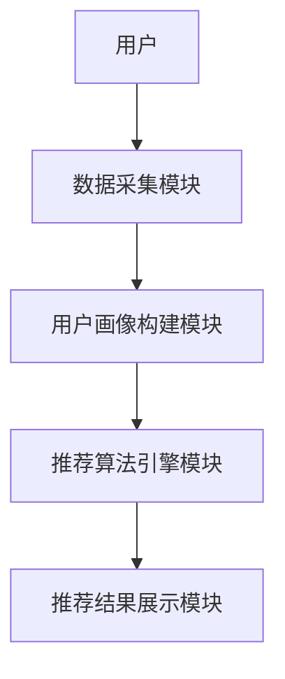
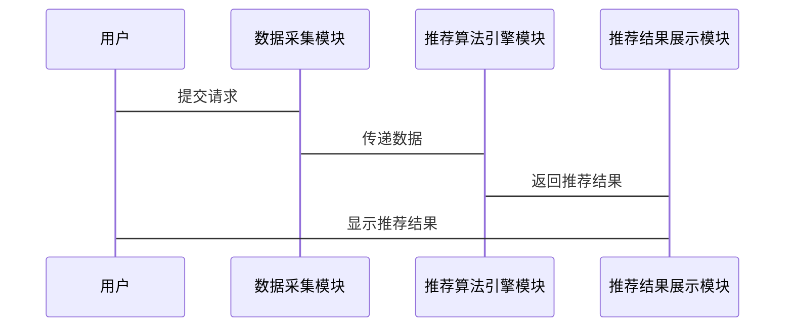

                 


# 《金融产品个性化推荐引擎》

---

## 关键词：
金融推荐系统、个性化推荐、机器学习、深度学习、协同过滤、金融产品推荐

---

## 摘要：
本文深入探讨了金融产品个性化推荐引擎的核心原理与实现方法，从背景、核心概念到算法实现，结合实际案例，全面解析了如何利用机器学习与深度学习技术构建高效、精准的金融推荐系统。文章内容涵盖推荐系统的设计思路、数学模型的详细推导、系统架构的优化设计，以及项目实战的代码实现，为读者提供了一套从理论到实践的完整解决方案。

---

# 第1章 金融产品推荐系统背景与挑战

## 1.1 金融产品推荐的背景与意义
### 1.1.1 金融行业数字化转型的现状
- 金融行业的数字化转型趋势
- 个性化推荐在金融业务中的重要性
- 用户需求的精准匹配与价值提升

### 1.1.2 个性化推荐在金融领域的价值
- 提高用户粘性与满意度
- 增强金融机构的竞争力
- 提升金融产品的销售效率

### 1.1.3 金融产品推荐的核心目标与边界
- 核心目标：基于用户需求与市场数据，精准推荐合适的金融产品
- 边界：明确推荐的范围与限制条件，避免过度推荐

---

## 1.2 金融产品推荐系统的关键问题
### 1.2.1 金融产品的多样性与复杂性
- 金融产品的种类繁多，包括基金、股票、保险等
- 不同产品的风险、收益特征差异大

### 1.2.2 用户需求的动态变化
- 用户的财务状况、投资目标随时间变化
- 用户偏好受市场环境影响

### 1.2.3 数据隐私与合规性挑战
- 金融数据的敏感性与隐私保护要求
- 合规性要求对推荐系统的约束

---

## 1.3 个性化推荐的核心概念与联系
### 1.3.1 用户画像与产品画像
- 用户画像：基于用户行为、偏好构建的用户特征
- 产品画像：基于产品属性、风险收益特征构建的产品特征

### 1.3.2 关联规则与相似性度量
- 基于关联规则的推荐
- 基于相似性度量的推荐

### 1.3.3 实体关系图（ER图）与推荐系统的关系
- 用户、产品、行为三者的关系
- 推荐系统中的关联规则与依赖关系

---

## 1.4 推荐系统的分类与应用
### 1.4.1 基于协同过滤的推荐
- 用户协同过滤与物品协同过滤
- 混合推荐模型的应用

### 1.4.2 基于内容的推荐
- 产品内容特征的提取与匹配
- 用户偏好与产品内容的关联

### 1.4.3 深度学习在推荐系统中的应用
- 基于神经网络的推荐模型
- 图神经网络在金融推荐中的应用

---

## 1.5 金融推荐系统的挑战与解决方案
### 1.5.1 数据稀疏性问题
- 数据稀疏性的定义与影响
- 解决方案：基于协同过滤与深度学习的结合

### 1.5.2 用户隐私与数据安全
- 数据匿名化处理
- 差分隐私技术的应用

### 1.5.3 实时推荐的性能优化
- 系统性能优化方法
- 分布式计算与并行处理

---

# 第2章 个性化推荐系统的核心原理

## 2.1 协同过滤推荐算法
### 2.1.1 基于用户的协同过滤
- 用户相似性度量方法：余弦相似度、Jaccard系数
- 基于用户的推荐流程：计算相似用户，聚合评分

### 2.1.2 基于物品的协同过滤
- 物品相似性度量方法：余弦相似度、欧氏距离
- 基于物品的推荐流程：计算相似物品，推导推荐

### 2.1.3 混合推荐模型的设计
- 用户-物品混合模型的优势
- 混合推荐的实现方法与优化

---

## 2.2 基于内容的推荐算法
### 2.2.1 金融产品特征提取
- 产品特征提取方法：文本挖掘、数值特征提取
- 特征向量的构建与标准化

### 2.2.2 用户偏好的内容匹配
- 基于向量的相似度计算
- 内容匹配的实现步骤

### 2.2.3 内容相似性计算方法
- 余弦相似度、欧氏距离
- 简单的实现代码示例

---

## 2.3 深度学习在推荐系统中的应用
### 2.3.1 基于神经网络的推荐模型
- DNN（深度神经网络）的结构与特点
- 推荐模型的训练流程与损失函数

### 2.3.2 图神经网络在金融推荐中的应用
- 图神经网络的基本原理
- 金融推荐中的图结构构建

### 2.3.3 深度强化学习的探索
- 强化学习的基本原理
- 深度强化学习在推荐中的应用

---

## 2.4 推荐系统的数学模型与公式
### 2.4.1 协同过滤的数学模型
- 基于矩阵分解的推荐公式
  $$ r_{u,i} = \text{predict}(u, i) = p_u^T q_i $$
- 矩阵分解的优化目标
  $$ \min_{p, q} \sum_{(u,i) \in S} (r_{u,i} - p_u^T q_i)^2 + \lambda (||p_u||^2 + ||q_i||^2) $$

### 2.4.2 深度学习模型的数学推导
- DNN模型的输入输出关系
- 注意力机制的公式推导
  $$ \text{Attention}(q, k, v) = \text{softmax}(\frac{qk^T}{\sqrt{d}})v $$

---

## 2.5 算法实现与优化
### 2.5.1 推荐算法的实现框架
- 协同过滤算法的实现步骤
- 内容推荐算法的实现步骤

### 2.5.2 算法性能的优化方法
- 稀疏矩阵的处理方法
- 并行计算与分布式处理

### 2.5.3 模型的调参与评估指标
- 调参方法：网格搜索、随机搜索
- 评估指标：准确率、召回率、F1值

---

# 第3章 金融推荐系统的系统架构与设计

## 3.1 系统功能模块划分
### 3.1.1 数据采集模块
- 数据源的获取与处理
- 数据清洗与预处理

### 3.1.2 用户画像构建模块
- 用户特征提取与建模
- 用户画像的更新与维护

### 3.1.3 推荐算法引擎模块
- 算法选择与配置
- 推荐结果的生成与输出

### 3.1.4 推荐结果展示模块
- 推荐结果的可视化
- 推荐结果的用户反馈收集

---

## 3.2 系统架构设计
### 3.2.1 分层架构设计
- 数据层、业务逻辑层、表现层的划分
- 各层之间的交互与依赖关系

### 3.2.2 微服务架构的应用
- 微服务的优势与适用场景
- 推荐系统的微服务化设计

### 3.2.3 高可用性与扩展性设计
- 系统的高可用性保障措施
- 系统的水平扩展设计

---

## 3.3 系统接口与交互流程
### 3.3.1 接口设计与数据流
- 接口定义：RESTful API
- 数据流的可视化图示（使用Mermaid）

### 3.3.2 用户与系统交互流程
- 用户请求推荐的流程
- 系统响应推荐结果的流程

### 3.3.3 接口的安全性与权限控制
- API的安全认证方法
- 权限控制策略

---

## 3.4 系统架构的实现
### 3.4.1 系统架构图（Mermaid）


### 3.4.2 功能模块的交互流程图（Mermaid）


---

# 第4章 金融推荐系统的项目实战

## 4.1 环境搭建与数据准备
### 4.1.1 开发环境的安装与配置
- Python、Jupyter Notebook、虚拟环境的安装
- 依赖库的安装：scikit-learn、TensorFlow、Keras

### 4.1.2 数据集的获取与预处理
- 数据来源：公开金融数据集（如Kaggle）
- 数据清洗与特征工程

### 4.1.3 数据清洗与特征工程
- 数据清洗步骤：去重、填充缺失值、异常值处理
- 特征提取：文本特征、数值特征

---

## 4.2 推荐算法的实现
### 4.2.1 协同过滤算法的实现
```python
from sklearn.metrics.pairwise import cosine_similarity

# 假设 ratings 是一个用户-产品评分矩阵
cosine_sim = cosine_similarity(ratings)
# 找出与目标用户最相似的k个用户
def get_recommendations(user_id, k=5):
    user_sim = cosine_sim[user_id]
    indices = [i for i in range(len(user_sim)) if i != user_id]
    indices.sort(key=lambda x: user_sim[x], reverse=True)
    return indices[:k]
```

### 4.2.2 基于内容的推荐算法实现
```python
from sklearn.feature_extraction.text import TfidfVectorizer

# 假设 products 是一个包含产品描述的列表
vectorizer = TfidfVectorizer()
product_features = vectorizer.fit_transform(products)
# 计算产品之间的相似性
product_sim = (product_features * product_features.T).A
```

### 4.2.3 深度学习模型的实现
```python
import tensorflow as tf
from tensorflow.keras import layers

model = tf.keras.Sequential()
model.add(layers.Dense(64, activation='relu', input_shape=(input_dim,)))
model.add(layers.Dense(1, activation='sigmoid'))
model.compile(optimizer='adam', loss='binary_crossentropy', metrics=['accuracy'])
```

---

## 4.3 项目案例分析与解读
### 4.3.1 案例背景与目标
- 案例背景：假设我们为某银行设计推荐系统
- 案例目标：推荐合适的理财产品给用户

### 4.3.2 数据分析与特征提取
- 数据分析结果展示
- 特征提取的具体实现

### 4.3.3 模型训练与结果分析
- 模型训练过程
- 模型评估结果

---

## 4.4 项目实战中的注意事项
### 4.4.1 数据处理的注意事项
- 数据清洗的常见问题
- 特征工程的优化建议

### 4.4.2 模型选择的注意事项
- 模型选择的依据
- 模型调优的技巧

### 4.4.3 系统部署的注意事项
- 系统部署的环境要求
- 系统监控与维护

---

## 4.5 项目小结
### 4.5.1 项目实现的关键点
- 数据处理与特征工程
- 模型选择与优化
- 系统架构设计

### 4.5.2 项目的价值与意义
- 提高推荐系统的精准度
- 提升用户体验与满意度

---

# 第5章 金融推荐系统的优化与扩展

## 5.1 系统优化方案
### 5.1.1 性能优化
- 算法优化：稀疏矩阵的处理
- 系统优化：分布式计算与并行处理

### 5.1.2 模型优化
- 模型调优：超参数优化
- 模型融合：协同过滤与深度学习的结合

---

## 5.2 推荐系统的扩展应用
### 5.2.1 多目标推荐
- 多目标优化的实现
- 多目标推荐的优势

### 5.2.2 动态推荐
- 动态推荐的实现方法
- 动态推荐的适用场景

---

## 5.3 最佳实践与注意事项
### 5.3.1 数据处理的注意事项
- 数据隐私保护
- 数据质量控制

### 5.3.2 模型选择的注意事项
- 模型的可解释性
- 模型的实时性

### 5.3.3 系统部署的注意事项
- 系统的可扩展性
- 系统的可维护性

---

## 5.4 小结与展望
### 5.4.1 小结
- 金融推荐系统的实现要点
- 系统优化的关键方向

### 5.4.2 展望
- 未来的研究方向
- 技术发展趋势

---

# 作者

作者：AI天才研究院/AI Genius Institute & 禅与计算机程序设计艺术 /Zen And The Art of Computer Programming

---

以上是《金融产品个性化推荐引擎》的完整目录大纲，涵盖了从背景到实现的各个方面，内容丰富且逻辑清晰，适合深入研究与实践。

