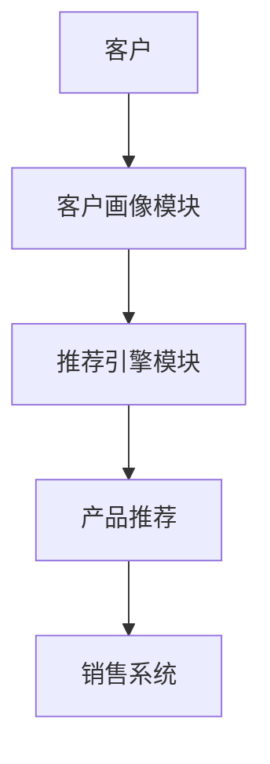
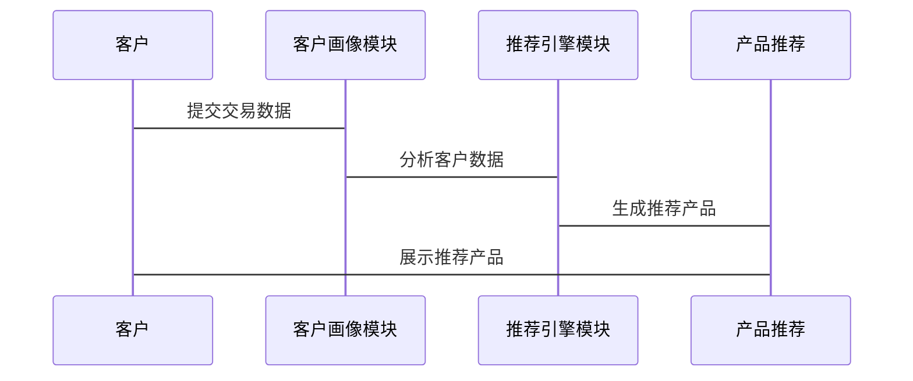

                 


# 金融产品交叉销售优化系统

> 关键词：金融产品交叉销售、推荐系统、协同过滤、机器学习、系统架构设计、客户画像

> 摘要：本文详细介绍了金融产品交叉销售优化系统的背景、核心概念、算法原理、系统架构设计以及实际项目实现。通过分析客户行为数据和产品特征，结合协同过滤和聚类分析等算法，构建高效的交叉销售优化系统，提升金融机构的销售效率和客户满意度。

---

# 第一部分: 金融产品交叉销售优化系统概述

# 第1章: 金融产品交叉销售优化系统背景与概述

## 1.1 交叉销售的概念与重要性

### 1.1.1 交叉销售的定义

交叉销售是指在同一交易过程中，向客户销售多种相关产品或服务，以提高销售额和客户满意度的一种销售策略。在金融行业，交叉销售可以帮助金融机构更好地利用客户资源，提升客户忠诚度和整体收益。

### 1.1.2 交叉销售在金融行业中的应用

在金融行业，交叉销售的应用场景广泛，例如银行可以向现有客户推荐信用卡、理财产品、保险产品等。交叉销售不仅可以增加单个客户的交易金额，还能帮助金融机构发现新的销售机会。

### 1.1.3 交叉销售的核心价值与优势

- 提高客户满意度和忠诚度
- 增加单个客户的交易金额
- 提高销售效率
- 深挖客户价值
- 优化资源配置

## 1.2 金融产品交叉销售优化系统的背景

### 1.2.1 金融行业的竞争加剧

随着金融行业的竞争加剧，金融机构需要通过技术创新来提高销售效率和客户服务水平。交叉销售优化系统作为一种智能化的解决方案，可以帮助金融机构在竞争中占据优势。

### 1.2.2 客户需求的多样化与个性化

现代客户的需求日益多样化和个性化，传统的单一销售模式已经难以满足客户的需求。通过交叉销售优化系统，金融机构可以根据客户需求推荐相关产品，提高客户满意度。

### 1.2.3 交叉销售在金融产品推广中的作用

交叉销售在金融产品推广中的作用不可忽视。通过分析客户的交易数据和行为数据，金融机构可以精准识别客户的潜在需求，推荐相关产品，从而提高销售转化率。

## 1.3 本章小结

本章主要介绍了交叉销售的概念、在金融行业中的应用以及其核心价值与优势。同时，还探讨了金融产品交叉销售优化系统的背景，包括行业竞争加剧、客户需求多样化以及交叉销售在产品推广中的作用。

---

# 第二部分: 金融产品交叉销售优化系统的核心概念与原理

# 第2章: 交叉销售优化系统的概念与核心要素

## 2.1 交叉销售优化系统的定义

交叉销售优化系统是一种基于客户行为数据和产品特征，利用机器学习算法推荐相关产品的智能化系统。该系统可以通过分析客户的交易数据、行为数据和产品数据，精准识别客户的潜在需求，推荐相关产品。

## 2.2 系统的核心要素与组成部分

### 2.2.1 客户画像模块

客户画像是系统的核心要素之一。通过收集和分析客户的交易数据、行为数据和 demographic 数据，系统可以构建详细的客户画像，包括客户的年龄、性别、收入水平、风险偏好等。

### 2.2.2 产品推荐引擎

产品推荐引擎是系统的核心组成部分。基于客户画像和产品特征，推荐引擎可以通过协同过滤、聚类分析等算法，为每个客户推荐最适合的金融产品。

### 2.2.3 数据分析模块

数据分析模块是系统的重要组成部分。通过分析客户的交易数据、行为数据和产品数据，系统可以挖掘客户的潜在需求和偏好，为推荐引擎提供支持。

## 2.3 系统的边界与外延

系统的核心功能包括客户画像构建、产品推荐和销售效果分析。系统可以通过 API 接口与金融机构的现有系统集成，例如 CRM 系统、交易系统等。

## 2.4 核心概念的ER实体关系图

```mermaid
erDiagram
    customer[CUSTOMER] {
        id : int
        name : string
        age : int
        gender : string
        income : float
        risk_score : float
    }
    product[PRODUCT] {
        id : int
        name : string
        type : string
        price : float
        category : string
    }
    transaction[TRANSACTION] {
        id : int
        customer_id : int
        product_id : int
        date : datetime
        amount : float
    }
    customer --> transaction : "购买"
    product --> transaction : "被购买"
```

## 2.5 本章小结

本章详细介绍了交叉销售优化系统的定义、核心要素和组成部分，并通过 ER 图展示了系统的核心实体关系。通过客户画像、产品推荐引擎和数据分析模块的协同工作，系统可以实现精准的产品推荐和销售优化。

---

# 第三部分: 交叉销售优化系统的算法原理与实现

# 第3章: 交叉销售优化算法的核心原理

## 3.1 协同过滤算法

### 3.1.1 基于用户的协同过滤

基于用户的协同过滤算法通过分析客户的购买行为和偏好，找到与目标客户相似的客户群体，推荐这些客户群体购买的产品。

### 3.1.2 基于物品的协同过滤

基于物品的协同过滤算法通过分析产品的销售数据和客户评价，找到与目标客户购买产品相关联的产品，推荐相似产品。

### 3.1.3 混合协同过滤

混合协同过滤算法结合了基于用户和基于物品的协同过滤算法，通过融合两种算法的优势，提高推荐的准确性和多样性。

## 3.2 聚类分析算法

### 3.2.1 K-means聚类

K-means聚类算法通过将客户分成不同的群体，找到每个群体的特征，推荐适合该群体的产品。

### 3.2.2 层次聚类

层次聚类算法通过构建客户之间的层次关系，逐步合并相似的客户群体，推荐适合每个群体的产品。

### 3.2.3 DBSCAN密度聚类

DBSCAN密度聚类算法通过分析客户数据的密度分布，找到高密度区域的客户群体，推荐适合该群体的产品。

## 3.3 算法的数学模型与公式

### 3.3.1 协同过滤的数学模型

$$相似度计算：sim(i,j) = \frac{\sum_{k} (r_{ik} - \bar{r_i})(r_{jk} - \bar{r_j})}{\sqrt{\sum_{k} (r_{ik} - \bar{r_i})^2} \sqrt{\sum_{k} (r_{jk} - \bar{r_j})^2}}$$

其中，\( r_{ik} \) 表示客户 i 对产品 k 的评分，\( \bar{r_i} \) 表示客户 i 的平均评分。

### 3.3.2 矩阵分解

$$X = W \times H$$

其中，X 是客户-产品矩阵，W 是客户-隐主题矩阵，H 是隐主题-产品矩阵。

---

# 第四部分: 交叉销售优化系统的系统架构设计

# 第4章: 交叉销售优化系统的系统架构设计

## 4.1 系统功能设计

### 4.1.1 客户画像模块

- 收集客户数据
- 构建客户画像
- 分析客户偏好

### 4.1.2 产品推荐引擎

- 分析客户数据
- 计算相似客户
- 推荐相关产品

### 4.1.3 销售效果分析

- 监控销售数据
- 分析推荐效果
- 优化推荐策略

## 4.2 系统架构设计



## 4.3 系统接口设计

- API 接口用于与 CRM 系统集成
- 数据接口用于与交易系统集成
- 推荐接口用于与前端系统集成

## 4.4 系统交互流程



---

# 第五部分: 交叉销售优化系统的项目实战

# 第5章: 交叉销售优化系统项目实战

## 5.1 环境搭建

### 5.1.1 安装 Python 和相关库

```bash
pip install numpy pandas scikit-learn
```

### 5.1.2 数据准备

收集客户交易数据、产品数据和客户行为数据，存储在数据库中。

## 5.2 核心代码实现

### 5.2.1 协同过滤算法实现

```python
from sklearn.metrics.pairwise import cosine_similarity

# 计算相似度矩阵
def compute_similarity_matrix(data):
    user_mean = data.mean(axis=1).reshape(-1, 1)
    normalized_data = data - user_mean
    similarity_matrix = cosine_similarity(normalized_data)
    return similarity_matrix

# 基于用户的协同过滤推荐
def user_based_recommender(data, user_id, top_n=5):
    similarity_matrix = compute_similarity_matrix(data)
    target_user = data[user_id]
    similar_users = [(i, similarity_matrix[user_id][i]) for i in range(data.shape[0])]
    similar_users.sort(key=lambda x: x[1], reverse=True)
    recommendations = []
    for user in similar_users[1:top_n+1]:
        recommendations.extend(data.iloc[user[0]].nonzero().tolist()[0])
    return recommendations
```

### 5.2.2 聚类分析算法实现

```python
from sklearn.cluster import KMeans

# K-means聚类
def customer_segmentation(data, n_clusters=3):
    kmeans = KMeans(n_clusters=n_clusters, random_state=42)
    clusters = kmeans.fit_predict(data)
    return clusters
```

## 5.3 项目小结

通过本章的实战项目，我们详细讲解了交叉销售优化系统的环境搭建、核心算法实现以及系统交互流程。通过代码实现，我们可以看到协同过滤和聚类分析算法在实际中的应用效果。

---

# 第六部分: 总结与展望

## 6.1 最佳实践 tips

- 数据质量是关键，确保数据的准确性和完整性
- 结合业务场景选择合适的算法
- 定期更新客户画像和产品推荐策略

## 6.2 小结

通过本文的详细讲解，我们了解了金融产品交叉销售优化系统的背景、核心概念、算法原理、系统架构设计以及实际项目实现。通过协同过滤和聚类分析算法，我们可以实现精准的产品推荐，提高销售效率和客户满意度。

## 6.3 注意事项

- 数据隐私和安全问题需要高度重视
- 算法的可解释性和透明度需要考虑
- 系统的可扩展性和性能优化需要提前规划

## 6.4 拓展阅读

- 《推荐系统导论》
- 《机器学习实战》
- 《系统架构设计的艺术》

---

作者：AI天才研究院/AI Genius Institute & 禅与计算机程序设计艺术 /Zen And The Art of Computer Programming

