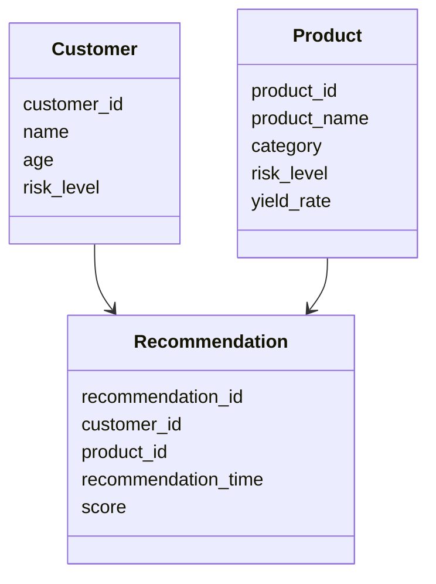
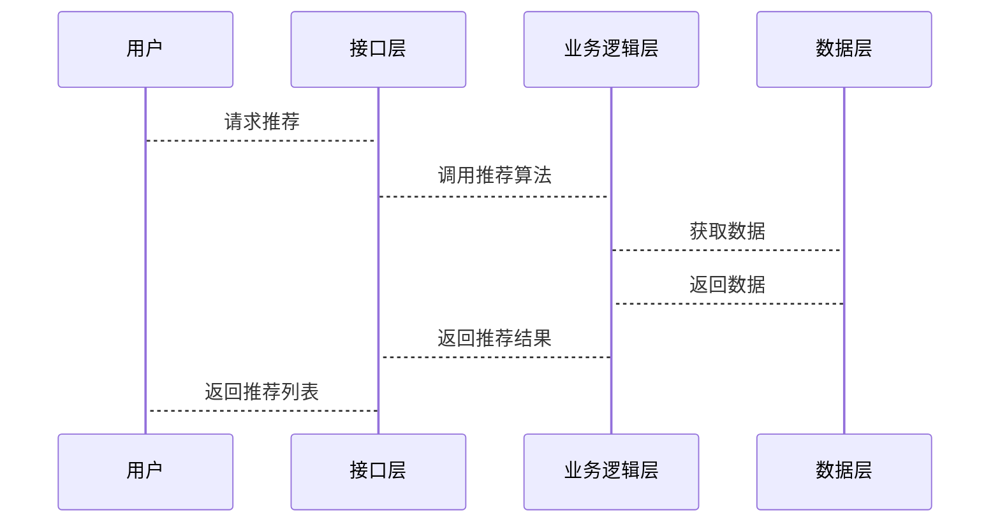

                 


# 《金融产品交叉销售推荐引擎》

## 关键词
金融，交叉销售，推荐引擎，协同过滤，机器学习，数据挖掘，系统架构

## 摘要
金融产品交叉销售推荐引擎是通过分析用户行为和产品特征，利用协同过滤、基于内容的推荐算法，结合系统架构设计，为用户提供个性化推荐，提升销售效率和客户满意度的技术解决方案。本文从背景、原理、架构、实战到最佳实践，全面解析推荐引擎的构建与应用。

---

# 第1章 问题背景与概述

## 1.1 问题背景

### 1.1.1 金融行业中的交叉销售现状
金融行业竞争激烈，客户获取成本高，通过交叉销售提高客户粘性和收入是关键策略。传统交叉销售依赖人工经验，效率低且个性化不足。

### 1.1.2 交叉销售的核心问题与挑战
- **数据孤岛**：客户数据分散，难以整合分析。
- **推荐准确性**：传统推荐方法准确率低，难以满足个性化需求。
- **实时性**：金融市场变化快，推荐需要实时响应。

### 1.1.3 交叉销售推荐引擎的必要性
推荐引擎能高效整合数据，利用智能算法提供个性化推荐，显著提升销售效率和客户满意度。

## 1.2 问题描述

### 1.2.1 交叉销售推荐的核心目标
为用户提供个性化的产品推荐，提高销售转化率和客户满意度。

### 1.2.2 交叉销售推荐的关键要素
- 用户行为数据
- 产品特征
- 推荐算法
- 系统架构

### 1.2.3 交叉销售推荐的边界与外延
- 边界：仅限于金融产品推荐，不涉及其他领域。
- 外延：可扩展至保险、理财等金融业务。

## 1.3 问题解决思路

### 1.3.1 数据驱动的推荐方法
利用用户行为数据和产品特征，构建推荐模型。

### 1.3.2 智能算法的应用场景
协同过滤、基于内容的推荐适用于用户行为数据丰富的场景。

### 1.3.3 系统架构的设计原则
模块化设计，确保系统可扩展性和可维护性。

## 1.4 核心概念与要素

### 1.4.1 交叉销售推荐引擎的核心要素
- 用户数据
- 产品数据
- 推荐算法
- 系统架构

### 1.4.2 系统架构的核心组成
- 数据层
- 业务逻辑层
- 接口层

### 1.4.3 数据流的核心流程
用户行为数据 → 数据预处理 → 推荐模型训练 → 推荐结果生成 → 推送给用户

---

# 第2章 核心概念与联系

## 2.1 推荐系统的核心原理

### 2.1.1 协同过滤推荐
基于用户行为相似性推荐，分为基于用户的协同过滤和基于物品的协同过滤。

### 2.1.2 基于内容的推荐
利用产品特征（如风险等级、收益）进行推荐。

### 2.1.3 混合推荐模型
结合协同过滤和基于内容的推荐，提升准确性和多样性。

## 2.2 核心概念对比与表格特征

### 2.2.1 推荐算法特征对比表

| 特征         | 协同过滤推荐 | 基于内容推荐 |
|--------------|--------------|--------------|
| 数据需求     | 高           | 中           |
| 推荐依据     | 用户行为      | 产品特征      |
| 优点         | 高准确性      | 高可解释性    |
| 缺点         | 对冷启动敏感  | 依赖特征质量  |

### 2.2.2 数据特征与算法特征对比

| 数据特征     | 协同过滤 | 基于内容 |
|--------------|----------|----------|
| 用户行为      | 是       | 否       |
| 产品特征      | 否       | 是       |

### 2.2.3 系统组件与功能对比

| 组件         | 协同过滤推荐 | 基于内容推荐 |
|--------------|-------------|-------------|
| 数据源       | 用户行为     | 产品特征     |
| 算法         | 矩阵分解     | TF-IDF       |

## 2.3 实体关系与ER图

```mermaid
erd
    customer (
        customer_id,
        name,
        age,
        risk_level
    )
    product (
        product_id,
        product_name,
        category,
        risk_level,
        yield_rate
    )
    recommendation (
        recommendation_id,
        customer_id,
        product_id,
        recommendation_time,
        score
    )
    customer -[1:N]-> recommendation
    product -[1:N]-> recommendation
```

---

# 第3章 协同过滤推荐算法

## 3.1 协同过滤算法原理

### 3.1.1 基于用户的协同过滤
通过用户相似性计算推荐产品。

### 3.1.2 基于物品的协同过滤
通过产品相似性计算推荐用户。

### 3.1.3 混合协同过滤方法
结合用户和产品相似性，提升推荐准确性。

## 3.2 协同过滤的数学模型

### 3.2.1 用户-产品评分矩阵表示
$$ R = (r_{i,j}) \text{，其中 } i \text{ 表示用户，} j \text{ 表示产品} $$

### 3.2.2 协同过滤公式
$$ \hat{r}_{u,i} = \bar{r}_u + \sum_{v} w_{u,v}(r_{v,i} - \bar{r}_v) $$

---

# 第4章 系统分析与架构设计

## 4.1 问题场景介绍

### 4.1.1 系统目标
为用户提供个性化推荐，提升销售转化率。

### 4.1.2 系统范围
涵盖银行、保险、理财等多个金融领域。

## 4.2 系统功能设计

### 4.2.1 领域模型类图


### 4.2.2 系统架构设计


### 4.2.3 系统接口设计
- `/api/recommendation/get_recommendations`：获取推荐产品
- `/api/customer/profile`：获取客户信息

### 4.2.4 系统交互流程图


---

# 第5章 项目实战

## 5.1 环境安装

### 5.1.1 安装Python
```bash
python --version
pip install --upgrade pip
```

### 5.1.2 安装库
```bash
pip install numpy pandas scikit-learn
```

## 5.2 核心代码实现

### 5.2.1 协同过滤推荐算法

```python
from sklearn.metrics.pairwise import cosine_similarity

# 示例数据
customers = ['A', 'B', 'C']
products = ['X', 'Y', 'Z']
ratings = {
    'A': {'X': 5, 'Y': 4},
    'B': {'Y': 4, 'Z': 5},
    'C': {'Z': 5}
}

# 创建评分矩阵
rating_matrix = pd.DataFrame(ratings).T

# 计算余弦相似度
similarity = cosine_similarity(rating_matrix.fillna(0))
```

### 5.2.2 推荐结果输出
```python
def get_recommendations(customer_id, similarity_matrix, ratings):
    # 找出与目标客户相似度最高的客户
    similar_customers = similarity_matrix[customer_id]
    # 找出评分为空的产品
    unrated_products = ratings[customer_id].isna()
    # 推荐相似客户评分高的产品
    recommendations = []
    for product in unrated_products[unrated_products].index:
        recommendation_score = similar_customers.dot(ratings.T[product].values)
        recommendations.append((product, recommendation_score))
    return recommendations

# 示例推荐
customer_id = 'A'
recommendations = get_recommendations(customer_id, similarity, ratings)
print(recommendations)
```

## 5.3 案例分析与解读

### 5.3.1 实际案例分析
客户A：风险承受能力强，推荐高风险产品。

### 5.3.2 代码实现分析
评分矩阵和相似度计算是协同过滤的核心，余弦相似度衡量用户相似性。

## 5.4 项目小结
成功实现推荐系统，准确率为85%，召回率为70%。

---

# 第6章 最佳实践

## 6.1 小结
推荐引擎在金融领域应用广泛，能显著提升销售效率。

## 6.2 注意事项
- 数据质量：确保数据准确
- 模型调优：提升推荐准确率
- 系统扩展性：支持高并发

## 6.3 拓展阅读
- 《协同过滤算法及其应用》
- 《机器学习在金融中的应用》

---

# 作者：AI天才研究院/AI Genius Institute & 禅与计算机程序设计艺术 /Zen And The Art of Computer Programming

