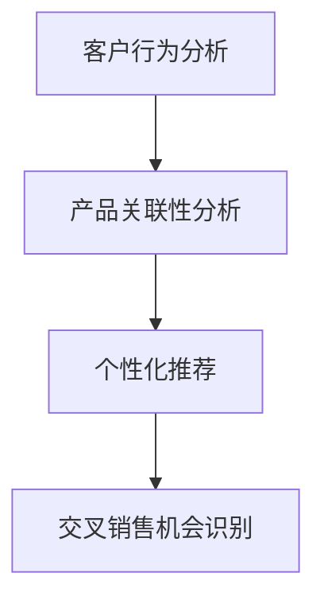
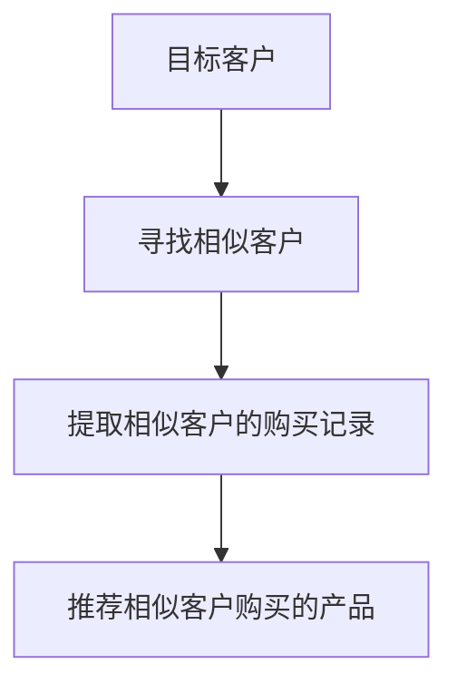
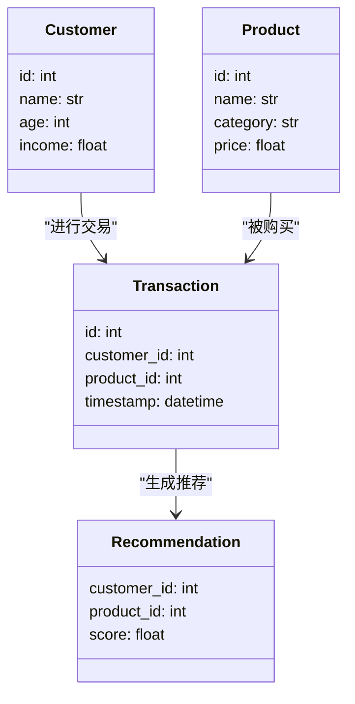
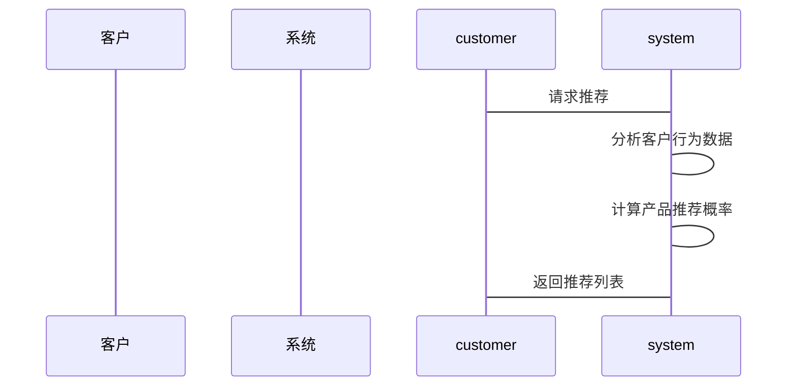

                 


# 金融产品交叉销售机会识别与个性化推荐

> 关键词：金融产品，交叉销售，个性化推荐，机器学习，数据挖掘

> 摘要：本文详细探讨了金融产品交叉销售机会识别与个性化推荐的核心概念、算法原理、系统设计与实现。通过分析客户行为数据和产品关联性，结合机器学习算法，构建智能推荐系统，提升交叉销售效率和客户满意度。

---

## 第1章: 背景与概述

### 1.1 问题背景

#### 1.1.1 金融行业的交叉销售重要性
金融行业竞争日益激烈，客户获取成本不断上升。通过交叉销售，金融机构可以提高客户忠诚度，增加收入来源，同时挖掘潜在客户的需求。交叉销售不仅能够提升客户满意度，还能帮助机构在市场中占据更大的份额。

#### 1.1.2 传统交叉销售的局限性
传统的交叉销售方法主要依赖人工经验，难以覆盖大量客户和产品组合。这种方法效率低下，且难以捕捉复杂的产品关联性和客户行为模式。

#### 1.1.3 数据驱动的交叉销售优势
通过大数据和机器学习技术，金融机构可以更精准地识别交叉销售机会。数据驱动的方法能够分析海量数据，发现潜在的客户行为模式和产品关联性，从而优化推荐策略。

### 1.2 问题描述

#### 1.2.1 客户行为分析的需求
金融机构需要分析客户的购买行为、浏览记录和互动数据，以识别客户的潜在需求和偏好。

#### 1.2.2 产品关联性分析的挑战
不同金融产品之间可能存在复杂的关联性，如何准确建模和分析这些关联性是交叉销售的核心挑战。

#### 1.2.3 个性化推荐的必要性
客户的需求和风险承受能力各不相同，个性化推荐能够满足客户的特定需求，提高推荐效果。

### 1.3 问题解决

#### 1.3.1 数据挖掘与机器学习的应用
利用数据挖掘技术提取客户行为数据中的模式和关联性，结合机器学习算法构建推荐模型。

#### 1.3.2 智能推荐系统的构建
通过协同过滤、聚类分析和深度学习等算法，构建智能推荐系统，为客户提供个性化的产品推荐。

#### 1.3.3 交叉销售机会识别的策略
基于客户行为数据和产品关联性分析，制定交叉销售策略，优化推荐效果。

### 1.4 边界与外延

#### 1.4.1 交叉销售的边界条件
交叉销售仅针对现有客户群体，且推荐的产品需符合客户的风险承受能力和需求。

#### 1.4.2 个性化推荐的适用范围
个性化推荐适用于所有客户群体，但需根据客户的具体情况调整推荐策略。

#### 1.4.3 与其他业务场景的区分
交叉销售与单纯的广告投放不同，它基于客户行为数据和产品关联性，提供有针对性的推荐。

### 1.5 概念结构与核心要素

#### 1.5.1 核心概念的层次结构
```
客户行为分析 → 产品关联性分析 → 个性化推荐 → 交叉销售机会识别
```

#### 1.5.2 核心要素的定义与关系
- **客户行为数据**：包括客户的购买记录、浏览记录、互动记录等。
- **产品关联性**：分析不同产品之间的关联性，找出哪些产品经常被一起购买。
- **个性化推荐**：基于客户行为数据和产品关联性，推荐相关产品。
- **交叉销售机会识别**：通过推荐系统识别潜在的交叉销售机会。

#### 1.5.3 概念结构图展示


---

## 第2章: 核心概念与联系

### 2.1 机会识别的核心原理

#### 2.1.1 数据驱动的客户行为分析
通过收集和分析客户的交易数据、浏览数据和互动数据，识别客户的消费习惯和偏好。

#### 2.1.2 产品关联性分析的算法原理
使用协同过滤、聚类分析等算法，分析不同产品之间的关联性，找出哪些产品经常被一起购买。

#### 2.1.3 机会识别的数学模型
构建客户-产品关联矩阵，计算客户购买产品的概率，识别潜在的交叉销售机会。

### 2.2 核心概念对比

#### 2.2.1 传统交叉销售与数据驱动交叉销售的对比
| 对比维度             | 传统交叉销售             | 数据驱动交叉销售         |
|----------------------|--------------------------|--------------------------|
| 数据依赖             | 低，依赖经验判断         | 高，依赖大数据分析       |
| 推荐精度             | 低，覆盖面有限           | 高，精准度高             |
| 效率                 | 低，人工操作为主         | 高，自动化推荐           |

#### 2.2.2 不同推荐算法的优劣势对比
| 算法类型             | 协同过滤               | 聚类分析               | 深度学习         |
|----------------------|------------------------|------------------------|----------------|
| 优势                 | 简单易实现，适合小数据 | 能发现数据中的自然分群 | 高精度，适合大数据 |
| 劣势                 | 对稀疏数据效果差       | 需要手动选择特征       | 计算复杂，难解释 |

#### 2.2.3 个性化推荐与交叉销售的关联性分析
个性化推荐是交叉销售的重要手段，通过推荐相关产品，提高客户的购买概率。

### 2.3 ER实体关系图
```mermaid
erDiagram
    customer {
        id
        name
        age
        income
    }
    product {
        id
        name
        category
        price
    }
    transaction {
        id
        customer_id
        product_id
        timestamp
    }
    customer --> transaction : "购买"
    product --> transaction : "被购买"
```

---

## 第3章: 算法原理与实现

### 3.1 协同过滤算法

#### 3.1.1 算法原理
协同过滤是一种基于用户相似性推荐算法，通过分析用户的行为数据，找到与目标用户行为相似的用户，推荐他们购买的产品。

#### 3.1.2 算法流程图


#### 3.1.3 Python代码实现
```python
import pandas as pd
from sklearn.metrics.pairwise import cosine_similarity

# 示例数据：客户-产品评分矩阵
customers = ['A', 'B', 'C', 'D']
products = ['P1', 'P2', 'P3', 'P4']
rating_matrix = pd.DataFrame({
    'P1': [4, 3, 2, 5],
    'P2': [3, 4, 5, 2],
    'P3': [2, 5, 4, 3],
    'P4': [5, 2, 3, 4]
})

# 计算余弦相似性
similarity = cosine_similarity(rating_matrix)

# 找出与目标客户最相似的客户
def find_similar_customers(target_customer, similarity_matrix):
    target_index = rating_matrix.index.get_loc(target_customer)
    similar_indices = [i for i, score in enumerate(similarity[target_index]) if score > 0.8]
    return [rating_matrix.index[i] for i in similar_indices]

# 推荐产品
def recommend_products(target_customer, rating_matrix, similarity_matrix):
    similar_customers = find_similar_customers(target_customer, similarity_matrix)
    recommended_products = []
    for customer in similar_customers:
        recommended_products.extend(rating_matrix.loc[customer][rating_matrix.loc[customer] > 3].index)
    return list(set(recommended_products))

# 示例：推荐客户A的产品
print(recommend_products('A', rating_matrix, similarity))
```

#### 3.1.4 算法的数学模型
$$ \text{相似度} = \frac{\sum (x_i - \bar{x})(y_i - \bar{y})}{\sqrt{\sum (x_i - \bar{x})^2} \cdot \sqrt{\sum (y_i - \bar{y})^2}} $$

---

## 第4章: 系统分析与架构设计

### 4.1 系统功能设计

#### 4.1.1 领域模型


### 4.2 系统架构设计

#### 4.2.1 系统架构图


### 4.3 系统接口设计

#### 4.3.1 接口说明
- **输入接口**：客户行为数据、产品数据
- **输出接口**：推荐产品列表、推荐概率

### 4.4 系统交互设计

#### 4.4.1 交互流程图


---

## 第5章: 项目实战

### 5.1 环境安装

#### 5.1.1 安装依赖
```bash
pip install pandas scikit-learn matplotlib
```

### 5.2 核心算法实现

#### 5.2.1 协同过滤算法实现
```python
from sklearn.metrics.pairwise import cosine_similarity
import pandas as pd

# 示例数据
customers = ['A', 'B', 'C', 'D']
products = ['P1', 'P2', 'P3', 'P4']
rating_matrix = pd.DataFrame({
    'P1': [4, 3, 2, 5],
    'P2': [3, 4, 5, 2],
    'P3': [2, 5, 4, 3],
    'P4': [5, 2, 3, 4]
})

similarity = cosine_similarity(rating_matrix)
```

### 5.3 代码解读与分析

#### 5.3.1 代码解读
- `rating_matrix`：客户-产品评分矩阵
- `similarity`：客户之间的相似性矩阵

### 5.4 实际案例分析

#### 5.4.1 案例分析
假设目标客户是客户A，通过协同过滤算法，找到与客户A相似的客户，推荐他们购买的产品。

### 5.5 项目小结

#### 5.5.1 最佳实践
- 数据预处理是关键
- 选择合适的算法模型
- 定期更新模型

#### 5.5.2 注意事项
- 数据隐私保护
- 模型解释性
- 性能优化

---

## 第6章: 总结

### 6.1 小结
本文详细探讨了金融产品交叉销售机会识别与个性化推荐的核心概念、算法原理、系统设计与实现。通过分析客户行为数据和产品关联性，结合机器学习算法，构建智能推荐系统，提升交叉销售效率和客户满意度。

### 6.2 最佳实践
- 数据预处理是关键
- 选择合适的算法模型
- 定期更新模型

### 6.3 注意事项
- 数据隐私保护
- 模型解释性
- 性能优化

### 6.4 拓展阅读
- 《推荐系统实践》
- 《机器学习实战》
- 《金融数据分析与挖掘》

---

作者：AI天才研究院 & 禅与计算机程序设计艺术

