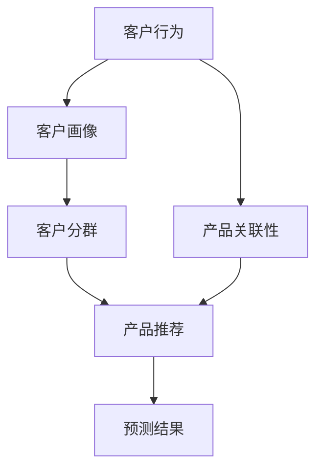
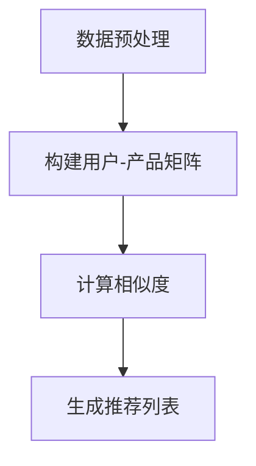
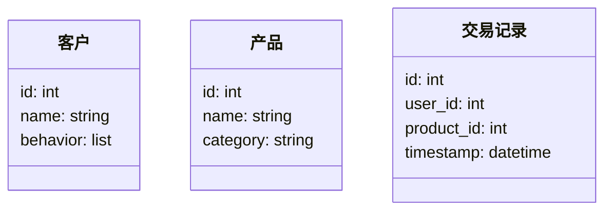

                 


# 《金融产品交叉销售预测引擎》

## 关键词：交叉销售预测，金融产品推荐，机器学习，客户行为分析，产品关联性，预测模型，系统架构

## 摘要：
《金融产品交叉销售预测引擎》旨在探讨如何利用机器学习和数据分析技术，构建一个高效的金融产品交叉销售预测系统。通过对客户行为分析、产品关联性分析以及预测模型构建的深入研究，结合实际业务场景，设计并实现一个能够准确预测客户购买多个金融产品的可能性，并优化销售策略的智能引擎。本文将从问题背景、核心概念、算法原理、系统架构到项目实战，全面系统地展开讨论，为读者提供一个从理论到实践的完整指南。

---

# 第一部分：金融产品交叉销售预测引擎的背景与概念

## 第1章：问题背景与描述

### 1.1 问题背景
#### 1.1.1 金融行业中的交叉销售现状
- 当前金融行业竞争激烈，客户获取成本高，交叉销售是提升客户价值的重要手段。
- 传统交叉销售依赖人工经验，效率低且精准度不足。
- 数据驱动的交叉销售预测成为行业趋势。

#### 1.1.2 交叉销售的核心价值
- 提升客户生命周期价值。
- 增加产品销售机会，优化收入结构。
- 提高客户忠诚度和满意度。

#### 1.1.3 当前交叉销售中的痛点与挑战
- 数据分散，难以整合。
- 模型复杂，难以实时预测。
- 缺乏个性化推荐，客户体验差。

### 1.2 问题描述
#### 1.2.1 客户行为分析的复杂性
- 客户行为受多种因素影响，如市场环境、客户风险偏好等。
- 数据维度多，难以提取有效特征。

#### 1.2.2 产品关联性分析的难点
- 产品种类繁多，关联性分析复杂。
- 产品生命周期不同，影响关联性判断。

#### 1.2.3 交叉销售预测的业务需求
- 实时预测客户需求。
- 提供个性化推荐。
- 支持决策优化。

### 1.3 问题解决思路
#### 1.3.1 数据驱动的解决方案
- 建立客户画像，分析行为特征。
- 构建产品关联矩阵，挖掘潜在关联性。

#### 1.3.2 智能算法的应用前景
- 使用协同过滤、关联规则挖掘等算法。
- 引入机器学习模型，提升预测精度。

#### 1.3.3 业务与技术的结合点
- 技术驱动业务创新。
- 业务需求指导技术实现。

### 1.4 边界与外延
#### 1.4.1 交叉销售预测的边界
- 仅关注客户购买行为，不涉及产品设计。
- 专注于预测，不直接干预销售过程。

#### 1.4.2 与其他预测模型的区别
- 与单一产品销售预测的区别。
- 与客户 churn 预测的区别。

#### 1.4.3 业务场景的可扩展性
- 支持多种金融产品组合。
- 适用于不同客户群体。

### 1.5 概念结构与核心要素
#### 1.5.1 核心概念的组成
- 客户画像。
- 产品关联矩阵。
- 预测模型。

#### 1.5.2 关键要素的对比分析
- 客户行为与产品关联性的对比。
- 不同预测模型的优劣势对比。

#### 1.5.3 概念之间的关系图


---

## 第2章：核心概念与联系

### 2.1 核心概念原理
#### 2.1.1 客户行为分析
- 数据收集：客户交易记录、产品持有情况、市场互动数据。
- 行为特征提取：购买频率、产品偏好、风险承受能力。

#### 2.1.2 产品关联性分析
- 产品分类：根据产品类型、风险等级、收益特征进行分类。
- 关联规则挖掘：使用 Apriori 算法挖掘关联规则。

#### 2.1.3 预测模型构建
- 数据预处理：特征选择、数据清洗。
- 模型训练：使用协同过滤、决策树、随机森林等算法。

### 2.2 概念属性特征对比
#### 2.2.1 对比表格展示
| 概念       | 属性               | 描述                                         |
|------------|--------------------|----------------------------------------------|
| 客户行为    | 数据来源           | 交易记录、互动数据                         |
|            | 分析目标           | 挖掘客户偏好                               |
| 产品关联性 | 关联规则           | 产品之间的关联性                           |
|            | 分析方法           | Apriori 算法                               |

### 2.3 ER 实体关系图
```mermaid
er
    actor: 客户
    product: 产品
    transaction: 交易记录
    customer_behavior: 客户行为
    product_association: 产品关联性
    prediction_model: 预测模型
```

---

## 第3章：算法原理讲解

### 3.1 协同过滤算法
#### 3.1.1 算法流程


#### 3.1.2 Python 实现
```python
import numpy as np
from sklearn.metrics.pairwise import cosine_similarity

# 示例数据
users = ['User1', 'User2', 'User3']
products = ['ProductA', 'ProductB', 'ProductC']
user_product_matrix = np.array([[1, 0, 1],
                                 [0, 1, 1],
                                 [1, 1, 0]])

# 计算余弦相似度
similarity_matrix = cosine_similarity(user_product_matrix)
```

#### 3.1.3 数学模型
$$ \text{相似度} = \frac{\sum_{i=1}^{n} (x_i - \bar{x})(y_i - \bar{y})}{\sqrt{\sum_{i=1}^{n} (x_i - \bar{x})^2} \cdot \sqrt{\sum_{i=1}^{n} (y_i - \bar{y})^2}} $$

---

## 第4章：系统分析与架构设计方案

### 4.1 问题场景介绍
- 客户画像构建。
- 产品关联性分析。
- 预测结果输出。

### 4.2 系统功能设计
#### 4.2.1 领域模型


### 4.3 系统架构设计
#### 4.3.1 系统架构图
```mermaid
graph TD
    API --> DB: 查询数据
    API --> Model: 调用预测模型
    Model --> Result: 返回预测结果
```

---

## 第5章：项目实战

### 5.1 环境安装
- Python 3.8+
- Jupyter Notebook
- scikit-learn、pandas、numpy

### 5.2 核心代码实现
#### 5.2.1 数据预处理
```python
import pandas as pd
from sklearn.preprocessing import StandardScaler

# 加载数据
data = pd.read_csv('transactions.csv')

# 特征选择
selected_features = ['age', 'income', 'product_purchases']
data = data[selected_features]

# 数据标准化
scaler = StandardScaler()
data_scaled = scaler.fit_transform(data)
```

#### 5.2.2 模型训练
```python
from sklearn.cluster import KMeans

# 训练模型
model = KMeans(n_clusters=3)
model.fit(data_scaled)

# 预测结果
clusters = model.predict(data_scaled)
```

---

## 第6章：最佳实践

### 6.1 小结
- 交叉销售预测是提升客户价值的重要工具。
- 算法选择和数据质量直接影响预测效果。

### 6.2 注意事项
- 数据隐私保护。
- 模型实时性优化。
- 业务场景与技术结合。

### 6.3 拓展阅读
- 《机器学习实战》。
- 《数据分析的的艺术》。

---

## 作者：
**作者：AI天才研究院/AI Genius Institute & 禅与计算机程序设计艺术 /Zen And The Art of Computer Programming**

---

**注：** 由于篇幅限制，本文仅展示部分内容。完整文章将涵盖更详细的内容，包括完整的代码实现、实际案例分析以及更深入的系统设计。

