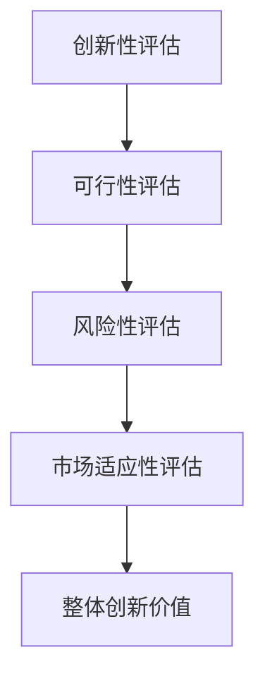
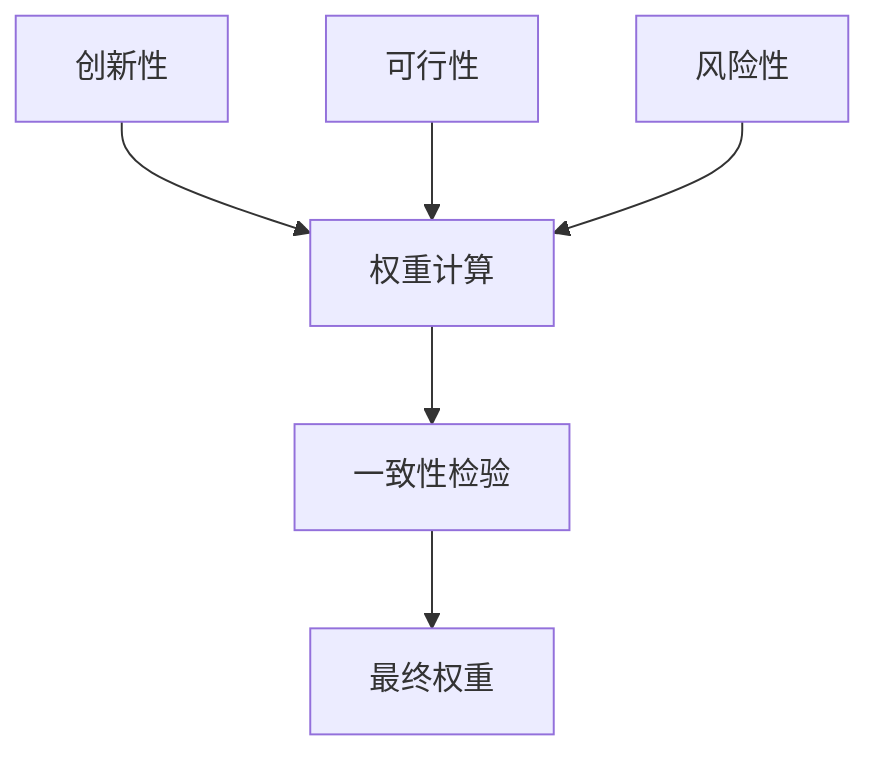
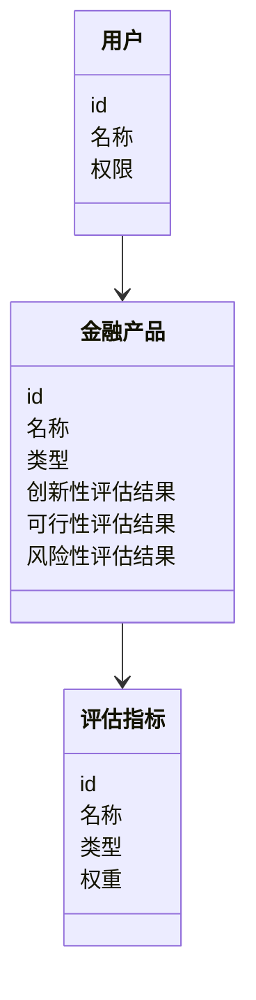
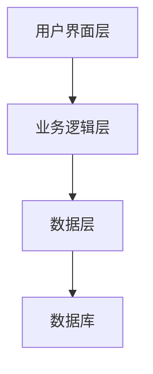
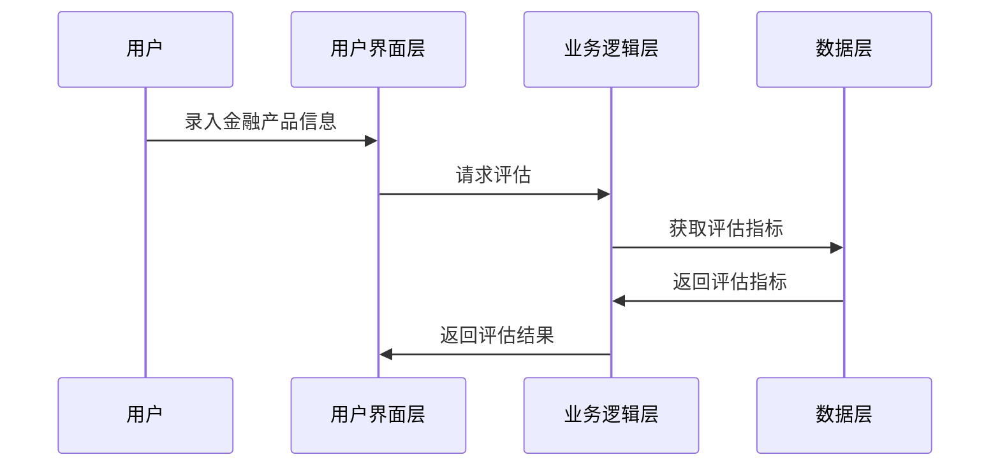

                 


# 《金融产品创新评估框架》

> 关键词：金融产品创新、评估框架、层次分析法、模糊综合评价法、系统架构设计

> 摘要：本文旨在构建一个系统化的金融产品创新评估框架，通过分析创新性、可行性和风险性的核心要素，结合层次分析法和模糊综合评价法等算法原理，设计一个适用于金融机构的创新评估系统。本文将从背景介绍、核心概念、算法原理、系统架构设计、项目实战等多个维度展开，为金融机构提供一套科学、系统的创新评估方法论。

---

## 第一章: 金融产品创新的背景与问题

### 1.1 金融创新的背景与趋势
- 1.1.1 金融创新的定义与内涵
  - 创新性：指产品在功能、结构、服务模式等方面的突破性改进。
  - 可行性：指产品在实际应用中的可操作性和可实现性。
  - 风险性：指产品在实际应用中可能面临的市场风险、技术风险等。

- 1.1.2 金融创新的驱动因素
  - 技术进步：如人工智能、区块链等技术推动金融产品创新。
  - 市场需求：客户对个性化、便捷化金融服务的需求增加。
  - 监管政策：监管机构对金融创新的支持与规范。

- 1.1.3 金融创新与风险管理
  - 创新往往伴随着风险，需要在创新与风险之间找到平衡点。
  - 创新性越高，风险性通常也越高；可行性越强，风险性通常越低。

### 1.2 金融产品创新评估的必要性
- 1.2.1 创新评估的核心作用
  - 通过科学的评估方法，量化金融产品的创新价值。
  - 为金融机构提供决策支持，优化资源配置。
  - 为监管机构提供参考依据，确保创新在可控范围内。

- 1.2.2 创新评估的边界与外延
  - 边界：仅针对金融产品的创新性、可行性和风险性进行评估，不涉及产品本身的合规性。
  - 外延：创新评估的结果可以作为产品定价、市场推广、风险管理等环节的输入。

- 1.2.3 创新评估框架的构建目标
  - 提供一套系统化、可操作的评估方法论。
  - 结合定量分析与定性分析，确保评估结果的科学性与准确性。

---

## 第二章: 创新评估的核心要素与关系

### 2.1 创新性评估的定义与属性
- 2.1.1 创新性的核心要素
  - 创新点：产品在功能、服务模式、技术实现等方面的突破性改进。
  - 创新程度：分为局部创新、整体创新、颠覆性创新等层次。

- 2.1.2 创新性的度量维度
  - 创新点的数量：产品的创新点越多，创新性越高。
  - 创新点的深度：创新点对行业的影响程度越大，创新性越高。
  - 创新点的可行性：创新点在实际应用中的可实现性。

- 2.1.3 创新性与风险性的关系
  - 高创新性通常伴随着高风险性。
  - 风险性越高，创新性评估的权重越大。

### 2.2 可行性评估的定义与属性
- 2.2.1 可行性的核心要素
  - 技术可行性：产品在技术实现上的可行性。
  - 市场可行性：产品在市场上的接受度和需求量。
  - 经济可行性：产品的投入产出比是否合理。

- 2.2.2 可行性的度量维度
  - 技术可行性：评估产品的技术实现难度。
  - 市场可行性：评估产品的市场需求量和竞争情况。
  - 经济可行性：评估产品的成本、收益和投资回报周期。

- 2.2.3 可行性与市场需求的关系
  - 市场需求越强烈，产品的可行性越高。
  - 市场需求越不确定，产品的可行性越低。

### 2.3 创新评估框架的实体关系图



---

## 第三章: 创新评估的数学模型与算法

### 3.1 层次分析法（AHP）的应用
- 3.1.1 层次分析法的基本原理
  - 层次分析法是一种用于多准则决策分析的方法。
  - 通过构建层次结构模型，将复杂问题分解为多个子问题。
  - 通过专家打分的方式，计算各子问题的权重。

- 3.1.2 创新评估的层次结构设计
  - 目标层：整体创新价值。
  - 准则层：创新性、可行性、风险性。
  - 方案层：具体金融产品。

- 3.1.3 权重计算与一致性检验
  - 通过专家打分，计算各准则的权重。
  - 检验层次分析法的一致性，确保权重计算的合理性。



- 3.1.4 权重计算示例
  - 创新性权重：0.4
  - 可行性权重：0.3
  - 风险性权重：0.3

### 3.2 模糊综合评价法的应用
- 3.2.1 模糊综合评价法的基本原理
  - 通过模糊数学的方法，对各准则进行综合评价。
  - 适用于评价对象模糊、评价指标多且复杂的场景。

- 3.2.2 创新评估的模糊指标体系
  - 创新点数量：模糊指标。
  - 创新点深度：模糊指标。
  - 创新点可行性：模糊指标。

- 3.2.3 综合评价结果的计算与解释
  - 通过模糊综合评价法，计算出各金融产品的创新价值指数。
  - 创新价值指数越高，创新性越强。

---

## 第四章: 系统分析与架构设计

### 4.1 问题场景介绍
- 金融机构需要对新开发的金融产品进行创新性评估，以确定其市场竞争力和风险可控性。

### 4.2 系统功能设计
- 4.2.1 系统功能模块
  - 评估指标管理：管理创新性、可行性、风险性等评估指标。
  - 产品信息管理：录入金融产品的基本信息。
  - 评估结果查询：查询金融产品的创新价值指数。

- 4.2.2 领域模型类图



### 4.3 系统架构设计
- 4.3.1 系统架构图



- 4.3.2 系统接口设计
  - 用户界面层：提供用户交互界面，录入金融产品信息。
  - 业务逻辑层：处理用户的请求，调用评估算法进行计算。
  - 数据层：存储金融产品信息和评估结果。

- 4.3.3 系统交互流程图



---

## 第五章: 项目实战

### 5.1 环境安装
- 5.1.1 安装Python
  - 安装Python 3.x
  - 安装Jupyter Notebook

- 5.1.2 安装依赖库
  - 安装numpy、pandas、scipy等依赖库。

### 5.2 核心代码实现
- 5.2.1 层次分析法的实现

```python
import numpy as np

def calculate_weights(criteria_matrix):
    # 计算权重向量
    weights = np.array(criteria_matrix).T @ np.array(criteria_matrix)
    # 计算一致性检验
    max_eigenvalue = np.linalg.eigvals(weights).max()
    consistency = (max_eigenvalue - len(criteria_matrix)) / (len(criteria_matrix) - 1)
    return weights, consistency
```

- 5.2.2 模糊综合评价法的实现

```python
import numpy as np

def fuzzy_evaluation(criteria_scores, weights):
    # 计算模糊综合评价结果
    normalized_weights = weights / np.sum(weights)
    evaluation_result = np.dot(normalized_weights, criteria_scores)
    return evaluation_result
```

### 5.3 代码应用解读与分析
- 5.3.1 层次分析法的应用
  - 输入：创新性、可行性、风险性的评估指标。
  - 输出：各指标的权重。

- 5.3.2 模糊综合评价法的应用
  - 输入：各指标的评估结果。
  - 输出：综合评估结果。

### 5.4 实际案例分析
- 5.4.1 案例背景
  - 某银行开发了一款新型理财产品，需要对其进行创新性评估。

- 5.4.2 案例分析
  - 创新性评估：产品的创新点数量为3个，创新点深度为中等。
  - 可行性评估：市场需求量较高，技术实现难度中等。
  - 风险性评估：市场风险较低，技术风险中等。

### 5.5 项目小结
- 本项目通过层次分析法和模糊综合评价法，成功实现了金融产品的创新性评估。

---

## 第六章: 最佳实践

### 6.1 小结
- 金融产品创新评估框架的核心在于科学的评估方法和系统的架构设计。

### 6.2 注意事项
- 创新评估结果仅供参考，实际决策需要结合具体市场环境。
- 评估指标需要根据实际情况进行调整和优化。

### 6.3 拓展阅读
- 《层次分析法在金融创新中的应用》
- 《模糊综合评价法在金融风险评估中的应用》

---

## 作者：AI天才研究院/AI Genius Institute & 禅与计算机程序设计艺术/Zen And The Art of Computer Programming

