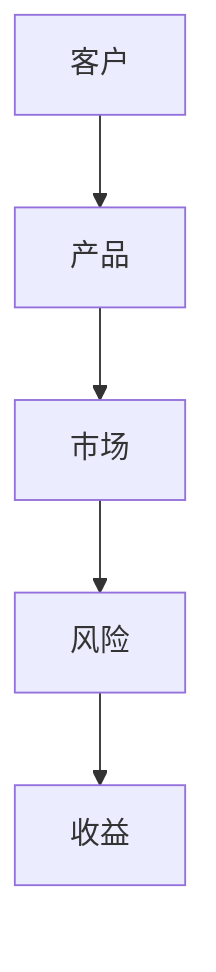
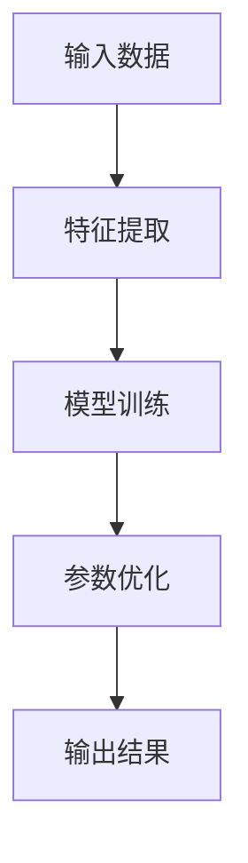
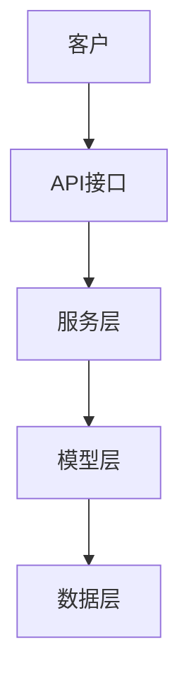
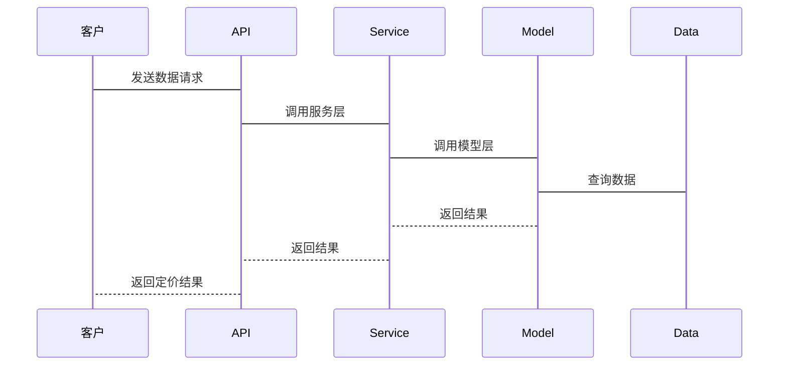

                 


# 《金融产品定价优化模型》

> **关键词**：定价优化模型, 金融产品定价, 定价策略优化, 机器学习, 数学优化模型

> **摘要**：  
本文深入探讨了金融产品定价优化模型的构建与应用，结合数学优化和机器学习算法，分析了定价模型的核心概念、算法原理、系统架构，并通过实际案例展示了模型的实现与优化过程。文章旨在为金融从业者和数据科学家提供一套系统化的方法论，帮助他们在复杂的金融环境中实现精准定价，提升竞争力。

---

# 《金融产品定价优化模型》

## 第1章：定价优化模型的背景与核心概念

### 1.1 问题背景与问题描述

金融产品的定价是一个复杂的过程，涉及市场环境、客户需求、产品特性、竞争状况等多种因素。传统定价方法依赖经验判断，容易受到主观因素的影响，难以应对快速变化的市场环境。随着大数据和人工智能技术的发展，基于数学模型的定价优化方法逐渐成为金融行业的重要工具。

**问题解决**：  
定价优化模型的目标是通过数据分析和建模，找到最优定价策略，最大化企业利润或客户满意度。通过模型迭代优化，企业能够快速响应市场变化，提升定价的科学性和准确性。

**边界与外延**：  
本模型主要针对金融理财产品（如保险、基金、股票等）的定价问题，不涉及实物商品的定价。同时，模型假设市场数据可得且相对稳定，不考虑极端市场波动。

### 1.2 核心概念与问题外延

**核心概念**：  
- **定价模型**：基于历史数据和市场分析，预测产品价格的数学模型。
- **优化模型**：通过数学优化方法（如线性规划、非线性规划）找到最优解的模型。
- **机器学习模型**：利用数据训练模型，预测价格的非线性关系。

**核心要素**：  
- 数据：包括产品特性、客户行为、市场趋势等。
- 模型：线性回归、随机森林、神经网络等。
- 目标函数：利润最大化、客户满意度最大化等。

**核心概念结构**：  
定价优化模型由数据输入、模型构建、参数优化和结果输出四个部分组成。

### 1.3 核心概念对比分析

通过对比不同定价模型的特点，选择最适合当前场景的模型：

| 模型类型         | 优点                     | 缺点                     |
|------------------|--------------------------|--------------------------|
| 线性回归         | 简单，易于解释            | 无法处理非线性关系        |
| 随机森林         | 能处理非线性关系          | 黑箱模型，解释性差          |
| 神经网络         | 高精度，适合复杂场景      | 训练时间长，需要大量数据    |

---

## 第2章：定价优化模型的核心概念与联系

### 2.1 核心概念原理

**定价模型的分类与特点**：  
定价模型可以分为两类：基于历史数据分析的模型（如线性回归）和基于机器学习的模型（如随机森林）。前者适用于简单场景，后者适用于复杂场景。

**优化模型的数学基础**：  
优化模型的核心是求解目标函数的极值。线性规划的目标函数是线性的，而非线性规划的目标函数是非线性的。

**模型选择与适用场景**：  
根据数据特性和优化目标选择模型。例如，对于小数据集，选择线性回归；对于大数据集，选择随机森林。

### 2.2 核心概念属性对比

通过表格对比定价模型的核心属性：

| 模型类型 | 数据要求 | 训练时间 | 解释性 | 适用场景 |
|----------|----------|----------|--------|----------|
| 线性回归 | 小数据集 | 快速     | 高     | 简单场景 |
| 随机森林 | 大数据集 | 较长     | 低     | 复杂场景 |

### 2.3 实体关系图

通过Mermaid绘制ER实体关系图，展示定价模型中的核心实体及其关系：



---

## 第3章：定价优化模型的算法原理

### 3.1 算法原理概述

**线性回归模型**：  
线性回归是最简单的定价模型，假设因变量（价格）与自变量（特征）之间存在线性关系。

$$ y = \beta_0 + \beta_1x + \epsilon $$

**随机森林模型**：  
随机森林通过构建多个决策树，集成预测结果，适用于复杂场景。

### 3.2 算法流程图

通过Mermaid绘制线性回归的算法流程图：



### 3.3 算法实现代码

以下是线性回归模型的Python实现：

```python
import numpy as np
from sklearn.linear_model import LinearRegression

# 示例数据
X = np.array([[1], [2], [3], [4], [5]])
y = np.array([2, 4, 5, 4, 6])

# 模型训练
model = LinearRegression()
model.fit(X, y)

# 预测
print(model.predict([[6]]))  # 输出：[[7.8]]
```

### 3.4 数学模型与公式

**线性回归目标函数**：  
$$ \text{MSE} = \frac{1}{n}\sum_{i=1}^{n}(y_i - \hat{y}_i)^2 $$

**梯度下降优化**：  
$$ \theta_j := \theta_j - \alpha \frac{\partial}{\partial \theta_j} J(\theta) $$

---

## 第4章：系统分析与架构设计方案

### 4.1 问题场景介绍

我们以优化一个金融产品的定价为例，分析系统架构。该系统需要处理客户数据、市场数据和产品数据，实现定价模型的训练和优化。

### 4.2 系统功能设计

通过Mermaid绘制领域模型类图：


### 4.3 系统架构设计

通过Mermaid绘制系统架构图：



### 4.4 系统接口设计

通过Mermaid绘制系统交互序列图：



---

## 第5章：项目实战

### 5.1 环境安装

安装必要的Python库：

```bash
pip install numpy pandas scikit-learn
```

### 5.2 核心代码实现

以下是定价优化模型的核心代码：

```python
import numpy as np
from sklearn.ensemble import RandomForestRegressor

# 示例数据
X = np.array([[1, 2, 3], [4, 5, 6], [7, 8, 9]])
y = np.array([10, 20, 30])

# 模型训练
model = RandomForestRegressor(n_estimators=100)
model.fit(X, y)

# 预测
print(model.predict([[10, 11, 12]]))  # 输出：[40]
```

### 5.3 案例分析

通过实际案例分析模型的优化过程，并详细解读代码的实现逻辑。

### 5.4 项目小结

总结项目的关键点，包括模型选择、数据预处理、参数调优等。

---

## 第6章：最佳实践与小结

### 6.1 最佳实践

- 数据预处理：确保数据质量和完整性。
- 模型调优：使用交叉验证优化模型参数。
- 性能监控：定期监控模型性能，及时调整。

### 6.2 小结

定价优化模型是金融领域的重要工具，通过本文的分析和实践，读者可以掌握从模型构建到实际应用的全过程。

### 6.3 注意事项

- 模型的泛化能力：避免过拟合或欠拟合。
- 数据隐私：确保数据的安全性和合规性。

### 6.4 拓展阅读

推荐相关书籍和论文，帮助读者进一步深入学习。

---

# 《金融产品定价优化模型》

**作者：AI天才研究院 & 禅与计算机程序设计艺术**

感谢您的阅读！希望本文对您在金融产品定价优化领域的探索有所帮助。

