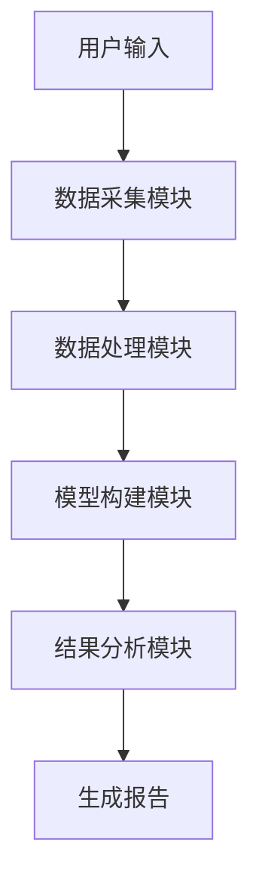

                 


# 《金融产品定价敏感性分析系统》

> 关键词：金融产品定价，敏感性分析，数学模型，系统架构，算法实现

> 摘要：本文系统地介绍了金融产品定价敏感性分析的基本原理、数学模型、算法实现以及系统架构设计。通过详细的理论分析和实际案例，帮助读者理解如何通过敏感性分析来评估金融产品的定价风险，并掌握实际操作中的关键步骤和方法。

---

# 第1章 金融产品定价敏感性分析系统概述

## 1.1 什么是金融产品定价敏感性分析
### 1.1.1 金融产品的定义与分类
金融产品是指以货币形式存在的各种金融工具，包括股票、债券、基金、衍生品等。根据功能和风险特性，金融产品可以分为以下几类：
- **债务工具**：如债券、贷款等，具有确定的还本付息义务。
- **股权工具**：如股票，代表对公司的所有权。
- **衍生品**：如期货、期权，其价值取决于基础资产的价格变动。

### 1.1.2 定价敏感性分析的定义
定价敏感性分析是研究金融产品价格对市场变量（如利率、汇率、波动率等）变化的敏感程度的过程。通过分析这些变量的变化对产品价格的影响，可以帮助投资者和金融机构更好地理解产品风险，优化定价策略。

### 1.1.3 定价敏感性分析的重要性
- **风险管理**：通过识别敏感变量，金融机构可以更好地管理市场风险。
- **优化定价**：定价敏感性分析帮助金融机构在复杂市场环境中制定更准确的价格。
- **决策支持**：分析结果为投资决策和产品设计提供数据支持。

---

## 1.2 定价敏感性分析的背景与应用
### 1.2.1 金融市场的复杂性
金融市场受到多种因素的影响，包括宏观经济指标、政策变化、市场情绪等。这些因素的波动会导致金融产品价格的剧烈变化。

### 1.2.2 定价敏感性分析的市场需求
随着金融市场的发展，金融机构对产品定价的精确性和风险控制提出了更高的要求。定价敏感性分析成为金融机构不可或缺的工具。

### 1.2.3 定价敏感性分析的实际应用案例
- **银行贷款定价**：通过分析利率变化对贷款收益的影响，优化贷款定价策略。
- **衍生品定价**：利用敏感性分析确定期权价格对波动率的敏感程度。

---

## 1.3 本书的核心目标与结构
### 1.3.1 本书的核心目标
通过系统化的理论分析和实际案例，全面介绍金融产品定价敏感性分析的原理、方法和实现技术。

### 1.3.2 本书的章节安排
- 第1章：概述定价敏感性分析的基本概念和背景。
- 第2章：详细讲解定价敏感性分析的核心概念和数学模型。
- 第3章：介绍定价敏感性分析的算法实现。
- 第4章：设计定价敏感性分析系统的架构。
- 第5章：通过实际案例展示系统实现和应用。

### 1.3.3 本书的读者群体
本书适合金融从业者、数据科学家、软件开发人员以及对金融产品定价敏感性分析感兴趣的研究者。

---

# 第2章 金融产品定价敏感性分析的核心概念

## 2.1 金融产品定价的基本原理
### 2.1.1 金融产品的定价模型
金融产品的定价模型是敏感性分析的基础。常见的定价模型包括：
- **Black-Scholes模型**：用于期权定价。
- **CAPM模型**：用于股票定价。

### 2.1.2 市场风险与信用风险
- **市场风险**：指市场价格波动对金融产品价值的影响。
- **信用风险**：指债务人违约对金融产品价值的影响。

### 2.1.3 定价模型的输入变量与输出变量
- **输入变量**：如利率、波动率、时间等。
- **输出变量**：如产品价格、风险价值（VaR）。

---

## 2.2 定价敏感性分析的原理与方法
### 2.2.1 定价敏感性分析的基本原理
敏感性分析通过改变输入变量的值，观察输出变量的变化，从而评估输入变量对输出变量的影响程度。

### 2.2.2 定价敏感性分析的主要方法
- **局部敏感性分析**：通过微扰输入变量，计算导数或偏导数。
- **全局敏感性分析**：通过蒙特卡洛模拟等方法，评估多个变量的综合影响。

### 2.2.3 定价敏感性分析的数学模型
- **线性模型**：如$$y = \beta_0 + \beta_1x_1 + \beta_2x_2 + ... + \beta_nx_n + \epsilon$$
- **非线性模型**：如$$y = e^{\beta_0 + \beta_1x_1}$$

---

## 2.3 定价敏感性分析的核心要素
### 2.3.1 定价模型的参数
- **利率**：如无风险利率和风险溢价。
- **波动率**：如资产价格波动率。
- **时间**：如期权的到期时间。

### 2.3.2 定价敏感性分析的指标
- **Delta**：价格对资产价格变化的敏感度。
- **Vega**：价格对波动率变化的敏感度。
- **Rho**：价格对利率变化的敏感度。

### 2.3.3 定价敏感性分析的边界条件
- **数据范围**：如历史价格数据的时间范围。
- **模型假设**：如无套利假设、市场有效假设。

---

# 第3章 金融产品定价敏感性分析的数学模型与算法

## 3.1 线性回归模型
### 3.1.1 线性回归模型的定义
线性回归模型用于描述自变量与因变量之间的线性关系。

### 3.1.2 线性回归模型的假设
- 线性关系：因变量与自变量之间存在线性关系。
- 独立性：自变量之间相互独立。
- 正态性：误差服从正态分布。
- 同方差性：误差方差恒定。

### 3.1.3 线性回归模型的优缺点
- 优点：简单易懂，计算效率高。
- 缺点：假设条件严格，难以处理非线性关系。

---

## 3.2 非线性回归模型
### 3.2.1 非线性回归模型的定义
非线性回归模型用于描述自变量与因变量之间的非线性关系。

### 3.2.2 常见的非线性回归模型
- **逻辑回归**：用于分类问题。
- **多项式回归**：用于拟合曲线关系。

### 3.2.3 非线性回归模型的应用场景
- 适用于复杂市场行为建模。
- 适用于非线性关系的数据分析。

---

## 3.3 定价敏感性分析的算法实现
### 3.3.1 算法实现的基本步骤
1. 数据预处理：清洗和标准化数据。
2. 模型训练：选择合适的回归模型。
3. 模型评估：计算回归系数和拟合优度。
4. 敏感性分析：计算各变量的敏感度。

### 3.3.2 算法实现的代码示例
```python
import numpy as np
from sklearn.linear_model import LinearRegression

# 生成数据
X = np.array([[1, 1], [2, 2], [3, 3], [4, 4], [5, 5]], dtype=float)
y = np.array([2, 4, 5, 4, 6], dtype=float)

# 训练模型
model = LinearRegression()
model.fit(X, y)

# 获取回归系数
print("回归系数：", model.coef_)
print("截距：", model.intercept_)
```

### 3.3.3 算法实现的优化建议
- 使用正则化方法防止过拟合。
- 选择合适的模型评估指标，如R²值和均方误差。

---

# 第4章 金融产品定价敏感性分析系统的架构设计

## 4.1 系统功能模块划分
### 4.1.1 数据采集模块
- 数据来源：市场数据接口、数据库。
- 数据类型：价格、利率、波动率等。

### 4.1.2 数据处理模块
- 数据清洗：处理缺失值和异常值。
- 数据转换：标准化和归一化。

### 4.1.3 模型构建模块
- 选择合适的回归模型。
- 训练模型并保存模型参数。

### 4.1.4 结果分析模块
- 计算各变量的敏感度。
- 生成可视化报告。

---

## 4.2 系统架构设计
- **数据采集模块**：通过API接口获取市场数据。
- **数据处理模块**：使用Python的Pandas库进行数据清洗和转换。
- **模型构建模块**：基于Scikit-learn框架实现回归模型。
- **结果分析模块**：生成敏感性分析报告，并通过图表展示敏感度。

---

## 4.3 系统接口设计
- 数据接口：提供RESTful API，供其他系统调用。
- 模型接口：提供预测接口，供实时分析使用。

---

## 4.4 系统交互流程图


---

通过以上章节的详细介绍，读者可以全面理解金融产品定价敏感性分析的系统架构、数学模型和算法实现。接下来的章节将通过实际案例进一步验证和应用这些理论。

