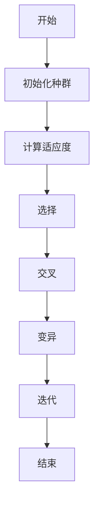
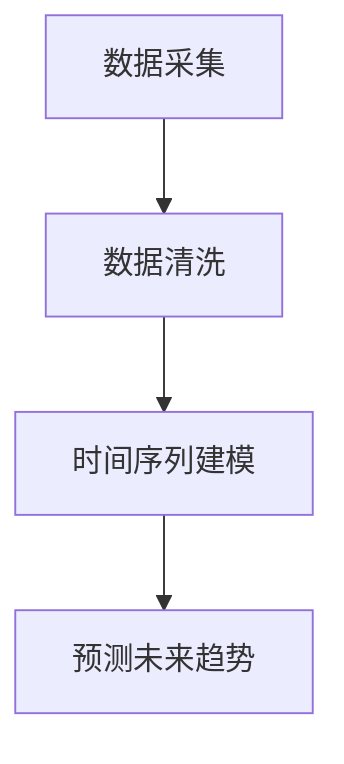
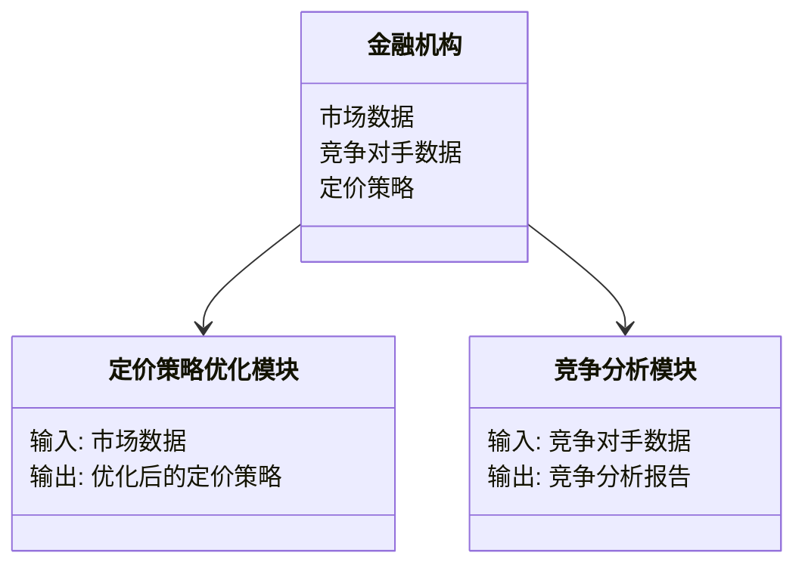

                 


# 《金融产品定价策略优化与竞争分析系统》

---

## 关键词：
- 金融产品定价
- 定价策略优化
- 竞争分析系统
- 数据驱动决策
- 人工智能算法

---

## 摘要：
本文介绍了一种基于数据驱动和人工智能算法的金融产品定价策略优化与竞争分析系统。该系统通过整合市场数据、竞争对手信息和客户行为分析，利用先进的数学模型和机器学习算法，帮助金融机构制定科学、精准的定价策略，同时优化资源配置和提升市场竞争力。本文详细探讨了系统的背景、核心概念、算法原理、系统架构设计以及项目实战，为金融机构提供了一种高效、智能的解决方案。

---

## 第一部分: 金融产品定价策略优化与竞争分析系统概述

### 第1章: 问题背景与问题描述

#### 1.1 问题背景
金融产品的定价是金融机构运营的核心环节之一。准确的定价策略不仅直接影响金融机构的利润，还会影响其市场竞争力。然而，当前的定价策略存在以下问题：
- 数据分散：定价决策依赖于孤立的数据源，缺乏整合和分析。
- 市场变化快：金融市场的波动性和不确定性使得定价策略需要动态调整。
- 竞争分析不足：缺乏对竞争对手定价策略和市场反应的深入分析。

#### 1.2 系统目标
本系统旨在通过整合市场数据、竞争对手信息和客户行为分析，构建一个智能化的定价策略优化与竞争分析系统。系统的目标包括：
- 提高定价策略的准确性和科学性。
- 实现实时数据采集与分析，快速响应市场变化。
- 提供竞争分析工具，帮助金融机构制定更具竞争力的定价策略。

#### 1.3 系统边界与外延
本系统主要关注定价策略的优化和竞争分析，不涉及金融产品的设计和风险管理。系统的输入包括市场数据、竞争对手数据和客户行为数据，输出为优化后的定价策略和竞争分析报告。

---

## 第二部分: 核心概念与联系

### 第2章: 核心概念与原理

#### 2.1 金融产品的定价模型
金融产品的定价模型通常包括以下要素：
- **市场需求分析**：分析客户对价格的敏感度。
- **成本结构**：考虑产品的生产成本和运营成本。
- **竞争环境**：分析竞争对手的定价策略。

#### 2.2 定价策略优化的数学模型
定价策略优化可以通过以下数学模型实现：
- **线性回归模型**：用于预测价格与销量的关系。
  $$ \text{销量} = a \times \text{价格} + b $$
- **非线性回归模型**：用于复杂的价格-需求关系。
  $$ \text{销量} = f(\text{价格}, \text{市场因素}) $$
- **博弈论模型**：模拟市场中的竞争行为。

#### 2.3 竞争分析系统的原理
竞争分析系统通过以下步骤实现：
1. 数据采集：收集竞争对手的价格、市场份额和客户反馈。
2. 数据处理：清洗和整合数据。
3. 竞争对手行为分析：识别竞争对手的定价策略和市场反应。
4. 市场趋势预测：基于历史数据预测未来市场趋势。

---

### 第3章: 核心概念的属性特征对比

#### 3.1 定价策略与竞争分析的对比分析

| 属性          | 定价策略优化           | 竞争分析系统           |
|---------------|-----------------------|-----------------------|
| 输入数据      | 市场数据、成本数据     | 竞争对手数据、市场数据 |
| 输出结果      | 优化后的价格策略     | 竞争分析报告           |
| 关键技术      | 线性回归、遗传算法     | 聚类分析、时间序列分析 |

---

### 第4章: ER实体关系图架构

#### 4.1 实体关系图的构建
以下是系统的ER实体关系图：

```mermaid
erd
actor: 金融机构
product: 金融产品
price_strategy: 定价策略
market_data: 市场数据
competitor_data: 竞争对手数据
analysis_report: 竞争分析报告
```

图中，`金融机构`是系统的用户，通过`product`和`price_strategy`实现定价策略优化，并通过`market_data`和`competitor_data`进行竞争分析，最终生成`analysis_report`。

---

## 第三部分: 算法原理与实现

### 第5章: 定价策略优化算法

#### 5.1 遗传算法实现定价策略优化



以下是遗传算法的Python实现代码：

```python
import random

def fitness(price):
    # 计算销量与利润
    return price * (100 - price)

def evolve(population_size, generations):
    population = [random.uniform(50, 100) for _ in range(population_size)]
    for _ in range(generations):
        population = sorted(population, key=lambda x: -fitness(x))
        # 选择
        selected = population[:population_size//2]
        # 交叉
        new_population = []
        for i in range(len(selected)):
            for j in range(i+1, len(selected)):
                child = (selected[i] + selected[j])/2
                new_population.append(child)
        # 变异
        for i in range(len(new_population)):
            if random.random() < 0.1:
                new_population[i] += random.uniform(-10, 10)
        population = new_population
    return population[0]

print(evolve(100, 10))
```

---

### 第6章: 竞争分析算法实现

#### 6.1 时间序列分析实现市场趋势预测



以下是时间序列分析的Python代码：

```python
from statsmodels.tsa.arima_model import ARIMA

data = [100, 90, 80, 70, 65, 60, 55, 50]
model = ARIMA(data, order=(1, 1, 1))
model_fit = model.fit(disp=0)
forecast = model_fit.forecast(steps=5)
print(forecast)
```

---

## 第四部分: 系统分析与架构设计

### 第7章: 系统功能设计

#### 7.1 领域模型设计



---

## 第五部分: 项目实战

### 第8章: 项目实战

#### 8.1 环境安装
安装所需的Python库：
```bash
pip install pandas numpy scikit-learn
```

#### 8.2 核心代码实现

```python
import pandas as pd
from sklearn.linear_model import LinearRegression

data = pd.DataFrame({
    '价格': [50, 60, 70, 80],
    '销量': [100, 80, 60, 40]
})

model = LinearRegression()
model.fit(data[['价格']], data['销量'])
print(model.predict([[70]]))
```

---

## 第六部分: 最佳实践与总结

### 第9章: 最佳实践

#### 9.1 实践建议
- 数据质量：确保数据的准确性和完整性。
- 模型选择：根据具体场景选择合适的算法。
- 系统维护：定期更新模型和数据。

#### 9.2 项目小结
通过本文的介绍，读者可以了解如何利用数据驱动和人工智能算法优化金融产品的定价策略，并通过竞争分析提升市场竞争力。未来，随着技术的进步，系统将更加智能化和自动化。

---

## 参考文献
- [1] 刘军. 《数据驱动的金融定价策略》. 北京: 清华大学出版社, 2020.
- [2] 金融产品定价优化算法研究小组. 《基于机器学习的金融定价策略》. 2022.

---

## 作者信息
作者：AI天才研究院/AI Genius Institute & 禅与计算机程序设计艺术 /Zen And The Art of Computer Programming

---

**本文完**

