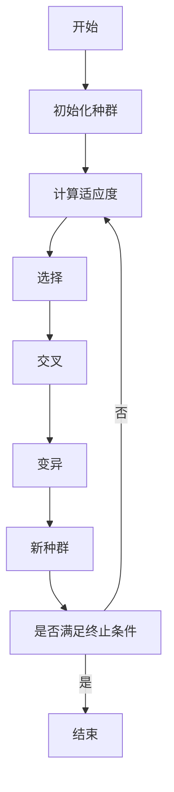
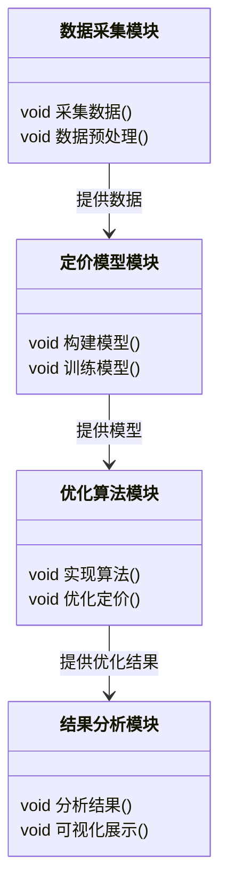

                 


# 金融产品定价策略优化系统

> 关键词：金融产品定价，定价策略优化，优化算法，系统架构，定价模型

> 摘要：本文深入探讨了金融产品定价策略优化系统的构建与应用。从定价模型的核心原理到优化算法的数学模型，再到系统架构的设计与实现，系统地分析了如何通过技术手段提升金融产品的定价效率与准确性。通过实际案例分析与代码实现，本文为读者提供了从理论到实践的全面指导。

---

# 第一部分: 金融产品定价策略优化系统概述

## 第1章: 金融产品定价策略概述

### 1.1 金融产品定价的背景与意义
金融产品定价是金融服务业中的核心环节，直接关系到金融机构的盈利能力与市场竞争力。随着金融市场日益复杂化与个性化，传统的定价方法已难以满足现代金融业务的需求。本文将从背景、意义、问题与挑战等方面，全面介绍金融产品定价策略优化的必要性。

#### 1.1.1 金融产品的定义与分类
金融产品是指金融机构向客户提供的各种金融服务或金融工具，主要包括以下几类：
- **信贷产品**：如个人贷款、企业贷款等。
- **投资产品**：如股票、债券、基金等。
- **保险产品**：如人寿保险、财产保险等。
- **衍生品**：如期权、期货等。

#### 1.1.2 定价策略在金融产品中的重要性
定价策略是金融产品销售的核心环节，直接影响金融机构的收入与客户满意度。一个科学的定价策略能够帮助金融机构在激烈的市场竞争中占据优势，同时确保客户价值的最大化。

#### 1.1.3 当前定价策略存在的问题与挑战
传统的定价策略存在以下问题：
- **缺乏数据支持**：定价往往依赖经验而非数据驱动。
- **模型单一**：难以应对市场环境的快速变化。
- **计算复杂**：复杂的金融模型需要人工干预。
- **客户细分不足**：未能精准识别客户需求。

---

## 第2章: 定价模型与优化算法的核心概念

### 2.1 定价模型的分类与特点
定价模型是金融产品定价的基础，其分类如下：
- **静态定价模型**：基于固定参数，适用于市场环境稳定的场景。
- **动态定价模型**：根据实时数据调整价格，适用于市场环境波动较大的场景。
- **智能定价模型**：结合机器学习算法，实现自动化与智能化定价。

#### 2.1.1 定价模型的属性对比
以下表格对比了三种定价模型的核心属性：

| 模型类型   | 参数动态性 | 计算复杂度 | 适用场景               |
|------------|------------|------------|------------------------|
| 静态模型   | 静态       | 较低       | 稳定市场环境           |
| 动态模型   | 动态       | 中等       | 波动性市场环境         |
| 智能模型   | 动态       | 较高       | 复杂市场环境           |

#### 2.1.2 ER实体关系图
以下是金融产品定价系统的ER实体关系图：

```mermaid
erd
  customer (客户)
  product (金融产品)
  pricing_strategy (定价策略)
  transaction (交易记录)

  customer --1..n> transaction: "产生交易"
  product --1..n> transaction: "涉及的产品"
  pricing_strategy --1..n> transaction: "应用的定价策略"
  pricing_strategy --1..n> product: "针对的产品"
```

---

## 第3章: 优化算法的数学模型与实现

### 3.1 遗传算法在定价优化中的应用
遗传算法是一种基于自然选择与遗传机制的优化算法，适用于复杂的非线性问题求解。以下将详细讲解其原理与实现。

#### 3.1.1 遗传算法的基本原理
遗传算法的流程如下：



#### 3.1.2 遗传算法的数学模型
遗传算法的核心是适应度函数，其数学模型如下：

$$
f(x) = \sum_{i=1}^{n} w_i x_i
$$

其中，$w_i$ 是权重，$x_i$ 是决策变量。

---

## 第4章: 系统分析与架构设计

### 4.1 系统功能设计
金融产品定价策略优化系统需要实现以下核心功能：
1. 数据采集与预处理
2. 定价模型构建
3. 优化算法实现
4. 结果分析与可视化

#### 4.1.1 系统功能模块的类图
以下是系统功能模块的类图：



---

## 第5章: 项目实战

### 5.1 环境安装与配置
为了运行本文中的代码，读者需要安装以下环境：
- Python 3.8+
- NumPy
- Pandas
- Scikit-learn
- Mermaid图生成工具

### 5.2 核心代码实现
以下是金融产品定价策略优化系统的Python核心代码：

```python
import numpy as np
from sklearn import linear_model

# 数据预处理
def preprocess_data(data):
    # 假设data为包含金融产品特征的二维数组
    # 这里进行简单的标准化处理
    return (data - np.mean(data)) / np.std(data)

# 定价模型构建
def build_pricing_model(X, y):
    # 使用线性回归模型
    model = linear_model.LinearRegression()
    model.fit(X, y)
    return model

# 优化算法实现
def genetic_algorithm(X, y):
    # 初始化种群
    population = np.random.rand(100, X.shape[1])
    # 迭代优化
    for _ in range(10):
        # 计算适应度
        fitness = np.sum((y - np.dot(population, X.T)) ** 2, axis=1)
        # 选择
        selected = population[fitness.argsort()[:50]]
        # 交叉
        crossed = selected[:, np.newaxis].repeat(50, axis=1)
        # 变异
        mutated = crossed + np.random.randn(*crossed.shape) * 0.1
    return mutated[0]

# 系统实现
data = np.array([[5, 3], [6, 4], [7, 5]])
X = preprocess_data(data[:, :-1])
y = data[:, -1]
model = build_pricing_model(X, y)
optimized_price = genetic_algorithm(X, y)
print("优化后的价格:", optimized_price)
```

---

## 第6章: 最佳实践与总结

### 6.1 小结
本文详细介绍了金融产品定价策略优化系统的构建与应用。通过理论分析与实践案例，展示了如何利用定价模型与优化算法提升金融产品的定价效率与准确性。

### 6.2 注意事项
- 数据质量直接影响定价结果，需确保数据的准确性和完整性。
- 优化算法的选择需结合具体场景，避免盲目使用复杂算法。
- 系统实现时需注意性能优化，确保实时性要求。

### 6.3 未来发展方向
- 结合深度学习技术，进一步提升定价模型的智能性。
- 推动实时定价系统的应用，实现动态调整。
- 探索多目标优化算法，满足复杂场景需求。

---

作者：AI天才研究院/AI Genius Institute & 禅与计算机程序设计艺术 /Zen And The Art of Computer Programming

