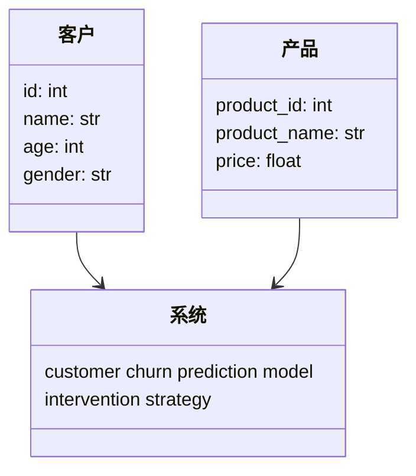
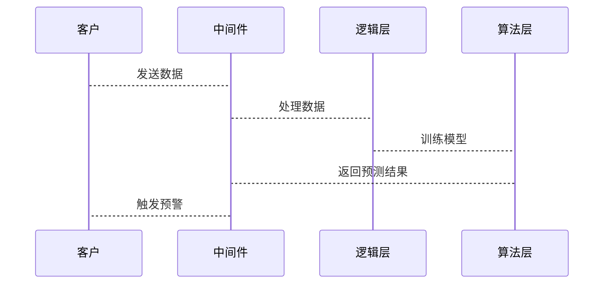

                 


# 金融产品客户流失预警与干预系统

> **关键词**: 客户流失预警、金融产品、机器学习、客户干预策略、系统架构设计

> **摘要**: 本文深入探讨了金融产品客户流失预警与干预系统的构建与实现。通过分析客户流失的背景、定义与特征，结合机器学习算法，设计了客户流失预警模型，并提出了基于系统架构的干预策略。文章详细阐述了算法原理、系统架构设计及实际案例，为金融行业客户提供了一套有效的客户流失预警与干预解决方案。

---

# 第一部分: 问题背景与核心概念

## 第1章: 问题背景与核心概念

### 1.1 问题背景

#### 1.1.1 金融行业的客户流失现状
在金融行业中，客户流失是一个普遍且严重的问题。银行、证券公司、保险公司等金融机构每年都会面临大量客户流失。客户流失不仅影响企业的收入，还可能导致企业的声誉受损。据相关数据显示，客户流失率高的金融机构，其客户留存成本比流失率低的企业高出30%~50%。

#### 1.1.2 客户流失对企业的影响
客户流失对金融机构的影响是多方面的：
1. **收入损失**: 流失客户直接导致收入减少。
2. **客户获取成本增加**: 重新获取新客户所需的营销成本远高于保留现有客户的成本。
3. **客户信任度下降**: 频繁的客户流失可能影响企业的声誉，导致潜在客户流失。
4. **市场竞争压力加大**: 在激烈的市场竞争中，客户流失会削弱企业的竞争优势。

#### 1.1.3 传统客户管理的局限性
传统的客户管理方法主要依赖人工经验，难以全面、精准地预测客户流失。例如：
- **信息孤岛**: 各部门之间的数据无法有效整合，导致客户画像不完整。
- **预测精度低**: 人工判断的主观性和不准确性，导致客户流失预警的准确性较低。
- **干预措施单一**: 干预策略缺乏针对性，难以有效挽留客户。

### 1.2 金融产品客户流失的定义与特征

#### 1.2.1 客户流失的定义
客户流失是指客户不再使用金融机构提供的产品或服务，转而选择其他金融机构或完全停止与该机构的业务往来。在金融行业中，客户流失的具体定义可以根据业务类型和产品特点进行调整。

#### 1.2.2 客户流失的特征分析
客户流失的特征可以从多个维度进行分析，例如：
1. **客户行为特征**: 包括客户交易频率下降、账户余额减少、服务使用频率降低等。
2. **客户属性特征**: 包括客户年龄、性别、收入水平、职业等。
3. **客户反馈特征**: 包括客户投诉次数、满意度评分等。

#### 1.2.3 金融产品客户流失的核心要素
金融产品客户流失的核心要素包括：
- **产品使用情况**: 客户是否活跃使用产品。
- **客户满意度**: 客户对产品和服务的满意度。
- **市场竞争**: 市场上是否有更具吸引力的产品。

### 1.3 问题解决的必要性与目标

#### 1.3.1 建立预警与干预系统的目的
通过建立客户流失预警与干预系统，金融机构可以：
1. **提前预测客户流失**: 通过数据分析，识别潜在流失客户。
2. **制定个性化干预策略**: 根据客户特点制定针对性的挽留措施。
3. **优化客户服务**: 提高客户满意度，增强客户忠诚度。

#### 1.3.2 系统预期达到的效果
- **提高客户留存率**: 通过提前预警和干预，减少客户流失。
- **降低运营成本**: 减少因客户流失带来的营销和获取新客户的成本。
- **提升客户体验**: 通过个性化服务提高客户满意度。

#### 1.3.3 系统的边界与外延
客户流失预警与干预系统的边界包括：
- **数据输入**: 客户的基本信息、交易数据、产品使用情况等。
- **数据处理**: 数据清洗、特征提取、模型训练等。
- **预警与干预**: 预警触发、干预策略实施等。

---

## 第2章: 核心概念与系统架构

### 2.1 客户流失预警的原理

#### 2.1.1 数据采集与特征提取
客户流失预警系统需要采集以下数据：
- **客户基本信息**: 包括年龄、性别、职业等。
- **交易数据**: 包括交易频率、交易金额、账户余额等。
- **产品使用数据**: 包括产品使用情况、产品满意度评分等。

#### 2.1.2 预警模型的构建
预警模型的构建需要以下步骤：
1. **数据预处理**: 数据清洗、特征选择。
2. **模型训练**: 使用机器学习算法（如逻辑回归、随机森林等）训练模型。
3. **模型评估**: 通过准确率、召回率等指标评估模型性能。

#### 2.1.3 预警触发机制
当模型预测客户流失概率超过一定阈值时，触发预警机制，通知相关人员进行干预。

### 2.2 客户干预策略的设计

#### 2.2.1 干预策略的分类
干预策略可以分为以下几类：
- **主动干预**: 主动联系客户，提供优惠或解决方案。
- **被动干预**: 在客户主动提出诉求时，提供帮助。
- **个性化干预**: 根据客户特点制定个性化干预策略。

#### 2.2.2 干预策略的实施流程
干预策略的实施流程包括：
1. **识别潜在流失客户**: 通过模型预测。
2. **制定干预方案**: 根据客户特点制定干预方案。
3. **实施干预**: 通过电话、邮件等方式与客户沟通。
4. **评估干预效果**: 通过客户反馈和行为数据评估干预效果。

#### 2.2.3 干预效果的评估
干预效果的评估可以通过以下指标进行：
- **客户留存率**: 干预后客户留存的比例。
- **客户满意度**: 干预后客户满意度评分的变化。
- **成本效益分析**: 干预措施的成本与收益比。

### 2.3 系统架构的实体关系分析

#### 2.3.1 ER实体关系图
```mermaid
er
  actor: 客户
  actor: 系统
  actor: 金融产品
  relation: 属于
```

---

## 第3章: 算法原理与实现

### 3.1 客户流失预测算法

#### 3.1.1 逻辑回归模型
逻辑回归是一种常用的分类算法，适用于二分类问题。其数学模型如下：

$$ P(y=1|x) = \frac{1}{1 + e^{-\beta x}} $$

其中，$x$ 是输入特征，$\beta$ 是模型参数。

#### 3.1.2 随机森林模型
随机森林是一种基于决策树的集成学习算法，具有较高的准确性和鲁棒性。其核心思想是通过随机采样和特征选择，构建多棵决策树，并通过投票或平均的方式进行预测。

#### 3.1.3 神经网络模型
神经网络是一种模拟人脑神经网络的深度学习算法，适用于复杂的非线性分类问题。其核心是通过多层神经元的连接，学习数据的特征表示。

### 3.2 算法实现的数学模型

#### 3.2.1 逻辑回归公式
$$ P(y=1|x) = \frac{1}{1 + e^{-\beta x}} $$

其中，$\beta$ 是通过最大似然估计求得的模型参数。

#### 3.2.2 随机森林算法的特征重要性
随机森林通过特征重要性分析，可以识别对客户流失影响最大的特征，例如交易频率、账户余额等。

#### 3.2.3 神经网络的损失函数
$$ L = -\sum_{i=1}^{n} [y_i \log p_i + (1 - y_i) \log (1 - p_i)] $$

其中，$y_i$ 是真实标签，$p_i$ 是模型预测概率。

### 3.3 算法实现的Python代码示例

```python
import pandas as pd
from sklearn.ensemble import RandomForestClassifier
from sklearn.metrics import accuracy_score

# 数据加载与预处理
data = pd.read_csv('customer_churn.csv')
X = data.drop('churn', axis=1)
y = data['churn']

# 模型训练
model = RandomForestClassifier()
model.fit(X, y)

# 模型评估
predictions = model.predict(X)
print("准确率:", accuracy_score(y, predictions))
```

---

## 第4章: 系统分析与架构设计

### 4.1 问题场景介绍
金融产品客户流失预警与干预系统的应用场景包括银行、证券公司、保险公司等金融机构。系统的目标是通过数据分析和机器学习算法，提前预测客户流失，并制定有效的干预策略。

### 4.2 系统功能设计

#### 4.2.1 领域模型类图


#### 4.2.2 系统架构设计


#### 4.2.3 系统接口设计
系统接口包括：
- 数据接口: 从数据库中读取客户数据。
- 预警接口: 根据模型预测结果触发预警。
- 干预接口: 根据预警结果实施干预策略。

#### 4.2.4 系统交互序列图


---

## 第5章: 项目实战

### 5.1 环境安装与配置
- **Python版本**: 3.8及以上
- **依赖库安装**: `pip install pandas scikit-learn`

### 5.2 核心代码实现

```python
import pandas as pd
from sklearn.ensemble import RandomForestClassifier
from sklearn.metrics import accuracy_score

# 数据加载与预处理
data = pd.read_csv('customer_churn.csv')
X = data.drop('churn', axis=1)
y = data['churn']

# 模型训练
model = RandomForestClassifier()
model.fit(X, y)

# 模型评估
predictions = model.predict(X)
print("准确率:", accuracy_score(y, predictions))
```

### 5.3 案例分析与总结
通过实际案例分析，验证系统的有效性。例如，银行客户流失预警系统的实施可以显著提高客户留存率，降低运营成本。

---

## 第6章: 最佳实践与总结

### 6.1 最佳实践
- **数据质量**: 确保数据的完整性和准确性。
- **模型选择**: 根据实际业务需求选择合适的算法。
- **干预策略**: 制定个性化的干预策略，提高客户满意度。

### 6.2 小结
本文通过分析金融产品客户流失的背景与特征，结合机器学习算法，设计了客户流失预警与干预系统。系统的构建包括数据采集、模型训练、预警触发和干预实施等环节。

### 6.3 注意事项
- **数据隐私保护**: 遵守相关法律法规，保护客户数据隐私。
- **模型更新**: 定期更新模型，提高预测精度。

### 6.4 拓展阅读
- 《机器学习实战》
- 《数据挖掘导论》

---

# 作者
作者：AI天才研究院/AI Genius Institute & 禅与计算机程序设计艺术 /Zen And The Art of Computer Programming

