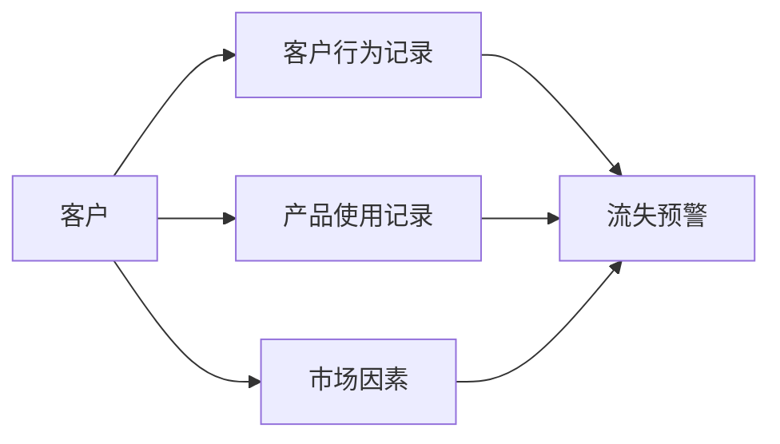
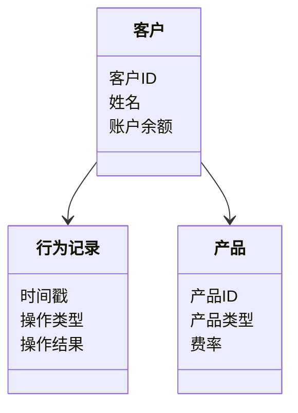

                 


# 《金融产品客户流失预警与挽留策略系统》

> 关键词：客户流失预警、金融产品、挽留策略、机器学习、系统架构、数据驱动

> 摘要：本文详细探讨了金融产品客户流失预警与挽留策略系统的构建过程，从问题背景、核心概念、算法原理到系统架构和项目实战，全面分析了如何利用数据驱动的方法预测客户流失并制定有效的挽留策略，帮助金融机构降低客户流失率，提升客户满意度和忠诚度。

---

# 第一部分: 问题背景与核心概念

## 第1章: 问题背景与核心概念

### 1.1 客户流失问题的背景

#### 1.1.1 金融行业客户流失的现状

在金融行业中，客户流失是一个普遍且关键的问题。随着市场竞争的加剧，金融机构面临着客户流失率上升的挑战。根据行业数据分析，客户的流失不仅会导致收入下降，还会增加获取新客户的成本。金融产品的客户流失率通常在5%到15%之间，而挽回一个客户的成本是获取新客户的5倍以上。

#### 1.1.2 金融产品客户流失的影响

客户流失对金融机构的影响是多方面的：

1. **收入损失**：流失的客户意味着直接收入的减少。
2. **成本增加**：获取新客户的成本远高于保留现有客户。
3. **声誉损失**：客户流失可能影响机构的声誉。
4. **市场机会损失**：流失的客户可能成为竞争对手的目标。

#### 1.1.3 客户流失预警的必要性

通过客户流失预警系统，金融机构可以提前识别潜在流失客户，采取有效措施降低流失率。这不仅可以减少收入损失，还可以提升客户满意度和忠诚度。

### 1.2 核心概念与问题描述

#### 1.2.1 客户流失的定义

客户流失是指客户停止使用金融机构提供的产品或服务，或者减少使用频率，导致收入下降的行为。

#### 1.2.2 客户流失预警的定义

客户流失预警是指通过数据分析和模型预测，识别潜在流失客户，并提前发出预警信号。

#### 1.2.3 客户流失挽留策略的定义

挽留策略是指针对潜在流失客户，采取的一系列措施，以重新获得客户或降低流失风险。

### 1.3 问题解决思路

#### 1.3.1 数据驱动的客户流失分析

通过收集和分析客户的交易数据、行为数据和市场数据，识别客户流失的潜在风险。

#### 1.3.2 预警模型的构建

利用机器学习算法，构建客户流失预警模型，准确预测客户流失的可能性。

#### 1.3.3 挽留策略的制定与实施

根据客户特征和流失风险，制定个性化的挽留策略，包括优惠活动、个性化服务等。

### 1.4 系统边界与外延

#### 1.4.1 系统的功能边界

系统主要功能包括客户数据采集、流失预警模型构建、挽留策略制定和实施。

#### 1.4.2 系统的外部接口

系统需要与客户数据库、交易系统和市场数据分析工具等外部系统接口对接。

#### 1.4.3 系统的适用范围

适用于各种金融产品，包括银行、保险、投资理财等领域。

### 1.5 核心要素与概念结构

#### 1.5.1 数据源的构成

客户数据、交易数据、市场数据、行为数据。

#### 1.5.2 模型算法的选择

逻辑回归、随机森林、神经网络等。

#### 1.5.3 挽留策略的分类

优惠活动、个性化服务、客户关系管理等。

---

# 第二部分: 核心概念与联系

## 第2章: 客户流失预警的核心原理

### 2.1 数据特征分析

#### 2.1.1 客户行为特征

客户的行为特征包括交易频率、交易金额、账户活跃度等。

#### 2.1.2 产品使用特征

产品使用特征包括产品类型、使用时长、使用频率等。

#### 2.1.3 市场环境特征

市场环境特征包括经济指标、行业竞争状况、政策变化等。

### 2.2 模型原理与特征对比

#### 2.2.1 不同模型的特征对比（表格）

| 模型类型   | 优点                         | 缺点                           |
|------------|------------------------------|--------------------------------|
| 逻辑回归   | 解释性强，计算速度快           | 非线性关系表现差               |
| 随机森林   | 非线性能力强，抗过拟合         | 解释性较弱                     |
| 神经网络   | 高度非线性，表现能力强         | 计算复杂，解释性差             |

#### 2.2.2 模型性能的对比分析

通过对比不同模型的准确率、召回率和F1值，选择最适合的模型。

### 2.3 实体关系图（ER图）



---

# 第三部分: 算法原理与数学模型

## 第3章: 客户流失预警算法原理

### 3.1 逻辑回归模型

#### 3.1.1 模型原理

逻辑回归是一种常用的分类算法，通过构建概率模型，预测客户流失的概率。

#### 3.1.2 模型流程图


#### 3.1.3 代码实现

```python
import pandas as pd
from sklearn.linear_model import LogisticRegression

# 假设 df 是数据集
df = pd.DataFrame({
    'feature1': [0, 1, 2, 3],
    'feature2': [0, 1, 2, 3],
    'target': [0, 1, 0, 1]
})

X = df[['feature1', 'feature2']]
y = df['target']

model = LogisticRegression()
model.fit(X, y)
```

---

## 第4章: 系统分析与架构设计

### 4.1 问题场景介绍

金融机构需要构建一个客户流失预警系统，通过数据分析和模型预测，提前识别潜在流失客户。

### 4.2 系统功能设计

#### 4.2.1 领域模型



### 4.3 系统架构设计

#### 4.3.1 系统架构图


#### 4.3.2 系统接口设计

系统需要与客户数据库、交易系统和市场数据分析工具等外部系统接口对接。

#### 4.3.3 系统交互流程图


---

## 第5章: 项目实战

### 5.1 环境安装

安装所需的Python库，如Pandas、Scikit-learn等。

### 5.2 核心代码实现

```python
import pandas as pd
from sklearn.ensemble import RandomForestClassifier

# 假设 df 是数据集
df = pd.DataFrame({
    'feature1': [0, 1, 2, 3],
    'feature2': [0, 1, 2, 3],
    'target': [0, 1, 0, 1]
})

X = df[['feature1', 'feature2']]
y = df['target']

model = RandomForestClassifier()
model.fit(X, y)
```

### 5.3 案例分析

通过实际案例分析，验证系统的有效性和准确性。

---

## 第6章: 总结与展望

### 6.1 总结

本文详细探讨了金融产品客户流失预警与挽留策略系统的构建过程，从背景、核心概念到算法原理和系统架构，全面分析了如何利用数据驱动的方法预测客户流失并制定有效的挽留策略。

### 6.2 展望

未来，随着人工智能和大数据技术的不断发展，客户流失预警系统将更加智能化和精准化，为金融机构提供更高效的客户管理工具。

---

作者：AI天才研究院/AI Genius Institute & 禅与计算机程序设计艺术 /Zen And The Art of Computer Programming

