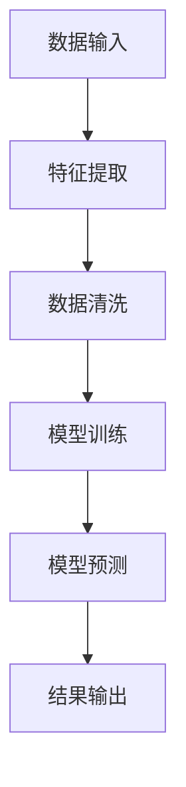
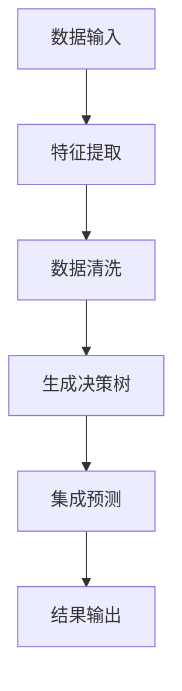
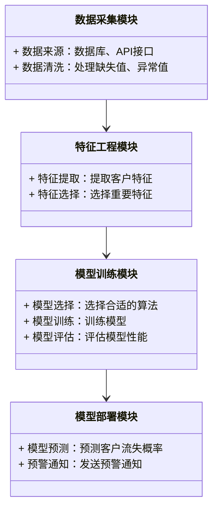
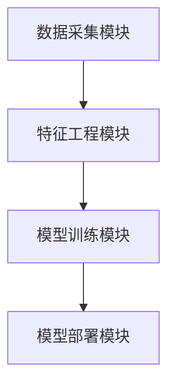
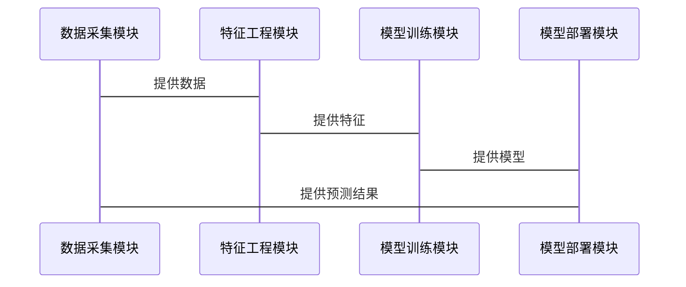

                 


# 金融产品客户流失预警模型

> 关键词：客户流失预警、金融产品、流失预测、机器学习、数据挖掘、风险控制

> 摘要：本文深入探讨了金融产品客户流失预警模型的构建与应用，通过逻辑回归和随机森林算法的原理分析，结合系统架构设计和项目实战，为金融行业提供了一套完整的客户流失预警解决方案。文章内容涵盖了背景介绍、核心概念、算法原理、系统设计、项目实施和最佳实践等多方面内容，帮助读者全面掌握客户流失预警模型的构建方法和实际应用。

---

## 第1章: 金融产品客户流失预警模型背景

### 1.1 客户流失的定义与问题背景

#### 1.1.1 客户流失的定义
客户流失是指客户不再使用企业的产品或服务，导致收入减少的现象。在金融行业，客户流失可能意味着客户不再使用信用卡、理财产品或其他金融产品。

#### 1.1.2 金融产品客户流失的特殊性
金融产品具有高价值和高风险的特点，客户流失不仅会影响收入，还可能导致声誉损失。此外，金融行业的数据隐私要求较高，模型构建需要符合相关法规。

#### 1.1.3 客户流失对企业的影响
客户流失会直接导致收入下降，同时还会增加获取新客户的成本。对于金融企业来说，及时预测客户流失并采取措施，可以有效降低客户流失率，提升客户满意度和忠诚度。

### 1.2 问题描述与目标

#### 1.2.1 客户流失预警的核心问题
如何通过数据分析，识别出潜在的流失客户，并提前采取干预措施。

#### 1.2.2 预警模型的目标
构建一个能够准确预测客户流失的模型，帮助企业提前识别高风险客户，并制定有效的客户保留策略。

#### 1.2.3 预警模型的边界与外延
模型的边界包括客户的基本信息、交易数据和行为数据；外延则包括客户流失后的行为分析和市场反馈。

### 1.3 问题解决的思路

#### 1.3.1 数据驱动的解决方案
通过收集和分析客户数据，利用机器学习算法构建预测模型，识别潜在流失客户。

#### 1.3.2 预警模型的构建逻辑
数据收集 → 数据清洗 → 特征提取 → 模型训练 → 模型评估 → 模型部署。

#### 1.3.3 预警模型的应用场景
信用卡客户流失预警、理财产品客户流失预警、高端客户流失预警等。

### 1.4 核心概念与联系

#### 1.4.1 核心概念的定义与属性

| 核心概念 | 定义 | 属性 |
|----------|------|------|
| 客户特征 | 描述客户行为和特征的数据 | 时间性、相关性、可衡量性 |
| 流失预测 | 预测客户是否可能流失 | 准确性、实时性、可解释性 |
| 预警模型 | 用于预测客户流失的数学模型 | 可扩展性、可解释性、可部署性 |

#### 1.4.2 核心概念的对比表格
| 对比维度 | 客户特征 | 流失预测 |
|----------|----------|----------|
| 数据来源 | 交易数据、行为数据、客户信息 | 预测结果、概率值、预警信号 |
| 目标 | 描述客户行为 | 预测客户流失 |
| 方法 | 数据分析 | 机器学习 |

#### 1.4.3 ER实体关系图架构
```mermaid
erd
  客户表
    id: int
    name: string
    age: int
    gender: string
    账户状态
      账户号: string
      开户日期: date
      最近登录日期: date
  交易记录
    交易号: int
    交易金额: float
    交易时间: datetime
  预警模型
    模型ID: int
    模型名称: string
    模型版本: string
    特征列表
    预警规则
```

---

## 第2章: 金融产品客户流失预警模型的核心概念

### 2.1 客户特征的定义与分类

#### 2.1.1 客户特征的维度
- 基本信息：年龄、性别、职业等。
- 行为特征：交易频率、交易金额、登录时间等。
- 账户特征：账户余额、账户状态等。

#### 2.1.2 客户特征的分类
- 高价值客户：贡献度高，流失风险低。
- 中价值客户：贡献度一般，流失风险中等。
- 低价值客户：贡献度低，流失风险高。

#### 2.1.3 客户特征的权重
通过数据分析，对不同特征赋予不同的权重，以反映其对客户流失的影响程度。

### 2.2 流失预测的原理

#### 2.2.1 流失预测的逻辑
根据客户特征，利用机器学习算法预测客户流失的概率。

#### 2.2.2 流失预测的数学模型
$$ P(y=1|x) = \frac{1}{1 + e^{-\beta x}} $$

其中，$x$ 是客户特征向量，$\beta$ 是模型参数。

#### 2.2.3 流失预测的算法选择
常用的算法包括逻辑回归、随机森林和梯度提升树（如XGBoost）。

### 2.3 预警模型的构建要素

#### 2.3.1 数据来源
- 交易数据：包括交易金额、交易时间、交易频率等。
- 客户信息：包括基本信息、账户状态等。
- 行为数据：包括登录时间、访问频率等。

#### 2.3.2 数据预处理
- 数据清洗：处理缺失值、异常值。
- 特征工程：提取特征、降维、特征选择。

#### 2.3.3 模型训练
利用训练数据，训练模型并评估模型性能。

### 2.4 模型评估与优化

#### 2.4.1 模型评估指标
- 准确率（Accuracy）：正确预测的比例。
- 召回率（Recall）：实际流失客户中被正确预测的比例。
- F1分数：综合准确率和召回率的指标。

#### 2.4.2 模型优化策略
- 调参：通过网格搜索优化模型参数。
- 集成学习：利用集成方法提高模型性能。

#### 2.4.3 模型部署与监控
将模型部署到生产环境，并实时监控模型性能。

---

## 第3章: 金融产品客户流失预警模型的算法原理

### 3.1 算法原理概述

#### 3.1.1 逻辑回归算法
逻辑回归是一种常用的分类算法，适用于二分类问题。

#### 3.1.2 随机森林算法
随机森林是一种基于决策树的集成算法，具有较高的鲁棒性。

#### 3.1.3 支持向量机算法
支持向量机是一种基于几何的分类算法，适用于高维数据。

### 3.2 算法原理的数学模型

#### 3.2.1 逻辑回归的数学模型
$$ P(y=1|x) = \frac{1}{1 + e^{-\beta x}} $$

其中，$\beta$ 是模型参数，$x$ 是客户特征向量。

#### 3.2.2 随机森林的数学模型
随机森林通过构建多棵决策树，并取其预测结果的平均值，提高模型的准确性和稳定性。

#### 3.2.3 支持向量机的数学模型
支持向量机通过寻找一个超平面，将数据分成两类。

### 3.3 算法原理的流程图

#### 3.3.1 逻辑回归流程图


#### 3.3.2 随机森林流程图


---

## 第4章: 金融产品客户流失预警模型的系统分析与架构设计

### 4.1 系统分析

#### 4.1.1 项目介绍
本项目旨在构建一个客户流失预警系统，帮助金融企业提前识别高风险客户。

#### 4.1.2 系统功能设计
- 数据采集：从数据库中获取客户数据。
- 特征工程：提取客户特征并进行数据预处理。
- 模型训练：利用机器学习算法训练预警模型。
- 模型部署：将模型部署到生产环境，并实时监控模型性能。

#### 4.1.3 系统架构设计


### 4.2 系统架构设计

#### 4.2.1 系统架构图


#### 4.2.2 系统接口设计
- 数据接口：提供数据输入和输出接口。
- 模型接口：提供模型训练和预测接口。

#### 4.2.3 系统交互设计


---

## 第5章: 金融产品客户流失预警模型的项目实战

### 5.1 环境安装

#### 5.1.1 安装Python
```bash
python --version
pip install --upgrade pip
```

#### 5.1.2 安装相关库
```bash
pip install numpy
pip install pandas
pip install scikit-learn
```

### 5.2 系统核心实现源代码

#### 5.2.1 数据预处理代码
```python
import pandas as pd
import numpy as np

# 读取数据
data = pd.read_csv('customer.csv')

# 处理缺失值
data = data.dropna()

# 处理异常值
data = data[~data['balance'].apply(lambda x: x < 0)]
```

#### 5.2.2 模型训练代码
```python
from sklearn.model_selection import train_test_split
from sklearn.linear_model import LogisticRegression
from sklearn.metrics import accuracy_score

# 划分数据集
X_train, X_test, y_train, y_test = train_test_split(data.drop('churn', axis=1), data['churn'], test_size=0.2)

# 训练逻辑回归模型
model = LogisticRegression()
model.fit(X_train, y_train)

# 预测结果
y_pred = model.predict(X_test)

# 评估模型
print(accuracy_score(y_test, y_pred))
```

### 5.3 代码应用解读与分析

#### 5.3.1 数据预处理
- 数据清洗：处理缺失值和异常值。
- 特征选择：选择对客户流失影响较大的特征。

#### 5.3.2 模型训练
- 划分数据集：将数据分为训练集和测试集。
- 训练模型：使用逻辑回归算法训练模型。
- 模型评估：评估模型的准确率、召回率等指标。

### 5.4 实际案例分析

#### 5.4.1 案例背景
某银行希望通过客户流失预警模型，预测信用卡客户的流失风险。

#### 5.4.2 数据分析
分析客户的基本信息、交易数据和行为数据，提取特征并进行建模。

#### 5.4.3 模型部署
将模型部署到生产环境，实时监控客户流失风险，并向相关部门发送预警通知。

### 5.5 项目小结

#### 5.5.1 项目总结
通过构建客户流失预警模型，帮助企业提前识别高风险客户，并制定有效的客户保留策略。

#### 5.5.2 项目经验
- 数据质量对模型性能影响较大。
- 模型部署和监控是项目成功的关键。
- 与业务部门紧密合作，确保模型的应用效果。

---

## 第6章: 金融产品客户流失预警模型的最佳实践

### 6.1 小结

#### 6.1.1 核心知识点总结
- 客户流失的定义与影响。
- 金融产品客户流失预警模型的构建逻辑。
- 逻辑回归和随机森林算法的原理与应用。

### 6.2 注意事项

#### 6.2.1 数据隐私与合规性
在构建模型时，需遵守相关法律法规，确保数据隐私和合规性。

#### 6.2.2 模型的可解释性
模型的可解释性对业务决策至关重要，需确保模型结果易于理解和应用。

#### 6.2.3 模型的实时性
实时监控模型性能，及时调整模型参数，确保模型的准确性。

### 6.3 拓展阅读

#### 6.3.1 推荐书籍
- 《机器学习实战》
- 《数据分析与数据挖掘实用技术》

#### 6.3.2 推荐博客
- Towards Data Science
- Medium上的机器学习专栏

---

## 作者：AI天才研究院/AI Genius Institute & 禅与计算机程序设计艺术/Zen And The Art of Computer Programming

---

以上是《金融产品客户流失预警模型》的技术博客文章的完整目录和内容概述，希望对您有所帮助！

