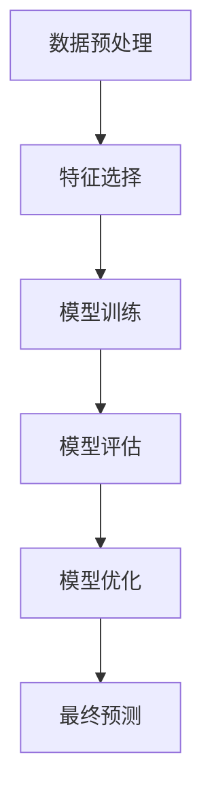
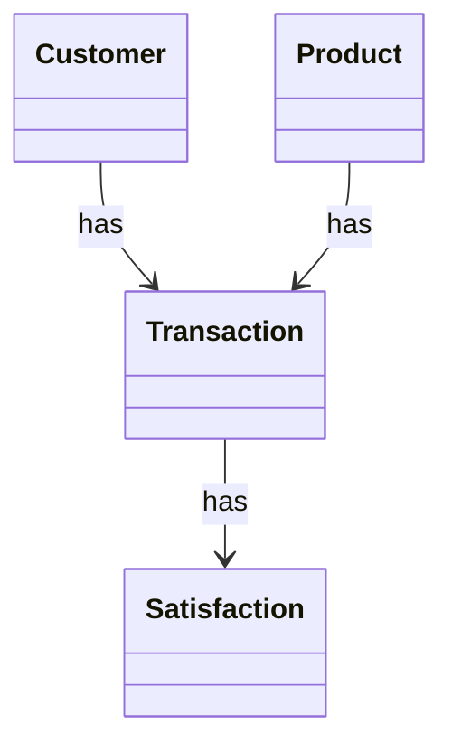

                 


# 《金融产品客户满意度预测与提升模型》

> 关键词：客户满意度预测、金融产品、机器学习、随机森林、模型优化

> 摘要：本文通过系统化的分析和建模方法，构建了一个基于机器学习的金融产品客户满意度预测与提升模型。文章详细探讨了客户满意度预测的核心概念、算法原理、系统设计以及实际应用，并通过实际案例展示了模型的预测与优化过程。本文旨在为金融机构提供科学的客户满意度分析方法，从而帮助机构更好地理解客户需求，提升客户满意度，增强客户忠诚度，最终实现业务增长。

---

## 第1章: 问题背景与描述

### 1.1 问题背景

在金融行业中，客户满意度是衡量客户对产品或服务的满意程度的重要指标。随着市场竞争的加剧，金融机构需要更加精准地预测客户满意度，以便及时调整产品策略和服务流程，提升客户体验。

#### 1.1.1 金融产品的客户满意度问题

金融产品种类繁多，包括银行理财、保险产品、基金投资等。每类产品的客户满意度受到多个因素的影响，例如产品的风险、收益、服务响应速度、客户体验等。然而，金融机构往往难以准确预测客户满意度，导致客户流失或产品优化不足。

#### 1.1.2 金融行业客户满意度的重要性

客户满意度高的客户更可能重复购买产品或推荐给他人，从而为金融机构带来更多的业务机会。同时，客户满意度低的客户可能投诉或转向竞争对手，直接影响金融机构的市场份额和声誉。

#### 1.1.3 当前客户满意度预测的挑战

- 数据多样性和复杂性：金融产品的数据涉及客户行为、市场环境、产品特性等多个维度。
- 数据质量：部分数据可能存在缺失或不准确，影响模型的预测能力。
- 模型复杂性：客户满意度预测需要结合定量和定性分析，模型的选择和优化具有挑战性。

### 1.2 问题描述

#### 1.2.1 客户满意度的定义与度量

客户满意度（Customer Satisfaction，CS）是指客户对金融机构提供的产品或服务的满意程度。通常，客户满意度可以通过问卷调查、客户反馈或数据分析等方式进行测量。

#### 1.2.2 金融产品客户满意度的影响因素

- **产品特性**：包括产品的风险、收益、流动性等。
- **客户行为**：包括客户的购买历史、使用频率、投诉记录等。
- **服务质量**：包括客户与金融机构的互动体验、服务响应速度等。

#### 1.2.3 问题的边界与外延

客户满意度预测的边界包括：预测范围、数据范围、时间范围等。外延则包括客户满意度提升的具体策略和实施方法。

### 1.3 问题解决方法

#### 1.3.1 数据驱动的客户满意度预测

通过收集和分析客户的交易数据、行为数据、反馈数据等，利用数据挖掘和机器学习技术进行客户满意度预测。

#### 1.3.2 机器学习在客户满意度预测中的应用

机器学习算法（如随机森林、支持向量机、神经网络等）能够有效地处理复杂的非线性关系，适合用于客户满意度预测。

#### 1.3.3 提升客户满意度的策略

根据预测结果，金融机构可以针对性地优化产品设计、改进服务质量、调整营销策略等，以提升客户满意度。

### 1.4 概念结构与核心要素

#### 1.4.1 客户满意度预测的核心要素

- 数据来源：客户交易数据、行为数据、反馈数据。
- 预测模型：基于机器学习的模型。
- 提升策略：优化产品和服务的具体措施。

#### 1.4.2 金融产品与客户满意度的关系

客户满意度与金融产品的特性、客户的认知和期望密切相关。通过分析这些关系，可以更好地理解客户的需求，优化产品设计。

#### 1.4.3 模型构建的关键步骤

- 数据收集与预处理。
- 特征选择与工程。
- 模型训练与优化。
- 模型评估与部署。

---

## 第2章: 客户满意度预测模型的核心概念

### 2.1 核心概念原理

#### 2.1.1 客户满意度预测的基本原理

通过分析客户的交易数据、行为数据和反馈数据，利用统计学和机器学习方法，预测客户对金融产品的满意度。

#### 2.1.2 金融产品特征与客户行为分析

- **产品特征**：产品的风险、收益、流动性等。
- **客户行为**：购买频率、投诉次数、产品使用情况等。

#### 2.1.3 模型的输入输出关系

输入：客户特征、产品特征、交易数据。

输出：客户满意度评分（例如，1-5分）。

### 2.2 核心概念属性特征对比

#### 2.2.1 金融产品属性特征表

| 特征类型 | 特征名称 | 特征描述 |
|----------|----------|----------|
| 产品特性 | 风险等级 | 产品的风险高低 |
| 收益率   | 预期年化收益 | 产品的预期收益 |
| 流动性   | 赎回时间 | 产品赎回的时间 |

#### 2.2.2 客户行为特征表

| 特征类型 | 特征名称 | 特征描述 |
|----------|----------|----------|
| 购买行为 | 购买频率 | 客户购买产品的频率 |
| 投诉记录 | 投诉次数 | 客户的投诉次数 |
| 使用行为 | 使用时长 | 客户使用产品的时长 |

#### 2.2.3 特征重要性对比分析

通过对特征重要性的分析，可以发现哪些特征对客户满意度的影响最大。

### 2.3 ER实体关系图

```mermaid
er
    Customer
    Product
    Transaction
    Satisfaction
```

- **Customer**：客户信息表，包含客户ID、年龄、性别、收入等。
- **Product**：产品信息表，包含产品ID、产品名称、产品类型等。
- **Transaction**：交易记录表，包含交易ID、交易金额、交易时间等。
- **Satisfaction**：客户满意度评分表，包含客户ID、产品ID、满意度评分。

---

## 第3章: 算法原理与流程

### 3.1 算法原理

#### 3.1.1 线性回归模型

线性回归是一种简单且常用的回归分析方法，适用于线性关系的预测。

$$ y = \beta_0 + \beta_1 x_1 + \beta_2 x_2 + \ldots + \beta_n x_n $$

其中，$y$ 是目标变量（客户满意度评分），$x_i$ 是特征变量，$\beta_i$ 是系数。

#### 3.1.2 随机森林模型

随机森林是一种基于决策树的集成学习方法，具有较强的抗过拟合能力。

$$ y = \text{sign}\left(\sum_{i=1}^n \text{tree}_i(x)\right) $$

其中，$\text{tree}_i(x)$ 是第$i$棵决策树的预测结果。

#### 3.1.3 模型融合方法

通过将多个模型的预测结果进行加权融合，可以进一步提高模型的预测精度。

$$ y = \sum_{i=1}^m \alpha_i y_i $$

其中，$\alpha_i$ 是第$i$个模型的权重，$y_i$ 是第$i$个模型的预测结果。

### 3.2 算法流程图



### 3.3 代码实现

#### 3.3.1 数据预处理代码

```python
import pandas as pd
data = pd.read_csv('data.csv')
data = data.dropna()
```

#### 3.3.2 模型训练代码

```python
from sklearn.ensemble import RandomForestClassifier
model = RandomForestClassifier()
model.fit(X_train, y_train)
```

---

## 第4章: 系统分析与架构设计

### 4.1 问题场景介绍

本项目旨在构建一个金融产品客户满意度预测与提升系统，帮助金融机构优化产品设计和服务流程。

### 4.2 系统功能设计

#### 4.2.1 领域模型类图



### 4.3 系统架构设计

#### 4.3.1 系统架构图


---

## 第5章: 项目实战

### 5.1 环境配置

安装必要的库：

```bash
pip install pandas numpy scikit-learn
```

### 5.2 核心代码实现

#### 5.2.1 数据预处理

```python
import pandas as pd
data = pd.read_csv('data.csv')
data = data.dropna()
```

#### 5.2.2 特征选择

```python
from sklearn.feature_selection import SelectKBest
selector = SelectKBest(k=10)
X_selected = selector.fit_transform(X, y)
```

### 5.3 案例分析

通过实际案例分析，验证模型的预测能力。

---

## 第6章: 总结与展望

### 6.1 项目总结

总结项目的成果，包括模型的准确率、预测能力等。

### 6.2 项目优缺点分析

分析模型的优点和不足，例如计算复杂度、预测精度等。

### 6.3 未来改进方向

提出改进建议，例如引入深度学习模型、优化特征工程等。

---

## 作者

作者：AI天才研究院/AI Genius Institute & 禅与计算机程序设计艺术/Zen And The Art of Computer Programming

---

以上是《金融产品客户满意度预测与提升模型》的完整目录和内容框架。根据需要，可以进一步扩展每个章节的具体内容，包括更详细的代码实现、案例分析和数学模型推导。

