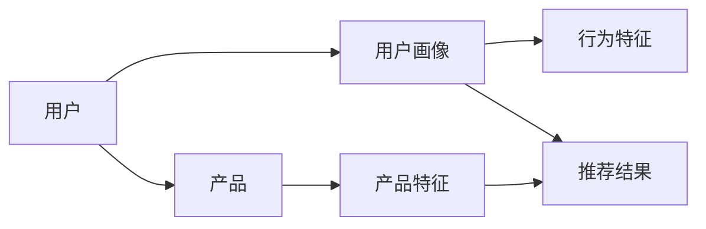
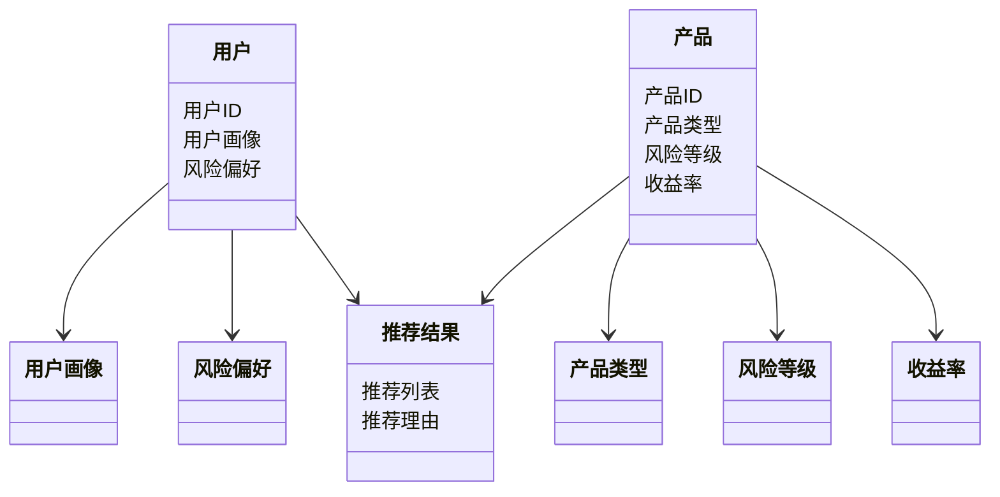

                 


# 金融产品推荐系统

> 关键词：金融推荐系统、推荐算法、机器学习、系统架构、深度学习

> 摘要：本文详细探讨了金融产品推荐系统的构建与实现，从背景、核心概念到算法原理、系统架构、项目实战，再到高级主题与优化，全面解析了金融推荐系统的设计与实现过程。文章结合理论与实践，深入分析了推荐系统的算法原理、系统架构设计以及实际项目中的应用，旨在为读者提供一份完整的金融推荐系统开发指南。

---

# 第一部分: 金融产品推荐系统概述

# 第1章: 金融产品推荐系统背景与概述

## 1.1 金融推荐系统的发展背景

### 1.1.1 传统金融推荐系统的局限性
传统的金融推荐系统主要依赖于人工经验或简单的规则引擎，存在以下问题：
- **信息孤岛**：难以整合多源数据，导致推荐结果不够精准。
- **缺乏个性化**：无法根据用户实时行为和市场变化进行动态调整。
- **计算效率低**：面对海量金融数据时，计算效率难以满足实时性要求。

### 1.1.2 现代金融推荐系统的兴起
随着人工智能和大数据技术的发展，金融推荐系统逐渐从简单的规则引擎向基于机器学习的智能推荐系统转变，具有以下特点：
- **数据驱动**：利用海量金融数据进行建模和分析。
- **实时性**：能够根据市场波动和用户行为实时调整推荐策略。
- **个性化**：基于用户画像和行为特征，提供个性化的推荐服务。

### 1.1.3 金融推荐系统的定义与目标
金融推荐系统是一种结合金融领域知识和人工智能技术的推荐系统，旨在根据用户的金融需求、风险偏好和市场动态，推荐适合的金融产品或投资组合。其目标是提高用户体验、降低投资风险并实现收益最大化。

## 1.2 金融产品推荐系统的独特性

### 1.2.1 金融数据的特殊性
金融数据具有以下特殊性：
- **时间序列性**：金融数据通常具有强烈的时间依赖性。
- **波动性**：金融市场波动剧烈，数据具有不确定性。
- **复杂性**：金融产品种类繁多，涉及多个维度的特征。

### 1.2.2 金融风险与收益的平衡
金融推荐系统需要在风险控制和收益最大化之间找到平衡点，这使得推荐系统的设计更加复杂。推荐系统需要考虑以下因素：
- **用户风险偏好**：不同用户对风险的承受能力不同。
- **产品风险等级**：不同金融产品的风险等级不同。
- **市场风险**：市场的波动可能对推荐结果产生重大影响。

### 1.2.3 金融推荐系统的应用场景
金融推荐系统广泛应用于以下场景：
- **财富管理**：根据用户资产配置需求推荐理财产品。
- **投资组合管理**：根据市场动态推荐最优投资组合。
- **风险管理**：实时监控市场风险并调整推荐策略。

## 1.3 本章小结
本章介绍了金融推荐系统的发展背景、独特性和应用场景。金融推荐系统的兴起是大数据和人工智能技术进步的产物，其独特性在于金融数据的特殊性和风险收益的平衡。金融推荐系统在财富管理、投资组合管理和风险管理等领域具有广泛的应用前景。

---

# 第2章: 金融推荐系统的核心概念与联系

## 2.1 核心概念原理

### 2.1.1 用户画像与金融行为分析
用户画像是金融推荐系统的重要组成部分，主要包括以下内容：
- **用户基本信息**：年龄、性别、职业等。
- **金融行为特征**：投资历史、交易频率、收益偏好等。
- **风险偏好**：用户对风险的承受能力。

### 2.1.2 产品特征与风险评估
金融产品具有以下特征：
- **产品类型**：股票、基金、债券等。
- **产品风险等级**：低风险、中风险、高风险。
- **产品收益率**：历史收益率、预期收益率等。

### 2.1.3 个性化推荐机制
个性化推荐机制是金融推荐系统的核心，主要包括以下步骤：
1. **用户特征提取**：提取用户的金融行为特征和风险偏好。
2. **产品特征提取**：提取金融产品的特征信息。
3. **相似度计算**：计算用户与产品的相似度。
4. **推荐结果生成**：根据相似度生成推荐列表。

## 2.2 核心概念属性对比表
以下是核心概念属性的对比表：

| 概念       | 属性                     |
|------------|--------------------------|
| 用户画像    | 用户ID, 行为特征, 风险偏好 |
| 产品特征    | 产品类型, 风险等级, 收益率  |
| 推荐机制    | 相似度计算, 模型选择, 排序策略 |

## 2.3 实体关系图
以下是实体关系图：



## 2.4 本章小结
本章介绍了金融推荐系统的核心概念与联系，包括用户画像、产品特征和推荐机制。通过对比表和实体关系图，展示了各核心概念之间的关系。用户画像和产品特征是推荐机制的重要输入，推荐结果是推荐机制的输出。

---

# 第3章: 推荐算法原理与实现

## 3.1 协同过滤算法

### 3.1.1 基于用户的协同过滤
基于用户的协同过滤是一种经典的推荐算法，其核心思想是：相似的用户会有相似的偏好。具体步骤如下：
1. **用户相似度计算**：计算用户之间的相似度，常用余弦相似度。
2. **推荐结果生成**：根据相似用户的偏好生成推荐列表。

### 3.1.2 基于物品的协同过滤
基于物品的协同过滤是一种基于产品相似性的推荐算法，具体步骤如下：
1. **产品相似度计算**：计算产品之间的相似度，常用余弦相似度。
2. **推荐结果生成**：根据用户已购买的产品，推荐相似产品。

### 3.1.3 混合协同过滤
混合协同过滤是基于用户的协同过滤和基于物品的协同过滤的结合，旨在利用两者的优点，提高推荐精度。

## 3.2 基于矩阵分解的推荐算法

### 3.2.1 矩阵分解原理
矩阵分解是一种有效的推荐算法，其核心思想是将用户-产品评分矩阵分解为两个低维矩阵，分别表示用户和产品的隐含特征。

### 3.2.2 SVD算法实现
奇异值分解（SVD）是一种常用的矩阵分解算法，其数学模型如下：
$$ A = U \Sigma V^T $$
其中，A是用户-产品评分矩阵，U和V是特征矩阵，Σ是奇异值矩阵。

### 3.2.3 FMC算法优化
FMC（Feature-based Matrix Completion）是一种基于特征的矩阵补全算法，其核心思想是利用特征信息进行矩阵补全。

## 3.3 基于深度学习的推荐算法

### 3.3.1 神经网络协同过滤
神经网络协同过滤是一种基于深度学习的推荐算法，其核心思想是利用神经网络提取用户和产品的隐含特征。

### 3.3.2 图神经网络推荐
图神经网络推荐是一种基于图结构的推荐算法，其核心思想是利用图结构数据进行推荐。

### 3.3.3 Transformer模型应用
Transformer模型是一种基于注意力机制的深度学习模型，其在推荐系统中的应用日益广泛。

## 3.4 算法实现代码示例

### 协同过滤算法实现
```python
def collaborative_filtering(train_data, test_data):
    # 计算相似度矩阵
    similarity = compute_similarity(train_data)
    # 生成推荐结果
    recommendations = generate_recommendations(similarity, test_data)
    return recommendations
```

### 矩阵分解算法实现
```python
def matrix_factorization(train_data, k=10):
    # 初始化特征矩阵
    U = np.random.randn(n_user, k)
    V = np.random.randn(n_item, k)
    # 训练模型
    for iter in range(max_iter):
        for u in range(n_user):
            for i in range(n_item):
                if train_data[u, i] > 0:
                    error = train_data[u, i] - np.dot(U[u, :], V[i, :])
                    # 更新特征矩阵
                    U[u, :] += learning_rate * error * V[i, :]
                    V[i, :] += learning_rate * error * U[u, :]
    return U, V
```

## 3.5 本章小结
本章详细介绍了推荐算法的原理与实现，包括协同过滤、矩阵分解和深度学习算法。通过代码示例，展示了这些算法的实现过程。这些算法为金融推荐系统提供了理论基础和技术支持。

---

# 第4章: 系统分析与架构设计

## 4.1 系统分析

### 4.1.1 问题场景介绍
金融推荐系统需要解决以下问题：
- **数据多样性**：金融数据种类繁多，包括股票、基金、债券等多种类型。
- **实时性要求**：金融市场波动剧烈，推荐系统需要实时更新。
- **安全性要求**：金融数据涉及用户隐私和资产安全，需要严格的安全保障。

### 4.1.2 项目介绍
本项目旨在开发一个金融推荐系统，为用户提供个性化的金融产品推荐服务。系统包括以下几个部分：
- **数据采集**：采集用户行为数据和市场数据。
- **数据处理**：清洗和预处理数据。
- **模型训练**：训练推荐模型。
- **推荐结果生成**：根据模型输出推荐结果。

## 4.2 系统功能设计

### 4.2.1 领域模型
以下是领域模型：



### 4.2.2 系统架构设计
以下是系统架构设计：


## 4.3 系统接口设计

### 4.3.1 接口描述
以下是系统接口描述：

| 接口名称   | 接口描述                     |
|------------|------------------------------|
| 获取用户画像 | 获取用户的基本信息和风险偏好 |
| 获取产品特征 | 获取产品的特征信息           |
| 生成推荐结果 | 根据用户画像和产品特征生成推荐结果 |

### 4.3.2 接口实现
以下是接口实现代码：

```python
# 获取用户画像
def get_user_profile(user_id):
    return {
        'user_id': user_id,
        'risk_prefer

