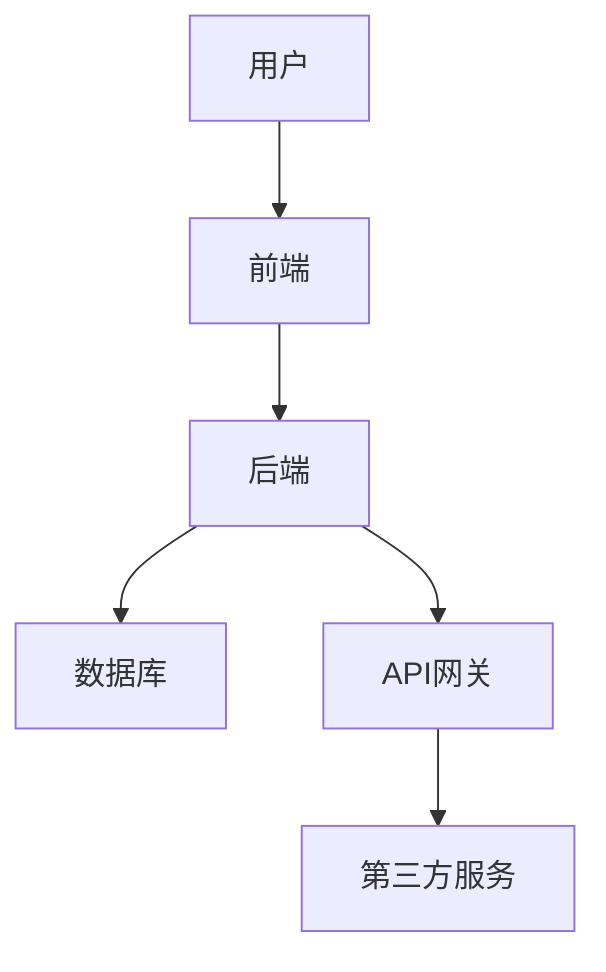

                 


# 《金融产品生命周期管理平台》

> 关键词：金融产品生命周期管理平台、风险管理、系统架构、算法原理、项目实战、最佳实践

> 摘要：本文深入探讨了金融产品生命周期管理平台的设计与实现，涵盖背景、核心概念、算法原理、系统架构、项目实战及最佳实践等方面，帮助读者全面理解并掌握相关技术。

---

## 第1章：金融产品生命周期管理平台的背景与概念

### 1.1 金融产品生命周期管理的重要性

#### 1.1.1 金融产品生命周期的基本概念

金融产品的生命周期指的是从设计、发行到终止的全过程。这个过程包括多个阶段，每个阶段都需要特定的管理策略和技术支持。有效的生命周期管理可以帮助金融机构优化产品设计、降低风险并提高运营效率。

#### 1.1.2 金融产品生命周期管理的必要性

在金融行业中，产品的复杂性和市场的不确定性要求金融机构具备高效的管理能力。通过生命周期管理，机构可以更好地监控产品表现，及时调整策略，从而在竞争激烈的市场中保持优势。

#### 1.1.3 平台在金融行业中的作用

平台作为技术工具，帮助金融机构实现自动化管理，提高效率，降低成本。它整合了各个阶段的管理功能，提供了统一的界面和数据支持，是现代金融管理的重要组成部分。

### 1.2 金融产品生命周期管理平台的定义与特点

#### 1.2.1 平台的定义

金融产品生命周期管理平台是一个集成化的系统，用于管理金融产品的整个生命周期，从设计到终止。它整合了产品设计、风险评估、运营监控等功能，为金融机构提供全面的支持。

#### 1.2.2 平台的核心功能与特点

- **模块化设计**：平台分为产品设计、风险评估和运营监控三大模块，每个模块专注于特定功能。
- **数据驱动**：利用数据分析技术，提供实时监控和预测功能。
- **用户友好**：界面直观，操作简便，支持多用户角色访问。

#### 1.2.3 平台与传统金融业务的区别

传统金融业务依赖人工操作，效率低且容易出错。而平台通过自动化和智能化技术，显著提高了管理效率和准确性，减少了人为错误。

### 1.3 金融产品生命周期管理平台的组成模块

#### 1.3.1 产品设计模块

负责产品的设计和开发，包括需求分析、产品定义和原型设计。

#### 1.3.2 风险评估模块

评估产品在不同阶段的风险，提供风险评分和管理建议。

#### 1.3.3 运营监控模块

监控产品在市场上的表现，提供实时数据和分析报告。

---

## 第2章：金融产品生命周期管理的核心概念与联系

### 2.1 金融产品生命周期的核心要素

#### 2.1.1 产品设计要素

包括产品目标、用户需求、功能设计等。

#### 2.1.2 风险评估要素

涉及风险指标、评估模型、管理策略等。

#### 2.1.3 运营监控要素

包括关键指标、数据分析、预警机制等。

### 2.2 核心概念之间的关系

#### 2.2.1 产品设计与风险评估的关系

产品设计决定了风险评估的对象和范围，而风险评估结果反过来影响产品设计的优化。

#### 2.2.2 风险评估与运营监控的关系

风险评估为运营监控提供数据支持，而运营监控的结果又用于评估风险模型的准确性。

#### 2.2.3 运营监控对产品设计的反馈作用

通过监控数据，可以发现产品设计中的不足，从而进行持续改进和优化。

---

## 第3章：风险评估模型的算法原理

### 3.1 风险评估模型的数学模型

#### 3.1.1 风险评分公式

$$
风险评分 = \alpha \times 信用评分 + \beta \times 财务指标 + \gamma \times 其他因素
$$

其中，$\alpha$、$\beta$、$\gamma$是权重系数，根据具体产品和市场环境确定。

#### 3.1.2 决策树模型

通过构建决策树，将复杂的金融数据进行分类和预测，帮助评估不同情景下的风险。

### 3.2 风险评估模型的实现流程

#### 3.2.1 数据收集与预处理

收集客户数据、市场数据等，进行清洗和特征提取。

#### 3.2.2 模型训练与验证

使用训练数据训练模型，并通过验证数据调整参数，确保模型的准确性和稳定性。

#### 3.2.3 模型部署与应用

将模型部署到平台中，实时评估产品风险，并生成报告供决策参考。

---

## 第4章：系统架构设计

### 4.1 系统功能设计

#### 4.1.1 产品设计模块的功能

- 支持产品需求分析和原型设计。
- 提供用户界面设计和交互测试。

#### 4.1.2 风险评估模块的功能

- 实现风险评分计算。
- 提供风险报告生成和管理建议。

#### 4.1.3 运营监控模块的功能

- 监控产品表现数据。
- 提供实时预警和分析报告。

### 4.2 系统架构图



---

## 第5章：项目实战

### 5.1 环境安装

#### 5.1.1 安装开发工具

安装Python、Jupyter Notebook等工具，配置开发环境。

#### 5.1.2 安装数据库与服务器

选择MySQL或MongoDB作为数据库，安装并配置服务器环境。

### 5.2 核心代码实现

#### 5.2.1 风险评估模块的Python代码

```python
def risk_assessment(data):
    # 计算信用评分
    credit_score = data['credit_score']
    # 计算财务指标
    financial_metrics = data['financial_metrics']
    # 计算风险评分
    alpha = 0.5
    beta = 0.3
    gamma = 0.2
    risk_score = alpha * credit_score + beta * financial_metrics + gamma
    return risk_score
```

### 5.3 实际案例分析

通过具体案例，展示平台在实际应用中的效果，分析数据变化和模型优化过程。

---

## 第6章：最佳实践与总结

### 6.1 最佳实践

#### 6.1.1 数据安全的重要性

确保数据的保密性和完整性，防止数据泄露和篡改。

#### 6.1.2 模型的持续优化

定期更新模型参数，适应市场变化和用户需求。

#### 6.1.3 平台的可扩展性设计

设计模块化的系统架构，便于功能扩展和升级。

### 6.2 注意事项

#### 6.2.1 数据隐私保护

遵守相关法律法规，确保用户数据的合法使用和保护。

#### 6.2.2 模型的实时更新

及时更新模型，保持其准确性和有效性。

#### 6.2.3 系统的稳定性保障

建立完善的监控和应急机制，确保系统稳定运行。

---

## 作者：AI天才研究院 & 禅与计算机程序设计艺术

