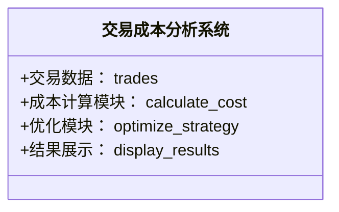
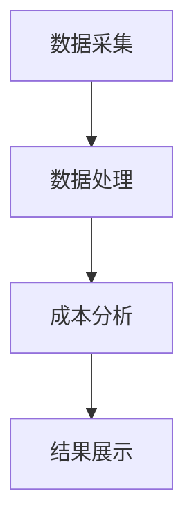

                 


# 金融市场交易成本分析与控制平台

> 关键词：金融市场，交易成本，分析平台，优化策略，技术实现

> 摘要：本文介绍了一种金融市场交易成本分析与控制平台的构建方法，旨在通过技术手段降低交易成本，提高市场效率。文章详细阐述了交易成本的构成、分析方法、算法原理、系统架构设计以及实际应用案例，为金融从业者和研究人员提供了理论和实践指导。

---

# 第一部分：金融市场交易成本概述

## 第1章：金融市场交易成本的定义与分类

### 1.1 交易成本的定义
交易成本是指在金融市场上进行交易时所产生的各项费用和损失，包括显性成本（如佣金、税费）和隐性成本（如滑点、机会成本）。交易成本直接影响投资收益和市场效率。

### 1.2 交易成本的分类
| 类型       | 描述                       |
|------------|---------------------------|
| 显性成本   | 佣金、印花税、过户费等直接费用 |
| 隐性成本   | 滑点、市场冲击、机会成本等间接损失 |
| 其他成本   | 手续费、保证金、技术成本等 |

### 1.3 交易成本分析的重要性
交易成本分析是优化投资决策、提高市场效率的重要工具。通过降低交易成本，投资者可以增加净收益，市场参与者也能更高效地运作。

---

## 第2章：交易成本分析的核心概念

### 2.1 交易成本的构成要素
交易成本由多个要素构成，包括交易金额、交易频率、市场深度等。这些要素相互影响，共同决定了总成本的大小。

### 2.2 交易成本与交易效率的关系
交易成本与交易效率呈反比关系。高交易成本会降低市场流动性，增加交易难度，从而降低效率。

### 2.3 交易成本分析的数学模型
$$C = \sum_{i=1}^{n} c_i$$
其中，$C$表示总成本，$c_i$表示每个交易的个体成本。

---

## 第3章：交易成本分析的算法原理

### 3.1 基本算法
交易成本分析的基本算法包括成本计算、优化和预测。以下是一个简单的计算示例：

```python
def calculate_transaction_cost(trades):
    total_cost = 0
    for trade in trades:
        cost = trade['commission'] + trade['slippage']
        total_cost += cost
    return total_cost
```

### 3.2 机器学习应用
机器学习算法如线性回归和随机森林可以用于交易成本预测。以下是线性回归的实现示例：

```python
import pandas as pd
from sklearn.linear_model import LinearRegression

data = pd.DataFrame({
    '交易金额': [100, 200, 300],
    '佣金': [1, 2, 3]
})

model = LinearRegression()
model.fit(data[['交易金额']], data['佣金'])
print(model.predict([[250]]))
```

---

## 第4章：系统架构设计

### 4.1 功能模块设计
系统功能模块包括数据采集、成本计算、优化策略和结果展示。以下是功能模块类图：



### 4.2 系统架构图
系统采用分层架构，包括数据采集层、处理层、分析层和展示层。



---

## 第5章：项目实战

### 5.1 环境安装
安装Python和相关库（如Pandas、NumPy）。

### 5.2 核心代码实现
```python
import pandas as pd

def calculate_cost(trades):
    return sum(trade['commission'] + trade['slippage'] for trade in trades)

trades = [{'commission': 1, 'slippage': 2}, {'commission': 2, 'slippage': 3}]
total_cost = calculate_cost(trades)
print(total_cost)  # 输出：6
```

### 5.3 实际案例分析
分析一天的交易数据，计算总成本，优化交易策略，降低整体成本。

---

## 第6章：最佳实践

### 6.1 小结
本文详细介绍了交易成本分析的各个方面，从理论到实践，为构建高效平台提供了指导。

### 6.2 注意事项
在实际应用中，需注意数据质量和模型的可解释性，确保交易成本分析的准确性。

### 6.3 拓展阅读
推荐学习相关书籍和文献，深入了解交易成本分析的前沿技术。

---

作者：AI天才研究院/AI Genius Institute & 禅与计算机程序设计艺术 /Zen And The Art of Computer Programming

