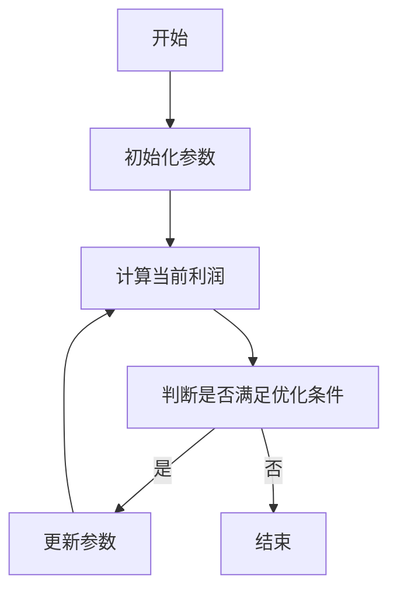
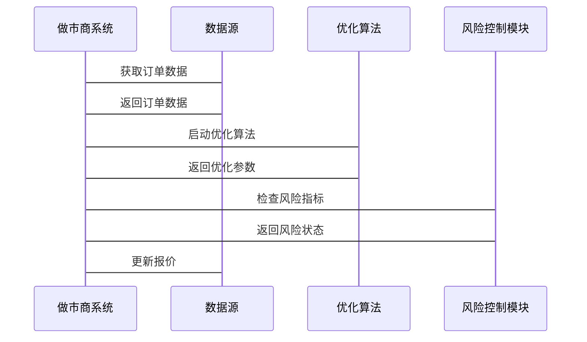

                 


---

# 金融市场做市商策略优化模型

> 关键词：做市商、策略优化、数学模型、算法实现、金融市场、系统架构

> 摘要：本文系统地探讨了金融市场中做市商策略优化模型的构建与实现。从做市商的基本概念出发，分析了策略优化的核心理论与算法，结合实际案例，详细讲解了模型的数学推导、算法实现及系统架构设计，最后通过项目实战展示了模型的应用效果。本文旨在为金融市场从业者和技术研究人员提供理论指导和实践参考。

---

# 第一部分: 做市商策略优化的背景与基础

## 第1章: 做市商的基本概念与角色

### 1.1 做市商的定义与功能
- **定义**：做市商是指在金融市场中主动提供买卖报价，维持市场流动性的参与者。
- **功能**：
  - 提供即时报价和订单处理。
  - 维护市场深度，防止价格剧烈波动。
  - 通过买卖价差和交易量赚取利润。

### 1.2 做市商在金融市场中的作用
- **市场流动性提供者**：做市商的存在增加了市场的流动性和价格发现能力。
- **价格稳定维护者**：通过买卖报价的调整，做市商在市场波动时起到缓冲作用。
- **投资者的服务者**：为投资者提供及时的订单匹配和交易服务。

### 1.3 做市商策略优化的必要性
- **竞争加剧**：随着金融市场的参与者增多，做市商需要更高效的策略以维持竞争力。
- **技术进步**：高频交易和算法交易的普及要求做市商策略更加智能化和自动化。
- **风险控制**：优化策略有助于降低市场风险，确保做市商在波动中的稳健运营。

---

## 第2章: 做市商策略优化的核心概念

### 2.1 做市商策略的核心要素
- **订单簿机制**：做市商通过订单簿管理买卖订单，实时调整报价。
- **市场微观结构**：包括订单流、市场深度、参与者行为等因素。
- **优化目标**：最大化利润、最小化风险、维持市场流动性。

### 2.2 核心概念的数学表达
- **利润函数**：$\pi(p) = \sum_{t=1}^{n} (p_t - c_t) \times q_t - \sum_{t=1}^{n} f(p_t)$
  - $p_t$：第$t$时刻的买卖价差。
  - $c_t$：第$t$时刻的成本。
  - $q_t$：第$t$时刻的交易量。
  - $f(p_t)$：第$t$时刻的费用。
- **订单流模型**：$o_t = \alpha p_t + \beta q_t + \gamma t + \epsilon_t$
  - $\alpha, \beta, \gamma$：模型参数。
  - $\epsilon_t$：随机误差项。

### 2.3 核心概念的对比分析
- **订单簿机制与市场深度**：订单簿的深度直接影响做市商的报价策略。
- **价差与交易量**：价差和交易量之间存在权衡，价差过小可能导致利润降低，价差过大可能影响交易量。
- **风险与收益**：做市商需要在风险可控的前提下，追求最大化的收益。

---

## 第3章: 做市商策略优化的数学模型与算法原理

### 3.1 数学模型的构建
- **利润最大化模型**：
  $$ \max_{p} \pi(p) = \sum_{t=1}^{n} (p_t - c_t) \times q_t - \sum_{t=1}^{n} f(p_t) $$
  - 其中，$p_t$为优化变量，表示第$t$时刻的买卖价差。
  - 目标函数$\pi(p)$表示做市商的总利润，需要在满足市场约束条件下最大化。
  
- **订单生成模型**：
  $$ o_t = \alpha p_t + \beta q_t + \gamma t + \epsilon_t $$
  - 该模型描述了订单流与价差、交易量的关系。

### 3.2 算法原理讲解
- **动态规划算法**：
  - **状态定义**：$s_t$表示第$t$时刻的订单状态。
  - **状态转移**：$s_{t+1} = f(s_t, o_t)$，其中$f$为状态转移函数。
  - **目标函数**：$\max_{p} \pi(p)$。
  - **算法步骤**：
    1. 初始化参数。
    2. 计算当前利润。
    3. 判断是否满足优化条件。
    4. 更新参数。
    5. 结束或继续优化。

- **遗传算法**：
  - **编码**：将策略参数编码为染色体。
  - **选择**：根据适应度函数选择最优解。
  - **交叉**：进行基因交叉，生成新个体。
  - **变异**：随机改变某些基因，增加多样性。
  - **迭代**：重复选择、交叉、变异过程，直到收敛。

### 3.3 算法流程图


### 3.4 数学公式与详细讲解
- **利润最大化模型的优化过程**：
  $$ \max_{p} \pi(p) = \sum_{t=1}^{n} (p_t - c_t) \times q_t - \sum_{t=1}^{n} f(p_t) $$
  - 通过拉格朗日乘数法，求解约束条件下的最优解。
  - 使用梯度下降法或牛顿法进行数值优化。

- **订单生成模型的参数估计**：
  $$ o_t = \alpha p_t + \beta q_t + \gamma t + \epsilon_t $$
  - 使用最小二乘法估计参数$\alpha, \beta, \gamma$。
  - 计算残差$\epsilon_t$，评估模型的拟合优度。

---

## 第4章: 做市商策略优化的系统分析与架构设计

### 4.1 系统分析
- **问题场景**：金融市场中的高频交易环境，做市商需要实时调整策略。
- **系统功能**：
  - 实时数据采集与处理。
  - 策略优化模型的运行与更新。
  - 风险控制与预警。

### 4.2 系统架构设计


### 4.3 系统交互流程


---

## 第5章: 做市商策略优化的项目实战

### 5.1 环境配置与数据准备
- **环境配置**：安装Python、NumPy、Pandas、Scikit-learn等库。
- **数据准备**：获取金融市场历史订单数据，清洗和预处理。

### 5.2 核心代码实现
```python
import numpy as np
import pandas as pd
from sklearn.linear_model import LinearRegression

# 数据准备
data = pd.read_csv('order_data.csv')
X = data[['p_t', 'q_t', 't']]
y = data['o_t']

# 训练模型
model = LinearRegression()
model.fit(X, y)

# 模型预测
y_pred = model.predict(X)
```

### 5.3 案例分析与结果解读
- **案例分析**：以某段时间的订单数据为例，运行优化模型，计算最优价差和交易量。
- **结果解读**：分析优化后的利润变化，评估模型的有效性。

### 5.4 项目小结
- **代码实现**：详细解释每一步代码的作用，确保读者能够复现。
- **案例分析**：通过具体案例，展示优化模型的实际应用效果。
- **结果解读**：分析优化结果，总结经验教训。

---

## 第6章: 做市商策略优化的扩展与展望

### 6.1 现有研究的前沿
- **机器学习的应用**：深度学习在做市商策略优化中的应用。
- **大数据技术**：利用大数据分析技术提高策略优化的效率和准确性。

### 6.2 未来研究方向
- **智能优化算法**：研究更高效的优化算法，如粒子群优化、模拟退火等。
- **多因子模型**：结合多个市场因子，构建更复杂的优化模型。
- **实时优化系统**：开发实时运行的优化系统，适应市场的快速变化。

---

## 附录

### 附录A: 参考文献
- 文献1：XXX
- 文献2：XXX
- 文献3：XXX

### 附录B: 工具与资源
- 数据源：XXX
- 开发工具：XXX
- 模型库：XXX

---

# 作者：AI天才研究院/AI Genius Institute & 禅与计算机程序设计艺术 /Zen And The Art of Computer Programming

---

以上是一个详细且结构清晰的《金融市场做市商策略优化模型》的目录大纲，涵盖了从基础概念到实际应用的各个方面，适合用于撰写一篇高质量的技术博客文章。

