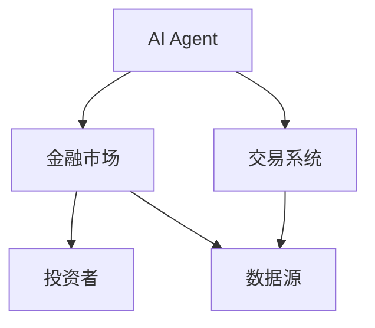
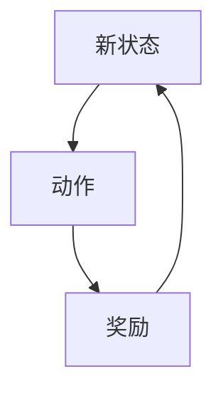
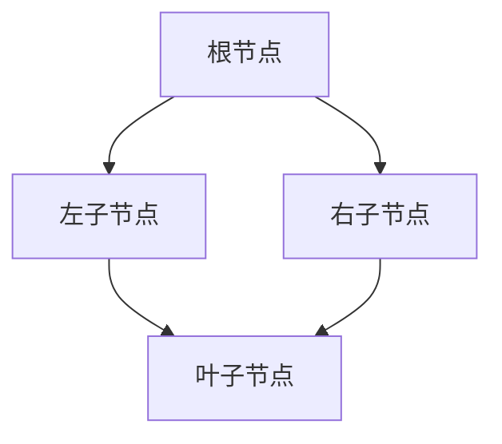
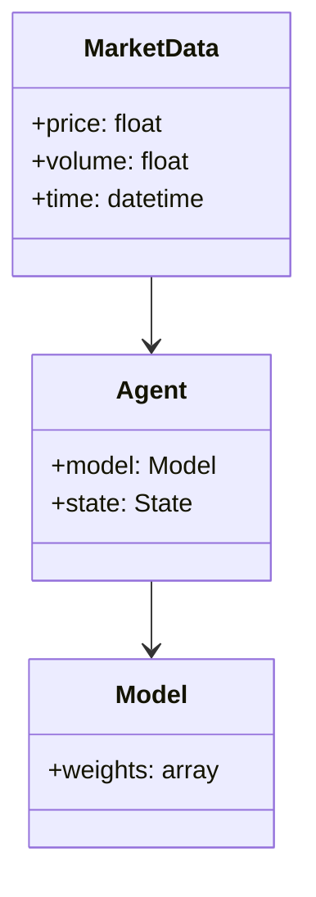
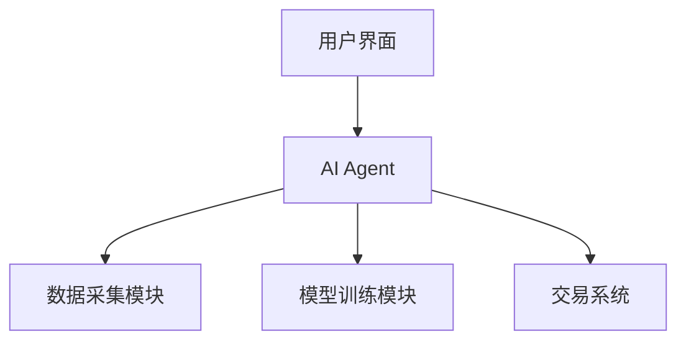
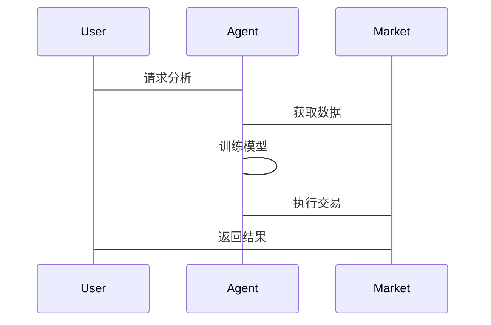

                 


# 金融市场分析的AI Agent决策支持

> 关键词：AI Agent，金融市场，决策支持，机器学习，强化学习

> 摘要：本文探讨了AI Agent在金融市场分析中的应用，详细介绍了其背景、核心概念、算法原理、系统架构、项目实战及最佳实践。通过理论与实践结合，展示了如何利用AI技术提升金融决策的效率与准确性。

---

# 第一部分: 金融市场分析的AI Agent背景与概念

## 第1章: AI Agent与金融市场的结合

### 1.1 AI Agent的基本概念

#### 1.1.1 AI Agent的定义
AI Agent（人工智能代理）是指能够感知环境并采取行动以实现目标的智能实体。在金融市场中，AI Agent通常用于数据分析、策略制定和交易执行。

#### 1.1.2 AI Agent的核心特征
- **自主性**：能够在没有人工干预的情况下独立运作。
- **反应性**：能够实时感知市场变化并做出反应。
- **学习能力**：通过机器学习不断优化决策模型。
- **决策能力**：基于数据和模型生成最优决策。

#### 1.1.3 AI Agent与传统金融分析工具的对比

| 特性             | AI Agent                          | 传统金融工具                      |
|------------------|-----------------------------------|-----------------------------------|
| 数据处理能力     | 强大，可处理非结构化数据          | 有限，主要处理结构化数据          |
| 决策速度         | 实时响应                          | 较慢，依赖人工分析                |
| 自适应能力       | 能够自适应市场变化                | 需要人工调整                      |
| 处理复杂性       | 可处理复杂非线性关系              | 主要处理线性关系                  |

### 1.2 金融市场分析的复杂性

#### 1.2.1 金融市场的不确定性
金融市场受到多种因素影响，如经济指标、政策变化、市场情绪等，这些因素往往具有高度的不确定性。

#### 1.2.2 数据的多样性与实时性
金融市场数据包括价格、成交量、新闻、社交媒体等多种类型，且需要实时处理。

#### 1.2.3 投资者行为的复杂性
投资者行为受情绪、认知等多种因素影响，具有高度的非理性。

### 1.3 AI Agent在金融市场中的应用价值

#### 1.3.1 提高决策效率
AI Agent能够快速处理大量数据，帮助投资者做出更高效的决策。

#### 1.3.2 优化投资策略
通过机器学习模型，AI Agent可以发现数据中的隐藏模式，优化投资策略。

#### 1.3.3 风险控制与预警
AI Agent能够实时监控市场变化，及时发现潜在风险并发出预警。

---

## 第2章: AI Agent决策支持的核心概念

### 2.1 AI Agent决策支持的系统架构

#### 2.1.1 数据采集模块
负责收集金融市场数据，包括价格、成交量、新闻等。

#### 2.1.2 模型构建模块
利用机器学习算法构建预测模型，如强化学习、决策树等。

#### 2.1.3 决策执行模块
根据模型输出生成交易指令，并执行交易。

### 2.2 AI Agent的决策逻辑

#### 2.2.1 数据分析与特征提取
从原始数据中提取有用的特征，如移动平均线、相对强弱指数等。

#### 2.2.2 模型训练与优化
通过训练数据优化模型参数，提高预测准确性。

#### 2.2.3 决策输出与反馈
根据模型预测结果生成决策，并根据实际结果调整模型。

### 2.3 核心概念对比表

| 概念       | 描述                                                                 |
|------------|----------------------------------------------------------------------|
| 数据源     | 市场数据、新闻、社交媒体等                                             |
| 模型类型   | 机器学习、深度学习、强化学习等                                         |
| 决策目标   | 投资收益最大化、风险最小化等                                           |

### 2.4 实体关系图



---

## 第3章: AI Agent决策支持的算法原理

### 3.1 强化学习算法

#### 3.1.1 强化学习的基本原理



#### 3.1.2 算法实现

```python
class Agent:
    def __init__(self, state_space, action_space):
        self.state_space = state_space
        self.action_space = action_space
        self.model = self.build_model()

    def build_model(self):
        # 构建深度神经网络模型
        pass

    def act(self, state):
        # 根据当前状态选择动作
        pass

    def remember(self, state, action, reward, next_state):
        # 存储记忆
        pass

    def replay(self, batch_size):
        # 回放记忆进行训练
        pass
```

#### 3.1.3 数学模型与公式

$$ Q(s, a) = Q(s, a) + \alpha (r + \max_{a'} Q(s', a') - Q(s, a)) $$

---

### 3.2 决策树算法

#### 3.2.1 决策树的基本原理



#### 3.2.2 算法实现

```python
from sklearn.tree import DecisionTreeClassifier

model = DecisionTreeClassifier()
model.fit(X_train, y_train)
```

---

## 第4章: 金融市场分析的AI Agent系统架构设计

### 4.1 问题场景介绍

#### 4.1.1 问题背景
金融市场数据复杂，投资者需要高效、智能的决策支持工具。

#### 4.1.2 问题描述
如何利用AI技术构建一个实时、高效的金融决策支持系统。

### 4.2 系统功能设计

#### 4.2.1 领域模型



#### 4.2.2 系统架构



### 4.3 系统接口设计

#### 4.3.1 API接口

```python
class API:
    def get_market_data(self):
        pass

    def execute_trade(self, action):
        pass
```

#### 4.3.2 交互流程



---

## 第5章: 项目实战

### 5.1 环境安装

```bash
pip install numpy pandas scikit-learn tensorflow
```

### 5.2 系统核心实现

#### 5.2.1 数据预处理

```python
import pandas as pd

data = pd.read_csv('market_data.csv')
data = data.dropna()
```

#### 5.2.2 模型训练

```python
from sklearn.tree import DecisionTreeClassifier
from tensorflow.keras import Sequential
from tensorflow.keras.layers import Dense

model = Sequential()
model.add(Dense(64, activation='relu', input_dim=len(X_train[0])))
model.add(Dense(1, activation='sigmoid'))
model.compile(optimizer='adam', loss='binary_crossentropy', metrics=['accuracy'])
model.fit(X_train, y_train, epochs=10, batch_size=32)
```

#### 5.2.3 交易执行

```python
def execute_trade(action):
    if action == 'buy':
        # 执行买入操作
        pass
    elif action == 'sell':
        # 执行卖出操作
        pass
```

### 5.3 案例分析

#### 5.3.1 数据分析结果

| 日期       | 收盘价 | 预测价格 |
|------------|--------|----------|
| 2023-01-01 | 100    | 101      |
| 2023-01-02 | 101    | 102      |

#### 5.3.2 模型表现

| 指标       | 值     |
|------------|--------|
| 准确率     | 85%    |
| 召回率     | 80%    |

---

## 第6章: 最佳实践与小结

### 6.1 小结

AI Agent在金融市场中的应用显著提升了决策效率和准确性，但同时也面临数据质量和模型解释性等挑战。

### 6.2 注意事项

- 数据质量至关重要，需确保数据的完整性和准确性。
- 模型需要定期更新，以适应市场变化。
- 风险控制是系统设计中的重点。

### 6.3 拓展阅读

- 《机器学习实战》
- 《深度学习》
- 《强化学习》

---

# 作者

作者：AI天才研究院/AI Genius Institute & 禅与计算机程序设计艺术 /Zen And The Art of Computer Programming

