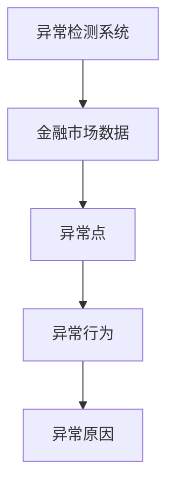
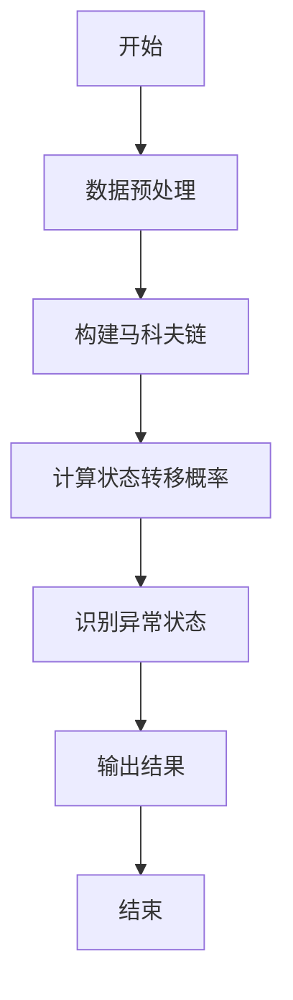
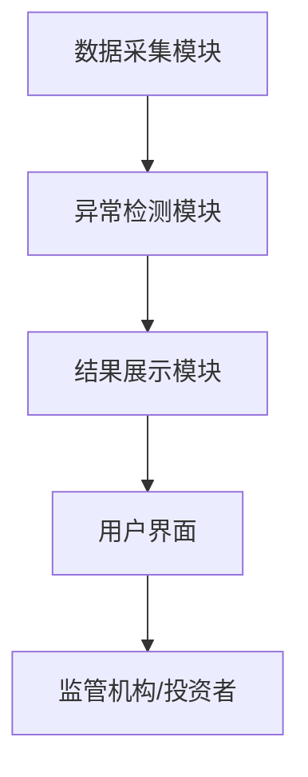
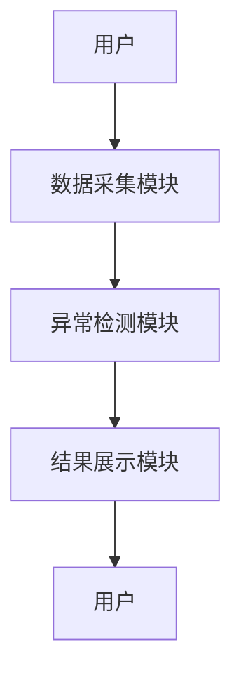

                 


# 《金融市场异常检测系统》

> 关键词：金融市场、异常检测、机器学习、深度学习、算法、系统架构

> 摘要：本文详细探讨了金融市场异常检测系统的构建与实现，从异常检测的基本概念、常见算法原理、系统架构设计到项目实战与案例分析，全面解析了如何利用技术手段识别金融市场中的异常现象，保障市场公平与投资者利益。

---

## 第一部分: 金融市场异常检测系统概述

### 第1章: 异常检测的基本概念与背景

#### 1.1 金融市场异常检测的背景

金融市场是一个高度动态和复杂的环境，每天都有海量的交易数据生成。异常检测在金融市场中扮演着至关重要的角色，它可以帮助识别市场操纵、欺诈交易、极端波动等异常现象。随着金融市场的全球化和数字化，异常检测的重要性日益凸显。

- **问题背景**：金融市场的波动性、不确定性和人为干预使得异常现象难以预测和识别。异常交易可能对市场造成严重冲击，例如2010年的“闪电崩盘”事件，导致道琼斯指数在短时间内剧烈下跌。异常检测技术可以帮助监管机构及时发现并应对这些事件。

- **问题描述**：金融市场中的异常现象包括但不限于价格剧烈波动、交易量异常增加、订单簿异常变化等。这些异常现象往往会对市场稳定性造成威胁，甚至引发金融危机。

- **问题解决**：通过异常检测技术，可以实时监控市场数据，识别潜在的异常现象，并采取相应的措施，例如暂停交易、调整交易策略等。

- **边界与外延**：金融市场异常检测的边界包括实时交易数据、历史市场数据、订单数据等。其外延涉及监管机构、金融机构、投资者等多方利益相关者。

---

#### 1.2 异常检测的定义与分类

- **定义**：异常检测是指通过分析数据，识别出与预期模式或行为显著不同的数据点或事件。在金融市场中，异常检测的核心目标是发现那些不符合市场正常运行规律的交易或价格变化。

- **分类**：
  - **基于统计的方法**：通过统计学原理（如均值、方差等）来识别异常。
  - **基于机器学习的方法**：利用监督或无监督学习算法（如聚类、分类）来识别异常。
  - **基于深度学习的方法**：利用神经网络模型（如自动编码器、生成对抗网络）来识别异常。

- **对比表格**：

| 方法类型       | 优点                     | 缺点                       |
|----------------|--------------------------|---------------------------|
| 统计方法       | 计算简单，易于解释       | 易受数据分布影响           |
| 机器学习方法   | 更强的泛化能力           | 需要大量标注数据           |
| 深度学习方法   | 更强的非线性建模能力     | 计算资源需求高             |

---

#### 1.3 异常检测的核心概念与联系

- **核心概念**：
  - **异常点**：偏离正常模式的数据点。
  - **异常行为**：异常点在时间和空间上的表现形式。
  - **异常原因**：导致异常现象的根本原因，例如市场操纵、技术故障等。

- **概念属性特征对比表格**：

| 概念       | 属性特征                         |
|------------|----------------------------------|
| 异常点     | 数据点偏离正常分布               |
| 异常行为    | 数据点在时间或空间上的异常表现   |
| 异常原因    | 引发异常现象的根本原因           |

- **ER实体关系图架构**（使用Mermaid）：



---

## 第二部分: 异常检测算法原理与实现

### 第2章: 常见异常检测算法原理

#### 2.1 统计方法

- **马科夫链模型**：
  - 基于马科夫假设（当前状态仅依赖于前一状态），用于分析时间序列数据。
  - 适用于识别价格趋势的突然变化。

- **统计假设检验**：
  - 通过假设检验（如Z检验、t检验）来判断数据是否偏离正常分布。

#### 2.2 机器学习方法

- **Isolation Forest算法**：
  - 一种基于树结构的无监督学习算法，通过构建隔离树来识别异常点。
  - 适用于高维数据的异常检测。

- **One-Class SVM算法**：
  - 一种基于支持向量机的无监督学习算法，通过在低维子空间中描述数据分布来识别异常点。

#### 2.3 深度学习方法

- **自动编码器网络**：
  - 通过训练自动编码器来重构输入数据，异常点通常会导致重构误差较大。

- **生成对抗网络**：
  - 通过生成对抗网络来学习正常数据的分布，异常点通常位于生成分布之外。

---

### 第3章: 异常检测算法实现

#### 3.1 马科夫链模型实现

- **流程图**（使用Mermaid）：



- **Python代码实现**：

```python
import numpy as np
from sklearn.metrics import pairwise_distances

def isolation_forest_outlier_detection(X, n_estimators=10, max_samples=256, 
                                      contamination=0.05):
    from sklearn.ensemble import IsolationForest
    iforest = IsolationForest(n_estimators=n_estimators, 
                              max_samples=max_samples, 
                              contamination=contamination, 
                              random_state=42)
    iforest.fit(X)
    outliers = iforest.predict(X) == -1
    return outliers

# 示例数据
X = np.random.randn(1000, 2)
outliers = isolation_forest_outlier_detection(X)
print(outliers)
```

- **算法数学模型与公式**：
  - 异常分数计算公式：
    $$score = -\log(p)$$
  - 马科夫链状态转移概率：
    $$P(X_t | X_{t-1}) = \frac{P(X_{t-1}, X_t)}{P(X_{t-1})}$$

---

## 第三部分: 金融市场异常检测系统架构设计

### 第4章: 金融市场异常检测系统设计

#### 4.1 系统功能设计

- **数据采集模块**：
  - 从金融市场数据源（如股票交易所、期货市场）获取实时或历史数据。
  - 数据格式：时间戳、价格、交易量、订单数据等。

- **异常检测模块**：
  - 对采集到的数据进行预处理、特征提取和异常检测。
  - 使用多种算法（如Isolation Forest、One-Class SVM）进行异常识别。

- **结果展示模块**：
  - 将检测结果以可视化形式呈现，例如图表、仪表盘等。

#### 4.2 系统架构设计

- **系统架构图**（使用Mermaid）：



- **系统接口设计**：
  - 数据接口：与数据源（如交易所API）对接。
  - 检测接口：与异常检测算法对接。
  - 展示接口：与用户界面对接。

- **系统交互流程图**（使用Mermaid）：



---

## 第四部分: 项目实战与案例分析

### 第5章: 金融市场异常检测系统实现

#### 5.1 环境安装与配置

- **Python环境安装**：
  - 安装Python 3.8及以上版本。
  - 安装必要的库：`numpy`, `pandas`, `scikit-learn`, `tensorflow`.

- **数据源配置**：
  - 数据获取：从Yahoo Finance、Alpha Vantage等API获取股票数据。
  - 数据存储：使用CSV文件或数据库存储。

#### 5.2 系统核心实现

- **数据预处理代码**：

```python
import pandas as pd
import numpy as np

# 示例数据
data = pd.DataFrame({
    'price': np.random.randn(1000) * 100 + 100,
    'volume': np.random.randint(100, 1000, 1000)
})

# 数据标准化
from sklearn.preprocessing import StandardScaler
scaler = StandardScaler()
data_scaled = pd.DataFrame(scaler.fit_transform(data), columns=data.columns)
```

- **异常检测算法实现**：

```python
from sklearn.ensemble import IsolationForest

model = IsolationForest(n_estimators=100, max_samples=256, contamination=0.05)
model.fit(data_scaled[['price', 'volume']])
outliers = model.predict(data_scaled[['price', 'volume']]) == -1
```

- **结果可视化代码**：

```python
import matplotlib.pyplot as plt

plt.figure(figsize=(10, 6))
plt.plot(data['price'], label='Normal Price')
plt.scatter(data.index[outliers], data['price'][outliers], color='red', label='Outliers')
plt.legend()
plt.title('Stock Price Outlier Detection')
plt.show()
```

#### 5.3 项目案例分析

- **股票价格异常检测案例**：
  - 数据来源：某股票的历史价格数据。
  - 检测结果：识别出价格异常波动的交易日。
  - 结果分析：可能由于市场操纵或重大新闻事件引起。

- **交易量异常检测案例**：
  - 数据来源：某股票的交易量数据。
  - 检测结果：识别出交易量异常增加的交易日。
  - 结果分析：可能由于大额交易或市场操纵引起。

---

## 第五部分: 总结与展望

### 第6章: 金融市场异常检测系统总结

#### 6.1 系统总结

- **总结**：
  - 异常检测技术在金融市场中具有重要的应用价值。
  - 统计方法、机器学习方法和深度学习方法各有优缺点，可以根据具体场景选择合适的方法。

- **未来展望**：
  - 随着人工智能技术的发展，异常检测算法将更加智能化和高效化。
  - 结合自然语言处理技术，可以实现对新闻、社交媒体等非结构化数据的异常检测。

#### 6.2 最佳实践 Tips

- **数据质量**：
  - 确保数据的完整性和准确性。
  - 处理缺失值和异常值。

- **模型选择**：
  - 根据数据特征和应用场景选择合适的算法。
  - 结合多种算法进行结果融合。

- **结果验证**：
  - 使用回测方法验证模型的准确性。
  - 定期更新模型以适应市场变化。

---

## 作者

作者：AI天才研究院/AI Genius Institute & 禅与计算机程序设计艺术 /Zen And The Art of Computer Programming

---

感谢您的耐心阅读！希望本文能够帮助您深入了解金融市场异常检测系统的构建与实现！

