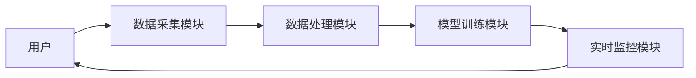

                 


# 金融市场情绪指标开发

## 关键词
金融市场情绪指标, 投资者情绪分析, 情绪算法开发, 数据采集与处理, 机器学习, 系统架构设计

## 摘要
金融市场情绪指标是量化投资者情绪的重要工具，能够帮助投资者更好地理解市场行为和波动。本文从情绪指标的基本概念出发，深入探讨其核心算法原理，并结合实际案例展示如何开发和应用这些指标。通过理论与实践的结合，本文旨在为读者提供一个全面的金融市场情绪指标开发指南。

---

# 第1章 金融市场情绪指标概述

## 1.1 情绪指标的定义与作用
### 1.1.1 什么是金融市场情绪指标
金融市场情绪指标是用于量化投资者情绪的工具，通过分析市场参与者的心理状态，帮助预测市场走势。常见的指标包括恐慌指数（VIX）和市场情绪指数（MFI）。

### 1.1.2 情绪指标在投资决策中的作用
情绪指标可以帮助投资者识别市场的过度乐观或悲观情绪，从而做出更明智的投资决策。例如，在市场情绪过于乐观时，投资者可以考虑减少风险敞口。

### 1.1.3 情绪指标与市场波动的关系
情绪指标能够反映市场波动的潜在趋势。例如，当投资者情绪从乐观转向悲观时，市场可能会出现调整，导致资产价格下跌。

## 1.2 情绪指标的核心概念
### 1.2.1 投资者情绪的量化方法
投资者情绪可以通过多种方式量化，例如通过新闻标题的情感分析、社交媒体的情绪监控以及市场交易数据的统计分析。

### 1.2.2 市场情绪的周期性特征
市场情绪通常呈现周期性波动，周期性波动可以通过情绪指标的时间序列分析来捕捉。例如，恐慌指数（VIX）在市场下跌时通常会升高。

### 1.2.3 情绪指标的分类与应用场景
情绪指标可以分为以下几类：
1. **市场情绪指数（MFI）**：基于交易数据计算，反映市场参与者的整体情绪。
2. **恐慌指数（VIX）**：反映标普500指数的波动性，常被用作市场恐慌的指标。
3. **社交媒体情绪指标**：通过分析社交媒体上的文本数据，量化市场情绪。

## 1.3 情绪指标开发的背景与意义
### 1.3.1 传统投资分析的局限性
传统投资分析主要依赖于基本面和技术分析，但这两者都无法完全捕捉市场情绪的变化。情绪指标的引入弥补了这一不足。

### 1.3.2 情绪指标在现代投资中的重要性
在现代投资中，情绪指标被广泛应用于量化交易策略和风险管理系统中。例如，机构投资者可以通过情绪指标调整投资组合的风险敞口。

### 1.3.3 情绪指标开发的技术与方法
情绪指标的开发通常结合了数据科学和金融工程的技术，包括数据采集、清洗、特征提取、模型构建和验证等步骤。

---

# 第2章 金融市场情绪指标的核心概念与联系

## 2.1 情绪指标的核心原理
### 2.1.1 投资者情绪的数学模型
情绪指标可以通过统计学和机器学习模型进行计算。例如，使用情感分析算法对新闻和社交媒体文本进行情绪分类。

### 2.1.2 情绪指标的计算方法
情绪指标的计算通常涉及以下几个步骤：
1. **数据采集**：从新闻、社交媒体、交易数据等多源数据中获取信息。
2. **数据清洗**：去除噪声数据，提取有用的信息。
3. **特征提取**：将文本数据转化为数值特征。
4. **模型训练**：使用机器学习算法（如随机森林、神经网络）训练情绪分类模型。

### 2.1.3 情绪指标与市场行为的关系
情绪指标可以预测市场行为的变化。例如，当市场情绪从乐观转向中性时，市场可能会出现调整。

## 2.2 情绪指标的核心属性特征对比
以下表格对比了常见的情绪指标及其特点：

| 指标名称 | 数据来源 | 计算方法 | 应用场景 |
|----------|----------|----------|----------|
| 恐慌指数（VIX） | 期权市场波动率 | 基于标普500指数期权的价格计算 | 预测市场波动性 |
| 市场情绪指数（MFI） | 交易数据 | 基于成交量和价格变化计算 | 量化市场情绪 |
| 社交媒体情绪指标 | 社交媒体文本 | 基于自然语言处理技术计算 | 监测市场情绪变化 |

## 2.3 情绪指标的ER实体关系图


---

# 第3章 情绪指标的算法原理与实现

## 3.1 情绪指标算法的核心流程
### 3.1.1 数据采集与预处理
数据采集是情绪指标开发的第一步，通常涉及以下步骤：
1. **数据源选择**：从新闻网站、社交媒体、交易平台等多源数据中获取信息。
2. **数据清洗**：去除噪声数据，例如重复数据、无效数据等。
3. **特征提取**：将文本数据转化为数值特征，例如使用TF-IDF提取关键词向量。

### 3.1.2 情绪指标的计算步骤
情绪指标的计算通常包括以下步骤：
1. **特征工程**：构建反映市场情绪的特征，例如情绪强度、情绪方向等。
2. **模型训练**：使用机器学习算法训练情绪分类模型，例如随机森林、支持向量机（SVM）等。
3. **模型验证**：通过回测和交叉验证评估模型的性能。

### 3.1.3 情绪指标的验证与优化
情绪指标的验证通常包括以下步骤：
1. **回测分析**：使用历史数据验证情绪指标的预测能力。
2. **模型优化**：通过调整模型参数和特征选择优化模型性能。
3. **实时监控**：将情绪指标应用于实时数据，监控市场情绪变化。

## 3.2 情绪指标算法的mermaid流程图


## 3.3 情绪指标算法的Python实现
### 3.3.1 数据预处理代码
```python
import pandas as pd
import numpy as np
from sklearn.feature_extraction.text import TfidfVectorizer

# 数据加载
data = pd.read_csv('market_news.csv')

# 数据清洗
data.dropna(inplace=True)

# 特征提取
vectorizer = TfidfVectorizer()
X = vectorizer.fit_transform(data['content'])
```

### 3.3.2 情绪指标计算代码
```python
from sklearn.ensemble import RandomForestClassifier

# 模型训练
model = RandomForestClassifier()
model.fit(X, data['label'])

# 模型预测
new_data = pd.read_csv('new_market_news.csv')
new_X = vectorizer.transform(new_data['content'])
predicted_labels = model.predict(new_X)
```

### 3.3.3 情绪指标的数学模型
情绪指标可以通过以下公式计算：
$$
\text{情绪强度} = \sum_{i=1}^{n} w_i \cdot x_i
$$
其中，\(w_i\) 是第 \(i\) 个特征的权重，\(x_i\) 是第 \(i\) 个特征的值。

---

# 第4章 情绪指标的系统分析与架构设计

## 4.1 系统分析
### 4.1.1 问题场景介绍
情绪指标系统需要实时监测市场情绪变化，帮助投资者做出快速决策。

### 4.1.2 项目介绍
情绪指标系统是一个基于机器学习的实时监测系统，旨在量化市场情绪并提供预警信号。

## 4.2 系统架构设计
### 4.2.1 系统功能设计
- 数据采集模块：从多源数据中采集市场信息。
- 数据处理模块：清洗和特征提取。
- 模型训练模块：训练情绪分类模型。
- 实时监控模块：实时监测市场情绪变化。

### 4.2.2 系统架构图


### 4.2.3 系统接口设计
- 数据接口：与新闻网站、社交媒体等数据源对接。
- 用户接口：提供实时情绪指标和预警信号。

### 4.2.4 系统交互流程图


---

# 第5章 情绪指标的项目实战

## 5.1 环境安装
- 安装必要的Python库，例如Pandas、Scikit-learn、NLTK等。

## 5.2 系统核心实现
### 5.2.1 数据预处理
```python
import pandas as pd
import numpy as np
from sklearn.feature_extraction.text import TfidfVectorizer

# 数据加载
data = pd.read_csv('market_news.csv')

# 数据清洗
data.dropna(inplace=True)

# 特征提取
vectorizer = TfidfVectorizer()
X = vectorizer.fit_transform(data['content'])
```

### 5.2.2 模型训练
```python
from sklearn.ensemble import RandomForestClassifier

model = RandomForestClassifier()
model.fit(X, data['label'])
```

### 5.2.3 案例分析
通过回测分析，验证情绪指标的预测能力。例如，计算情绪指标与市场收益率的相关性。

## 5.3 情绪指标的实际应用
### 5.3.1 投资组合管理
情绪指标可以用于动态调整投资组合的风险敞口，例如在市场情绪过于乐观时减少高风险资产的配置。

### 5.3.2 风险管理
情绪指标可以用于风险管理，例如在市场恐慌情绪上升时增加防御性资产的配置。

## 5.4 项目小结
情绪指标的开发需要结合数据科学和金融工程的技术，通过实际案例分析可以验证其在投资决策中的应用价值。

---

# 第6章 最佳实践与总结

## 6.1 开发中的注意事项
- 数据质量：确保数据来源可靠，避免噪声数据的干扰。
- 模型选择：选择合适的机器学习算法，避免过拟合。
- 实时性：情绪指标需要实时更新，以捕捉市场的短期波动。

## 6.2 总结与展望
情绪指标是金融市场分析的重要工具，未来可以通过引入更复杂的数据和算法（如深度学习）进一步提升其预测能力。

## 6.3 拓展阅读
- "Quantitative Equity Portfolio Management" by Ludwig B. Chincarini and Daehwan Kim
- "Algorithmic Trading: Winning Strategies and Their Rationale" by Ernest P. F. Tsui

---

# 作者
作者：AI天才研究院 & 禅与计算机程序设计艺术

