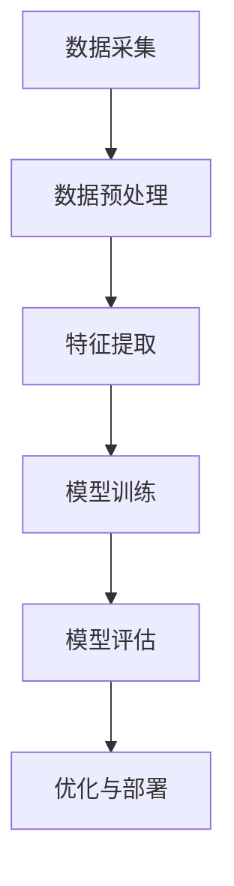
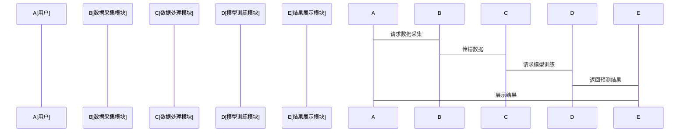

                 

# 金融市场情绪指标预测模型

> 关键词：金融市场、情绪指标、预测模型、机器学习、自然语言处理、时间序列分析

> 摘要：本文详细探讨了金融市场情绪指标预测模型的构建与应用。从情绪指标的核心概念到算法原理，再到系统架构设计和项目实战，全面分析了如何利用情绪指标预测金融市场走势。通过实际案例分析，展示了模型在金融投资中的潜在价值，并提出了未来研究方向。

---

## 第1章: 金融市场情绪指标概述

### 1.1 金融市场概述

#### 1.1.1 金融市场的基本概念
金融市场是资金流动和资产交易的场所，参与者包括投资者、机构、监管机构等。金融市场分为股票、债券、期货等多种类型，价格波动受多种因素影响，如经济数据、政策变化、市场情绪等。

#### 1.1.2 金融市场的参与者与交易机制
主要参与者包括个人投资者、机构投资者、券商、交易所等。交易机制涉及竞价交易、订单簿、撮合系统等，不同市场的交易规则和机制有所差异。

#### 1.1.3 金融市场波动与情绪的关系
市场情绪是影响价格波动的重要因素。当投资者情绪乐观时，资产价格上涨；反之则下跌。情绪指标能够量化这种波动，帮助预测市场走势。

### 1.2 情绪指标的定义与作用

#### 1.2.1 情绪指标的定义
情绪指标是衡量市场参与者情绪状态的量化工具，通常基于新闻、社交媒体、交易数据等信息进行计算。

#### 1.2.2 情绪指标在金融预测中的作用
情绪指标能够捕捉市场情绪变化，帮助预测价格波动、判断市场拐点，为投资决策提供支持。

#### 1.2.3 情绪指标的边界与外延
情绪指标并非万能，受数据质量、模型准确性等因素影响，需结合其他指标进行综合分析。

### 1.3 情绪指标预测模型的背景与意义

#### 1.3.1 金融市场情绪分析的背景
随着大数据和人工智能技术的发展，情绪分析逐渐成为金融研究的热点领域。

#### 1.3.2 情绪指标预测模型的意义
通过情绪指标预测模型，投资者可以更好地把握市场情绪变化，优化投资策略。

#### 1.3.3 情绪指标预测模型的应用场景
适用于股票预测、外汇交易、风险管理等领域，帮助投资者做出更明智的决策。

---

## 第2章: 情绪指标的核心概念与联系

### 2.1 情绪指标的核心概念

#### 2.1.1 数据来源与特征
情绪指标的数据来源包括新闻、社交媒体、交易数据等。不同数据源具有不同的特征，需进行预处理和清洗。

#### 2.1.2 情绪分析方法
常用的方法包括文本挖掘、情感分类、统计分析等。每种方法都有其优缺点，需根据具体情况选择。

#### 2.1.3 情绪指标的计算与标准化
情绪指标的计算涉及数据的整合和特征提取，需进行标准化处理，确保指标的可比性和一致性。

### 2.2 情绪指标的核心要素

#### 2.2.1 数据特征提取
提取与情绪相关的关键词、情感倾向等特征，为模型提供有效的输入。

#### 2.2.2 情绪强度计算
通过加权计算，得出情绪强度指标，反映市场的乐观或悲观程度。

#### 2.2.3 情绪指标的时间序列分析
分析情绪指标的时间序列特征，识别周期性、趋势性等模式，为预测提供依据。

---

## 第3章: 情绪指标预测模型的算法原理

### 3.1 情绪指标预测模型的算法概述

#### 3.1.1 文本分析与情绪分类
使用自然语言处理技术对文本进行分词、情感分类，提取情绪特征。

#### 3.1.2 特征提取与选择
从原始数据中提取有意义的特征，选择对情绪指标影响较大的特征。

#### 3.1.3 模型训练与优化
使用机器学习算法（如随机森林、支持向量机）进行训练，通过交叉验证优化模型参数。

### 3.2 情绪指标预测模型的流程图

### 3.3 算法实现与数学模型

#### 3.3.1 情绪分类算法
使用文本分类算法对新闻标题进行情绪分类，计算每条新闻的情绪得分。

#### 3.3.2 情绪强度计算
将每条新闻的情绪得分进行加权求和，得到整体情绪强度。

#### 3.3.3 时间序列预测模型
使用ARIMA模型对情绪强度进行时间序列预测，输出未来的情绪指标。

---

## 第4章: 情绪指标预测模型的系统架构设计

### 4.1 系统功能设计

#### 4.1.1 数据采集模块
从新闻网站、社交媒体等数据源采集文本数据。

#### 4.1.2 数据处理模块
对采集到的数据进行清洗、分词、情感分类等处理。

#### 4.1.3 模型训练模块
训练情绪指标预测模型，输出情绪强度和预测结果。

#### 4.1.4 结果展示模块
将情绪指标和预测结果可视化，提供直观的分析界面。

### 4.2 系统架构图

### 4.3 接口设计与交互流程

---

## 第5章: 情绪指标预测模型的项目实战

### 5.1 项目环境与工具安装

#### 5.1.1 环境配置
安装Python、Pandas、Scikit-learn、NLTK等工具。

#### 5.1.2 数据采集工具
使用爬虫工具采集新闻数据，如BeautifulSoup、Selenium等。

### 5.2 数据采集与预处理

#### 5.2.1 数据采集
从新闻网站采集股票相关的新闻标题和内容。

#### 5.2.2 数据清洗
去除无效数据，如重复、噪声信息，进行分词和情感分类。

### 5.3 特征提取与模型训练

#### 5.3.1 特征提取
提取关键词、情感倾向等特征，构建特征向量。

#### 5.3.2 模型训练
使用随机森林算法训练情绪指标预测模型，评估模型性能。

### 5.4 模型部署与结果分析

#### 5.4.1 模型部署
将训练好的模型部署到服务器，提供API接口供其他系统调用。

#### 5.4.2 结果分析
分析模型预测结果，验证模型的准确性和稳定性。

---

## 第6章: 最佳实践与小结

### 6.1 小结

#### 6.1.1 项目成果
成功构建了情绪指标预测模型，验证了其在金融预测中的有效性。

#### 6.1.2 经验总结
数据质量、特征选择、模型优化是影响模型性能的关键因素。

### 6.2 注意事项

#### 6.2.1 数据来源的可靠性
数据来源影响模型的准确性，需选择可靠的新闻源。

#### 6.2.2 模型的实时性
金融市场变化迅速，模型需要定期更新和优化。

#### 6.2.3 风险提示
情绪指标预测模型仅供参考，投资需谨慎。

### 6.3 未来研究方向

#### 6.3.1 多模态数据融合
结合文本、图像等多种数据源，提高情绪指标的准确性。

#### 6.3.2 深度学习应用
探索深度学习模型（如LSTM、Transformer）在情绪指标预测中的应用。

#### 6.3.3 预测模型的实时性优化
优化模型计算速度，提高预测的实时性。

---

## 参考文献

（此处可列出相关的参考文献，如书籍、论文、技术文档等）

---

## 作者信息

作者：AI天才研究院/AI Genius Institute & 禅与计算机程序设计艺术 /Zen And The Art of Computer Programming

---

本文通过系统化的分析和实践，详细探讨了金融市场情绪指标预测模型的构建与应用。从理论到实践，从算法到系统设计，全面揭示了情绪指标预测模型的核心原理和实际应用价值，为金融领域的研究和投资决策提供了新的思路和工具。

