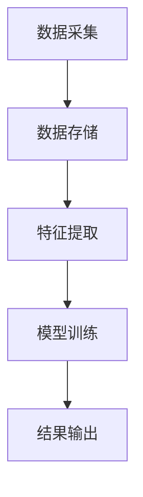

                 


# 金融市场波动预测模型

## 关键词：
金融市场波动预测、时间序列分析、机器学习、统计套利、算法交易、风险管理

## 摘要：
金融市场波动预测模型是利用数学模型和算法，通过对历史数据的分析，预测未来市场波动的重要工具。本文从金融市场的基本概念出发，详细介绍了波动预测的核心概念、算法原理、系统架构设计及项目实战，帮助读者全面理解并掌握金融市场波动预测模型的构建与应用。

---

# 第1章: 金融市场波动预测的背景与挑战

## 1.1 金融市场的基本概念
### 1.1.1 金融市场的定义与分类
金融市场是指资金供需双方进行交易的场所，分为货币市场、资本市场、外汇市场等。波动性是市场价格短期剧烈变化的特征，反映了市场的不确定性。

### 1.1.2 金融市场波动的定义与特征
波动性可以通过标准差、波动率等指标衡量。波动率是衡量资产价格变化程度的重要指标，反映了市场的风险程度。

### 1.1.3 金融市场波动预测的现实意义
波动预测有助于投资者制定交易策略、规避风险，帮助机构优化资产配置，提高投资回报率。

## 1.2 金融市场波动预测的挑战
### 1.2.1 数据的复杂性
金融市场数据具有高维、非线性、噪声多等特点，增加了模型构建的难度。

### 1.2.2 市场的非线性特征
市场参与者的行为复杂，价格波动受多种因素影响，如政策、经济指标、突发事件等，导致模型难以捕捉所有影响因素。

### 1.2.3 噪声与噪声的干扰
金融市场数据中存在大量噪声，如市场微观结构噪声，干扰了模型的预测能力。

## 1.3 本书的核心目标与内容框架
### 1.3.1 核心目标的设定
构建一个能够准确预测金融市场波动的模型，帮助投资者做出科学决策。

### 1.3.2 内容框架的概述
本文将从基础概念、算法原理、系统架构到项目实战，全面介绍金融市场波动预测模型的构建与应用。

### 1.3.3 预期读者群体
本书适合金融从业者、数据科学家、算法交易员以及对金融市场波动预测感兴趣的读者。

## 1.4 本章小结
本章介绍了金融市场的基本概念、波动预测的挑战以及本书的核心目标和框架，为后续章节的学习奠定了基础。

---

# 第2章: 核心概念与联系

## 2.1 时间序列分析
### 2.1.1 时间序列的基本概念
时间序列是指按时间顺序排列的数据，如股票价格、汇率等。时间序列分析旨在发现数据中的趋势、周期性等模式。

### 2.1.2 时间序列的分类
时间序列可以分为平稳序列和非平稳序列。平稳序列具有恒定的均值和方差，而非平稳序列则具有趋势或周期性变化。

### 2.1.3 时间序列分析的常用方法
常用方法包括移动平均法、指数平滑法、ARIMA模型等。

## 2.2 统计套利与机器学习
### 2.2.1 统计套利的定义与特点
统计套利是利用资产价格短期偏离均值的机会进行套利交易。其特点是依赖统计套利模型，具有低风险、高流动性。

### 2.2.2 机器学习在金融中的应用
机器学习通过训练数据，识别数据中的模式和特征，用于分类、回归等任务，如股票价格预测、风险评估等。

### 2.2.3 统计套利与机器学习的结合
机器学习模型可以优化统计套利策略，提高套利机会的识别能力，降低交易风险。

## 2.3 股票、期货与外汇市场的波动性对比
### 2.3.1 股票市场的波动性
股票市场波动性受公司业绩、市场情绪、宏观经济因素等影响，具有较高的不确定性。

### 2.3.2 期货市场的波动性
期货市场波动性较大，受基差、持仓量、市场情绪等因素影响。

### 2.3.3 外汇市场的波动性
外汇市场波动性受经济数据、利率政策、地缘政治等影响，具有较强的不可预测性。

## 2.4 核心概念对比表格
| 概念       | 时间序列分析 | 统计套利 | 机器学习 |
|------------|--------------|----------|----------|
| 定义       | 基于时间顺序的数据分析 | 利用价格偏离均值的机会进行套利 | 利用数据训练模型识别模式 |
| 应用领域   | 金融时间序列预测 | 套利交易 | 金融预测、分类等 |
| 优势       | 捕捉趋势和周期性 | 低风险套利 | 高精度预测 |
| 局限性     | 无法捕捉非线性关系 | 市场深度不足 | 数据依赖性强 |

## 2.5 ER实体关系图
```mermaid
erd
    entity 交易所 {
        key: 交易代码
        <a>交易时间</a>
        <a>交易价格</a>
    }
    entity 股票 {
        key: 股票代码
        股票名称
        行业分类
    }
    entity 交易者 {
        key: 交易者ID
        交易者名称
        资产规模
    }
    交易所 --> 股票: 交易
    交易所 --> 交易者: 下单
```

---

# 第3章: 算法原理与实现

## 3.1 时间序列预测算法
### 3.1.1 ARIMA模型
ARIMA（自回归积分滑动平均模型）用于预测时间序列数据。模型包括自回归部分、差分部分和滑动平均部分。

模型公式：
$$ ARIMA(p, d, q) $$
其中，p为自回归阶数，d为差分阶数，q为滑动平均阶数。

### 3.1.2 LSTM模型
长短期记忆网络（LSTM）是一种特殊的RNN，适合处理长序列数据。LSTM通过细胞状态和门控机制保存长期信息。

### 3.1.3 Prophet模型
Prophet模型是Facebook开源的时间序列预测工具，基于非负惩罚回归和ARIMA模型，适用于具有强烈周期性的数据。

## 3.2 统计套利算法
### 3.2.1 均值回归策略
均值回归假设价格会回归到均值水平，如配对交易策略。

### 3.2.2 股差策略
利用股票价格差异进行套利，如跨市场套利。

### 3.2.3 统计套利的实现步骤
1. 数据收集与预处理
2. 计算价差
3. 确定交易规则
4. 风险控制

## 3.3 机器学习算法
### 3.3.1 支持向量机（SVM）
SVM用于分类和回归任务，适用于金融市场数据分类。

### 3.3.2 随机森林（Random Forest）
随机森林是一种基于决策树的集成学习方法，适用于特征重要性分析和预测任务。

---

# 第4章: 系统分析与架构设计

## 4.1 项目背景
金融市场波动预测系统的开发旨在帮助投资者捕捉市场机会，规避风险。

## 4.2 系统功能设计
### 4.2.1 数据采集模块
负责采集实时或历史数据，支持多种数据源。

### 4.2.2 特征提取模块
从数据中提取有用特征，如波动率、成交量等。

### 4.2.3 模型训练模块
使用机器学习模型训练波动预测模型。

## 4.3 系统架构设计


---

# 第5章: 项目实战

## 5.1 环境安装
使用Anaconda安装Python环境，安装相关库如pandas、numpy、scikit-learn等。

## 5.2 系统核心实现源代码
```python
import pandas as pd
import numpy as np
from sklearn.ensemble import RandomForestRegressor
from sklearn.metrics import mean_squared_error

# 数据加载
data = pd.read_csv('market_data.csv')

# 特征提取
features = data[['open', 'high', 'low', 'volume']]
target = data['close']

# 模型训练
model = RandomForestRegressor(n_estimators=100)
model.fit(features, target)

# 预测与评估
predicted = model.predict(features)
print(mean_squared_error(target, predicted))
```

## 5.3 实际案例分析
以某股票为例，分析模型预测效果，评估模型的准确性和稳定性。

## 5.4 项目小结
总结项目实现的关键点，讨论模型的优缺点及改进方向。

---

# 第6章: 最佳实践

## 6.1 建模经验总结
数据清洗、特征工程、模型调优是模型构建的关键步骤。

## 6.2 模型调优技巧
使用网格搜索、交叉验证等方法优化模型参数。

## 6.3 风险提示
避免过度拟合、数据泄漏，注意模型的实时性和稳定性。

## 6.4 未来研究方向
探索深度学习模型、多因子模型，结合实时数据流优化预测能力。

---

# 作者：AI天才研究院/AI Genius Institute & 禅与计算机程序设计艺术 /Zen And The Art of Computer Programming

