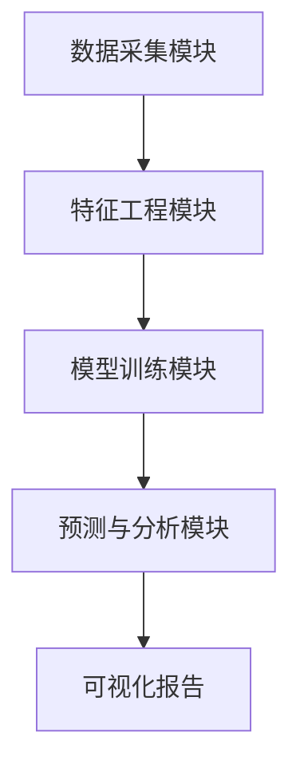
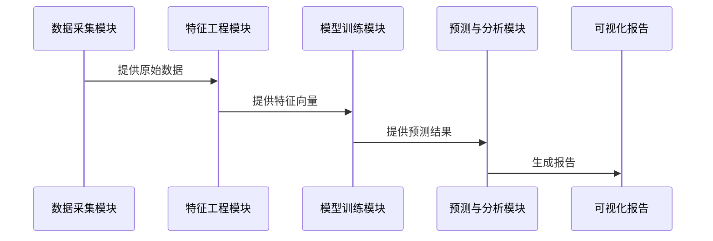

                 


# 金融市场流动性供给预测模型

> 关键词：金融市场流动性供给预测模型，流动性预测，机器学习，时间序列分析，金融风险管理，系统架构设计

> 摘要：本文详细探讨了金融市场流动性供给预测模型的设计与实现，从理论基础到算法实现，从系统架构到项目实战，全面解析了流动性供给预测的核心原理与应用场景。文章首先介绍了金融市场流动性供给预测的基本概念与重要性，随后深入分析了基于时间序列分析、机器学习和宏观经济指标的多种预测算法，详细阐述了模型的数学公式与实现代码。最后，通过实际案例展示了系统的架构设计与实现过程，总结了流动性供给预测模型在金融风险管理中的应用价值。

---

## 第一部分: 金融市场流动性供给预测模型概述

### 第1章: 金融市场流动性概述

#### 1.1 金融市场流动性基本概念
金融市场流动性是指金融资产在市场中迅速转换为现金而不导致资产价值显著下降的能力。流动性供给则是指市场参与者提供资金支持，以满足交易需求的过程。

#### 1.2 金融市场流动性供给问题背景
- **问题背景**：金融市场流动性不足可能导致交易成本上升、市场波动加剧，甚至引发系统性风险。特别是在金融危机期间，流动性供给的预测与管理尤为重要。
- **问题描述**：流动性供给受多种因素影响，包括市场参与者的交易行为、宏观经济指标、政策调控等。准确预测流动性供给可以帮助金融机构更好地进行资产配置和风险管理。
- **解决方法**：构建流动性供给预测模型，通过数据分析与建模，量化流动性供给的变化趋势，为金融机构提供决策支持。

#### 1.3 金融市场流动性供给预测的目标与意义
- **目标**：通过模型预测流动性供给的变化，帮助金融机构优化资产负债管理、降低流动性风险。
- **意义**：流动性供给预测是金融风险管理的重要组成部分，能够帮助机构提前应对流动性短缺或过剩的情况，确保市场稳定运行。

---

## 第二部分: 流动性供给预测模型的核心算法

### 第2章: 时间序列预测算法

#### 2.1 ARIMA模型原理
ARIMA（自回归积分滑动平均模型）是一种广泛应用于时间序列预测的经典算法。其核心思想是通过自回归和滑动平均的组合，捕捉时间序列的内在规律。

- **数学公式**：$$ ARIMA(p, d, q) $$
  其中，p为自回归阶数，d为差分阶数，q为滑动平均阶数。

- **实现步骤**：
  1. 数据预处理：对原始数据进行差分，使其平稳化。
  2. 模型参数选择：通过网格搜索或信息准则确定最佳的p、d、q值。
  3. 模型训练：使用历史数据拟合模型。
  4. 预测与验证：基于测试数据进行预测，并评估模型性能。

#### 2.2 LSTM模型原理
LSTM（长短期记忆网络）是一种基于深度学习的时间序列预测模型，能够有效捕捉时间序列的长距离依赖关系。

- **数学公式**：$$ LSTM\ (units, input\_size) $$
  其中，units为神经元数量，input\_size为输入特征维度。

- **实现步骤**：
  1. 数据预处理：将时间序列数据转换为适合LSTM输入的格式（如多步滞后）。
  2. 模型构建：搭建LSTM网络，包括输入层、LSTM层、全连接层和输出层。
  3. 模型训练：使用训练数据拟合模型，优化损失函数（如均方误差）。
  4. 预测与验证：基于测试数据进行预测，并评估模型性能。

#### 2.3 Prophet模型原理
Prophet是由Facebook开源的时间序列预测模型，基于回归模型和时间序列分解方法（类似ARIMA）构建。

- **数学公式**：$$ Prophet\ ( changepoint\_{prior\_scale}) $$
  其中，changepoint_prior_scale是参数，用于控制模型对历史数据中变化点的敏感性。

- **实现步骤**：
  1. 数据预处理：将时间序列数据格式化为Prophet所需的输入格式。
  2. 模型构建：使用Prophet库训练模型。
  3. 预测与可视化：基于测试数据进行预测，并生成预测结果的可视化图表。

---

## 第三部分: 流动性供给预测模型的系统架构与实现

### 第3章: 系统架构设计

#### 3.1 系统功能设计
- **数据采集模块**：负责获取金融市场数据，包括交易量、价格、订单簿等。
- **特征工程模块**：对原始数据进行特征提取，生成适合模型输入的特征向量。
- **模型训练模块**：基于特征数据训练流动性供给预测模型。
- **预测与分析模块**：利用训练好的模型进行流动性供给预测，并生成可视化报告。

#### 3.2 系统架构设计


#### 3.3 系统接口设计
- **数据接口**：与数据源（如交易所API）对接，获取实时数据。
- **模型接口**：与前端或下游系统对接，提供流动性供给预测结果。

#### 3.4 系统交互流程


---

## 第四部分: 项目实战与应用展望

### 第4章: 项目实战

#### 4.1 环境安装
```bash
pip install numpy pandas scikit-learn tensorflow prophet
```

#### 4.2 核心代码实现

##### 4.2.1 ARIMA模型实现
```python
from statsmodels.tsa.arima.model import ARIMA

# 数据预处理
train_data = df['liquidity_supply'].iloc[:-30]
test_data = df['liquidity_supply'].iloc[-30:]

# 模型训练
model = ARIMA(train_data, order=(5, 1, 0))
model_fit = model.fit()

# 预测
forecast = model_fit.forecast(steps=30)
```

##### 4.2.2 LSTM模型实现
```python
from tensorflow.keras.models import Sequential
from tensorflow.keras.layers import LSTM, Dense

# 数据预处理
train_X = train_data.reshape((train_data.shape[0], 1, 1))
train_y = train_data[1:]

# 模型构建
model = Sequential()
model.add(LSTM(50, input_shape=(1, 1)))
model.add(Dense(1))
model.compile(loss='mean_squared_error', optimizer='adam')

# 模型训练
model.fit(train_X, train_y, epochs=100, batch_size=1)
```

##### 4.2.3 Prophet模型实现
```python
from fbprophet import Prophet

# 数据预处理
df_prophet = df[['date', 'liquidity_supply']]
df_prophet.columns = ['ds', 'y']

# 模型训练
model = Prophet(changepoint_prior_scale=0.01)
model.fit(df_prophet)

# 预测
future = model.make_future_dataframe(periods=30)
forecast = model.predict(future)
```

#### 4.3 实际案例分析
以某金融市场的历史流动性数据为例，通过上述模型进行预测，并与实际数据进行对比，验证模型的准确性。

---

## 第五部分: 总结与展望

### 5.1 最佳实践
- **数据质量**：确保数据的完整性和准确性。
- **模型选择**：根据实际需求选择合适的模型，并进行充分的模型验证。
- **系统优化**：通过分布式计算和优化算法提升模型训练效率。

### 5.2 小结
本文详细介绍了金融市场流动性供给预测模型的设计与实现，从算法原理到系统架构，从理论分析到项目实战，为读者提供了全面的指导。

### 5.3 注意事项
- 流动性供给预测模型的结果仅供参考，实际应用中需结合市场实际情况进行调整。
- 模型的预测精度受到数据质量和市场环境的影响，需定期更新和优化。

### 5.4 拓展阅读
- 《时间序列分析》
- 《机器学习实战》
- 《金融风险管理》

---

作者：AI天才研究院/AI Genius Institute & 禅与计算机程序设计艺术 /Zen And The Art of Computer Programming

