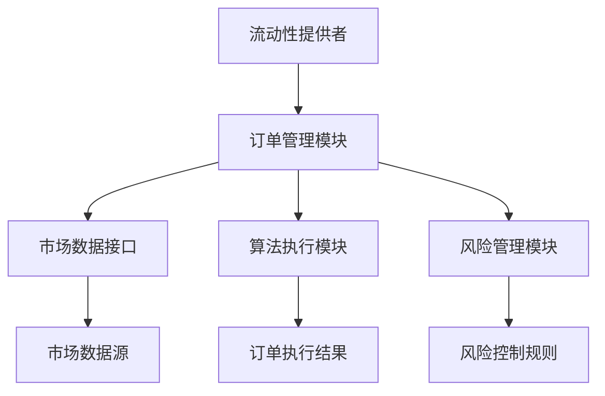
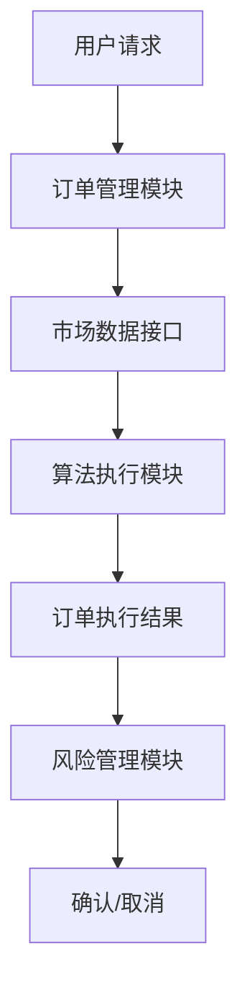

                 


```markdown
# 金融市场流动性提供策略

> 关键词：金融市场，流动性，提供策略，算法，系统架构

> 摘要：本文详细探讨了金融市场中流动性提供策略的核心概念、算法实现、系统架构以及实际应用。通过分析TWAP、VWAP等常见策略，结合数学模型和系统设计，为读者提供了从理论到实践的全面指南。

---

## 第三章: 流动性提供策略的算法原理

### 3.1 常见的流动性提供算法

#### 3.1.1 时间加权平均价格（TWAP）

TWAP是一种常用的流动性提供策略，通过在指定时间段内逐步执行订单，以减少市场冲击。其核心思想是将大额订单分解为多个小订单，均匀分布在目标时间段内。

##### TWAP算法实现步骤：
1. 确定目标订单总量和时间段。
2. 将订单分解为多个小订单，均匀分布在整个时间段。
3. 监控市场数据，根据实时价格调整订单执行速度。

##### TWAP算法实现示例代码：

```python
import pandas as pd
import numpy as np
import time

def twap_execution(target_volume, timeframe_in_seconds):
    execution_speed = target_volume / timeframe_in_seconds  # 每秒执行的体积
    execution_timestamps = np.arange(0, timeframe_in_seconds, 1)
    execution_volumes = [execution_speed for _ in execution_timestamps]
    return execution_timestamps, execution_volumes

# 示例使用
target_volume = 1000  # 目标成交量
timeframe = 60  # 时间窗长，单位为秒
timestamps, volumes = twap_execution(target_volume, timeframe)

# 输出结果
print("TWAP Execution Schedule:")
for ts, vol in zip(timestamps, volumes):
    print(f"Time: {ts}s, Volume: {vol}")
```

#### 3.1.2 体积加权平均价格（VWAP）

VWAP是一种更复杂的策略，旨在以尽可能接近市场自然交易量的方式执行订单，从而降低市场冲击。其计算公式为：

$$ VWAP = \frac{\sum_{i=1}^{n} p_i v_i}{\sum_{i=1}^{n} v_i} $$

其中，\( p_i \) 是第i笔交易的价格，\( v_i \) 是第i笔交易的成交量。

##### VWAP算法实现步骤：
1. 分析市场的历史交易数据，确定市场的自然交易量分布。
2. 根据目标订单量和时间窗，计算每段时间内应执行的成交量。
3. 按照计算的成交量逐步执行订单，实时调整以适应市场变化。

##### VWAP算法实现示例代码：

```python
import pandas as pd
import numpy as np

def vwap_calculation(trade_data):
    # 计算VWAP
    trade_data['cum_volume'] = trade_data['volume'].cumsum()
    trade_data['vwap'] = (trade_data['price'] * trade_data['volume']).cumsum() / trade_data['cum_volume']
    return trade_data['vwap'].iloc[-1]

# 示例使用
# 假设trade_data包含'price'和'volume'列
# 计算VWAP
vwap_value = vwap_calculation(trade_data)
print(f"Current VWAP: {vwap_value}")
```

### 3.2 算法实现细节

#### 3.2.1 TWAP算法的实现步骤

1. **确定目标和时间窗**：用户指定要执行的订单总量和期望完成的时间段。
2. **分解订单**：将大额订单分解为多个小订单，均匀分布在整个时间段内。
3. **监控市场**：实时跟踪市场价格变化，根据波动调整执行速度。

#### 3.2.2 VWAP算法的实现步骤

1. **分析市场数据**：收集并分析历史交易数据，确定市场的自然交易量分布。
2. **计算VWAP**：根据收集的数据计算VWAP，作为订单执行的基准。
3. **执行订单**：按照计算的VWAP，动态调整订单执行速度，确保交易量与市场自然交易量相匹配。

### 3.3 数学模型与公式

#### 3.3.1 最优执行速度模型

最优执行速度模型旨在最小化市场冲击和交易成本，其数学表达式为：

$$ \frac{dP}{dt} = k \cdot (Q(t) - Q_m(t)) $$

其中，\( Q(t) \) 是当前执行的订单量，\( Q_m(t) \) 是市场自然交易量，\( k \) 是常数。

#### 3.3.2 市场冲击模型

市场冲击模型用于量化订单执行对市场价格的影响，通常表示为：

$$ S = \alpha \cdot V + \beta \cdot V^2 $$

其中，\( V \) 是订单的成交量，\( \alpha \) 和 \( \beta \) 是模型参数。

---

## 第4章: 系统分析与架构设计

### 4.1 系统架构设计

一个典型的流动性提供系统包括以下几个关键组件：



### 4.2 功能设计

#### 4.2.1 核心功能模块

- **订单管理模块**：负责订单的生成、分解和提交。
- **市场数据接口**：实时获取市场数据，如价格、成交量等。
- **算法执行模块**：根据选定的策略执行订单。
- **风险管理模块**：监控和管理执行过程中的风险。

#### 4.2.2 功能流程图



---

## 第5章: 项目实战

### 5.1 项目背景与目标

开发一个基于TWAP策略的简单流动性提供系统，用于在指定时间内分解并执行大额订单，以减少市场冲击。

### 5.2 环境安装

安装必要的Python库：

```bash
pip install pandas numpy matplotlib
```

### 5.3 系统核心实现

#### 5.3.1 TWAP执行系统实现代码

```python
import pandas as pd
import numpy as np
import time

def twap_execution_system(target_volume, timeframe_in_seconds):
    execution_speed = target_volume / timeframe_in_seconds  # 每秒执行的体积
    timestamps = np.arange(0, timeframe_in_seconds, 1)
    volumes = [execution_speed for _ in timestamps]
    
    # 模拟市场数据
    market_data = pd.DataFrame({
        'timestamp': timestamps,
        'price': np.random.normal(100, 0.5, len(timestamps))
    })
    
    # 执行订单并监控市场
    executed_price = []
    for ts, vol in zip(timestamps, volumes):
        current_price = market_data[market_data['timestamp'] == ts]['price'].values[0]
        executed_price.append(current_price)
    
    return timestamps, volumes, executed_price

# 示例使用
target_volume = 1000
timeframe = 60
timestamps, volumes, prices = twap_execution_system(target_volume, timeframe)

# 可视化结果
import matplotlib.pyplot as plt

plt.figure(figsize=(10, 6))
plt.plot(timestamps, prices, label='Market Price')
plt.xlabel('Time (s)')
plt.ylabel('Price')
plt.legend()
plt.show()
```

### 5.4 案例分析与总结

通过上述代码实现TWAP策略，我们发现：

- **优点**：TWAP策略能够有效减少市场冲击，降低交易成本。
- **缺点**：在市场剧烈波动时，TWAP可能无法及时调整，导致较高的成交价。

---

## 第6章: 总结与展望

### 6.1 总结

本文详细探讨了金融市场流动性提供策略的核心概念、算法实现、系统架构以及实际应用。通过分析TWAP、VWAP等策略，结合数学模型和系统设计，为读者提供了从理论到实践的全面指南。

### 6.2 未来展望

未来，流动性提供策略将更加智能化和自动化，结合人工智能技术，实时分析市场数据，优化执行策略。同时，随着区块链技术的发展，去中心化金融（DeFi）将为流动性提供带来新的机遇和挑战。

### 6.3 最佳实践 Tips

- **风险管理**：在实施流动性提供策略时，始终关注市场风险，设置合理的止损点。
- **系统监控**：实时监控系统运行状态，及时发现并解决问题。
- **持续优化**：根据市场变化，不断优化策略参数，提高执行效率。

---

## 作者

作者：AI天才研究院/AI Genius Institute & 禅与计算机程序设计艺术 /Zen And The Art of Computer Programming
```

