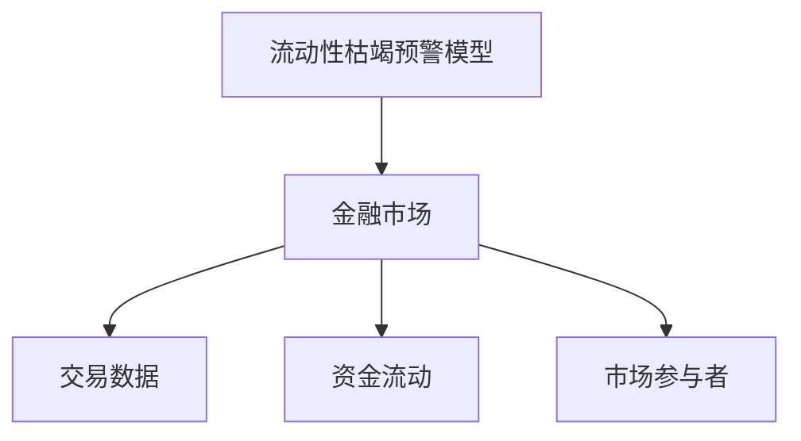
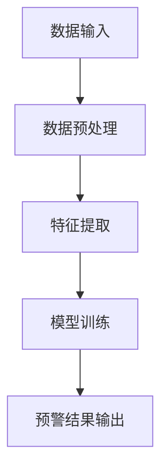
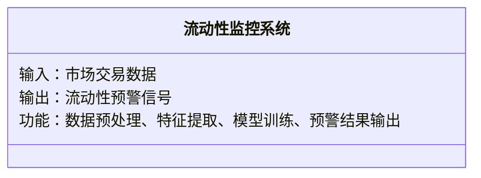
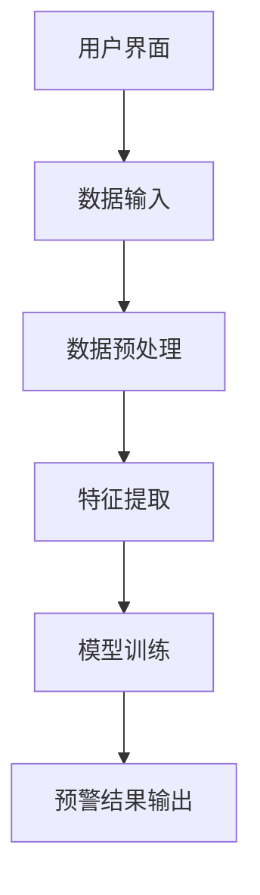
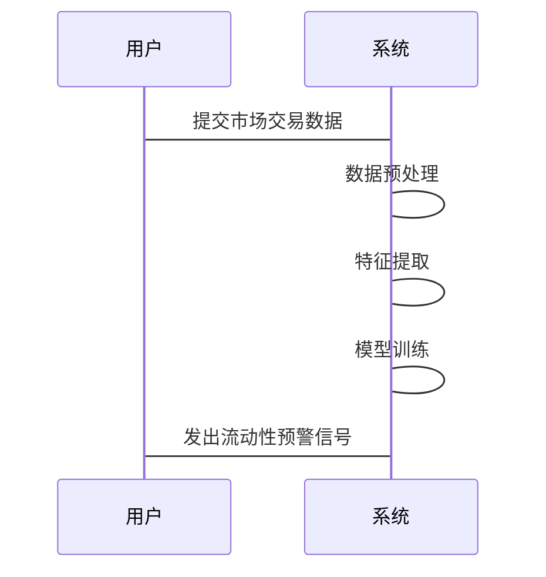

                 


```markdown
# 金融市场流动性枯竭预警模型

> 关键词：金融市场流动性、流动性枯竭、预警模型、时间序列分析、机器学习、系统架构设计、项目实战

> 摘要：金融市场流动性枯竭是金融市场中的一个重要问题，它可能导致市场的剧烈波动和系统性风险。本文将详细介绍如何构建一个金融市场流动性枯竭预警模型，包括模型的核心概念、算法原理、系统架构设计、项目实战以及最佳实践。通过本文的分析，读者将能够理解流动性枯竭预警模型的构建过程，并能够实际应用这些方法来预警和防范流动性风险。

---

# 第一部分: 金融市场流动性与流动性枯竭概述

# 第1章: 金融市场流动性与流动性枯竭概述

## 1.1 金融市场流动性概念

### 1.1.1 流动性定义与基本特征
流动性是指资产在金融市场中快速转化为现金的能力，也可以理解为市场参与者在不显著影响市场价格的情况下买卖资产的能力。流动性高的市场交易活跃，买卖价差小，交易深度大；流动性低的市场交易不活跃，买卖价差大，交易深度小。

### 1.1.2 流动性在金融市场中的作用
流动性是金融市场正常运行的基础，它直接影响市场的价格发现、风险管理和资源配置效率。高流动性可以降低交易成本，提高市场效率；低流动性可能导致市场失灵，引发价格剧烈波动。

### 1.1.3 流动性枯竭的定义与表现
流动性枯竭是指市场中买卖双方无法在合理的时间和价格范围内完成交易，导致市场流动性骤减，交易量急剧下降，买卖价差扩大，市场深度不足。具体表现包括：
- 交易量急剧下降
- 买卖价差扩大
- 市场深度不足
- 市场波动性显著增加
- 市场参与者恐慌性抛售或买入

## 1.2 金融市场流动性枯竭的背景与问题

### 1.2.1 近年来金融市场流动性问题的现状
近年来，全球金融市场经历了多次流动性危机，例如2008年全球金融危机、2020年新冠疫情引发的市场崩盘等。这些事件表明，流动性枯竭是金融市场中的一个重大风险，需要引起高度重视。

### 1.2.2 流动性枯竭对市场的影响
流动性枯竭可能导致市场的剧烈波动，引发系统性风险，甚至导致金融危机。具体影响包括：
- 市场参与者无法及时变现资产，导致资产贬值
- 金融机构面临流动性压力，可能导致破产或倒闭
- 市场信心下降，投资者恐慌性抛售资产
- 市场功能失灵，影响经济的正常运行

### 1.2.3 流动性枯竭预警的必要性
流动性枯竭预警的目的是通过及时发现市场中的流动性风险，采取相应的措施来缓解或避免流动性危机。预警模型可以帮助市场参与者提前了解市场的流动性状况，采取相应的风险管理措施。

## 1.3 流动性枯竭预警模型的目标与意义

### 1.3.1 模型的目标
流动性枯竭预警模型的目标是通过分析市场数据，识别市场的流动性风险，提前发出预警信号，帮助市场参与者采取相应的风险管理措施。

### 1.3.2 模型的意义与价值
流动性枯竭预警模型的意义在于：
- 提高市场的风险管理能力
- 降低市场的系统性风险
- 维护金融市场的稳定
- 为市场参与者提供决策支持

### 1.3.3 模型的应用场景
流动性枯竭预警模型可以应用于以下场景：
- 金融机构的风险管理
- 投资者的投资决策
- 监管机构的市场监控
- 学术研究

## 1.4 本章小结
本章介绍了金融市场流动性与流动性枯竭的基本概念，分析了流动性枯竭对市场的影响，提出了流动性枯竭预警模型的目标与意义，并总结了模型的应用场景。

---

# 第二部分: 流动性枯竭预警模型的核心概念与联系

# 第2章: 流动性枯竭预警模型的核心要素

## 2.1 模型核心概念与属性

### 2.1.1 模型的核心概念
流动性枯竭预警模型的核心概念包括：
- 数据来源：市场交易数据、资金流动数据、市场参与者行为数据等
- 预警指标：市场深度、买卖价差、波动性、交易量等
- 预警阈值：根据历史数据确定的临界值
- 预警算法：时间序列分析、机器学习模型等

### 2.1.2 模型属性特征对比表格
```markdown
| 概念       | 描述                           |
|------------|--------------------------------|
| 数据来源   | 市场交易数据、资金流动数据等   |
| 预警指标   | 市场深度、买卖价差、波动性等   |
| 预警阈值   | 根据历史数据确定的临界值       |
| 预警算法   | 时间序列分析、机器学习模型等   |
```

### 2.1.3 ER实体关系图


## 2.2 模型的核心原理与流程

### 2.2.1 模型的基本原理
流动性枯竭预警模型的基本原理是通过分析市场的交易数据，提取相关的预警指标，建立数学模型，计算这些指标的变化趋势，判断市场是否处于流动性枯竭的风险中。

### 2.2.2 模型的流程图


## 2.3 本章小结
本章详细介绍了流动性枯竭预警模型的核心概念与属性，通过对比表格和ER实体关系图，展示了模型的结构和组成部分。

---

# 第三部分: 流动性枯竭预警模型的算法原理

# 第3章: 基于时间序列分析的预警算法

## 3.1 时间序列分析的基本原理

### 3.1.1 时间序列分析的定义
时间序列分析是一种通过分析历史数据，预测未来趋势的方法。它广泛应用于经济、金融、气象等领域。

### 3.1.2 时间序列分析的核心模型
时间序列分析的核心模型包括：
- 平稳时间序列模型（ARIMA）
- 非平稳时间序列模型（ARIMA-GARCH）

### 3.1.3 时间序列分析的应用场景
时间序列分析在金融市场流动性预警中的应用场景包括：
- 市场深度预测
- 买卖价差预测
- 波动性预测

## 3.2 基于时间序列分析的预警算法实现

### 3.2.1 数据预处理
数据预处理包括：
- 数据清洗：去除异常值、填补缺失值
- 数据标准化：对数据进行标准化处理，使其具有可比性

### 3.2.2 特征提取
特征提取包括：
- 提取市场深度、买卖价差、波动性等指标
- 对特征进行降维处理，例如使用主成分分析（PCA）

### 3.2.3 模型训练
模型训练包括：
- 选择合适的模型：例如ARIMA模型
- 确定模型的参数：例如ARIMA的p、q值
- 模型的训练与验证：使用历史数据进行训练，并验证模型的准确性

### 3.2.4 预警结果输出
预警结果输出包括：
- 预警指标的计算：例如计算市场深度是否低于预警阈值
- 预警信号的发出：例如发出红色预警信号

## 3.3 时间序列分析的数学模型

### 3.3.1 ARIMA模型
ARIMA模型是一种常用的时间序列分析模型，其数学表达式为：
$$ ARIMA(p, d, q) $$
其中：
- p为自回归阶数
- d为差分阶数
- q为移动平均阶数

### 3.3.2 ARIMA-GARCH模型
ARIMA-GARCH模型是一种结合ARIMA模型和GARCH模型的模型，其数学表达式为：
$$ ARIMA(p, d, q) + GARCH(r, s) $$
其中：
- r为GARCH模型的阶数
- s为 ARCH模型的阶数

## 3.4 本章小结
本章详细介绍了基于时间序列分析的预警算法，包括数据预处理、特征提取、模型训练和预警结果输出，并给出了ARIMA和ARIMA-GARCH模型的数学表达式。

---

# 第四部分: 流动性枯竭预警模型的系统架构设计

# 第4章: 系统分析与架构设计

## 4.1 问题场景介绍

### 4.1.1 问题描述
流动性枯竭预警系统需要解决的问题是：如何通过分析市场数据，识别市场的流动性风险，提前发出预警信号。

### 4.1.2 问题解决
通过构建流动性枯竭预警系统，可以实时监控市场的流动性状况，及时发现潜在的流动性风险，并采取相应的措施。

## 4.2 系统功能设计

### 4.2.1 领域模型


### 4.2.2 系统架构设计


### 4.2.3 系统接口设计
系统接口设计包括：
- 数据接口：与数据源对接，获取市场交易数据
- 预警接口：向用户发出预警信号

### 4.2.4 系统交互设计


## 4.3 本章小结
本章详细介绍了流动性枯竭预警系统的系统架构设计，包括问题场景、系统功能设计、系统架构设计、系统接口设计和系统交互设计。

---

# 第五部分: 流动性枯竭预警模型的项目实战

# 第5章: 项目实战

## 5.1 环境安装

### 5.1.1 环境要求
- 操作系统：Windows/Mac/Linux
- Python版本：3.6+
- 网络环境：稳定的互联网连接

### 5.1.2 安装依赖
- Python库：numpy、pandas、scikit-learn、mermaid、mathjax
- 其他工具：Jupyter Notebook

## 5.2 系统核心实现

### 5.2.1 核心代码实现
```python
import numpy as np
import pandas as pd
from sklearn.metrics import mean_squared_error

def preprocess_data(data):
    # 数据清洗
    data = data.dropna()
    # 数据标准化
    data = (data - data.mean()) / data.std()
    return data

def extract_features(data):
    # 提取特征
    features = data[['market_depth', 'bid_ask_spread', 'volatility']]
    return features

def train_model(features, labels):
    # 模型训练
    from sklearn.linear_model import LinearRegression
    model = LinearRegression()
    model.fit(features, labels)
    return model

def predict_and预警(model, features):
    # 预测与预警
    predictions = model.predict(features)
    threshold = 0.5
   预警信号 = predictions > threshold
    return 预警信号

# 主程序
data = pd.read_csv('market_data.csv')
processed_data = preprocess_data(data)
features = extract_features(processed_data)
labels = processed_data['流动性风险']
model = train_model(features, labels)
预警信号 = predict_and预警(model, features)
print('预警信号:', 预警信号)
```

### 5.2.2 代码应用解读与分析
上述代码实现了一个简单的流动性枯竭预警系统，包括数据预处理、特征提取、模型训练和预警结果输出。

## 5.3 实际案例分析与详细讲解剖析

### 5.3.1 案例数据
假设我们有一个包含市场深度、买卖价差、波动性等指标的数据集。

### 5.3.2 数据预处理
对数据进行清洗和标准化处理。

### 5.3.3 模型训练
使用线性回归模型对数据进行训练，得到模型参数。

### 5.3.4 预警结果输出
根据模型预测结果，判断是否发出流动性枯竭预警信号。

## 5.4 本章小结
本章通过实际案例分析，详细讲解了流动性枯竭预警系统的实现过程，包括环境安装、核心代码实现和实际案例分析。

---

# 第六部分: 总结与展望

# 第6章: 总结与展望

## 6.1 本章总结
本文详细介绍了金融市场流动性枯竭预警模型的构建过程，包括模型的核心概念、算法原理、系统架构设计、项目实战以及最佳实践。

## 6.2 模型的优缺点

### 6.2.1 优点
- 可以实时监控市场的流动性状况
- 可以提前发现流动性风险
- 可以帮助市场参与者采取相应的风险管理措施

### 6.2.2 缺点
- 模型的准确性依赖于数据质量和模型选择
- 模型的实时性可能受到计算能力的限制
- 模型的可解释性可能较差

## 6.3 总结与展望
流动性枯竭预警模型是一种重要的金融风险管理工具，本文提出了一个基于时间序列分析的预警模型，并通过实际案例分析展示了模型的实现过程。未来的研究可以进一步优化模型，例如引入机器学习模型如LSTM来提高模型的准确性，或者引入更多的市场数据来提高模型的实时性。

---

作者：AI天才研究院/AI Genius Institute & 禅与计算机程序设计艺术 /Zen And The Art of Computer Programming
```

