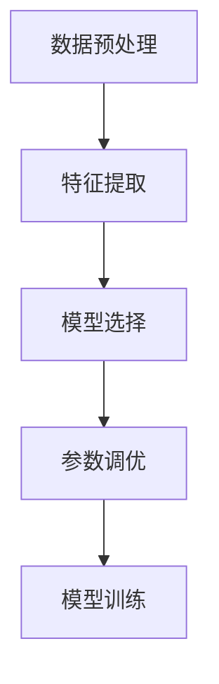
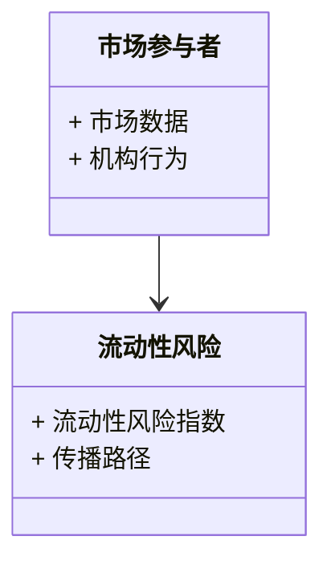

                 


# 金融市场流动性风险传导模型

> 关键词：金融市场，流动性风险，传导模型，风险度量，系统架构

> 摘要：本文详细探讨了金融市场流动性风险的传导机制及其建模方法。首先介绍了流动性风险的基本概念和其在金融市场中的重要性，然后分析了流动性风险的传导路径和影响因素。接着，从算法原理、数学模型、系统架构等多个角度，详细讲解了流动性风险传导模型的构建过程。最后，通过实际案例展示了模型的应用，并总结了最佳实践和未来研究方向。

---

# 第1章: 金融市场流动性风险概述

## 1.1 金融市场流动性风险的定义与背景

### 1.1.1 什么是流动性风险
流动性风险是指由于市场参与者无法及时以合理价格买卖资产，导致资产价值下降或无法履行义务的风险。它反映了金融市场中资金流动的顺畅程度。

### 1.1.2 流动性风险的产生背景
随着全球化和金融创新的加速，金融市场日益复杂。金融危机（如2008年全球金融危机）的教训表明，流动性风险是系统性风险的重要来源。

### 1.1.3 流动性风险的分类与特点
- **分类**：包括市场流动性风险和资金流动性风险。
- **特点**：隐蔽性、传染性、系统性。

---

## 1.2 金融市场流动性风险的传导机制

### 1.2.1 流动性风险传导的概念
流动性风险通过市场参与者的行为和资产价格波动在金融市场中传递。

### 1.2.2 流动性风险传导的路径
- **直接路径**：资产价格下跌导致投资者抛售资产。
- **间接路径**：市场参与者资金链断裂引发连锁反应。

### 1.2.3 流动性风险传导的影响因素
- **市场深度**：交易量和参与者数量。
- **市场波动性**：资产价格波动程度。
- **机构行为**：金融机构的交易策略和资产负债结构。

---

## 1.3 金融市场流动性风险的度量方法

### 1.3.1 流动性风险的度量指标
- **流动性覆盖率（LCR）**：衡量机构短期流动性资产与短期负债的比例。
- **净稳定资金比率（NSFR）**：衡量机构长期资金来源与使用情况。

### 1.3.2 流动性风险的度量模型
- **VaR模型**：度量潜在损失。
- **CVaR模型**：度量在VaR条件下的潜在损失。

### 1.3.3 流动性风险的度量方法比较
通过对比不同模型的优缺点，选择适合特定场景的度量方法。

---

## 1.4 本章小结
本章介绍了流动性风险的基本概念、传导机制及其度量方法，为后续模型构建奠定了基础。

---

# 第2章: 金融市场流动性风险传导模型的核心概念

## 2.1 流动性风险传导模型的构成要素

### 2.1.1 市场参与者
包括金融机构、投资者和监管机构。

### 2.1.2 资金流动
涉及资金的流入和流出，以及资产价格的变化。

### 2.1.3 风险传播路径
描述风险如何从一个市场传递到另一个市场。

---

## 2.2 流动性风险传导模型的属性特征对比

### 2.2.1 模型的输入变量
包括市场数据、机构行为数据等。

### 2.2.2 模型的输出变量
包括流动性风险指数、风险传播路径等。

### 2.2.3 模型的适用范围
适用于不同规模和类型的金融市场。

---

## 2.3 流动性风险传导模型的ER实体关系图

```mermaid
er
actor: 市场参与者
asset: 资产
transaction: 交易
 liquidityRisk: 流动性风险
 liquidityRisk传播路径: 传播路径
```

---

## 2.4 本章小结
本章通过核心概念和实体关系图，展示了流动性风险传导模型的结构和组成。

---

# 第3章: 金融市场流动性风险传导模型的算法原理

## 3.1 流动性风险传导模型的构建过程

### 3.1.1 数据预处理
- 清洗数据：去除异常值。
- 标准化处理：统一数据格式。

### 3.1.2 特征提取
- 提取资产价格波动、交易量等特征。

### 3.1.3 模型选择
- 选择适合的机器学习模型，如随机森林、神经网络。

### 3.1.4 参数调优
- 使用交叉验证优化模型参数。

---

## 3.2 流动性风险传导模型的算法流程



---

## 3.3 流动性风险传导模型的数学模型

### 3.3.1 模型的数学表达式
$$
\text{流动性风险指数} = \alpha \cdot \text{资产波动率} + \beta \cdot \text{交易量}
$$

### 3.3.2 模型的参数解释
- $\alpha$：资产波动率的权重。
- $\beta$：交易量的权重。

### 3.3.3 模型的验证与评估
使用历史数据验证模型的准确性，并通过回测分析评估模型的性能。

---

## 3.4 本章小结
本章详细讲解了流动性风险传导模型的构建过程和算法原理，为后续实现奠定了基础。

---

# 第4章: 金融市场流动性风险传导模型的系统架构设计

## 4.1 系统架构设计的背景与目标

### 4.1.1 系统架构设计的背景
- 需求：实时监控和管理流动性风险。
- 目标：构建一个高效、可靠的流动性风险传导模型。

---

## 4.2 系统功能设计

### 4.2.1 系统功能模块
- 数据采集模块：收集市场数据。
- 模型计算模块：运行流动性风险传导模型。
- 结果展示模块：可视化风险指数和传播路径。

### 4.2.2 系统功能设计的领域模型



---

## 4.3 系统架构设计

### 4.3.1 系统架构图

```mermaid
containerDiagram
    container 系统边界 {
        component 数据采集模块
        component 模型计算模块
        component 结果展示模块
    }
```

---

## 4.4 本章小结
本章通过系统架构设计，展示了流动性风险传导模型的整体结构和各部分的交互关系。

---

# 第5章: 金融市场流动性风险传导模型的项目实战

## 5.1 项目环境安装

### 5.1.1 环境要求
- Python 3.6+
- 必要的库：Pandas、NumPy、Scikit-learn。

### 5.1.2 环境配置
安装必要的库并配置开发环境。

---

## 5.2 核心代码实现

### 5.2.1 数据预处理

```python
import pandas as pd

# 读取数据
data = pd.read_csv('market_data.csv')
# 数据清洗
data = data.dropna()
# 标准化处理
data = (data - data.mean()) / data.std()
```

### 5.2.2 模型实现

```python
from sklearn.ensemble import RandomForestRegressor

# 训练模型
model = RandomForestRegressor(n_estimators=100)
model.fit(X_train, y_train)
```

---

## 5.3 案例分析

### 5.3.1 数据分析
分析历史数据中的流动性风险指数变化。

### 5.3.2 模型验证
通过回测分析模型的准确性和稳定性。

---

## 5.4 结果解读

### 5.4.1 风险指数解读
解释流动性风险指数的含义及其对市场的影响。

### 5.4.2 传播路径分析
分析风险从一个市场传递到另一个市场的路径。

---

## 5.5 本章小结
通过实际案例，展示了流动性风险传导模型的应用和效果。

---

# 第6章: 金融市场流动性风险传导模型的最佳实践

## 6.1 小结
总结全文的主要内容和研究成果。

---

## 6.2 注意事项
- 数据质量：确保数据的准确性和完整性。
- 模型选择：根据实际情况选择合适的模型。
- 风险管理：建立有效的风险管理机制。

---

## 6.3 未来研究方向
- 更精确的度量方法。
- 多市场联动的模型优化。
- 结合AI技术的实时风险监控。

---

## 6.4 拓展阅读
推荐相关的书籍和论文，供读者进一步学习。

---

# 作者

作者：AI天才研究院/AI Genius Institute & 禅与计算机程序设计艺术 /Zen And The Art of Computer Programming

---

以上是文章的完整目录大纲，涵盖了从基本概念到实际应用的各个方面，结构清晰，内容丰富。

