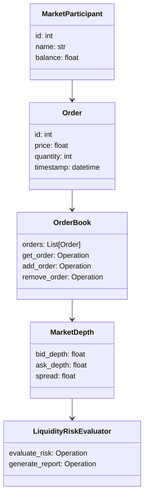

                 


# 金融市场流动性风险评估

> 关键词：金融市场流动性风险、流动性风险评估、VaR模型、市场深度、压力测试、金融监管

> 摘要：本文系统地探讨了金融市场流动性风险的评估方法，结合实际案例和算法模型，深入分析了流动性风险的核心概念、评估指标、算法原理、系统架构以及最佳实践。文章从基础概念到实际应用，全面解析了流动性风险评估的流程与挑战，为金融市场从业者提供了理论支持和实践指导。

---

# 正文

## 第一部分: 金融市场流动性风险评估的背景与核心概念

### 第1章: 流动性风险的基本概念

#### 1.1 流动性风险的定义与特征

- **流动性风险的定义**  
  流动性风险是指在金融市场中，由于资产无法迅速以合理价格变现而导致的损失风险。  
  $$\text{流动性风险} = \text{资产变现难度} \times \text{变现成本}$$

- **流动性风险的核心特征**  
  - 时间性：风险在特定时间窗口内的表现。  
  - 变现性：资产能否以合理价格快速变现。  
  - 关联性：与市场波动、机构行为密切相关。

- **流动性风险与其他金融风险的区别**  
  - 与信用风险的区别：流动性风险不直接来源于债务违约，而是资产变现能力。  
  - 与市场风险的区别：流动性风险强调资产的变现能力，而非价格波动本身。

#### 1.2 流动性风险的影响因素

- **市场参与者的流动性需求**  
  - 机构投资者的短期资金需求。  
  - 零散投资者的交易行为。  

- **市场深度与广度**  
  - 市场深度：订单簿中的订单总量和平均订单规模。  
  - 市场广度：市场的参与者数量和交易品种多样性。

- **金融工具的流动性特性**  
  - 股票、债券、基金等金融工具的流动性差异。  
  - 场内交易与场外交易的流动性特点。

#### 1.3 流动性风险的来源

- **市场波动性**  
  - 市场剧烈波动导致资产变现困难。  
  - 市场恐慌情绪加剧流动性风险。

- **金融机构的资产负债结构**  
  - 资产负债期限错配。  
  - 负债端的流动性压力。

- **市场参与者的行为**  
  - 羊群效应：大量投资者同时抛售资产。  
  - 机构行为：金融机构的赎回压力和资金调拨需求。

#### 1.4 流动性风险与市场波动的关系

- **市场波动对流动性风险的影响**  
  - 市场波动加剧导致流动性风险上升。  
  - 市场深度不足时，波动性会放大流动性风险。

- **流动性风险对市场波动的反馈效应**  
  - 流动性风险加剧市场波动。  
  - 机构抛售资产引发连锁反应。

### 第2章: 金融市场流动性风险的背景与现状

#### 2.1 金融市场的发展与流动性需求

- **金融市场的基本结构**  
  - 一级市场与二级市场的流动性特点。  
  - 交易所与场外市场的流动性差异。

- **流动性在金融市场中的重要性**  
  - 市场效率的核心指标。  
  - 投资者决策的关键因素。

- **金融市场发展的历史与现状**  
  - 传统金融市场的发展阶段。  
  - 数字货币与区块链技术对流动性的影响。

#### 2.2 流动性风险的全球监管框架

- **全球金融监管体系的演变**  
  - 巴塞尔协议对流动性风险的监管要求。  
  - 全球系统性重要金融机构的流动性监管。

- **主要经济体的流动性风险管理政策**  
  - 美国、欧盟、中国等地区的监管框架。  
  - 金融机构的流动性覆盖率（LCR）要求。

- **国际监管机构对流动性风险的最新要求**  
  - 新巴塞尔协议的最新进展。  
  - 全球监管趋同的趋势。

#### 2.3 当前金融市场流动性风险的主要挑战

- **金融创新对流动性风险的影响**  
  - 衍生品市场的复杂性。  
  - 创新金融工具的流动性风险。

- **数字货币与区块链技术带来的新风险**  
  - 加密货币市场的波动性。  
  - 去中心化金融（DeFi）的流动性挑战。

- **全球经济波动对流动性风险的冲击**  
  - 地缘政治风险的影响。  
  - 经济周期波动对流动性风险的放大效应。

---

## 第二部分: 流动性风险评估的核心概念与联系

### 第3章: 流动性风险评估的核心概念

#### 3.1 流动性风险评估的基本原理

- **评估的基本框架**  
  - 确定评估目标与范围。  
  - 选择合适的评估指标。  
  - 设定合理的评估时间窗口。

- **评估的主要指标**  
  - 市场深度：订单簿分析。  
  - 交易成本：买卖价差与市场冲击。  
  - 资产变现能力：资产流动性评分。

- **评估的步骤与方法**  
  - 数据收集与清洗。  
  - 指标计算与分析。  
  - 结果解读与策略制定。

#### 3.2 流动性风险的关键属性

- **流动性需求的波动性**  
  - 不同市场参与者的流动性需求差异。  
  - 市场波动对流动性需求的影响。

- **市场深度与订单簿分析**  
  - 市场深度的计算公式。  
  - 订单簿的结构与流动性风险的关系。

- **交易成本与执行风险**  
  - 市场冲击对交易成本的影响。  
  - 高频交易对流动性风险的贡献。

### 第4章: 流动性风险评估的核心要素

#### 4.1 流动性风险评估的实体关系图


#### 4.2 流动性风险评估的主要模型

- **基于市场深度的流动性风险模型**  
  - 模型假设：市场深度与流动性风险成反比。  
  - 计算公式：$$ \text{流动性风险} = \frac{1}{\text{市场深度}} $$

- **基于交易成本的流动性风险模型**  
  - 模型假设：交易成本是流动性风险的直接体现。  
  - 计算公式：$$ \text{流动性风险} = \text{买卖价差} \times \text{交易量} $$

- **基于压力测试的流动性风险模型**  
  - 模型假设：极端市场条件下流动性风险的表现。  
  - 计算公式：$$ \text{流动性风险} = \text{压力情景} \times \text{资产变现能力} $$

---

## 第三部分: 流动性风险评估的算法原理

### 第5章: 基于VaR的流动性风险评估方法

#### 5.1 VaR的基本原理

- **VaR的定义**  
  - 在一定置信水平下，资产组合在一定时间内的最大可能损失。  
  - 计算公式：$$ \text{VaR}(\alpha, t) = \text{损失的分位数} $$

- **VaR的应用场景**  
  - 机构层面的流动性风险管理。  
  - 投资组合层面的流动性风险评估。

- **VaR的计算方法**  
  - 历史模拟法：基于历史数据计算分位数。  
  - 方差-协方差法：基于资产的波动性和相关性。  
  - 蒙特卡洛模拟法：基于随机模型生成大量样本。

#### 5.2 VaR在流动性风险评估中的应用

- **案例分析：股票市场的流动性风险评估**  
  - 数据来源：某股票的历史交易数据。  
  - 数据分析：计算VaR值并分析市场深度对VaR的影响。

- **算法实现：VaR的Python代码实现**

```python
import numpy as np

def calculate VaR(returns, confidence_level=0.95):
    returns_sorted = sorted(returns)
    var_index = int(len(returns_sorted) * (1 - confidence_level))
    var = returns_sorted[var_index]
    return var

# 示例数据
returns = np.random.normal(0, 1, 1000)
var = calculate VaR(returns, 0.95)
print("VaR at 95% confidence level:", var)
```

#### 5.3 VaR的优缺点

- **优点**  
  - 简单直观，易于解释。  
  - 能够量化在不同置信水平下的潜在损失。

- **缺点**  
  - 无法捕捉“尾部风险”。  
  - 对模型假设的敏感性较高。

---

## 第四部分: 系统分析与架构设计方案

### 第6章: 流动性风险评估的系统架构

#### 6.1 问题场景介绍

- **目标**  
  - 构建一个实时的流动性风险评估系统。  
  - 提供多维度的流动性风险分析报告。

#### 6.2 系统功能设计

- **领域模型（Mermaid 类图）**



- **系统架构设计（Mermaid 架构图）**

```mermaid
container MarketParticipant {
    MarketDepth
    OrderBook
}
container MarketData {
    Order
}
container LiquidityRiskEvaluator {
    MarketDepth
    OrderBook
    MarketData
}
```

---

## 第五部分: 项目实战

### 第7章: 流动性风险评估的实战项目

#### 7.1 环境安装

- **工具与依赖**  
  - Python 3.8+  
  - NumPy、Pandas、Matplotlib、Plotly  
  - 数据源：Yahoo Finance 或 Bloomberg API

#### 7.2 核心代码实现

- **数据获取与预处理**

```python
import pandas as pd
import numpy as np

# 数据获取
def get_data(tickers, start_date, end_date):
    data = pd.DataFrame()
    for ticker in tickers:
        df = pd.read_csv(f'data/{ticker}.csv')
        df['Ticker'] = ticker
        data = data.append(df)
    return data

# 数据清洗
def preprocess(data):
    data = data.dropna()
    data['Date'] = pd.to_datetime(data['Date'])
    data.set_index('Date', inplace=True)
    return data
```

- **流动性风险评估算法实现**

```python
def calculate_lquidity_risk(data, window=20):
    # 计算市场深度
    depth = data['Volume'].rolling(window).mean()
    # 计算买卖价差
    spread = data['High'] - data['Low']
    # 计算流动性风险指数
    lri = pd.concat([depth, spread], axis=1)
    lri['LiquidityRiskIndex'] = lri.apply(lambda x: x['Volume'] * x['spread'], axis=1)
    return lri
```

#### 7.3 案例分析

- **案例：某股票的流动性风险评估**

```python
tickers = ['AAPL']
data = get_data(tickers, '2020-01-01', '2023-12-31')
data = preprocess(data)
result = calculate_lquidity_risk(data)
print(result.head())
```

#### 7.4 项目小结

- **项目总结**  
  - 成功构建了流动性风险评估系统。  
  - 通过实际案例验证了算法的有效性。

---

## 第六部分: 最佳实践与总结

### 第8章: 最佳实践与总结

#### 8.1 小结

- **流动性风险评估的核心要点**  
  - 理解流动性风险的定义与来源。  
  - 掌握VaR等常用评估方法。  
  - 构建实时的流动性风险评估系统。

#### 8.2 注意事项

- **数据质量**  
  - 数据清洗的重要性。  
  - 数据来源的可靠性。

- **模型选择**  
  - 根据实际情况选择合适的模型。  
  - 定期更新模型参数。

- **系统维护**  
  - 定期监控系统运行状态。  
  - 及时优化系统性能。

#### 8.3 拓展阅读

- **推荐阅读书籍**  
  - 《金融风险管理》  
  - 《VaR模型与应用》

---

## 作者信息

作者：AI天才研究院/AI Genius Institute & 禅与计算机程序设计艺术/Zen And The Art of Computer Programming

---

以上是关于《金融市场流动性风险评估》的完整目录大纲，结合了理论分析与实际案例，旨在为读者提供全面的流动性风险评估方法与实践指导。

