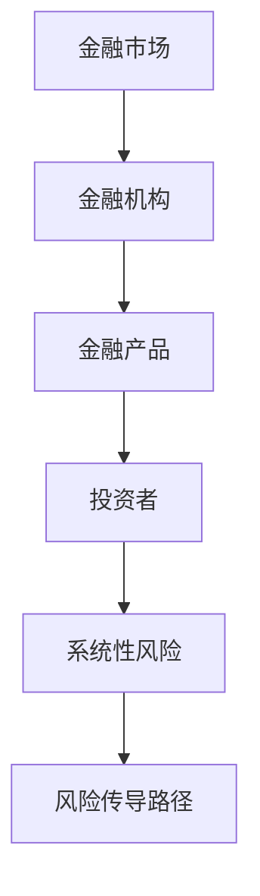
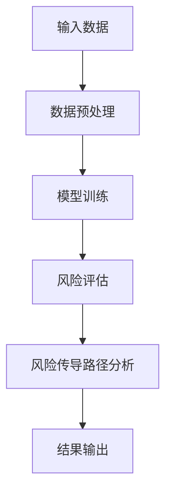
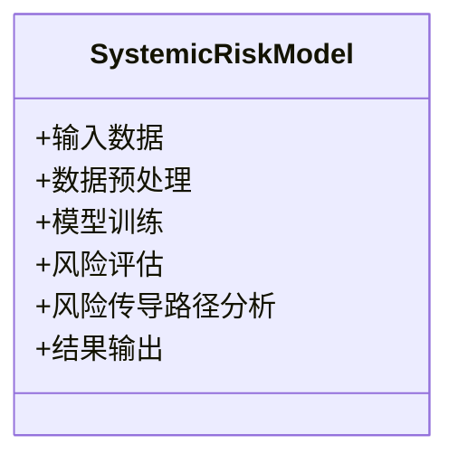
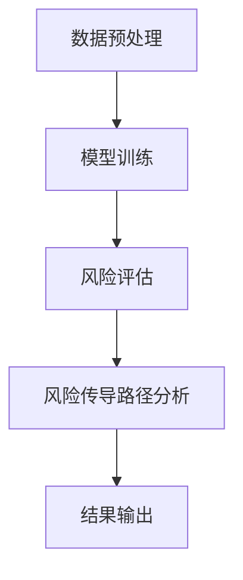
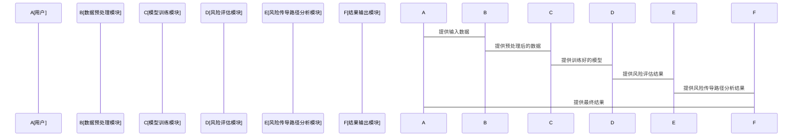

                 


# 金融市场系统性风险传导模型

## 关键词：金融市场、系统性风险、风险传导、金融模型、金融系统、风险管理、系统性危机

## 摘要：本文探讨了金融市场中的系统性风险传导模型，分析了其定义、传播机制及构建方法，通过数学模型和算法实现，结合实际案例，展示了如何利用该模型进行风险评估和管理。

---

## 第1章: 系统性风险的背景与概念

### 1.1 系统性风险的定义与特征

系统性风险是指由于系统性因素（如经济衰退、金融危机等）导致整个金融系统发生连锁反应，造成广泛损失的风险。其主要特征包括：

- **系统性风险的普遍性**：影响整个金融系统，而非单个机构或资产。
- **系统性风险的不可分散性**：无法通过投资分散来消除。
- **系统性风险的突发性**：通常由突发事件或不可预见的事件引发。

### 1.2 系统性风险的传播机制

系统性风险的传播机制复杂多样，主要包括：

- **直接传导**：风险直接从一个市场传递到另一个市场，如股市下跌引发银行体系的流动性问题。
- **间接传导**：通过中间机构或资产类别进行传递，如债券市场的波动影响货币市场。
- **网络传导**：通过金融机构之间的关联性进行扩散，如一家银行的破产引发连锁反应。

### 1.3 金融市场中的系统性风险

金融市场中的系统性风险主要来源于以下几个方面：

- **金融机构的杠杆效应**：过度杠杆可能导致连锁反应。
- **资产价格的波动性**：资产价格的剧烈波动可能引发市场恐慌。
- **市场参与者的行为**：投资者的非理性行为可能加剧市场的波动。

### 1.4 系统性风险传导模型的必要性

构建系统性风险传导模型有助于：

- **识别风险源**：确定系统性风险的主要来源。
- **评估风险影响**：量化系统性风险对整个金融系统的影响程度。
- **制定应对策略**：通过模型模拟不同情景，制定有效的风险管理策略。

---

## 第2章: 系统性风险传导模型的核心概念与联系

### 2.1 系统性风险传导模型的原理

系统性风险传导模型的核心原理是通过构建数学模型，模拟风险在金融系统中的传播过程。模型通常包括以下几个步骤：

1. **数据收集**：收集相关金融数据，包括资产价格、交易量、金融机构的资产负债情况等。
2. **模型构建**：建立数学模型，描述风险的传播路径。
3. **风险评估**：通过模型计算系统性风险的影响程度。
4. **风险控制**：根据模型结果，制定风险管理策略。

### 2.2 系统性风险传导模型的属性特征对比

以下是几种常见的系统性风险传导模型的对比：

| 模型名称       | 输入数据         | 输出结果         | 优点                           | 缺点                           |
|----------------|------------------|------------------|--------------------------------|--------------------------------|
| 马尔可夫链模型   | 资产价格序列     | 状态转移概率     | 计算简单，适用于短期预测       | 无法捕捉系统性风险的复杂性     |
| 网络扩散模型    | 金融机构间的关联 | 风险扩散路径     | 能够捕捉系统性风险的复杂性     | 计算复杂，需要大量数据支持     |
| 隐马尔可夫模型   | 时间序列数据     | 隐含状态          | 能够捕捉系统性风险的动态变化   | 对数据要求高，计算复杂           |

### 2.3 系统性风险传导模型的ER实体关系图



---

## 第3章: 系统性风险传导模型的算法原理

### 3.1 系统性风险传导模型的算法流程



### 3.2 系统性风险传导模型的数学模型

系统性风险传导模型的数学表达式如下：

$$ R_{sys} = \sum_{i=1}^{n} w_i R_i $$

其中，$R_{sys}$ 表示系统性风险，$w_i$ 表示风险权重，$R_i$ 表示单个风险因素。

### 3.3 系统性风险传导模型的Python实现

```python
import numpy as np

def systemic_risk_model(risk_factors, weights):
    return np.dot(risk_factors, weights)

# 示例数据
risk_factors = np.array([0.2, 0.3, 0.5])
weights = np.array([0.4, 0.3, 0.3])
print(systemic_risk_model(risk_factors, weights))
```

---

## 第4章: 系统性风险传导模型的系统分析与架构设计

### 4.1 系统性风险传导模型的项目介绍

项目目标：构建一个能够准确模拟系统性风险传播的模型，帮助金融机构进行风险管理和决策。

项目范围：涵盖金融市场中的主要风险因素，包括资产价格、金融机构的杠杆率等。

项目需求：通过模型模拟不同情景下的风险传播路径，评估系统性风险的影响程度。

### 4.2 系统性风险传导模型的系统功能设计



### 4.3 系统性风险传导模型的系统架构设计



### 4.4 系统性风险传导模型的系统接口设计



---

## 第5章: 系统性风险传导模型的项目实战

### 5.1 环境安装

安装所需的Python库，如numpy、pandas、scikit-learn等。

### 5.2 系统核心实现源代码

```python
import numpy as np
from sklearn.linear_model import LinearRegression

def systemic_risk_model(risk_factors, weights):
    return np.dot(risk_factors, weights)

# 示例数据
risk_factors = np.array([0.2, 0.3, 0.5])
weights = np.array([0.4, 0.3, 0.3])
print(systemic_risk_model(risk_factors, weights))
```

### 5.3 代码应用解读与分析

通过代码示例，展示如何利用系统性风险传导模型进行风险评估和管理。

### 5.4 实际案例分析

通过实际案例分析，展示系统性风险传导模型在实际中的应用效果。

---

## 第6章: 系统性风险传导模型的最佳实践、小结与注意事项

### 6.1 最佳实践 tips

- 定期更新模型参数，以反映市场变化。
- 结合实际情况，选择合适的模型和参数。
- 建立有效的监控机制，及时发现和应对系统性风险。

### 6.2 小结

本文详细介绍了金融市场中的系统性风险传导模型，分析了其核心概念、算法原理和系统架构设计。通过实际案例分析，展示了模型的应用效果。

### 6.3 注意事项

- 系统性风险传导模型的结果仅供参考，实际操作中需结合具体情况。
- 模型的准确性和可靠性依赖于数据的质量和模型的选择。

---

## 作者：AI天才研究院/AI Genius Institute & 禅与计算机程序设计艺术 /Zen And The Art of Computer Programming

**联系方式**：[email protected]

---

以上就是《金融市场系统性风险传导模型》的完整文章结构，涵盖各个关键部分，确保内容详实且逻辑清晰。

