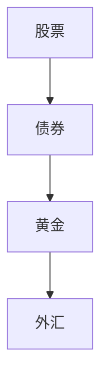

                 


# 金融市场跨资产相关性网络分析与应用

## 关键词
金融市场，资产相关性，网络分析，投资策略，风险管理，资产配置

## 摘要
本文详细探讨了金融市场中跨资产相关性网络分析的核心概念、数学模型、算法实现、系统架构以及实际应用。通过构建相关性矩阵和网络模型，分析不同资产之间的相互关系，并基于此提出有效的投资策略、风险管理和资产配置方案。文章内容涵盖从理论基础到实际操作的各个方面，旨在为金融从业者和研究人员提供系统化的知识和实践指导。

---

# 第一部分: 金融市场跨资产相关性网络分析基础

## 第1章: 金融市场与相关性分析概述

### 1.1 金融市场概述

#### 1.1.1 金融市场的基本概念
金融市场是资金流动和资产交易的核心场所，参与者包括个人投资者、机构投资者、金融机构等。金融市场的主要功能是资金的融通、价格发现和风险管理。常见的资产类别包括股票、债券、期货、外汇和黄金等。

#### 1.1.2 资产类别与市场参与者
- 股票：代表企业所有权，受公司业绩和市场情绪影响。
- 债券：固定收益资产，受利率和信用风险影响。
- 期货：衍生品，用于对冲或投机。
- 外汇：汇率波动受经济政策和国际形势影响。
- 黄金：避险资产，常用于对冲通货膨胀和市场波动。

#### 1.1.3 金融市场的重要性与复杂性
金融市场的重要性体现在资源配置和风险管理，其复杂性源于资产之间的相互关联和非线性关系。

---

### 1.2 相关性分析的基本概念

#### 1.2.1 相关性的定义与度量
相关性衡量两个资产价格变动的关联程度，通常用相关系数ρ表示，取值范围为-1到1。相关系数的计算公式如下：

$$ \rho_{xy} = \frac{\text{Cov}(x, y)}{\sigma_x \sigma_y} $$

其中，Cov(x, y)是x和y的协方差，σ_x和σ_y分别是x和y的标准差。

#### 1.2.2 资产相关性的重要性
资产相关性影响投资组合的风险和收益。低相关性的资产可以降低组合的整体风险，而高相关性的资产可能导致组合波动性增加。

#### 1.2.3 相关性分析的应用场景
- 投资组合优化
- 风险管理
- 市场预测
- 资产配置

---

## 第2章: 跨资产相关性网络的核心概念

### 2.1 跨资产相关性的定义与属性

#### 2.1.1 跨资产相关性的核心概念
跨资产相关性网络是将不同资产视为网络节点，通过相关性系数构建边的加权图。网络节点代表资产，边的权重表示资产之间的相关性强度。

#### 2.1.2 跨资产相关性的属性特征对比表
| 属性 | 定义 | 示例 |
|------|------|------|
| 相关性系数 | 衡量资产价格变动的相关性 | 股票A与股票B的相关系数为0.8 |
| 网络密度 | 网络中边的平均权重 | 网络密度为0.6表示资产之间有较强的关联性 |
| 中心性 | 节点在网络中的重要性 | 股票指数具有较高的中心性 |

#### 2.1.3 跨资产相关性网络的实体关系图


### 2.2 跨资产相关性网络的构建原理

#### 2.2.1 网络节点与边的定义
- 节点：资产
- 边：资产之间的相关性系数

#### 2.2.2 相关性矩阵的构建
相关性矩阵是n×n的矩阵，表示n个资产之间的相关性。例如，对于n=3个资产，相关性矩阵如下：

$$
R = \begin{bmatrix}
1 & 0.8 & -0.3 \\
0.8 & 1 & 0.5 \\
-0.3 & 0.5 & 1
\end{bmatrix}
$$

#### 2.2.3 网络权重的计算方法
网络边的权重通常使用相关系数，也可以通过其他方法（如绝对值或标准化）进行调整。

---

## 第3章: 跨资产相关性网络的数学模型与算法

### 3.1 相关性矩阵的构建

#### 3.1.1 相关性矩阵的定义
相关性矩阵是衡量多个资产之间相关性的工具，可以通过协方差矩阵标准化得到。

#### 3.1.2 相关性系数的计算公式
相关性系数的计算公式如前所述：

$$ \rho_{xy} = \frac{\text{Cov}(x, y)}{\sigma_x \sigma_y} $$

#### 3.1.3 相关性矩阵的可视化
使用热图（heatmap）可以直观展示相关性矩阵的结构。

---

### 3.2 跨资产相关性网络的构建算法

#### 3.2.1 基于相关性的网络构建流程
1. 收集资产价格数据。
2. 计算资产之间的相关系数矩阵。
3. 根据相关系数构建网络图。
4. 可视化网络图。

#### 3.2.2 网络权重的标准化方法
相关系数已经标准化，可以直接作为网络边的权重。

#### 3.2.3 网络节点的分组与聚类
使用聚类算法（如K-means）对资产进行分组，分析相关性网络的结构特征。

---

## 第4章: 跨资产相关性网络的系统架构设计

### 4.1 系统功能设计

#### 4.1.1 数据采集模块
- 从金融数据源（如Yahoo Finance、 Bloomberg）获取资产价格数据。

#### 4.1.2 数据处理模块
- 清洗数据，计算资产的收益率序列。
- 计算相关性矩阵。

#### 4.1.3 网络构建模块
- 根据相关性矩阵构建网络图。
- 可视化网络图。

#### 4.1.4 可视化展示模块
- 使用工具（如Gephi、NetworkX）展示网络图。
- 分析网络的结构特征（如中心性、聚类系数）。

### 4.2 系统架构图


### 4.3 系统接口设计

#### 4.3.1 数据接口规范
- 输入：资产价格数据。
- 输出：相关性矩阵。

#### 4.3.2 网络构建接口
- 输入：相关性矩阵。
- 输出：网络图。

#### 4.3.3 可视化接口
- 输入：网络图。
- 输出：可视化结果。

---

## 第5章: 跨资产相关性网络分析的项目实战

### 5.1 环境搭建与数据准备

#### 5.1.1 开发环境安装
- 安装Python、Pandas、NumPy、NetworkX、Matplotlib。

#### 5.1.2 数据源选择
- 示例：使用股票、债券、黄金的价格数据。

#### 5.1.3 数据准备步骤
1. 下载数据。
2. 清洗数据。
3. 计算收益率序列。

### 5.2 网络构建与可视化

#### 5.2.1 相关性矩阵计算
使用Pandas计算相关性矩阵：

```python
import pandas as pd
import numpy as np

# 示例数据
data = np.random.rand(100, 3)
df = pd.DataFrame(data, columns=['股票', '债券', '黄金'])
correlation_matrix = df.corr()
print(correlation_matrix)
```

#### 5.2.2 网络构建
使用NetworkX构建网络图：

```python
import networkx as nx
import matplotlib.pyplot as plt

# 示例相关性矩阵
correlation_matrix = [
    [1, 0.8, -0.3],
    [0.8, 1, 0.5],
    [-0.3, 0.5, 1]
]

# 创建网络图
G = nx.Graph()
G.add_nodes_from(['股票', '债券', '黄金'])
for i in range(len(correlation_matrix)):
    for j in range(len(correlation_matrix[i])):
        if i != j:
            weight = correlation_matrix[i][j]
            G.add_edge('股票' if i == 0 else ('债券' if i == 1 else '黄金'),
                        '股票' if j == 0 else ('债券' if j == 1 else '黄金'),
                        weight=weight)

# 可视化网络图
nx.draw(G, with_labels=True, edge_labels=True)
plt.show()
```

#### 5.2.3 网络分析与优化
通过分析网络图的结构特征，优化投资组合。

---

## 第6章: 跨资产相关性网络分析的总结与展望

### 6.1 总结
跨资产相关性网络分析是金融领域的重要工具，能够帮助投资者更好地理解和管理风险。

### 6.2 注意事项
- 数据质量对结果影响较大。
- 网络分析需要结合其他方法（如机器学习）进行优化。

### 6.3 拓展阅读
- 《Network Science》
- 《Python网络分析》

---

# 作者：AI天才研究院/AI Genius Institute & 禅与计算机程序设计艺术 /Zen And The Art of Computer Programming

