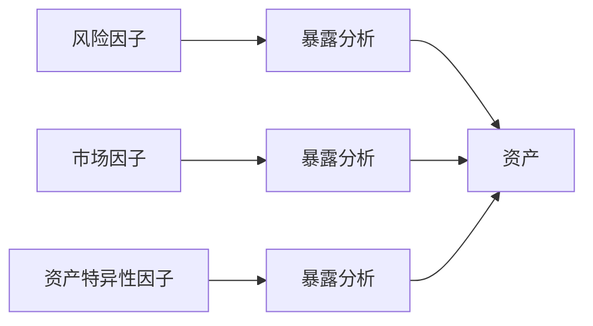
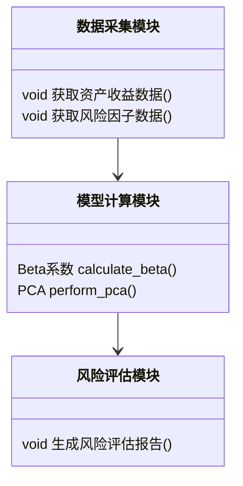
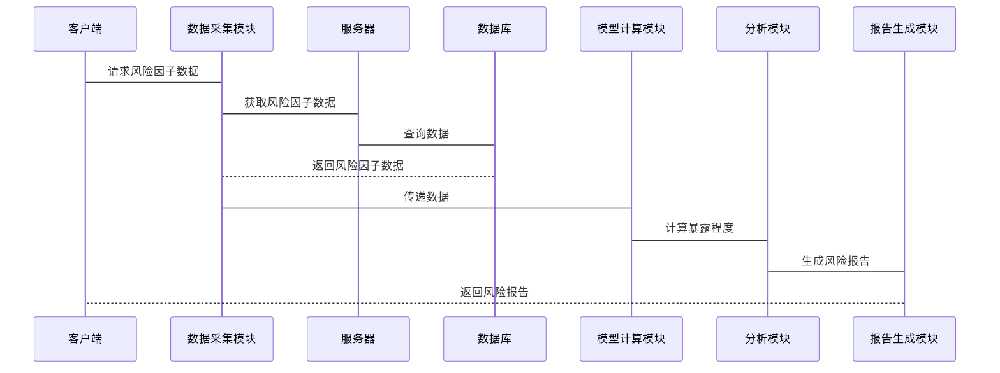

                 


# 金融市场风险因子暴露分析

> 关键词：风险因子、暴露分析、金融市场、风险管理、投资组合优化

> 摘要：本文深入探讨金融市场中风险因子暴露分析的核心概念、算法原理、系统架构及实际应用。通过理论分析与实战案例结合，帮助读者全面理解如何通过风险因子暴露分析优化投资组合，降低市场风险。

---

# 第一部分: 风险因子与暴露分析的背景介绍

## 第1章: 风险因子与暴露分析的背景介绍

### 1.1 风险因子的定义与分类

#### 1.1.1 风险因子的定义
风险因子是金融市场中影响资产价格波动的关键因素。这些因子可以是宏观经济指标（如GDP增长率、通货膨胀率）、市场情绪指标（如波动率指数）或资产特异性因素（如个股的流动性风险）。

#### 1.1.2 风险因子的分类
- **宏观经济因子**：如利率、汇率、通货膨胀率等。
- **市场因子**：如市场波动率、市值因子（Size）、价值因子（Value）等。
- **资产特异性因子**：如个股的信用风险、流动性风险等。

#### 1.1.3 风险因子的特征与属性
- **可量化性**：风险因子需要能够被量化，以便进行数学建模。
- **相关性**：不同风险因子之间可能存在相关性，影响其对资产价格的综合影响。
- **时间依赖性**：风险因子的影响可能随时间变化。

### 1.2 风险暴露分析的基本原理

#### 1.2.1 风险暴露的定义
风险暴露是指资产或投资组合对特定风险因子的敏感程度。它量化了当风险因子发生变化时，资产或投资组合可能受到的影响程度。

#### 1.2.2 风险暴露的度量方法
- **Beta系数**：衡量资产价格对市场波动的敏感性。
- **Value-at-Risk (VaR)**：在给定置信水平下，资产可能遭受的最大损失。
- **Conditional VaR (CVaR)**：在 VaR 基础上，考虑尾部风险的度量方法。

#### 1.2.3 风险暴露与风险因子的关系
风险暴露是风险因子与资产或投资组合之间关系的量化结果。通过分析不同风险因子的暴露程度，投资者可以更好地理解投资组合的风险来源。

### 1.3 风险因子暴露分析的意义与应用

#### 1.3.1 风险管理的重要性
在金融市场中，有效的风险管理是投资者实现长期收益目标的关键。通过风险因子暴露分析，投资者可以识别和量化潜在风险，制定相应的风险管理策略。

#### 1.3.2 风险因子暴露分析在金融决策中的作用
- **投资组合优化**：通过调整资产配置，降低对高风险因子的暴露。
- **风险定价**：根据风险因子的暴露程度，对资产进行合理定价。
- **风险预警**：识别潜在的高风险因子，提前采取应对措施。

#### 1.3.3 风险因子暴露分析的边界与外延
- **边界**：风险因子暴露分析仅考虑可量化因素，无法完全涵盖所有风险来源。
- **外延**：随着金融市场的复杂化，风险因子暴露分析需要结合机器学习等新技术，进一步拓展其应用范围。

---

## 第2章: 风险因子与暴露分析的核心概念

### 2.1 风险因子的属性特征对比

#### 2.1.1 风险因子的分类维度
- **时间维度**：短期风险因子与长期风险因子。
- **空间维度**：市场风险因子与资产特异性风险因子。
- **影响范围维度**：系统性风险因子与非系统性风险因子。

#### 2.1.2 不同风险因子的属性特征对比
| 风险因子类型 | 时间维度 | 空间维度 | 影响范围 |
|--------------|----------|----------|----------|
| 宏观经济因子 | 长期     | 全市场   | 系统性   |
| 市场因子     | 短期     | 全市场   | 系统性   |
| 资产特异性因子 | 短期     | 单一资产 | 非系统性 |

#### 2.1.3 风险因子的量化指标
- **Beta系数**：衡量资产对市场波动的敏感性。
- **波动率**：资产价格波动程度的量化指标。
- **相关系数**：资产之间协同波动的程度。

### 2.2 风险因子与暴露分析的实体关系图



---

## 第3章: 风险因子暴露分析的算法原理

### 3.1 风险因子暴露分析的核心算法

#### 3.1.1 多元回归分析


```python
import statsmodels.api as sm

def calculate_beta(risky_asset_returns, market_returns):
    model = sm.OLS(risky_asset_returns, sm.add_constant(market_returns))
    results = model.fit()
    return results.params[1]
```

#### 3.1.2 主成分分析（PCA）


```python
import numpy as np
from sklearn.decomposition import PCA

def perform_pca(covariance_matrix):
    pca = PCA(n_components=3)
    principal_components = pca.fit_transform(covariance_matrix)
    return principal_components
```

#### 3.1.3 其他相关算法简介
- **VaR 模型**：基于统计学的方法，计算资产在一定置信水平下的最大损失。
- **CVaR 模型**：在 VaR 基础上，进一步考虑尾部风险。

### 3.2 算法原理的数学模型与公式

#### 3.2.1 多元回归模型
$$ y = \beta_0 + \beta_1x_1 + \beta_2x_2 + ... + \beta_nx_n + \epsilon $$

其中：
- $y$ 是资产收益
- $x_i$ 是风险因子
- $\beta_i$ 是对应的风险因子暴露程度
- $\epsilon$ 是误差项

---

# 第四部分: 金融市场风险因子暴露分析的系统架构设计

## 第4章: 系统分析与架构设计方案

### 4.1 风险因子暴露分析系统功能设计

#### 4.1.1 功能模块
- 数据采集模块：获取资产收益数据和风险因子数据。
- 模型计算模块：计算各风险因子的暴露程度。
- 风险评估模块：生成风险评估报告。

#### 4.1.2 领域模型（Mermaid 类图）



### 4.2 系统架构设计（Mermaid 架构图）


### 4.3 接口设计（Mermaid 序列图）



---

## 第5章: 项目实战

### 5.1 项目环境安装

```bash
pip install numpy pandas statsmodels sklearn matplotlib
```

### 5.2 核心代码实现

#### 5.2.1 数据采集

```python
import pandas as pd

def load_data(file_path):
    return pd.read_csv(file_path)
```

#### 5.2.2 模型计算

```python
import numpy as np
from sklearn.decomposition import PCA

def calculate_exposure(asset_returns, factors_returns):
    model = PCA()
    exposures = model.fit_transform(asset_returns, factors_returns)
    return exposures
```

#### 5.2.3 风险评估

```python
import matplotlib.pyplot as plt

def visualize_exposures(exposures):
    plt.hist(exposures, bins=10)
    plt.xlabel('Exposure Value')
    plt.ylabel('Frequency')
    plt.title('Risk Factor Exposure Distribution')
    plt.show()
```

### 5.3 案例分析

#### 5.3.1 数据准备
假设我们有以下资产收益数据和风险因子数据：

| 日期 | 资产收益 | 市场因子 | 利率因子 | 汇率因子 |
|------|----------|----------|----------|----------|
| 2023-01-01 | 0.02 | 0.01 | 0.005 | 0.003 |
| 2023-01-02 | 0.01 | 0.015 | 0.008 | 0.002 |
| ... | ... | ... | ... | ... |

#### 5.3.2 模型计算
使用PCA计算各风险因子的暴露程度。

#### 5.3.3 结果分析
可视化风险因子的暴露分布，识别高风险因子。

---

## 第6章: 总结与展望

### 6.1 总结
本文详细探讨了金融市场风险因子暴露分析的核心概念、算法原理、系统架构及实际应用。通过理论分析与实战案例结合，帮助读者全面理解如何通过风险因子暴露分析优化投资组合，降低市场风险。

### 6.2 注意事项
- 数据质量对分析结果影响重大，需确保数据的准确性和完整性。
- 模型假设可能限制分析结果的适用性，需结合实际市场情况调整。

### 6.3 拓展阅读
- 《投资学》（书籍）
- 《金融工程中的风险管理》（书籍）
- 《风险中性定价》（论文）

---

作者：AI天才研究院/AI Genius Institute & 禅与计算机程序设计艺术 /Zen And The Art of Computer Programming

