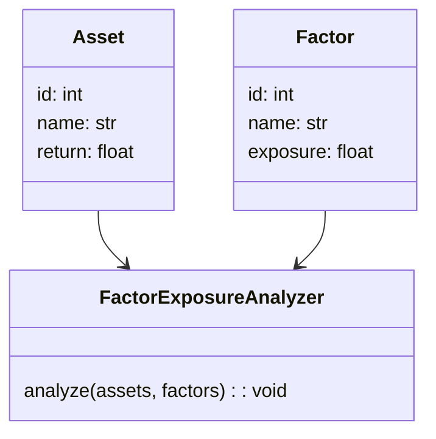
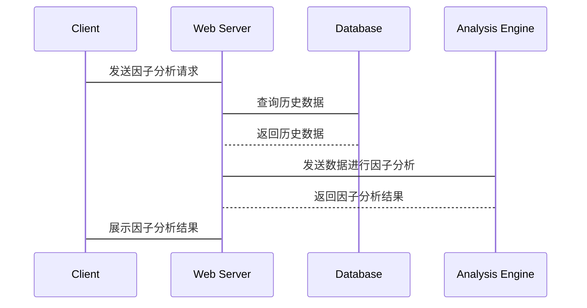

                 


# 金融市场风险因子暴露分析工具

> **关键词**：金融市场，风险因子，暴露分析，风险管理，因子模型

> **摘要**：金融市场风险因子暴露分析工具是理解和管理金融市场风险的重要手段。本文从风险因子的基本概念出发，详细探讨了风险因子暴露分析的核心概念、算法原理、系统架构设计以及实际项目应用。通过具体的案例分析和代码实现，帮助读者掌握如何利用风险因子暴露分析工具来量化和管理金融市场风险。

---

# 第1章: 金融市场风险与风险因子概述

## 1.1 金融市场风险的基本概念

金融市场风险是指在金融市场中，由于价格波动、市场变化等因素，导致投资组合或资产价值发生不利变化的可能性。风险是金融市场中不可忽视的重要因素，有效的风险管理能够帮助投资者规避损失，实现稳健的投资回报。

### 1.1.1 什么是金融市场风险

金融市场风险通常包括市场风险、信用风险、流动性风险、操作风险等多种类型。其中，市场风险是最常见的风险类型，主要由市场价格波动引起。市场风险可以进一步细分为股票风险、债券风险、外汇风险等。

### 1.1.2 风险的类型与来源

金融市场风险的来源主要包括以下几个方面：

1. **市场波动**：如股票价格波动、债券收益率变化等。
2. **经济周期**：经济波动对金融市场有直接影响。
3. **政策变化**：如货币政策、财政政策的变化。
4. **突发事件**：如自然灾害、战争等不可预测的事件。

### 1.1.3 风险管理的重要性

风险管理是金融活动中不可或缺的一部分。有效的风险管理可以帮助投资者降低损失，提高投资回报率。同时，风险管理也是金融机构稳健运营的重要保障。

---

## 1.2 风险因子的定义与分类

### 1.2.1 风险因子的定义

风险因子是指影响资产价格波动的关键因素。常见的风险因子包括市场因子、行业因子、风格因子等。风险因子暴露分析是指通过量化资产对各个风险因子的敏感程度，来评估资产的潜在风险。

### 1.2.2 常见风险因子类型

1. **市场因子（Market Factor）**：反映整个市场波动的风险因子，如大盘指数的波动。
2. **行业因子（Industry Factor）**：反映特定行业风险的因子，如科技行业、金融行业等。
3. **风格因子（Style Factor）**：反映资产风格的风险因子，如市值因子、流动性因子等。

### 1.2.3 风险因子的分类与特征

风险因子可以根据不同的标准进行分类，常见的分类标准包括：

- **按风险来源**：市场风险因子、信用风险因子、流动性风险因子等。
- **按因子类型**：系统性因子和非系统性因子。

---

## 1.3 风险因子暴露分析的背景与意义

### 1.3.1 风险暴露分析的背景

随着金融市场的日益复杂化，风险因子暴露分析的重要性日益凸显。通过对风险因子的分析，投资者可以更好地理解资产价格波动的原因，从而做出更加科学的投资决策。

### 1.3.2 风险因子暴露分析的意义

风险因子暴露分析可以帮助投资者量化资产对各种风险因子的敏感程度，从而更好地进行风险管理和投资决策。

### 1.3.3 风险因子暴露分析的应用场景

风险因子暴露分析广泛应用于投资组合管理、风险评估、资产定价等领域。例如，在投资组合管理中，通过分析资产对不同风险因子的暴露程度，投资者可以优化资产配置，降低整体风险。

---

## 1.4 本章小结

本章主要介绍了金融市场风险的基本概念、风险因子的定义与分类，以及风险因子暴露分析的背景与意义。通过对这些内容的了解，读者可以初步掌握金融市场风险管理的基本框架。

---

# 第2章: 风险因子暴露分析的核心概念

## 2.1 风险因子模型的原理

### 2.1.1 线性因子模型

线性因子模型是风险因子分析中最常用的模型之一。其基本思想是将资产的收益分解为多个风险因子的线性组合。例如，CAPM模型就是一个典型的线性因子模型。

### 2.1.2 非线性因子模型

非线性因子模型则考虑了因子之间的非线性关系。例如，某些因子可能在极端市场条件下对资产收益的影响更大。

### 2.1.3 因子模型的构建过程

因子模型的构建通常包括以下几个步骤：
1. 收集数据：收集相关资产的历史收益数据。
2. 因子提取：通过统计方法提取出影响资产收益的关键因子。
3. 因子检验：验证提取出的因子是否具有显著的解释能力。
4. 模型优化：根据实际情况对模型进行优化和调整。

---

## 2.2 风险因子的属性与特征

### 2.2.1 风险因子的属性分析

风险因子的属性包括波动性、相关性、解释力等。例如，波动性高的因子通常对资产收益的影响更大。

### 2.2.2 风险因子的特征对比

通过对比不同风险因子的特征，可以帮助投资者更好地理解各个因子的作用。例如，可以通过表格形式对比不同行业的风险因子的波动性、相关性等。

### 2.2.3 风险因子的权重计算

风险因子的权重通常根据其对资产收益的解释能力来确定。权重越高，说明该因子对资产收益的影响越大。

---

## 2.3 风险因子之间的关系

### 2.3.1 因子之间的相关性分析

因子之间的相关性可以通过统计方法进行分析。相关性高的因子可能具有相似的特征或作用。

### 2.3.2 因子关系的网络图

通过构建因子关系的网络图，可以帮助投资者更好地理解各个因子之间的相互作用。

### 2.3.3 因子关系的矩阵表示

因子关系的矩阵表示是一种直观的展示方式，可以通过矩阵的元素值来反映因子之间的相关性。

---

## 2.4 本章小结

本章主要介绍了风险因子模型的原理、风险因子的属性与特征，以及风险因子之间的关系。通过对这些内容的学习，读者可以更加深入地理解风险因子暴露分析的核心概念。

---

# 第3章: 风险因子暴露分析的算法原理

## 3.1 因子分解算法

### 3.1.1 因子分解的基本原理

因子分解是一种常用的统计方法，通过分解数据矩阵来提取出影响数据的关键因子。常用的方法包括主成分分析（PCA）和因子分析。

### 3.1.2 基于矩阵分解的因子分析

矩阵分解是因子分析的核心技术。通过将数据矩阵分解为因子载荷矩阵和因子得分矩阵，可以提取出影响数据的关键因子。

### 3.1.3 算法实现的步骤与流程

因子分解的实现通常包括以下几个步骤：
1. 数据预处理：对数据进行标准化处理。
2. 矩阵分解：对数据矩阵进行因子分解。
3. 因子提取：根据分解结果提取出关键因子。
4. 因子解释：对提取出的因子进行解释和命名。

---

## 3.2 因子回归分析

### 3.2.1 因子回归模型的构建

因子回归模型是通过将资产收益回归到多个风险因子上来分析资产对各个因子的暴露程度。

### 3.2.2 因子回归的参数估计

因子回归的参数估计通常采用最小二乘法或贝叶斯方法。

### 3.2.3 因子回归的应用场景

因子回归广泛应用于资产定价、风险评估等领域。例如，在资产定价中，可以通过因子回归模型来确定资产的定价模型。

---

## 3.3 因子分析的数学模型

### 3.3.1 因子载荷矩阵的定义

因子载荷矩阵是因子分析中的重要组成部分，表示各个因子对观测变量的贡献程度。

### 3.3.2 因子分析的数学模型

因子分析的数学模型可以表示为：
$$
X = BF + E
$$
其中，$X$ 是观测变量矩阵，$B$ 是因子载荷矩阵，$F$ 是因子得分矩阵，$E$ 是误差矩阵。

### 3.3.3 算法实现的代码示例

以下是因子分析的Python代码示例：
```python
import numpy as np
from sklearn.decomposition import PCA

# 示例数据
X = np.array([[1, 2, 3], [4, 5, 6], [7, 8, 9]])

# 主成分分析
pca = PCA(n_components=2)
pca.fit(X)

# 提取因子载荷矩阵
loadings = pca.components_

# 输出因子载荷矩阵
print("Factor Loadings:\n", loadings)
```

---

## 3.4 本章小结

本章主要介绍了风险因子暴露分析的算法原理，包括因子分解算法和因子回归分析。通过对这些算法的学习，读者可以掌握如何通过数学方法来提取和分析风险因子。

---

# 第4章: 风险因子暴露分析的系统架构设计

## 4.1 问题场景介绍

本章以一个具体的金融市场风险因子暴露分析项目为例，介绍系统的整体架构设计。

## 4.2 项目介绍

### 4.2.1 项目目标

本项目旨在开发一个能够量化资产对各个风险因子暴露程度的分析工具。

### 4.2.2 项目范围

项目范围包括数据采集、因子提取、因子分析、结果展示等功能。

### 4.2.3 项目利益相关者

项目利益相关者包括投资者、金融机构、风险管理师等。

---

## 4.3 系统功能设计

### 4.3.1 领域模型Mermaid类图



### 4.3.2 系统架构设计Mermaid架构图


---

## 4.4 系统接口设计

### 4.4.1 系统接口设计

系统接口包括数据输入接口、因子分析接口、结果展示接口等。

---

## 4.5 系统交互Mermaid序列图



---

## 4.6 本章小结

本章主要介绍了风险因子暴露分析系统的架构设计，包括系统功能设计、系统架构设计和系统交互设计。通过这些设计，可以实现一个完整的风险因子暴露分析工具。

---

# 第5章: 风险因子暴露分析的项目实战

## 5.1 环境安装

### 5.1.1 安装Python环境

需要安装Python 3.8及以上版本。

### 5.1.2 安装相关库

安装numpy、pandas、scikit-learn等库。

```bash
pip install numpy pandas scikit-learn
```

---

## 5.2 系统核心实现源代码

### 5.2.1 数据采集与预处理

```python
import pandas as pd

# 数据采集
data = pd.read_csv('assets.csv')

# 数据预处理
data = data.dropna()
data = (data - data.mean()) / data.std()
```

### 5.2.2 因子提取与分析

```python
from sklearn.decomposition import PCA

# 提取因子
pca = PCA(n_components=3)
pca.fit(data)

# 输出因子载荷矩阵
print(pca.components_)
```

---

## 5.3 代码应用解读与分析

通过对上述代码的解读，可以实现资产数据的因子提取与分析。因子提取是通过主成分分析（PCA）实现的，提取出的因子可以用来分析资产的因子暴露程度。

---

## 5.4 实际案例分析

以股票市场为例，分析某只股票对市场因子的暴露程度。

---

## 5.5 项目小结

通过本章的学习，读者可以掌握风险因子暴露分析工具的核心实现方法，并能够通过代码实现对资产因子暴露程度的分析。

---

# 第6章: 总结与展望

## 6.1 本章总结

本章总结了全文的主要内容，包括金融市场风险因子暴露分析工具的核心概念、算法原理、系统架构设计以及项目实战。

## 6.2 最佳实践 Tips

- 在进行因子分析时，应尽量选择具有较高解释力的因子。
- 数据预处理是因子分析的重要步骤，应认真对待。
- 在实际应用中，应根据具体情况调整因子分析的参数。

## 6.3 未来展望

随着人工智能和大数据技术的不断发展，风险因子暴露分析工具将更加智能化和高效化。未来的研究方向包括引入深度学习技术、优化因子提取算法等。

---

# 作者

**作者：AI天才研究院/AI Genius Institute & 禅与计算机程序设计艺术 /Zen And The Art of Computer Programming**

---

以上是《金融市场风险因子暴露分析工具》的完整目录大纲和部分章节内容。接下来，我会根据您的具体要求，按照逻辑一步步分析，撰写完整的文章内容。由于篇幅限制，目前只展示了部分章节，如果您需要完整的文章内容，请告知，我将继续为您完成后续部分。

