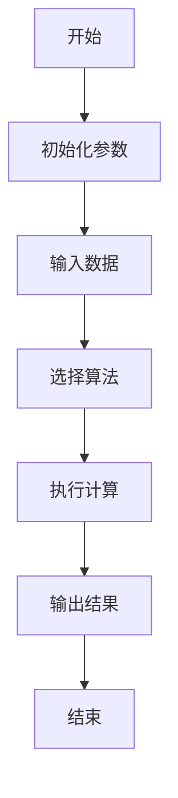
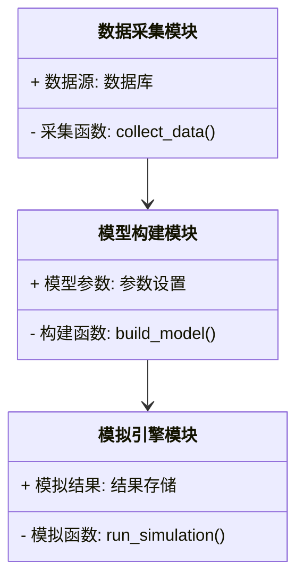

                 


# 《金融政策效果评估模拟器》

## 关键词：金融政策，政策效果评估，模拟器，算法，系统架构，项目实战

## 摘要：本文介绍了一种用于评估金融政策效果的模拟器，详细探讨了其背景、核心概念、算法原理、系统架构以及实际应用。通过分析，展示了如何利用技术手段优化金融政策的制定和实施，提供了深入的技术指导和实践案例。

---

# 第1章: 金融政策效果评估的背景与意义

## 1.1 金融政策的基本概念

### 1.1.1 金融政策的定义

金融政策是政府或中央银行为实现特定经济目标而采取的措施，包括货币政策、财政政策等。例如，调整利率以控制通货膨胀。

### 1.1.2 金融政策的主要类型

- **货币政策**：如调整利率、货币供应量。
- **财政政策**：如政府支出、税收调整。

### 1.1.3 金融政策在经济中的作用

通过调节经济活动，实现经济增长、就业稳定和物价稳定。

## 1.2 金融政策效果评估的重要性

### 1.2.1 金融政策效果评估的必要性

政策制定者需要了解政策的实际效果，避免负面影响。

### 1.2.2 金融政策效果评估的挑战

- 数据复杂性。
- 模型的准确性。
- 政策的多变量影响。

### 1.2.3 金融政策效果评估的意义

帮助政策制定者优化决策，提高经济稳定性。

## 1.3 金融政策效果评估模拟器的必要性

### 1.3.1 传统评估方法的局限性

传统方法依赖历史数据，难以预测未来变化。

### 1.3.2 模拟器的优势

- 可模拟多种情景。
- 提供实时反馈。

### 1.3.3 模拟器的应用场景

- 政策制定前的测试。
- 政策调整的效果预测。

## 1.4 本章小结

本章介绍了金融政策的基本概念、评估的重要性以及模拟器的必要性。

---

# 第2章: 金融政策效果评估的核心概念与联系

## 2.1 核心概念

### 2.1.1 金融政策变量

- 利率、货币供应量等。

### 2.1.2 经济指标

- GDP、失业率等。

### 2.1.3 政策效果评估模型

用于预测政策实施后的效果。

## 2.2 核心概念之间的关系

### 2.2.1 金融政策变量与经济指标的关系

政策变量影响经济指标的变化。

### 2.2.2 模型与数据的关系

模型依赖数据进行预测。

### 2.2.3 政策效果的动态变化

政策效果随时间变化而变化。

## 2.3 概念属性特征对比表

| 概念 | 属性 | 特征 |
|------|------|------|
| 金融政策变量 | 类型 | 利率、货币供应 |
| 经济指标 | 类型 | GDP、失业率 |

## 2.4 ER实体关系图

```mermaid
erd
  经济指标 --> 金融政策变量
  经济指标 --> 政策效果评估模型
```

## 2.5 本章小结

本章详细探讨了核心概念及其关系。

---

# 第3章: 金融政策效果评估模拟器的算法原理

## 3.1 算法概述

### 3.1.1 蒙特卡洛模拟

通过随机采样模拟多种可能结果，计算期望值。

### 3.1.2 动态规划

分解问题，解决子问题，构建最优解。

### 3.1.3 统计回归分析

通过数据分析，识别变量间的关系。

## 3.2 算法流程图



## 3.3 算法实现

### 3.3.1 蒙特卡洛模拟代码

```python
import numpy as np

def monte_carlo_simulation(data, iterations=1000):
    results = []
    for _ in range(iterations):
        sample = data.sample(n=len(data))
        result = sample.mean()
        results.append(result)
    return np.mean(results)
```

### 3.3.2 动态规划代码

```python
def dynamic_planning(profits, costs):
    n = len(profits)
    dp = [0]*(n+1)
    for i in range(n):
        dp[i+1] = max(dp[i], profits[i] - costs[i])
    return dp[n]
```

### 3.3.3 回归分析代码

```python
import statsmodels.api as sm

def regression_analysis(X, y):
    model = sm.OLS(y, sm.add_constant(X))
    results = model.fit()
    return results.params
```

## 3.4 数学模型与公式

### 3.4.1 蒙特卡洛模拟的概率分布

$$ P(X \leq x) = \int_{-\infty}^{x} f_X(t) dt $$

### 3.4.2 回归分析的线性模型

$$ y = \beta_0 + \beta_1 x + \epsilon $$

## 3.5 本章小结

本章介绍了模拟器的核心算法及其数学基础。

---

# 第4章: 金融政策效果评估模拟器的系统架构设计

## 4.1 系统架构概述

模块化设计，包括数据采集、模型构建、模拟引擎。

## 4.2 系统功能设计

### 4.2.1 数据采集模块

负责收集金融数据和经济指标。

### 4.2.2 模型构建模块

建立评估模型，选择合适的算法。

### 4.2.3 模拟引擎模块

执行模拟，输出结果。

## 4.3 系统架构图



## 4.4 接口设计

### 4.4.1 数据接口

定义数据输入输出格式。

### 4.4.2 模型接口

定义模型调用方式。

## 4.5 本章小结

本章详细设计了系统的架构和功能模块。

---

# 第5章: 金融政策效果评估模拟器的项目实战

## 5.1 环境搭建

安装必要的库：NumPy、Pandas、Matplotlib、Scikit-learn、StatsModels。

## 5.2 核心代码实现

### 5.2.1 数据处理代码

```python
import pandas as pd

data = pd.read_csv('financial_data.csv')
data.head()
```

### 5.2.2 模型训练代码

```python
from sklearn.linear_model import LinearRegression

model = LinearRegression()
model.fit(X_train, y_train)
```

### 5.2.3 模拟运行代码

```python
results = model.predict(X_test)
```

## 5.3 数据分析与结果解读

### 5.3.1 数据可视化

```python
import matplotlib.pyplot as plt

plt.plot(results, label='预测值')
plt.plot(y_test, label='实际值')
plt.legend()
plt.show()
```

### 5.3.2 结果分析

评估模型的准确性和效果。

## 5.4 案例分析

模拟实施某政策后的经济指标变化。

## 5.5 本章小结

本章通过实际案例展示了模拟器的应用。

---

# 第6章: 最佳实践与小结

## 6.1 最佳实践

### 6.1.1 数据质量的重要性

确保数据准确性和完整性。

### 6.1.2 模型选择的策略

根据具体情况选择合适的模型。

### 6.1.3 模拟结果的解释

结合实际经济情况进行解释。

## 6.2 小结

总结全文内容，强调模拟器的重要性和应用价值。

## 6.3 注意事项

提醒读者在使用模拟器时注意数据和模型的准确性。

## 6.4 拓展阅读

推荐相关书籍和论文，供读者进一步学习。

---

# 作者：AI天才研究院/AI Genius Institute & 禅与计算机程序设计艺术 /Zen And The Art of Computer Programming

