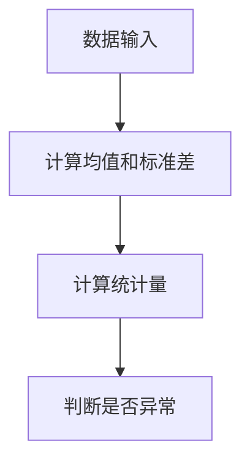
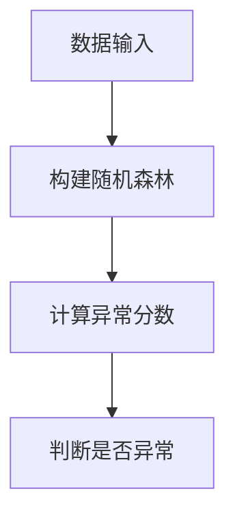
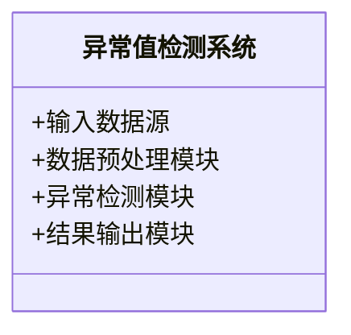
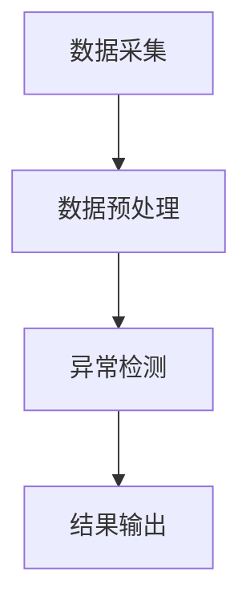

                 


```markdown
# 《金融数据异常值检测与处理系统》

## 关键词：金融数据，异常值，检测系统，机器学习，统计方法，深度学习

## 摘要：本文详细探讨了金融数据异常值检测与处理系统的设计与实现。从背景知识到核心算法，再到系统架构和项目实战，系统地分析了如何有效检测和处理金融数据中的异常值，帮助数据科学家和金融从业者提升数据质量，优化决策流程。

---

# 第一部分: 金融数据异常值检测与处理系统概述

## 第1章: 异常值检测的背景与问题描述

### 1.1 问题背景
#### 1.1.1 金融数据的特点
- 高频性：金融市场数据生成速度快，要求实时处理。
- 高维性：包含多种金融指标和市场数据。
- 非线性：金融数据常呈现复杂的非线性关系。

#### 1.1.2 异常值在金融数据中的重要性
- 异常值可能导致重大经济损失，如股票市场的异常交易。
- 异常值是识别市场操纵和欺诈行为的重要线索。
- 异常值影响数据建模的准确性，需及时处理。

#### 1.1.3 异常值检测的必要性
- 数据清洗：为后续分析提供高质量数据。
- 风险控制：及时发现异常交易或市场波动。
- 系统预警：提前识别潜在风险。

### 1.2 问题描述
#### 1.2.1 异常值的定义与分类
- 异常值定义：与整体数据分布显著不同的数据点。
- 分类：点异常、集体异常、上下文异常。

#### 1.2.2 金融数据异常值的典型场景
- 价格剧烈波动：如闪崩事件。
- 交易量突增：异常交易行为。
- 时间序列异常：偏离历史规律。

#### 1.2.3 异常值检测的目标与边界
- 目标：识别异常值并分类。
- 边界：区分正常波动与异常事件。

### 1.3 问题解决方法
#### 1.3.1 统计方法
- 使用均值、标准差等统计指标。
- 示例：Grubbs检验。

#### 1.3.2 机器学习方法
- 使用Isolation Forest等无监督算法。

#### 1.3.3 深度学习方法
- 使用LSTM识别时间序列异常。

---

## 第2章: 异常值检测的核心概念与联系

### 2.1 异常值检测的原理
#### 2.1.1 统计学原理
- 基于数据分布的偏离。

#### 2.1.2 机器学习原理
- 通过模型学习正常数据的分布。

#### 2.1.3 深度学习原理
- 捕捉复杂的数据模式。

### 2.2 异常值检测方法的对比
#### 2.2.1 基于统计的方法
- 优点：简单高效。
- 缺点：难以处理高维数据。

#### 2.2.2 基于机器学习的方法
- 优点：适用于复杂场景。
- 缺点：计算资源消耗大。

#### 2.2.3 基于深度学习的方法
- 优点：捕捉复杂模式。
- 缺点：训练时间长。

### 2.3 实体关系图
```mermaid
er
    entity 异常值检测系统 {
        <属性> 数据源
        <属性> 数据预处理
        <属性> 检测算法
        <属性> 结果输出
    }
```

### 2.4 本章小结

---

## 第3章: 异常值检测算法原理

### 3.1 统计学方法
#### 3.1.1 Grubbs检验


#### 3.1.2 Z-score方法
$$ Z = \frac{x - \mu}{\sigma} $$

### 3.2 机器学习方法
#### 3.2.1 Isolation Forest


### 3.3 深度学习方法
#### 3.3.1 LSTM网络
- 示例：时间序列异常检测。

### 3.4 本章小结

---

## 第4章: 系统分析与架构设计

### 4.1 问题场景介绍
- 高频交易数据处理。

### 4.2 系统功能设计


### 4.3 系统架构设计


### 4.4 系统接口设计
- 输入接口：接收金融数据流。
- 输出接口：返回异常报告。

### 4.5 本章小结

---

## 第5章: 项目实战

### 5.1 环境安装
- Python 3.8+
- 必要库：numpy、pandas、scikit-learn。

### 5.2 核心实现
#### 5.2.1 数据预处理
```python
import pandas as pd

# 示例数据加载
data = pd.read_csv('financial_data.csv')
```

#### 5.2.2 异常检测实现
```python
from sklearn.ensemble import IsolationForest

model = IsolationForest()
model.fit(data)
outliers = model.predict(data)
```

### 5.3 案例分析
- 使用Grubbs检验识别异常交易。

### 5.4 本章小结

---

## 第6章: 最佳实践与总结

### 6.1 小结
- 统计方法适用于简单场景。
- 机器学习方法适合复杂场景。

### 6.2 注意事项
- 数据预处理至关重要。
- 结果需结合业务背景解释。

### 6.3 拓展阅读
- 异常值检测的最新研究进展。

---

## 作者：AI天才研究院/AI Genius Institute & 禅与计算机程序设计艺术 /Zen And The Art of Computer Programming
```

