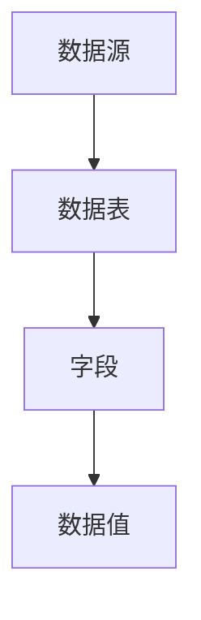
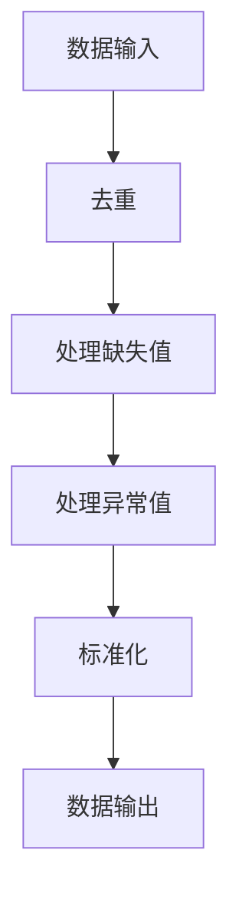
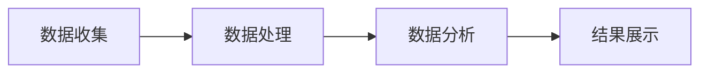
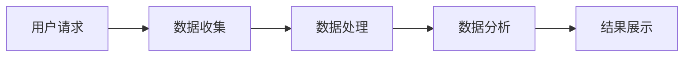

                 


# 金融数据收集与处理

> 关键词：金融数据，数据收集，数据处理，数据分析，数据清洗，数据挖掘

> 摘要：本文深入探讨了金融数据收集与处理的关键问题，包括数据来源、处理方法、算法实现以及系统架构设计。通过实际案例和代码示例，详细介绍了如何高效地收集、清洗和分析金融数据，为金融领域的决策提供支持。

---

# 第1章: 金融数据收集与处理的背景介绍

## 1.1 问题背景

### 1.1.1 金融数据的重要性

在金融领域，数据是决策的核心。股票价格、市场趋势、交易记录等数据为投资者、交易员和分析师提供了关键的信息。然而，金融数据的复杂性和多样性使得数据的收集与处理变得极具挑战性。

### 1.1.2 数据收集与处理的挑战

金融数据的来源广泛，包括实时市场数据、历史交易数据、新闻资讯等。这些数据往往存在格式不统一、缺失值多、异常值多等问题，增加了数据处理的难度。

### 1.1.3 金融数据分析的现状与趋势

随着大数据技术的发展，金融数据分析从传统的统计分析逐渐转向机器学习和人工智能的应用。实时数据分析和预测成为金融领域的热门方向。

### 1.1.4 数据收集与处理的目标

数据收集的目标是获取准确、完整的金融数据；数据处理的目标是清理数据、提取特征，为后续的分析提供高质量的数据支持。

### 1.1.5 边界与外延

金融数据的收集与处理通常局限于特定的时间范围和数据类型，但其外延可以扩展到风险管理、投资决策等多个领域。

---

## 1.2 核心概念与术语

### 1.2.1 数据源的分类

1. **实时数据**：如股票交易的实时报价。
2. **历史数据**：如过去几年的交易记录。
3. **外部数据**：如新闻、社交媒体数据。

### 1.2.2 数据格式的标准化

数据格式包括文本、CSV、JSON等，标准化是数据处理的第一步。

### 1.2.3 数据清洗的流程

数据清洗包括去重、处理缺失值、异常值等步骤，确保数据的完整性和准确性。

### 1.2.4 数据分析的层次结构

数据分析可以分为描述性分析、诊断性分析、预测性分析和规范性分析四个层次。

---

# 第2章: 数据收集与处理的核心概念

## 2.1 核心概念原理

### 2.1.1 数据源的分类与选择

选择合适的数据源是数据收集的第一步，需要考虑数据的准确性和实时性。

### 2.1.2 数据格式的标准化

标准化数据格式可以提高数据处理的效率，例如将文本数据转换为结构化的数据格式。

### 2.1.3 数据清洗的流程

数据清洗是数据预处理的关键步骤，包括去重、填充缺失值、处理异常值等。

---

## 2.2 核心概念属性对比

### 2.2.1 数据源的特征对比

| 数据源类型 | 特征                     |
|------------|--------------------------|
| 实时数据   | 高实时性、准确性         |
| 历史数据   | 时间跨度长、稳定性       |
| 外部数据   | 信息丰富、多样性         |

### 2.2.2 数据格式的优劣势分析

| 数据格式 | 优势             | 劣势             |
|----------|------------------|------------------|
| CSV      | 简单、通用         | 缺乏结构化信息     |
| JSON      | 结构清晰、易于解析   | 数据量大时解析效率低 |

### 2.2.3 数据清洗方法的对比

| 清洗方法   | 适用场景           |
|------------|--------------------|
| 去重       | 数据重复问题         |
| 填充缺失值 | 数据缺失问题         |
| 异常值处理 | 数据异常问题         |

---

## 2.3 ER实体关系图架构



---

# 第3章: 数据清洗算法原理

## 3.1 数据清洗算法流程



---

## 3.2 算法实现

### 3.2.1 Python代码实现

```python
import pandas as pd

def data_cleaning(data):
    # 去重
    data = data.drop_duplicates()
    # 处理缺失值
    data = data.fillna(0)
    # 处理异常值
    data = data[(data['value'] > -1000) & (data['value'] < 1000)]
    return data
```

---

## 3.3 数学模型与公式

### 3.3.1 缺失值填充

$$
\text{新值} = \frac{\sum \text{旧值}}{n}
$$

### 3.3.2 异常值检测

$$
Z = \frac{X - \mu}{\sigma}
$$

---

## 3.4 实例分析

通过一个实际案例，详细讲解如何使用上述算法清洗数据，并展示清洗前后的对比结果。

---

# 第4章: 数据特征提取与分析

## 4.1 数据特征提取方法

### 4.1.1 主成分分析（PCA）

PCA是一种降维技术，可以提取数据的主要特征。

### 4.1.2 线性判别分析（LDA）

LDA是一种分类技术，常用于特征提取。

---

## 4.2 PCA实现

### 4.2.1 PCA数学模型

$$
\text{主成分} = X \cdot P^T
$$

---

## 4.3 实例分析

通过实际数据，展示如何使用PCA提取主成分，并进行数据分析。

---

# 第5章: 系统分析与架构设计

## 5.1 问题场景介绍

### 5.1.1 项目介绍

一个金融数据分析系统的开发，旨在收集、处理和分析股票数据。

### 5.1.2 系统功能设计

1. 数据收集模块
2. 数据处理模块
3. 数据分析模块

---

## 5.2 系统架构设计

### 5.2.1 系统架构图



---

## 5.3 系统接口设计

### 5.3.1 接口设计

1. 数据收集接口：接收实时数据。
2. 数据处理接口：清洗数据。
3. 数据分析接口：进行预测分析。

---

## 5.4 系统交互流程



---

# 第6章: 项目实战

## 6.1 环境安装

安装必要的库，如Pandas、NumPy、Scikit-learn。

## 6.2 核心实现

### 6.2.1 数据收集

```python
import pandas as pd
import requests

def fetch_data(url):
    response = requests.get(url)
    data = pd.read_csv(response.content)
    return data
```

### 6.2.2 数据清洗

```python
def clean_data(data):
    data = data.dropna()
    return data
```

### 6.2.3 数据分析

```python
from sklearn.linear_model import LinearRegression

model = LinearRegression()
model.fit(X, y)
```

---

## 6.3 代码解读与分析

详细解读上述代码，并说明每一步的功能。

---

## 6.4 案例分析

通过具体案例，展示如何使用上述代码进行数据分析，并得出结论。

---

## 6.5 项目小结

总结项目实现的过程，并提出改进建议。

---

# 第7章: 总结与展望

## 7.1 总结

总结本文的主要内容，强调数据收集与处理的重要性。

## 7.2 展望

展望未来的研究方向，如实时数据分析、深度学习在金融数据中的应用。

---

# 作者：AI天才研究院/AI Genius Institute & 禅与计算机程序设计艺术 /Zen And The Art of Computer Programming

---

通过以上思考过程，我们可以系统地完成《金融数据收集与处理》的技术博客文章，确保每个部分都详实具体，逻辑清晰，语言专业。

