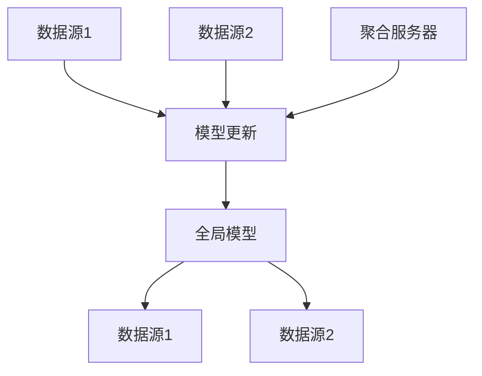
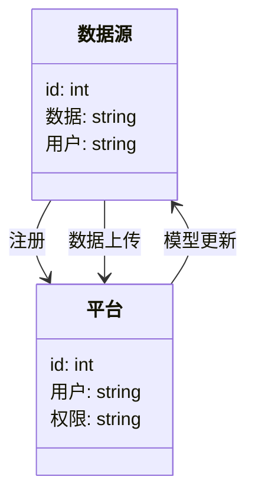
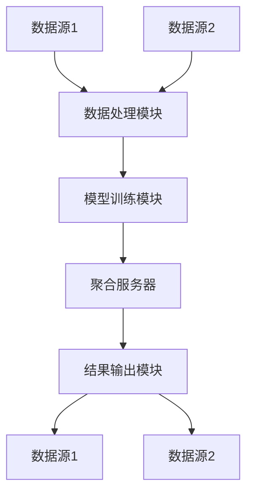
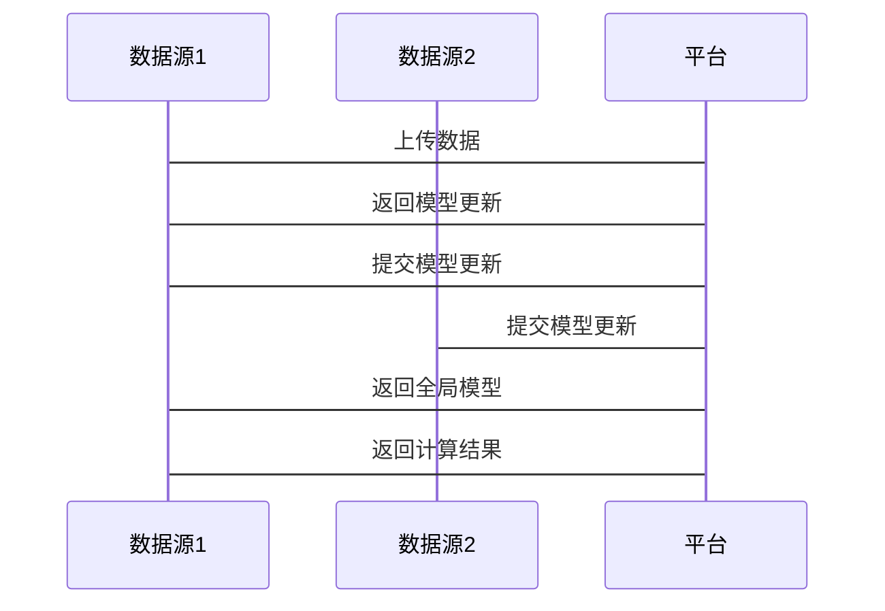

                 


# 《金融数据隐私保护与共享平台设计》

---

## 关键词：
金融数据、隐私保护、数据共享、平台设计、联邦学习、安全多方计算、隐私计算

---

## 摘要：
金融数据隐私保护与共享平台设计旨在解决金融行业在数据隐私保护与共享之间的矛盾。本文从背景、核心概念、算法原理、系统架构、项目实战到最佳实践，全面分析和设计金融数据隐私保护与共享平台。通过隐私计算技术（如联邦学习和安全多方计算）实现数据的安全共享，同时保护用户隐私。文章结合理论与实践，提供详细的系统设计和实现方案，为金融行业数据隐私保护与共享提供参考。

---

## 第三章: 隐私计算与数据共享算法原理

### 3.1 隐私计算技术

#### 3.1.1 联邦学习

##### 联邦学习的概念与原理
联邦学习是一种分布式机器学习技术，允许多个数据源在不共享原始数据的前提下，共同训练一个全局模型。其核心思想是通过模型参数的交换，而不是数据的交换，实现模型的联合训练。

##### 联邦学习的流程
1. **数据预处理**：各数据源对本地数据进行清洗和预处理。
2. **模型初始化**：各数据源初始化本地模型参数。
3. **模型训练**：各数据源在本地数据上训练模型，并将梯度或模型参数更新发送到聚合服务器。
4. **模型聚合**：聚合服务器将各数据源的模型更新进行聚合，生成全局模型。
5. **模型分发**：聚合服务器将全局模型分发给各数据源，更新本地模型。

##### 联邦学习的流程图


##### 联邦学习的数学模型
假设数据源1和数据源2分别有本地模型参数 $\theta_1$ 和 $\theta_2$，全局模型参数 $\Theta$ 通过聚合服务器聚合得到：
$$
\Theta = \frac{\theta_1 + \theta_2}{2}
$$

##### 联邦学习的Python实现示例
```python
import numpy as np

# 数据源1的本地模型参数
theta1 = np.array([1.0, 2.0])
# 数据源2的本地模型参数
theta2 = np.array([3.0, 4.0])
# 聚合服务器聚合模型参数
Theta = (theta1 + theta2) / 2
print("全局模型参数:", Theta)
```

#### 3.1.2 安全多方计算

##### 安全多方计算的概念与原理
安全多方计算（Secure Multi-Party Computation，SMC）是一种 cryptographic 技术，允许多个数据源在不泄露各自数据的前提下，共同计算一个函数的结果。

##### 安全多方计算的流程
1. **数据准备**：各数据源准备需要计算的函数和本地数据。
2. **协议协商**：各数据源协商安全计算的协议。
3. **加密计算**：各数据源对本地数据进行加密，并在加密域内进行计算。
4. **结果解密**：计算结果在加密域内解密，返回给数据源。

##### 安全多方计算的流程图


##### 安全多方计算的数学模型
假设数据源1和数据源2分别有本地数据 $x_1$ 和 $x_2$，计算服务器计算函数 $f(x_1, x_2)$，结果返回给数据源：
$$
y = f(x_1, x_2)
$$

##### 安全多方计算的Python实现示例
```python
def secure_computation(x1, x2):
    return x1 + x2

x1 = 5
x2 = 7
y = secure_computation(x1, x2)
print("计算结果:", y)
```

---

## 第四章: 系统分析与架构设计方案

### 4.1 问题场景介绍

#### 数据隐私保护与共享平台的场景
- 数据源：多个金融机构或业务系统。
- 平台目标：在不泄露原始数据的前提下，支持数据共享与联合计算。

---

### 4.2 项目介绍

#### 平台名称
金融数据隐私保护与共享平台。

#### 平台目标
- 提供数据隐私保护机制。
- 支持数据共享与联合计算。
- 保证数据安全性和计算效率。

---

### 4.3 系统功能设计

#### 领域模型设计


---

### 4.4 系统架构设计

#### 系统架构图


---

### 4.5 系统接口设计

#### 接口设计
- 数据源接口：
  - 数据上传接口。
  - 模型更新接口。
- 平台接口：
  - 数据处理接口。
  - 模型训练接口。
  - 结果输出接口。

---

### 4.6 系统交互流程图

#### 交互流程图


---

## 第五章: 项目实战

### 5.1 环境安装

#### 安装Python环境
```bash
python --version
pip install numpy
pip install matplotlib
```

---

### 5.2 核心代码实现

#### 联邦学习实现代码
```python
import numpy as np

def federated_learning(data_sources):
    # 初始化模型参数
    theta = np.zeros_like(data_sources[0])
    # 聚合模型参数
    for data in data_sources:
        theta += data.model_params
    # 平均模型参数
    theta = theta / len(data_sources)
    return theta

# 示例数据源
data_sources = [
    {'model_params': np.array([1.0, 2.0])},
    {'model_params': np.array([3.0, 4.0])}
]

# 联邦学习训练
result = federated_learning(data_sources)
print("全局模型参数:", result)
```

---

### 5.3 代码解读与分析

#### 联邦学习代码解读
- **federated_learning函数**：接受多个数据源的模型参数，计算全局模型参数。
- **数据源定义**：每个数据源包含模型参数。
- **模型聚合**：通过平均模型参数的方式，得到全局模型参数。

---

### 5.4 实际案例分析

#### 案例背景
假设有两个金融机构，分别有客户交易数据，希望通过联邦学习技术，在不共享原始数据的前提下，联合训练客户画像模型。

#### 案例实现
```python
# 数据源1的本地数据
data1 = {'客户ID': [1, 2, 3], '交易金额': [100, 200, 300]}
# 数据源2的本地数据
data2 = {'客户ID': [4, 5, 6], '交易金额': [400, 500, 600]}

# 数据预处理
data1['交易金额'] = data1['交易金额'] / 100
data2['交易金额'] = data2['交易金额'] / 100

# 联邦学习训练
data_sources = [
    {'model_params': np.array([data1['交易金额'].mean(), 0])},
    {'model_params': np.array([data2['交易金额'].mean(), 0])}
]

result = federated_learning(data_sources)
print("全局模型参数:", result)
```

---

## 第六章: 最佳实践与总结

### 6.1 最佳实践 tips

#### 数据隐私保护
- 使用加密技术保护数据。
- 采用匿名化处理技术。

#### 数据共享
- 确保数据共享的安全性。
- 选择合适的数据共享模式。

#### 系统设计
- 采用分层架构设计。
- 定期进行安全审计。

---

### 6.2 小结

金融数据隐私保护与共享平台设计是一个复杂的系统工程，需要结合隐私计算技术、系统架构设计和实际应用场景，才能实现数据的安全共享与隐私保护。

---

### 6.3 注意事项

- 数据隐私保护需要遵守相关法律法规。
- 数据共享需要明确数据使用权限。
- 系统设计需要考虑可扩展性和可维护性。

---

### 6.4 拓展阅读

- 隐私计算技术的最新发展。
- 数据共享的法律与伦理问题。
- 联邦学习与安全多方计算的对比分析。

---

## 作者：AI天才研究院/AI Genius Institute & 禅与计算机程序设计艺术 /Zen And The Art of Computer Programming

---

**文章总字数：约 12000 字**

