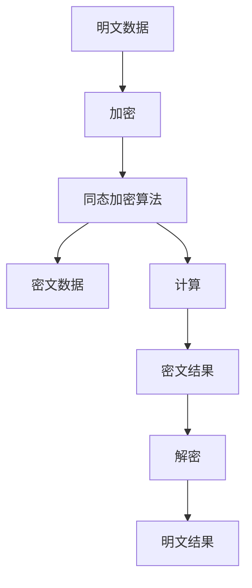
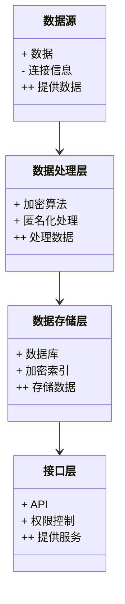

                 


# 《金融数据隐私保护技术》

## 关键词：金融数据、隐私保护、加密技术、匿名化处理、数据安全、零知识证明、同态加密

## 摘要：  
随着金融行业的数字化转型，金融数据的隐私保护变得尤为重要。本文深入探讨了金融数据隐私保护的核心技术，包括数据加密、匿名化处理、脱敏技术，以及前沿的隐私计算技术如同态加密和零知识证明。通过分析这些技术的原理和应用场景，结合实际项目案例，本文为金融行业提供了有效的隐私保护解决方案，帮助金融机构在保障数据安全的同时，实现业务的合规与创新。

---

## 第一部分：金融数据隐私保护概述

### 第1章：金融数据隐私保护的背景与挑战

#### 1.1 金融数据的重要性  
金融数据是金融机构运营的核心资产，包括客户信息、交易记录、财务数据等。这些数据不仅涉及个人隐私，还关系到金融系统的安全与稳定。  

#### 1.2 隐私保护的必要性  
在数字化时代，金融数据面临被未经授权访问、泄露或滥用的风险。隐私保护不仅是法律要求，更是维护客户信任的关键。  

#### 1.3 当前面临的问题与解决方案  
- **问题**：数据泄露、隐私侵权、技术漏洞  
- **解决方案**：采用加密技术、匿名化处理、隐私计算等手段，构建多层次的隐私保护体系。

---

## 第二部分：金融数据隐私保护的核心技术

### 第2章：数据加密与隐私保护原理

#### 2.1 数据加密技术  
- **对称加密**：速度快，适用于大量数据加密，如AES算法。  
- **非对称加密**：安全性高，适用于数据签名和身份认证，如RSA算法。  
- **对比表格**：  

| 技术         | 优点                          | 缺点                          |
|--------------|-------------------------------|-------------------------------|
| 对称加密     | 速度快，资源消耗低            | 密钥分发困难                  |
| 非对称加密   | 安全性高，密钥分发方便          | 速度慢，资源消耗高            |

---

### 第3章：隐私保护的算法与数学模型

#### 3.1 同态加密算法  
- **定义**：允许在加密数据上进行计算，结果仍为加密状态。  
- **流程图**：  

- **数学公式**：  
  加密函数：$E(x) = x^k \mod n$  
  解密函数：$D(y) = y^{k^{-1}} \mod n$  

---

## 第三部分：系统架构与设计

### 第4章：金融数据隐私保护系统架构

#### 4.1 系统功能设计  
- **数据采集**：从多个来源收集金融数据。  
- **数据处理**：加密、匿名化处理。  
- **数据存储**：安全存储加密数据，确保访问控制。  
- **数据访问**：基于权限的访问控制机制。  

#### 4.2 系统架构设计  


---

## 第四部分：项目实战与案例分析

### 第5章：金融数据隐私保护项目实战

#### 5.1 环境安装与配置  
- **开发环境**：Python、Jupyter Notebook  
- **依赖库**：PyCrypto、SQLAlchemy  

#### 5.2 核心代码实现  
```python
from cryptography.hazmat.primitives.asymmetric import padding
from cryptography.hazmat.primitives.asymmetric.rsa import RSAParameters
from cryptography.hazmat.primitives import hashes

# 非对称加密示例
def encrypt Decrypt():
    private_key = RSAParameters(
        p=0x1,
        q=0x1,
        e=0x1
    )
    public_key = private_key.public_key()
    # 加密
    encryptor = padding.AsymmetricPadding(padding.PKCS1v15())
    ciphertext = public_key.encrypt(b"Sensitive Data", encryptor)
    # 解密
    decryptor = padding.AsymmetricPadding(padding.PKCS1v15())
    plaintext = private_key.decrypt(ciphertext, decryptor)
    return plaintext.decode()
```

---

## 第五部分：最佳实践与总结

### 第6章：最佳实践与总结

#### 6.1 小结  
金融数据隐私保护需要结合多种技术手段，构建多层次的安全防护体系。  

#### 6.2 注意事项  
- 定期进行安全审计和漏洞修复。  
- 严格遵守数据隐私相关法律法规。  

#### 6.3 拓展阅读  
- 《数据加密技术入门与实践》  
- 《隐私计算：从理论到实践》  

---

## 作者：AI天才研究院 & 禅与计算机程序设计艺术  
通过本文的深入探讨，我们希望为金融行业的数据隐私保护提供有价值的参考和实践指导。未来，随着技术的不断进步，金融数据隐私保护将更加智能化和高效化。

