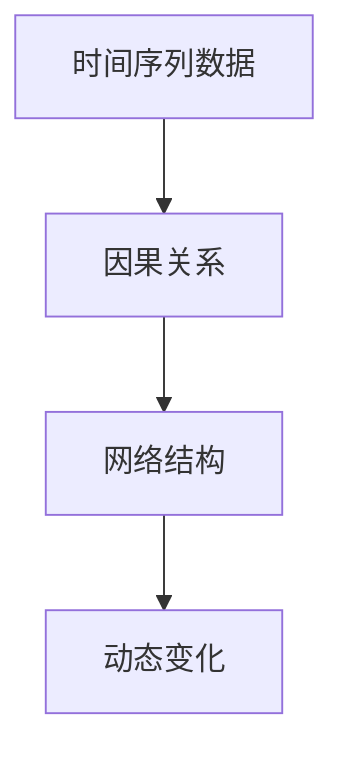
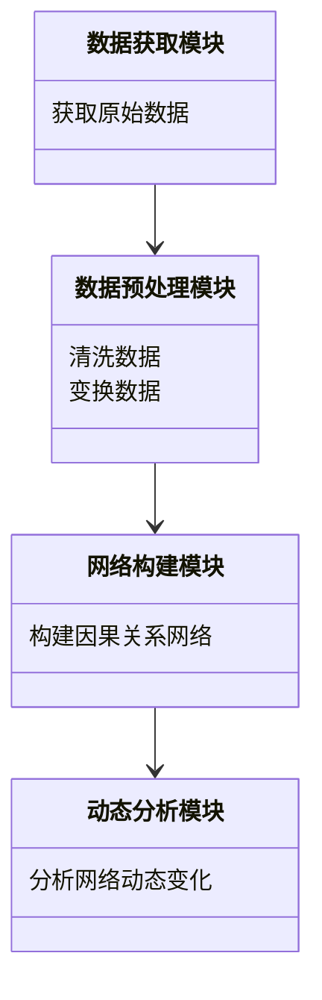
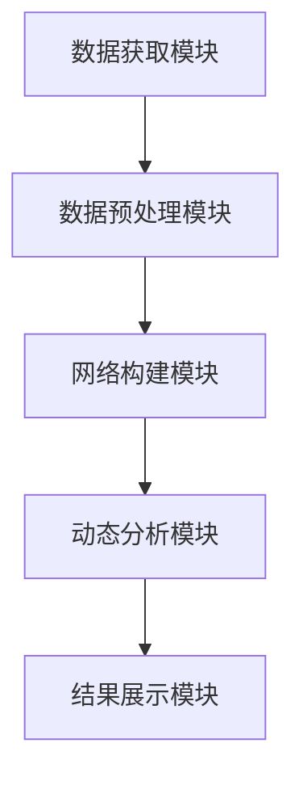

                 

# 金融时间序列因果关系网络动态分析

> **关键词**：金融时间序列，因果关系网络，动态分析，Granger因果，系统架构，LSTM网络

> **摘要**：本文详细探讨了金融时间序列数据中的因果关系网络构建及其动态分析方法。通过结合时间序列分析、因果关系建模和网络科学，提出了一种动态因果网络分析框架，用于揭示金融市场中变量间的动态因果关系。文章从基础概念到高级方法进行了系统性阐述，结合实际案例和系统架构设计，为金融领域的动态网络分析提供了理论支持和实践指导。

---

## 第一章 问题背景与核心概念

### 1.1 问题背景介绍

#### 1.1.1 金融数据的特性与挑战

金融数据具有高度的复杂性和动态性，主要体现在以下几个方面：
- **时间依赖性**：金融资产的价格通常表现出显著的时间依赖性，过去的价格走势往往影响未来的价格。
- **非线性关系**：金融市场中的变量关系通常是非线性的，传统的线性回归方法难以捕捉复杂的依赖关系。
- **噪声干扰**：金融市场受到多种随机因素的影响，数据中存在大量噪声，增加了因果关系识别的难度。

#### 1.1.2 问题描述与目标

在金融领域，因果关系分析的核心目标是识别变量之间的因果关系，从而为投资决策、风险管理和资产定价提供理论依据。传统的统计方法往往局限于相关性分析，难以揭示变量之间的因果关系。本文旨在通过构建因果关系网络，分析网络的动态变化，揭示金融市场中变量间的动态因果关系。

#### 1.1.3 研究意义与价值

- **理论意义**：因果关系网络为理解金融市场中的变量关系提供了新的视角，有助于揭示市场的内在结构和运行机制。
- **实践价值**：通过动态分析因果关系网络的变化，可以为投资者提供实时的市场洞察，帮助做出更科学的投资决策。

### 1.2 核心概念与联系

#### 1.2.1 时间序列数据与因果关系

时间序列数据是指按照时间顺序排列的数据，通常用于描述某一变量在不同时间点的观测值。在金融领域，时间序列数据广泛应用于股票价格、指数、利率等变量的分析。

**因果关系**是指一个变量的变化会直接影响另一个变量的变化。在时间序列数据中，因果关系可以通过Granger因果检验等方法进行识别。

#### 1.2.2 因果关系网络的属性特征

因果关系网络是一种图结构，节点代表变量，边代表变量之间的因果关系。网络的属性特征包括：
- **节点度**：表示一个变量与其他变量的因果关系强度。
- **网络密度**：表示网络中边的密集程度。
- **网络聚类系数**：表示网络中节点的聚类程度。

#### 1.2.3 ER实体关系图

---

## 第二章 时间序列分析基础

### 2.1 时间序列的基本概念

#### 2.1.1 时间序列的分解

时间序列数据可以分解为以下几个部分：
- **趋势**：长期趋势，如股票价格的上涨趋势。
- **周期性**：周期性波动，如季节性波动。
- **随机性**：不可预测的随机波动。

分解方法包括移动平均法、指数平滑法等。

#### 2.1.2 常见时间序列模型

- **ARIMA模型**：自回归积分滑动平均模型，适用于线性时间序列数据。
  $$ ARIMA(p, d, q) $$
- **GARCH模型**：广义自回归条件异方差模型，适用于波动率建模。
  $$ GARCH(p, q) $$
- **LSTM网络**：长短期记忆网络，适用于非线性时间序列数据。

### 2.2 时间序列数据的预处理

#### 2.2.1 数据清洗

- **异常值处理**：识别并剔除异常值，如使用Z-score方法。
- **缺失值填充**：使用均值、插值或模型预测填补缺失值。

#### 2.2.2 数据变换

- **标准化与归一化**：将数据缩放到统一范围内，便于模型训练。
- **对数变换与差分**：通过差分消除趋势和周期性。

---

## 第三章 因果关系分析基础

### 3.1 Granger因果检验

#### 3.1.1 Granger因果的概念

Granger因果检验是一种统计方法，用于判断一个时间序列是否是另一个时间序列的“原因”。其核心思想是，如果时间序列X对时间序列Y有Granger因果关系，则利用X的过去信息可以更好地预测Y的当前值。

#### 3.1.2 Granger因果的检验方法

1. **原假设**：X不Granger引起Y。
2. **备择假设**：X Granger引起Y。
3. **检验统计量**：F统计量或卡方统计量。
4. **显著性水平**：通常选择0.05或0.01。

#### 3.1.3 Granger因果与相关性的区别

Granger因果与相关性不同，相关性只表示变量之间的关联程度，而Granger因果强调变量之间的因果关系。

---

## 第四章 金融时间序列因果关系网络的构建

### 4.1 数据预处理与特征提取

#### 4.1.1 数据清洗

- 去除异常值和缺失值。
- 标准化数据。

#### 4.1.2 特征提取

- 使用主成分分析（PCA）提取特征。

### 4.2 因果关系网络的构建方法

#### 4.2.1 基于Granger因果的网络构建

- 计算每对变量之间的Granger因果关系。
- 构建有向图，边表示因果关系。

#### 4.2.2 基于贝叶斯网络的网络构建

- 使用贝叶斯网络方法，计算变量之间的条件概率。
- 构建无向图，边表示相关性。

#### 4.2.3 网络可视化

使用Gephi等工具对网络进行可视化，展示节点和边的属性。

### 4.3 网络属性分析

#### 4.3.1 网络密度

$$ \text{密度} = \frac{\text{边数}}{\text{可能的边数}} $$

#### 4.3.2 节点度分布

$$ \text{度分布} = \{d_1, d_2, \dots, d_n\} $$

---

## 第五章 金融时间序列因果关系网络的动态分析

### 5.1 网络的动态变化

#### 5.1.1 动态网络模型

- 时间序列网络模型：网络结构随时间变化。
- 状态转移模型：网络状态的转移。

#### 5.1.2 网络的稳定性分析

- 网络稳定性：网络在动态变化中的鲁棒性。
- 稳定性分析方法：主成分分析、聚类分析。

### 5.2 网络的动态预测

#### 5.2.1 基于马尔可夫链的动态预测

- 状态转移矩阵：描述状态转移概率。
- 预测未来状态：基于当前状态和转移概率。

#### 5.2.2 基于LSTM的动态预测

- 使用LSTM网络预测网络结构的变化。
- 输入：当前网络结构，输出：未来网络结构。

### 5.3 动态网络的可视化与分析

使用工具（如Gephi）对动态网络进行可视化，分析网络的演化过程。

---

## 第六章 系统设计与实现

### 6.1 系统功能设计

#### 6.1.1 功能模块划分

- 数据获取模块：从数据库中获取金融时间序列数据。
- 数据预处理模块：清洗和变换数据。
- 网络构建模块：构建因果关系网络。
- 动态分析模块：分析网络的动态变化。

#### 6.1.2 领域模型类图

### 6.2 系统架构设计

#### 6.2.1 系统架构图

---

## 第七章 项目实战

### 7.1 数据获取与预处理

#### 7.1.1 数据获取

从金融数据库中获取股票价格数据，如使用Yahoo Finance API。

#### 7.1.2 数据清洗

去除异常值和缺失值。

### 7.2 网络构建与动态分析

#### 7.2.1 网络构建

使用Granger因果检验构建因果关系网络。

#### 7.2.2 动态分析

分析网络的动态变化，预测未来网络结构。

### 7.3 实际案例分析

以某股票为例，展示整个分析过程，包括数据获取、预处理、网络构建和动态分析。

---

## 第八章 高级主题与扩展

### 8.1 多层网络分析

#### 8.1.1 多层网络的构建

- 构建多层网络，如将不同时间窗口的网络结构进行叠加。

#### 8.1.2 多层网络的分析

- 分析多层网络的属性，如层间边的权重分布。

### 8.2 异构网络分析

#### 8.2.1 异构网络的构建

- 构建异构网络，如将股票价格与市场指数进行关联。

#### 8.2.2 异构网络的分析

- 分析异构网络的属性，如节点类型分布。

### 8.3 网络鲁棒性分析

#### 8.3.1 网络鲁棒性的定义

- 网络在受到干扰时的恢复能力。

#### 8.3.2 网络鲁棒性的分析

- 分析网络的鲁棒性，如去除关键节点后的网络结构变化。

---

## 第九章 总结与展望

### 9.1 全文总结

本文详细探讨了金融时间序列因果关系网络动态分析的方法，从数据预处理、网络构建到动态分析，为金融领域的因果关系研究提供了理论支持和实践指导。

### 9.2 未来展望

未来的研究可以进一步探索以下方向：
- 更复杂的网络模型，如多层网络和异构网络。
- 更先进的算法，如深度学习算法在动态网络分析中的应用。

---

## 作者信息

作者：AI天才研究院/AI Genius Institute & 禅与计算机程序设计艺术 /Zen And The Art of Computer Programming

---

通过以上内容，本文系统性地阐述了金融时间序列因果关系网络动态分析的理论与实践，为金融领域的因果关系研究提供了新的视角和方法。

