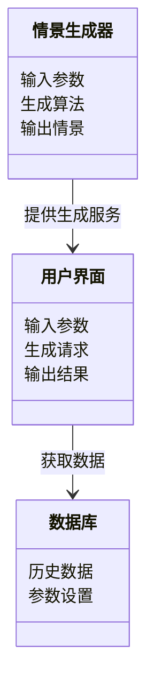
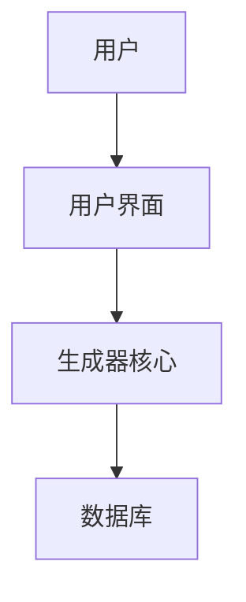

                 


# 金融机构压力测试情景生成器

## 关键词：压力测试，情景生成，金融机构，风险管理，人工智能，蒙特卡洛模拟，机器学习

## 摘要：  
金融机构压力测试情景生成器是一种用于评估金融机构在极端市场条件下的风险承受能力的工具。本文详细介绍了压力测试的基本概念、情景生成器的核心原理、多种生成算法的实现方法，以及系统架构设计。通过实际案例分析，展示了如何利用压力测试情景生成器进行有效的风险管理和决策支持。文章最后总结了最佳实践和未来发展趋势。

---

# 第一部分: 金融机构压力测试情景生成器概述

## 第1章: 金融机构压力测试概述

### 1.1 压力测试的基本概念

#### 1.1.1 什么是压力测试  
压力测试是指在极端市场条件下，评估金融机构资产组合、业务模式或整体运营的稳定性。通过模拟可能的极端情景，压力测试可以帮助金融机构识别潜在风险，并制定应对策略。

#### 1.1.2 压力测试的目的与意义  
压力测试的主要目的是评估金融机构在极端情况下的抗风险能力。通过压力测试，金融机构可以：  
- 识别潜在的脆弱环节。  
- 制定应对极端情况的应急预案。  
- 提高风险管理和决策能力。  

#### 1.1.3 金融机构压力测试的监管要求  
全球主要金融市场对压力测试有严格要求。例如，巴塞尔协议规定，银行必须定期进行压力测试，确保资本充足率符合监管要求。  

---

### 1.2 压力测试情景生成器的定义与作用  

#### 1.2.1 压力测试情景生成器的概念  
压力测试情景生成器是一种工具，用于自动生成符合特定条件的市场情景，供金融机构进行压力测试。这些情景通常包括资产价格波动、利率变化、流动性风险等。  

#### 1.2.2 情景生成器在金融机构中的作用  
情景生成器的作用包括：  
- 提供多样化的测试情景。  
- 快速生成符合监管要求的情景。  
- 支持定制化测试需求。  

#### 1.2.3 情景生成器的分类与特点  
压力测试情景生成器可以分为以下几类：  
- **历史情景生成器**：基于历史数据生成情景。  
- **随机生成器**：基于统计模型生成情景。  
- **机器学习生成器**：利用深度学习模型生成情景。  

---

### 1.3 金融机构压力测试的背景与现状  

#### 1.3.1 金融危机与压力测试的重要性  
2008年金融危机暴露了金融机构在极端情况下的脆弱性。此后，压力测试成为金融监管的重要手段。  

#### 1.3.2 全球主要金融机构的测试实践  
- 美国的“压力测试”（Stress Testing）框架。  
- 欧洲的“银行压力测试”（EBA Stress Testing）。  

#### 1.3.3 压力测试情景生成器的发展趋势  
随着人工智能技术的发展，基于机器学习的生成器越来越受欢迎。  

---

## 第2章: 压力测试情景生成器的核心概念  

### 2.1 压力测试情景生成的原理  

#### 2.1.1 情景生成的基本流程  
1. 确定测试目标和参数。  
2. 选择生成方法（如蒙特卡洛模拟）。  
3. 生成情景并进行验证。  

#### 2.1.2 情景生成的关键要素  
- 输入数据（如历史价格、利率）。  
- 生成算法（如随机数生成器）。  
- 输出结果（如情景报告）。  

#### 2.1.3 情景生成的数学模型  
情景生成通常基于概率分布模型。例如，假设资产价格服从几何布朗运动，可以用以下公式表示：  
$$ S(t) = S(0) \times e^{\mu t + \sigma W(t)} $$  

---

### 2.2 压力测试情景生成器的输入与输出  

#### 2.2.1 输入数据的类型与特征  
- 历史数据：如股票价格、利率。  
- 参数：如波动率、相关性。  

#### 2.2.2 输出结果的格式与标准  
- 情景报告：包括资产价格、收益率等。  
- 风险指标：如VaR（在险值）、CVaR（条件在险值）。  

#### 2.2.3 输入输出的关联关系  
输入数据通过生成算法生成输出情景，情景用于压力测试。  

---

### 2.3 压力测试情景生成器的特征分析  

#### 2.3.1 情景生成的多样性  
生成器应能够生成多样化的测试情景。  

#### 2.3.2 情景生成的可定制性  
用户可以根据需求定制生成情景的参数。  

#### 2.3.3 情景生成的可解释性  
生成的情景应具有较高的可解释性，便于分析和验证。  

---

## 第3章: 压力测试情景生成器的算法原理与实现  

### 3.1 基于统计学的生成方法  

#### 3.1.1 蒙特卡洛模拟的原理  
蒙特卡洛模拟是一种基于随机数的生成方法。其流程如下：  
1. 确定输入参数。  
2. 生成随机数。  
3. 计算资产价格。  
4. 输出情景。  

#### 3.1.2 时间序列分析的应用  
时间序列分析常用于生成资产价格情景。例如，使用ARIMA模型预测未来价格。  

#### 3.1.3 基于历史数据的生成方法  
基于历史数据的生成方法通常使用历史价格波动率作为输入参数。  

---

### 3.2 基于机器学习的生成方法  

#### 3.2.1 神经网络在情景生成中的应用  
深度学习模型（如LSTM）可以用于生成时间序列数据。  

#### 3.2.2 随机森林与梯度提升树的使用  
随机森林和梯度提升树可以用于生成分类或回归结果。  

#### 3.2.3 基于深度学习的生成模型  
生成对抗网络（GAN）可以用于生成逼真的市场情景。  

---

### 3.3 混合模型的生成方法  

#### 3.3.1 统计模型与机器学习模型的结合  
混合模型结合了统计模型的可解释性和机器学习模型的复杂性。  

#### 3.3.2 混合模型的优势与挑战  
优势：灵活性高。挑战：计算复杂度高。  

#### 3.3.3 混合模型的实际应用案例  
例如，使用统计模型生成基础情景，再通过机器学习模型进行优化。  

---

## 第4章: 压力测试情景生成器的系统分析与架构设计  

### 4.1 系统功能设计  

#### 4.1.1 领域模型  
领域模型展示了生成器的主要功能模块。  



---

### 4.2 系统架构设计  

#### 4.2.1 系统架构图  
系统架构图展示了生成器的整体结构。  



---

## 第5章: 项目实战  

### 5.1 实际案例分析  

#### 5.1.1 案例背景  
假设我们需要生成一个市场下跌的情景。  

#### 5.1.2 环境安装  
安装Python和相关库（如NumPy、Pandas、Scikit-learn）。  

#### 5.1.3 代码实现  
以下是基于蒙特卡洛模拟的生成代码：  

```python
import numpy as np
import matplotlib.pyplot as plt

# 参数设置
S0 = 100  # 初始价格
mu = 0.05  # 预期回报率
sigma = 0.2  # 波动率
T = 1  # 时间跨度
n_steps = 100  # 步数

# 生成随机数
np.random.seed(42)
W = np.random.standard_normal(n_steps)

# 计算布朗运动
S = np.zeros(n_steps + 1)
S[0] = S0
for t in range(1, n_steps + 1):
    S[t] = S[t-1] * (1 + mu + sigma * W[t-1])

# 绘制情景
plt.plot(S)
plt.xlabel('时间')
plt.ylabel('价格')
plt.title('市场下跌情景')
plt.show()
```

#### 5.1.4 结果分析  
生成的情景显示资产价格在极端情况下大幅下跌。  

---

## 第6章: 最佳实践与小结  

### 6.1 最佳实践  

#### 6.1.1 情景生成器的使用注意事项  
- 确保输入数据的准确性和完整性。  
- 定期更新模型参数。  
- 结合多种生成方法提高结果的准确性。  

#### 6.1.2 压力测试的实施建议  
- 制定详细的测试计划。  
- 建立专业的测试团队。  
- 定期进行压力测试。  

### 6.2 小结  
本文详细介绍了压力测试情景生成器的原理、算法和实现方法。通过实际案例分析，展示了其在金融机构中的应用价值。未来，随着人工智能技术的进步，压力测试情景生成器将更加智能化和多样化。

---

## 作者：AI天才研究院/AI Genius Institute & 禅与计算机程序设计艺术 /Zen And The Art of Computer Programming

---

以上是《金融机构压力测试情景生成器》的完整技术博客文章。内容涵盖了从基本概念到算法实现，再到系统设计和实际案例的详细讲解，旨在为金融机构的风险管理提供有力的技术支持。

