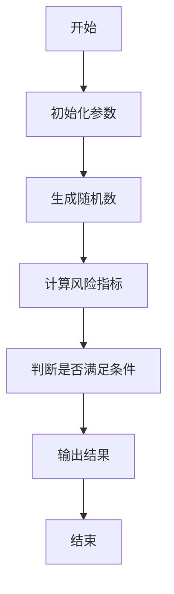
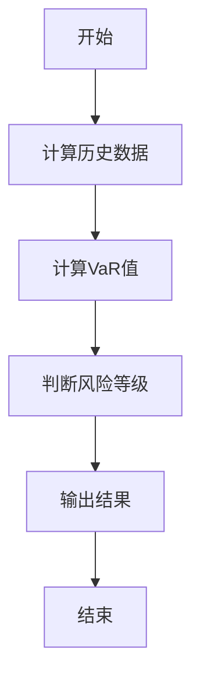

                 


# 金融机构压力测试自动化工具

> 关键词：金融机构，压力测试，自动化工具，风险管理，蒙特卡洛模拟，VaR模型，系统架构

> 摘要：本文将详细探讨金融机构压力测试自动化工具的设计与实现，从压力测试的基本概念到自动化工具的算法原理，再到系统架构设计与项目实战，为读者提供全面的技术指导。

---

## 第一部分: 金融机构压力测试自动化工具概述

### 第1章: 压力测试与金融机构概述

#### 1.1 压力测试的定义与背景
##### 1.1.1 压力测试的定义
压力测试是一种通过模拟极端市场条件，评估金融机构在不利环境下的风险承受能力的分析方法。它帮助机构识别潜在风险，并制定应对策略。

##### 1.1.2 金融机构中的压力测试需求
金融机构面临复杂的市场波动和经济不确定性，压力测试是评估其稳健性的关键工具。通过压力测试，机构可以确保在极端情况下仍能维持正常运营。

##### 1.1.3 压力测试的重要性与作用
压力测试不仅帮助机构识别潜在风险，还能评估现有风险管理策略的有效性，从而优化资本分配和运营策略。

##### 1.1.4 压力测试的边界与外延
压力测试的边界包括确定测试的范围和假设条件，外延则涉及测试结果的应用和持续改进。

#### 1.2 金融机构压力测试的核心概念
##### 1.2.1 压力测试的核心要素
压力测试的核心要素包括输入数据、测试情景、风险指标和输出结果。

##### 1.2.2 压力测试的分类与特点
压力测试可分为历史模拟法、情景分析法和蒙特卡洛模拟法。每种方法有其独特的特点和适用场景。

##### 1.2.3 压力测试与风险管理的关系
压力测试是风险管理的重要组成部分，通过评估极端风险，帮助机构制定有效的风险控制措施。

##### 1.2.4 压力测试的流程与框架
压力测试的流程包括数据准备、情景设计、模型构建、结果分析和报告生成。

---

### 第2章: 压力测试自动化工具的核心概念

#### 2.1 压力测试自动化工具的定义
自动化工具是利用技术手段，自动执行压力测试流程，提高效率并降低成本。

#### 2.2 自动化工具的核心功能与特点
核心功能包括数据采集、算法计算、结果分析和报告生成。特点包括高效性、准确性、可扩展性和易用性。

#### 2.3 自动化工具与传统压力测试的区别
自动化工具通过技术手段实现流程自动化，显著提高了效率和准确性，减少了人为错误。

#### 2.4 自动化工具的实现原理与技术架构
自动化工具的实现依赖于先进的算法和强大的计算能力，技术架构包括数据处理层、算法计算层和结果展示层。

---

### 第3章: 压力测试自动化工具的算法原理

#### 3.1 压力测试算法概述
##### 3.1.1 常见压力测试算法介绍
常用算法包括蒙特卡洛模拟和VaR模型。

##### 3.1.2 算法选择与应用场景
选择算法需考虑数据特性、计算复杂度和测试目标。

#### 3.2 基于蒙特卡洛模拟的压力测试算法
##### 3.2.1 蒙特卡洛模拟的原理与实现
蒙特卡洛模拟通过生成大量随机数，模拟极端市场条件下的资产价格变化。

##### 3.2.2 算法流程图（使用mermaid）


##### 3.2.3 算法实现的Python代码示例
```python
import numpy as np

def monte_carlo_simulation(data, iterations=10000):
    np.random.seed(42)
    simulated_prices = []
    for _ in range(iterations):
        # 生成随机数
        random_number = np.random.normal(0, 1)
        # 计算模拟价格
        simulated_price = data[-1] * (1 + random_number * 0.01)
        simulated_prices.append(simulated_price)
    return simulated_prices
```

#### 3.3 基于VaR模型的压力测试算法
##### 3.3.1 VaR模型的原理与实现
VaR模型通过历史数据分析，计算资产在一定置信水平下的潜在损失。

##### 3.3.2 算法流程图（使用mermaid）


##### 3.3.3 算法实现的Python代码示例
```python
import numpy as np

def calculate_var(data, confidence_level=0.95):
    # 计算历史数据的VaR
    sorted_data = np.sort(data)
    var_index = int(len(sorted_data) * (1 - confidence_level))
    var_value = sorted_data[var_index]
    return var_value
```

---

### 第4章: 压力测试自动化工具的系统分析与架构设计

#### 4.1 系统功能模块设计
##### 4.1.1 数据采集模块
负责收集历史市场数据和机构的资产组合信息。

##### 4.1.2 算法计算模块
实现蒙特卡洛模拟和VaR模型，计算风险指标。

##### 4.1.3 结果分析模块
对计算结果进行分析，生成风险报告。

##### 4.1.4 报告生成模块
将分析结果整理成报告，便于管理层决策。

#### 4.2 系统架构设计
##### 4.2.1 分层架构设计
系统分为数据层、计算层和展示层。

##### 4.2.2 模块化设计
每个功能模块独立开发，便于维护和扩展。

##### 4.2.3 高可用性设计
采用分布式架构，确保系统稳定运行。

#### 4.3 系统接口设计
##### 4.3.1 数据接口
定义数据输入和输出的格式。

##### 4.3.2 计算接口
定义算法调用的接口。

##### 4.3.3 报告接口
定义报告生成的接口。

#### 4.4 系统交互流程设计
##### 4.4.1 用户输入数据
用户输入市场数据和资产组合信息。

##### 4.4.2 系统计算风险指标
系统调用算法计算模块，生成风险指标。

##### 4.4.3 系统生成报告
系统根据计算结果生成风险报告。

##### 4.4.4 用户查看报告
用户查看报告并做出决策。

---

### 第5章: 压力测试自动化工具的项目实战

#### 5.1 环境安装与配置
##### 5.1.1 安装Python环境
安装Python 3.8以上版本。

##### 5.1.2 安装必要的库（如numpy、pandas、scipy等）
使用pip安装必要的依赖库。

#### 5.2 核心代码实现
##### 5.2.1 数据采集模块
```python
import pandas as pd

def load_data(file_path):
    # 读取CSV文件
    data = pd.read_csv(file_path)
    return data
```

##### 5.2.2 算法计算模块
```python
import numpy as np

def calculate_risk(data):
    # 计算风险指标
    variance = np.var(data)
    return variance
```

##### 5.2.3 报告生成模块
```python
import pandas as pd

def generate_report(data, results):
    # 生成报告
    report = pd.DataFrame({'Date': data.index, 'Risk': results})
    return report
```

#### 5.3 项目小结
通过项目实战，读者可以掌握压力测试自动化工具的实现过程，从数据采集到结果生成，全面了解系统设计和实现的细节。

---

## 第六章: 最佳实践与注意事项

### 6.1 最佳实践
##### 6.1.1 数据清洗的重要性
确保数据的准确性和完整性。

##### 6.1.2 算法选择的合理性
根据具体需求选择合适的算法。

##### 6.1.3 系统优化的必要性
通过优化算法和架构设计，提高系统性能。

### 6.2 小结
压力测试自动化工具的应用，显著提高了金融机构的风险管理能力，帮助机构在极端市场条件下稳健运行。

### 6.3 注意事项
在实际应用中，需注意数据质量和算法的有效性，确保测试结果的准确性。

### 6.4 拓展阅读
建议读者进一步学习高级算法和系统架构设计，提升技术能力。

---

## 作者：AI天才研究院/AI Genius Institute & 禅与计算机程序设计艺术 /Zen And The Art of Computer Programming

---

以上是《金融机构压力测试自动化工具》的技术博客文章的详细目录大纲。接下来，我将根据这一大纲，逐步展开每个章节的内容，撰写一篇完整的博客文章。

