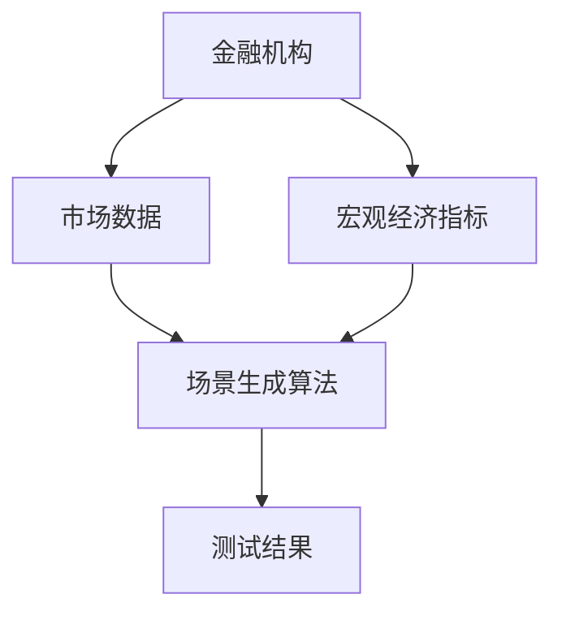
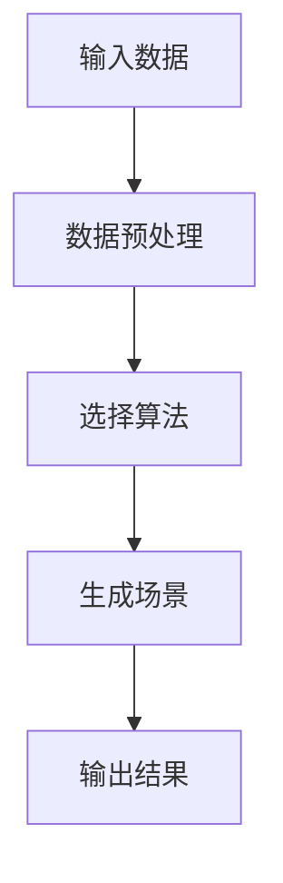
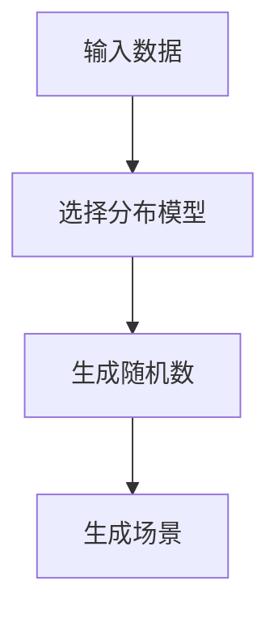
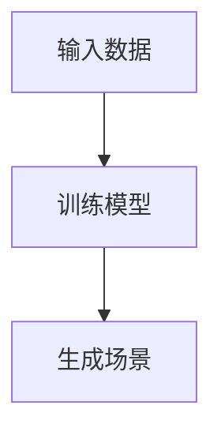
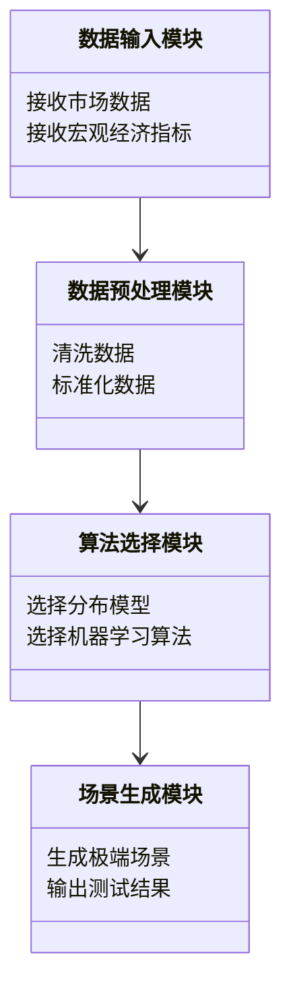

                 


# 《金融监管压力测试场景生成》

---

## 关键词

- 金融监管  
- 压力测试  
- 场景生成  
- 算法原理  
- 系统设计  

---

## 摘要

本文系统地探讨了金融监管压力测试场景生成的核心方法和技术。从压力测试的基本概念出发，结合金融监管的实际需求，详细分析了压力测试场景生成的原理、算法、系统设计和项目实战。通过概率分布模型、机器学习算法和规则驱动方法的结合，提出了高效的场景生成方案，并通过实际案例展示了如何将理论应用于实践。文章最后总结了压力测试场景生成的最佳实践和未来发展趋势。

---

## 第1章: 金融监管压力测试概述

### 1.1 什么是金融监管压力测试

压力测试是一种用于评估金融系统在极端情况下表现的方法，通过模拟潜在的负面事件（如市场崩盘、流动性危机等），分析金融机构或系统的风险承受能力。压力测试的核心目标是帮助监管机构和金融机构识别潜在风险，制定应对策略，确保金融系统的稳定性。

#### 关键概念

- **输入**：宏观经济指标、市场数据、金融机构资产负债表等。
- **输出**：金融机构在极端情况下的表现指标，如资本充足率、流动性覆盖率等。
- **应用场景**：金融机构的风险管理、监管机构的审慎监管、金融系统的稳定性维护。

### 1.2 压力测试的基本原理

压力测试通过构建数学模型，模拟极端市场条件下的金融机构表现。其核心步骤包括：

1. **定义假设场景**：选择极端市场条件（如经济衰退、市场崩盘等）。
2. **模拟金融机构表现**：基于假设场景，计算金融机构的资本充足率、流动性等关键指标。
3. **分析结果**：评估金融机构在极端条件下的生存能力，制定应对策略。

### 1.3 金融监管压力测试的背景与现状

近年来，全球金融危机频发，压力测试在金融监管中的重要性日益凸显。2008年金融危机后，监管机构开始广泛采用压力测试方法，以评估金融机构的抗风险能力。目前，压力测试已成为金融监管的核心工具之一，广泛应用于银行、保险、证券等行业的风险评估。

---

## 第2章: 压力测试场景生成的核心概念

### 2.1 压力测试场景的定义与特征

压力测试场景是指模拟极端市场条件下的各种可能情况。其主要特征包括：

- **输入多样性**：场景生成需要考虑多种因素，如市场波动率、利率变化、资产价格波动等。
- **输出一致性**：场景生成的结果应符合金融监管的标准化要求，便于分析和比较。
- **关联性**：不同场景之间应具有一定的关联性，确保测试的全面性和代表性。

### 2.2 压力测试场景生成的实体关系图

以下是压力测试场景生成的核心实体关系图：



图中展示了金融机构、市场数据、宏观经济指标、场景生成算法和测试结果之间的关系。金融机构通过提供市场数据和宏观经济指标，输入到场景生成算法中，生成测试结果。

### 2.3 压力测试场景生成的流程图

以下是压力测试场景生成的流程图：



流程图展示了从数据输入到场景生成的完整流程，包括数据预处理、算法选择、场景生成和结果输出。

---

## 第3章: 压力测试场景生成的算法原理

### 3.1 基于概率分布的场景生成

#### 3.1.1 概率分布模型的定义与特点

概率分布模型通过模拟市场数据的概率分布，生成极端场景。常用的概率分布模型包括正态分布、t分布和柯西分布。

- **正态分布**：适用于市场波动较小的情况，概率密度函数为：
  $$ f(x) = \frac{1}{\sqrt{2\pi\sigma^2}} e^{-\frac{(x-\mu)^2}{2\sigma^2}} $$
- **t分布**：适用于市场波动较大的情况，概率密度函数为：
  $$ f(x) = \frac{\Gamma(\frac{\nu+1}{2})}{\sqrt{\nu\pi} \Gamma(\frac{\nu}{2})} \left(1 + \frac{(x-\mu)^2}{\nu\sigma^2}\right)^{-\frac{\nu+1}{2}} $$
- **柯西分布**：适用于极端市场情况，概率密度函数为：
  $$ f(x) = \frac{1}{\pi} \frac{\sigma}{\sigma^2 + (x-\mu)^2} $$

#### 3.1.2 基于概率分布的场景生成流程

以下是基于概率分布的场景生成流程图：



---

### 3.2 基于机器学习的场景生成

#### 3.2.1 机器学习在压力测试中的应用

机器学习算法（如随机森林、神经网络）可以通过历史数据学习市场波动模式，生成极端场景。以下是常用的机器学习算法及其特点：

- **随机森林**：基于树的集成方法，适用于高维数据。
- **神经网络**：通过多层网络结构，捕捉复杂市场模式。

#### 3.2.2 基于机器学习的场景生成流程

以下是基于机器学习的场景生成流程图：



---

## 第4章: 系统分析与架构设计

### 4.1 系统功能需求分析

#### 4.1.1 系统功能模块划分

压力测试场景生成系统主要包括以下功能模块：

- **数据输入模块**：接收市场数据和宏观经济指标。
- **数据预处理模块**：清洗和标准化数据。
- **算法选择模块**：根据需求选择合适的生成算法。
- **场景生成模块**：生成极端市场场景。
- **结果输出模块**：输出测试结果。

#### 4.1.2 系统功能设计（领域模型）

以下是领域模型（Mermaid类图）：



---

## 第5章: 项目实战

### 5.1 项目环境安装

#### 5.1.1 环境要求

- 操作系统：Windows 10 或更高版本，或 Linux（推荐）
- Python版本：3.7 或更高
- 需要安装的库：
  - `numpy`
  - `pandas`
  - `scikit-learn`
  - `mermaid`

#### 5.1.2 安装步骤

```bash
pip install numpy pandas scikit-learn mermaid
```

---

### 5.2 系统核心实现源代码

以下是压力测试场景生成的Python代码示例：

```python
import numpy as np
from sklearn.ensemble import RandomForestRegressor

# 数据输入
market_data = np.array([1, 2, 3, 4, 5])
macroeconomic_indicators = np.array([5, 4, 3, 2, 1])

# 数据预处理
processed_data = np.concatenate((market_data, macroeconomic_indicators))

# 选择算法
model = RandomForestRegressor(n_estimators=100)

# 训练模型
model.fit(processed_data.reshape(-1, 1), market_data)

# 生成场景
predicted_scenario = model.predict(processed_data.reshape(-1, 1))
print(predicted_scenario)
```

---

### 5.3 代码应用解读与分析

上述代码实现了基于随机森林回归的场景生成。首先，输入市场数据和宏观经济指标，进行数据预处理，然后选择随机森林算法进行训练，最后生成极端场景。

---

## 第6章: 高级主题与最佳实践

### 6.1 压力测试场景生成的前沿技术

- **区块链技术**：用于确保压力测试数据的安全性和透明性。
- **边缘计算**：通过边缘计算技术，实现实时压力测试。

### 6.2 最佳实践 tips

- **数据质量**：确保输入数据的准确性和完整性。
- **算法选择**：根据具体需求选择合适的算法。
- **结果验证**：通过历史数据验证生成场景的合理性。

---

## 作者：AI天才研究院 & 禅与计算机程序设计艺术

---

以上是《金融监管压力测试场景生成》的完整文章大纲和内容。通过系统的分析和详细的代码示例，本文为金融监管领域的从业者提供了实用的技术指导和实践参考。

