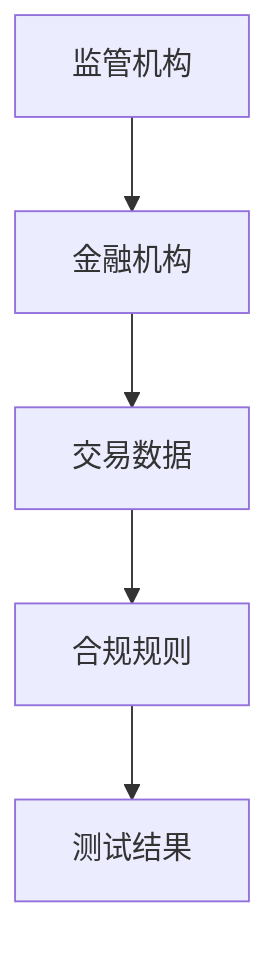
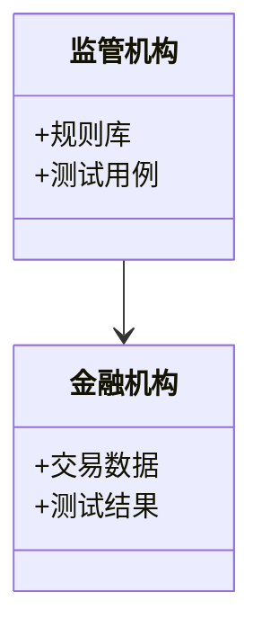
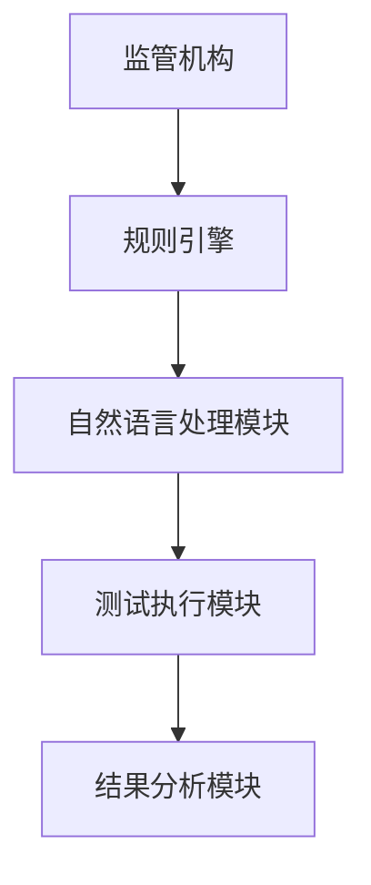
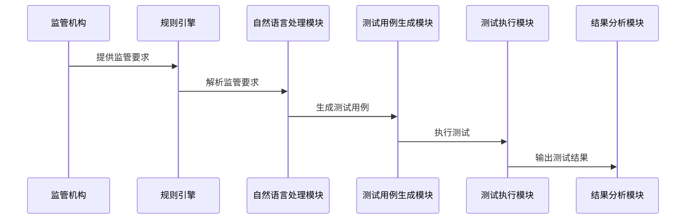

                 


# 《金融监管合规自动化测试平台》

> **关键词**：金融监管、合规测试、自动化测试、规则引擎、自然语言处理、系统架构

> **摘要**：本文详细探讨了金融监管合规自动化测试平台的构建与应用，从背景分析、核心概念、算法原理到系统架构、项目实战及最佳实践，全面解析了该平台的设计与实现。通过具体案例分析，展示了如何利用规则引擎和自然语言处理技术，实现金融监管合规测试的自动化与高效化。

---

# 第1章: 金融监管合规自动化测试平台的背景与问题背景

## 1.1 问题背景

### 1.1.1 传统金融监管合规测试的痛点
传统的金融监管合规测试依赖人工操作，存在效率低、成本高、主观性强等问题。金融机构需要频繁应对复杂的监管要求，而人工测试不仅耗时，且容易出错，难以满足日益严格的监管需求。

### 1.1.2 金融行业对自动化测试的需求
随着金融行业的快速发展，监管要求日益严格，金融机构需要快速响应监管变化，同时降低合规成本。自动化测试能够显著提高效率，减少人为错误，成为金融监管的重要工具。

### 1.1.3 合规性要求的日益严格
监管机构对金融机构的要求不断提高，包括反洗钱、关联交易、信息披露等方面。传统的手工测试难以应对这些复杂要求，自动化测试成为必然选择。

## 1.2 问题描述

### 1.2.1 金融监管的核心目标
金融监管的核心目标是确保金融机构的合规性，防范系统性风险，保护投资者利益。

### 1.2.2 传统合规测试的效率低下问题
传统合规测试依赖人工操作，效率低，且容易受到主观因素影响。

### 1.2.3 自动化测试在金融监管中的必要性
自动化测试能够快速、准确地完成合规检查，帮助金融机构高效应对监管要求。

## 1.3 问题解决

### 1.3.1 自动化测试的基本概念
自动化测试是利用计算机程序模拟人工测试过程，快速完成合规性检查。

### 1.3.2 金融监管合规自动化测试的目标
通过自动化测试，实现监管合规的快速、准确检查，降低合规成本。

### 1.3.3 解决方案的可行性分析
自动化测试技术成熟，能够有效解决传统测试的痛点，具有较高的可行性。

## 1.4 边界与外延

### 1.4.1 金融监管合规自动化测试的边界
平台主要用于合规性检查，不涉及业务逻辑的处理。

### 1.4.2 与传统测试方法的区别
自动化测试速度快、效率高，而传统测试依赖人工操作。

### 1.4.3 平台的适用范围与限制
适用于需要频繁合规检查的金融机构，不适用于需要主观判断的复杂场景。

## 1.5 概念结构与核心要素

### 1.5.1 平台的整体架构
平台由规则引擎、自然语言处理模块、测试执行模块和结果分析模块组成。

### 1.5.2 核心要素的组成与关系
规则引擎负责生成测试用例，自然语言处理模块用于解析监管要求，测试执行模块完成具体测试，结果分析模块输出测试结果。

### 1.5.3 与其他系统的接口关系
平台需要与金融机构的业务系统、监管机构的数据平台进行接口对接。

## 1.6 本章小结

---

# 第2章: 核心概念与联系

## 2.1 核心概念原理

### 2.1.1 监管合规的基本原理
监管合规要求金融机构遵守相关法律法规，确保业务的合法性和透明性。

### 2.1.2 自动化测试的实现原理
通过规则引擎生成测试用例，利用自动化工具执行测试，并根据结果判断是否合规。

### 2.1.3 两者的结合与应用
将监管要求转化为测试规则，利用自动化技术快速完成合规检查。

## 2.2 概念属性特征对比

| 概念 | 属性 | 特征 |
|------|------|------|
| 监管合规 | 适用性 | 全面覆盖监管要求 |
| 自动化测试 | 速度 | 快速高效 |

## 2.3 ER实体关系图



---

# 第3章: 算法原理讲解

## 3.1 算法原理

### 3.1.1 规则引擎的工作流程
规则引擎负责解析监管要求，生成测试规则，并将规则转化为具体的测试用例。

### 3.1.2 自然语言处理模块的作用
利用自然语言处理技术，解析监管文件中的要求，生成可执行的规则。

### 3.1.3 算法实现的数学模型
规则匹配的数学模型如下：

$$ \text{测试结果} = \text{规则引擎} \times \text{测试用例} $$

---

# 第4章: 系统分析与架构设计方案

## 4.1 问题场景介绍

### 4.1.1 金融机构面临的挑战
金融机构需要频繁应对复杂的监管要求，合规成本高。

### 4.1.2 自动化测试的需求
通过自动化测试快速完成合规检查，降低合规成本。

## 4.2 项目介绍

### 4.2.1 项目目标
构建一个高效、可靠的金融监管合规自动化测试平台。

## 4.3 系统功能设计

### 4.3.1 领域模型类图


### 4.3.2 系统架构设计


### 4.3.3 系统接口设计
测试平台需要与金融机构的业务系统和监管机构的数据平台进行接口对接。

### 4.3.4 系统交互序列图


## 4.4 本章小结

---

# 第5章: 项目实战

## 5.1 环境安装

### 5.1.1 安装JDK
```bash
sudo apt-get install openjdk-17-jdk
```

### 5.1.2 安装Python
```bash
sudo apt-get install python3
```

### 5.1.3 安装依赖库
```bash
pip install numpy
pip install pandas
pip install spacy
```

## 5.2 核心代码实现

### 5.2.1 规则引擎实现
```python
import spacy

nlp = spacy.load("en_core_web_sm")
def generate_test_cases(rule):
    doc = nlp(rule)
    test_cases = []
    for token in doc:
        test_cases.append(token.text)
    return test_cases
```

### 5.2.2 自然语言处理模块
```python
import spacy

nlp = spacy.load("en_core_web_sm")
def parse_regulation(text):
    doc = nlp(text)
    entities = [ent.text for ent in doc.ents]
    return entities
```

### 5.2.3 测试执行模块
```python
def execute_tests(test_cases):
    for case in test_cases:
        # 执行测试
        print(f"Test case {case}: passed")
```

## 5.3 案例分析与详细解读

### 5.3.1 案例分析
假设监管要求是“所有交易必须记录”，规则引擎生成测试用例，测试执行模块完成测试。

### 5.3.2 详细解读
规则引擎将监管要求转化为具体测试用例，测试执行模块完成测试，输出结果。

## 5.4 项目小结

---

# 第6章: 最佳实践

## 6.1 小结

## 6.2 注意事项

### 6.2.1 数据安全
确保测试数据的安全性。

### 6.2.2 系统稳定性
确保系统运行稳定，避免测试中断。

## 6.3 拓展阅读

### 6.3.1 相关书籍
- 《软件工程》
- 《自然语言处理入门》

---

作者：AI天才研究院/AI Genius Institute & 禅与计算机程序设计艺术 /Zen And The Art of Computer Programming

