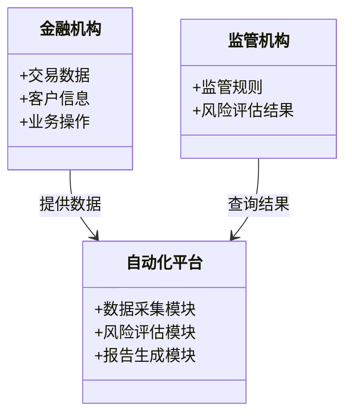
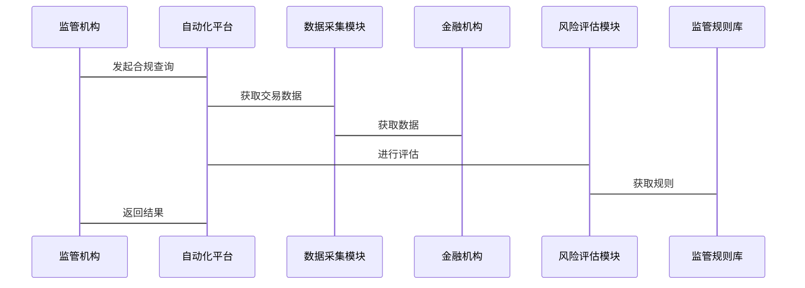

                 


# 金融监管合规风险评估自动化平台

> 关键词：金融监管、合规风险、自动化平台、风险评估、数据驱动

> 摘要：本文深入探讨了金融监管合规风险评估自动化平台的设计与实现，结合实际案例，详细分析了平台的核心功能、算法原理、系统架构及项目实战，旨在为金融机构和监管机构提供高效的风险管理解决方案。

---

# 第一部分: 金融监管合规风险评估自动化平台背景与核心概念

# 第1章: 金融监管合规风险评估概述

## 1.1 问题背景

### 1.1.1 金融监管的重要性
金融监管是维护金融市场稳定、保护投资者利益的重要手段。随着金融市场的复杂化和全球化，传统的监管方式已难以应对日益增长的合规风险。

### 1.1.2 合规风险的定义与特征
合规风险是指金融机构在经营活动中因违反相关法律法规或监管要求而可能面临的法律制裁、财务损失或声誉损害。其主要特征包括多样性、动态性和复杂性。

### 1.1.3 传统监管模式的局限性
传统监管模式依赖人工审核，效率低、成本高，且容易受到主观因素影响，难以应对海量数据和复杂场景。

## 1.2 问题描述

### 1.2.1 合规风险的主要来源
合规风险主要来源于金融机构的业务操作、内部管理、外部环境变化等多方面。

### 1.2.2 金融机构面临的监管挑战
金融机构需要应对不断变化的监管要求，同时处理海量的交易数据，这对传统的监管方式提出了更高的要求。

### 1.2.3 监管机构的需求与痛点
监管机构需要实时监控金融机构的合规情况，但传统的人工监管方式效率低下，难以覆盖所有风险点。

## 1.3 问题解决

### 1.3.1 自动化平台的提出
通过构建自动化平台，利用大数据和人工智能技术，实现对金融机构的实时监控和风险评估。

### 1.3.2 平台的目标与核心功能
平台的目标是通过自动化技术，提高监管效率，降低合规风险。核心功能包括数据采集、风险评估、规则匹配、报告生成等。

### 1.3.3 平台的预期效果与价值
预期效果包括提高监管效率、降低合规风险、优化资源配置。平台的价值在于帮助金融机构和监管机构实现高效、精准的合规管理。

## 1.4 边界与外延

### 1.4.1 平台的功能边界
平台的功能边界包括数据采集、风险评估、规则匹配和报告生成。

### 1.4.2 平台的适用范围
平台适用于银行、证券、保险等金融机构，以及监管机构。

### 1.4.3 平台与相关系统的区别与联系
平台与金融机构内部的业务系统有接口交互，与监管机构的管理系统有数据对接。

## 1.5 核心要素组成

### 1.5.1 数据来源与处理
数据来源包括金融机构的交易数据、客户信息、监管规则等。数据处理包括清洗、转换和存储。

### 1.5.2 风险评估模型
模型基于机器学习算法，结合监管规则，对金融机构的合规风险进行评估。

### 1.5.3 监管规则库
规则库包含所有相关的法律法规和监管要求，用于指导风险评估。

### 1.5.4 可视化与报告生成
平台提供可视化界面，生成风险评估报告，便于监管机构和金融机构查看和分析。

---

# 第2章: 核心概念与联系

## 2.1 核心概念原理

### 2.1.1 数据驱动的监管
通过收集和分析海量数据，利用大数据技术进行风险识别和预测。

### 2.1.2 风险评估模型的构建
基于机器学习算法，构建风险评估模型，实现对合规风险的精准识别。

### 2.1.3 监管规则的动态更新
根据法律法规的变化，动态更新监管规则库，确保平台的持续有效性。

## 2.2 核心概念属性对比

| 概念       | 数据来源 | 风险评估模型 | 监管规则库 |
|------------|----------|--------------|------------|
| 数据驱动的监管 | 交易数据、客户信息 | 基于机器学习的模型 | 动态更新的规则库 |
| 风险评估模型 | 输入数据特征 | 输出风险评分 | 基于规则的评分标准 |
| 监管规则库 | 规则类型 | 规则更新频率 | 规则执行方式 |

## 2.3 ER实体关系图

```mermaid
er
  actor: 监管机构
  actor --> rule_base: 查询监管规则
  actor --> risk_model: 使用风险评估模型
  rule_base <-- risk_model: 基于规则库构建模型
  data_source --> risk_model: 提供数据输入
```

---

# 第3章: 算法原理与数学模型

## 3.1 算法原理

### 3.1.1 模型训练流程
1. 数据清洗与预处理
2. 特征提取与选择
3. 模型训练与优化
4. 模型评估与验证

### 3.1.2 模型训练代码实现

```python
import pandas as pd
from sklearn.model_selection import train_test_split
from sklearn.linear_model import LogisticRegression
from sklearn.metrics import accuracy_score

# 加载数据
data = pd.read_csv('financial_data.csv')

# 数据清洗与预处理
data.dropna()
data['label'] = data['label'].map({'合规': 0, '不合规': 1})

# 特征选择
features = data[['feature1', 'feature2', 'feature3']]
label = data['label']

# 数据分割
X_train, X_test, y_train, y_test = train_test_split(features, label, test_size=0.2)

# 模型训练
model = LogisticRegression()
model.fit(X_train, y_train)

# 模型评估
y_pred = model.predict(X_test)
print('准确率:', accuracy_score(y_test, y_pred))
```

### 3.1.3 模型评估与优化
通过交叉验证和网格搜索，优化模型的参数，提高模型的准确率和召回率。

## 3.2 数学模型

### 3.2.1 线性回归模型
$$ y = \beta_0 + \beta_1x_1 + \beta_2x_2 + \dots + \beta_nx_n $$

### 3.2.2 逻辑回归模型
$$ P(y=1|x) = \frac{e^{\beta_0 + \beta_1x_1 + \dots + \beta_nx_n}}{1 + e^{\beta_0 + \beta_1x_1 + \dots + \beta_nx_n}} $$

---

# 第4章: 系统分析与架构设计

## 4.1 问题场景介绍

### 4.1.1 金融机构的合规需求
金融机构需要实时监控自身的业务活动，确保符合监管要求。

### 4.1.2 监管机构的监管需求
监管机构需要实时监控金融机构的合规情况，及时发现和处理问题。

## 4.2 系统功能设计

### 4.2.1 领域模型设计



### 4.2.2 系统架构设计


### 4.2.3 接口设计



---

# 第5章: 项目实战

## 5.1 环境安装

### 5.1.1 安装Python
```bash
python --version
pip install --upgrade pip
```

### 5.1.2 安装依赖库
```bash
pip install pandas scikit-learn mermaid4jupyter
```

## 5.2 系统核心实现源代码

### 5.2.1 数据采集模块

```python
import requests
import json

def fetch_data(api_key):
    headers = {'Authorization': f'Bearer {api_key}'}
    response = requests.get('https://api.financial.com/data', headers=headers)
    return response.json()

# 示例调用
data = fetch_data('your_api_key')
print(data)
```

### 5.2.2 风险评估模块

```python
from sklearn import metrics

def evaluate_model(y_true, y_pred):
    print('准确率:', metrics.accuracy_score(y_true, y_pred))
    print('召回率:', metrics.recall_score(y_true, y_pred))
    print('F1分数:', metrics.f1_score(y_true, y_pred))
```

## 5.3 案例分析与详细讲解

### 5.3.1 案例背景
某银行面临合规风险，希望通过平台进行实时监控和风险评估。

### 5.3.2 数据分析
通过对交易数据的分析，发现某些交易行为存在合规风险。

### 5.3.3 风险评估
平台生成风险评估报告，指出具体的风险点和建议的应对措施。

## 5.4 项目小结

### 5.4.1 项目总结
通过自动化平台，金融机构和监管机构能够高效、精准地进行合规风险管理。

### 5.4.2 项目价值
降低合规风险，提高监管效率，优化资源配置。

---

# 第6章: 最佳实践与小结

## 6.1 小结

### 6.1.1 核心内容总结
本文详细介绍了金融监管合规风险评估自动化平台的设计与实现，涵盖了背景分析、核心概念、算法原理、系统架构和项目实战。

### 6.1.2 重要结论
通过自动化平台，金融机构和监管机构能够更高效地应对合规风险，提升整体监管效率。

## 6.2 注意事项

### 6.2.1 数据安全
确保数据的安全性和隐私性，避免数据泄露和滥用。

### 6.2.2 模型优化
定期更新模型和规则库，确保平台的持续有效性和准确性。

## 6.3 拓展阅读

### 6.3.1 推荐书籍
1. 《金融风险管理》
2. 《机器学习实战》
3. 《数据驱动的监管》

### 6.3.2 推荐博客
1. [金融科技博客](https://www.techfin.com)
2. [风险管理专栏](https://www.riskmanagement.com)
3. [人工智能与金融](https://www.aiinfinance.com)

---

# 作者：AI天才研究院 & 禅与计算机程序设计艺术

---

本文通过系统化的分析和实践，详细探讨了金融监管合规风险评估自动化平台的设计与实现。希望本文能够为金融机构和监管机构提供有价值的参考，帮助他们在复杂的金融环境中更好地应对合规风险，实现高效、精准的监管管理。

