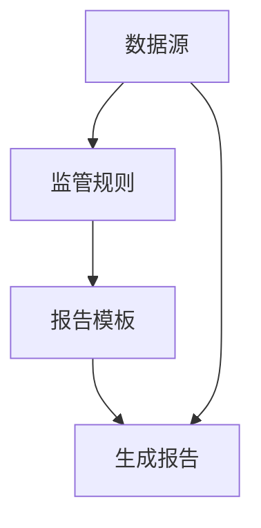
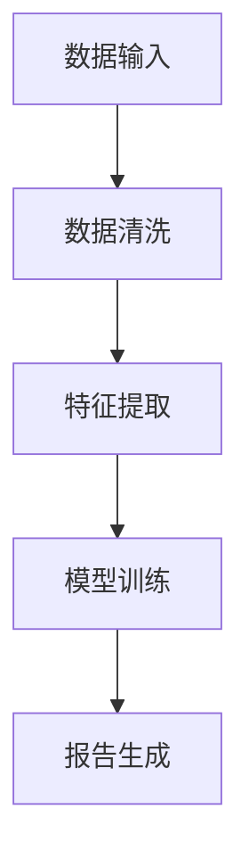

                 


# 《金融监管报告自动化生成》

---

## 关键词：  
金融监管，自然语言处理，机器学习，报告生成，自动化系统

---

## 摘要：  
随着金融市场的快速发展，监管报告的生成变得越来越复杂和耗时。传统的手动报告生成方式效率低下，且容易出错。本文将深入探讨如何利用自然语言处理（NLP）和机器学习技术实现金融监管报告的自动化生成。通过分析监管报告的核心要素，结合先进的技术手段，提出一套完整的解决方案，涵盖数据采集、模型训练、报告生成和优化改进等环节。本文还将通过实际案例和系统架构设计，详细阐述如何构建一个高效可靠的金融监管报告自动化系统。

---

# 第1章: 金融监管报告的现状与挑战

## 1.1 传统金融监管模式的局限性  
传统的金融监管模式依赖于人工收集和分析数据，生成报告的过程繁琐且耗时。监管机构需要处理大量的非结构化数据（如新闻、公告）和结构化数据（如财务报表），这使得手动操作效率低下，且容易出现人为错误。此外，监管规则的复杂性和多样性进一步增加了报告生成的难度。

## 1.2 金融监管报告的复杂性与多样性  
金融监管报告通常包含丰富的信息，如市场分析、风险评估、合规检查等。这些报告需要遵循严格的格式和内容要求，且不同机构可能有不同的模板和标准。传统的自动化工具难以应对这种多样性和复杂性。

## 1.3 金融机构面临的合规压力  
随着全球金融市场的不断扩张，监管机构对金融机构的合规要求越来越高。金融机构需要频繁生成详细的监管报告，以满足国内外监管机构的要求。然而，手动生成报告的方式不仅效率低下，还可能导致合规风险的增加。

---

## 1.4 问题背景与目标  
### 1.4.1 问题背景的定义与描述  
金融监管报告的生成需要解决以下问题：  
1. 数据来源多样，格式不统一。  
2. 监管规则复杂，难以自动化处理。  
3. 报告生成效率低，容易出错。  

### 1.4.2 问题解决的必要性  
通过自动化生成监管报告，可以显著提高效率，降低合规成本，并减少人为错误。同时，自动化系统能够实时处理数据，确保报告的准确性和及时性。

### 1.4.3 边界与外延的界定  
本研究的边界包括：  
1. 数据来源：包括公开财报、新闻、公告等结构化和非结构化数据。  
2. 报告类型：涵盖市场分析、风险评估、合规检查等。  
3. 输出形式：支持多种格式的报告生成，如PDF、Excel等。  

### 1.4.4 核心要素与概念结构  
- **数据源**：结构化数据（如财务报表）和非结构化数据（如新闻）。  
- **监管规则**：包括法律法规、行业标准等。  
- **报告模板**：固定的报告格式和内容要求。  

---

## 1.5 本章小结  
本章分析了传统金融监管模式的局限性，指出了金融机构面临的合规压力，并明确了金融监管报告自动化生成的目标和范围。下一章将深入探讨金融监管报告自动化的核心概念和技术原理。

---

# 第2章: 金融监管报告自动化的核心概念  

## 2.1 数据源的多样性与处理方法  
### 2.1.1 结构化数据的处理  
结构化数据（如财务报表）可以通过数据库查询和数据清洗直接获取。  
### 2.1.2 非结构化数据的处理  
非结构化数据（如新闻、公告）需要通过自然语言处理技术（如分词、实体识别）进行处理。  

## 2.2 自然语言处理技术的作用  
### 2.2.1 文本解析  
通过NLP技术提取文本中的关键信息，如公司名称、财务数据等。  
### 2.2.2 实体识别  
识别文本中的实体（如公司、人名、金额等），并将其结构化。  

## 2.3 机器学习模型的应用  
### 2.3.1 监督学习  
使用分类模型对文本进行分类，例如将新闻分为“正面”、“负面”、“中性”。  
### 2.3.2 生成模型  
使用生成模型（如GPT）自动生成符合要求的报告内容。  

## 2.4 生成报告的逻辑结构  
### 2.4.1 报告模板  
定义报告的结构和内容，如标题、摘要、正文等。  
### 2.4.2 内容填充  
根据模板和数据生成报告内容，确保符合监管要求。  

---

## 2.5 核心概念的对比分析  
### 2.5.1 概念属性特征对比表  

| 概念         | 属性         | 特征                       |
|--------------|--------------|---------------------------|
| 数据源       | 类型         | 结构化数据、非结构化数据   |
| NLP技术     | 功能         | 文本解析、实体识别         |
| 机器学习模型 | 类型         | 分类、生成                 |
| 报告生成     | 方法         | 模板填充、自动生成         |

### 2.5.2 实体关系图  



---

## 2.6 本章小结  
本章详细介绍了金融监管报告自动化的核心概念，包括数据源的多样性、NLP技术的作用以及机器学习模型的应用。通过对比分析和实体关系图，进一步明确了各概念之间的关系。下一章将深入探讨算法原理和数学模型。

---

# 第3章: 金融监管报告生成的算法原理  

## 3.1 数据预处理流程  
### 3.1.1 数据清洗  
去除噪声数据，如停用词、标点符号等。  
### 3.1.2 特征提取  
从文本中提取关键词、实体等特征。  

## 3.2 模型训练过程  
### 3.2.1 监督学习模型  
使用分类模型对文本进行分类，如判断新闻的性质（正面/负面）。  
### 3.2.2 生成模型  
使用生成模型（如Transformer架构）生成符合模板的报告内容。  

## 3.3 生成模型的概率计算  
### 3.3.1 概率公式  
$$p(y|x) = \frac{\exp(s(x,y))}{\sum_{y'} \exp(s(x,y'))}$$  
其中，$s(x,y)$表示输入$x$和目标$y$之间的相似性。  

---

## 3.4 算法流程图  



---

## 3.5 本章小结  
本章详细讲解了金融监管报告生成的算法原理，包括数据预处理、模型训练和生成过程。通过公式和流程图，进一步明确了各步骤之间的关系。下一章将从系统架构的角度，探讨如何实现这一自动化过程。

---

# 第4章: 金融监管报告自动化系统的架构设计  

## 4.1 系统功能设计  
### 4.1.1 数据采集模块  
从多种数据源（如API、文件）获取数据。  
### 4.1.2 数据处理模块  
对数据进行清洗和特征提取。  
### 4.1.3 模型训练模块  
训练生成模型，生成报告内容。  

## 4.2 系统架构图  


---

## 4.3 系统交互流程  


---

## 4.4 本章小结  
本章从系统架构的角度，详细设计了金融监管报告自动化系统的功能模块和交互流程。通过架构图和交互图，明确了系统的各个部分如何协同工作。下一章将通过实际案例，探讨如何实现这一系统。

---

# 第5章: 项目实战与优化  

## 5.1 环境安装与配置  
### 5.1.1 Python环境  
安装Python 3.8及以上版本。  
### 5.1.2 依赖库安装  
安装NLP库（如spaCy、NLTK）和机器学习库（如TensorFlow、PyTorch）。  

## 5.2 核心代码实现  
### 5.2.1 数据处理代码  

```python
import spacy
nlp = spacy.load("en_core_web_sm")
doc = nlp("The company's revenue increased by 10% last quarter.")
entities = [ent.text for ent in doc.ents]
print(entities)
```

### 5.2.2 模型训练代码  

```python
import tensorflow as tf
from tensorflow.keras import layers
model = tf.keras.Sequential([
    layers.Embedding(input_dim=10000, output_dim=100),
    layers.LSTM(64),
    layers.Dense(1, activation="sigmoid")
])
model.compile(optimizer="adam", loss="binary_crossentropy", metrics=["accuracy"])
model.fit(X_train, y_train, epochs=10, batch_size=32)
```

## 5.3 实际案例分析  
以某公司财报为例，展示如何从数据处理到模型训练，最终生成监管报告的全过程。  

---

## 5.4 系统优化与改进  
### 5.4.1 模型优化  
使用超参数调优和模型集成技术提高生成效果。  
### 5.4.2 系统性能优化  
优化数据处理和模型推理的速度，确保系统高效运行。  

---

## 5.5 本章小结  
本章通过实际案例和代码实现，展示了如何构建一个金融监管报告自动化的系统。同时，提出了优化建议，为后续研究提供了方向。

---

# 第6章: 结论与展望  

## 6.1 研究总结  
金融监管报告自动化生成是一项具有重要意义的技术，能够显著提高监管效率和合规性。通过结合NLP和机器学习技术，可以实现高质量的自动化报告生成。

## 6.2 未来展望  
未来，随着AI技术的不断发展，金融监管报告自动化将更加智能化和个性化。可能的研究方向包括：多语言支持、实时报告生成、动态模板适应等。

---

## 作者：  
AI天才研究院/AI Genius Institute & 禅与计算机程序设计艺术 /Zen And The Art of Computer Programming

