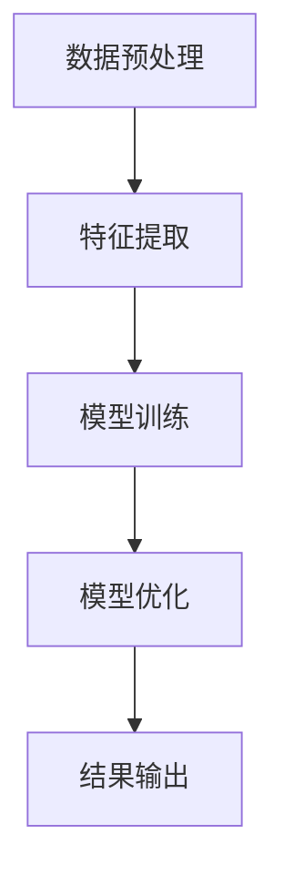
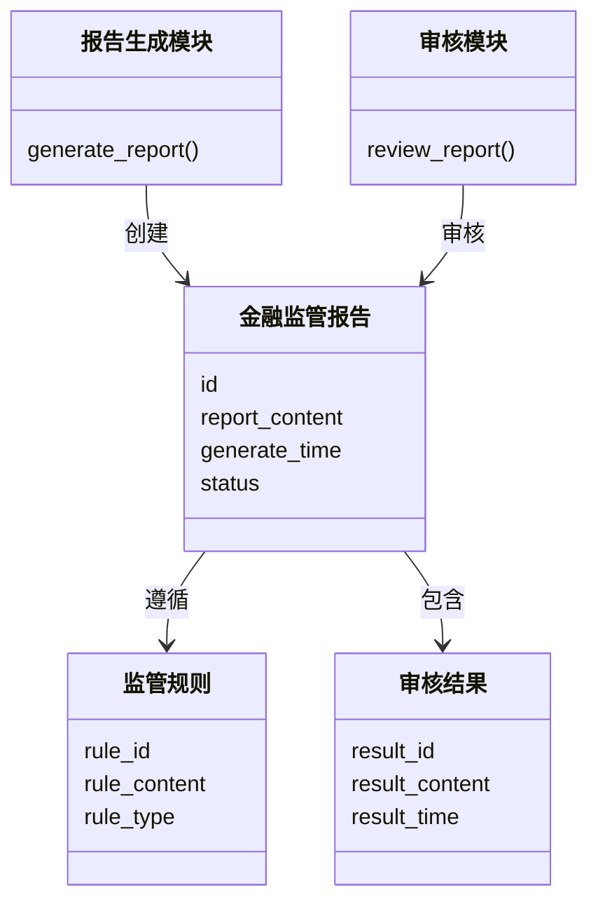
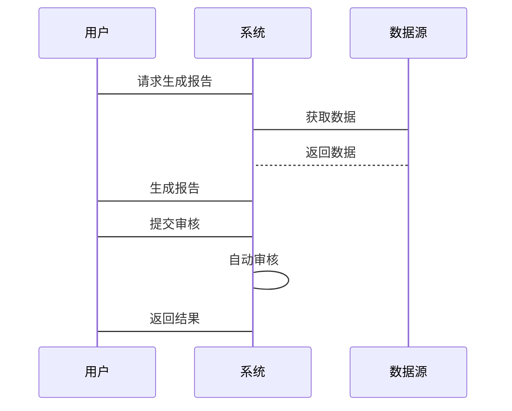

                 


# 金融监管报告自动化生成与审核系统

## 关键词
金融监管, 自动化生成, 智能审核, 机器学习, 自然语言处理, 数据挖掘

## 摘要
随着金融市场的快速发展，监管报告的生成与审核变得日益复杂。传统的人工监管方式效率低下，容易出错，难以应对海量数据的处理需求。本篇文章将详细介绍如何利用自然语言处理、机器学习和数据挖掘等技术，构建一个高效的金融监管报告自动化生成与审核系统。通过系统化的分析和设计，本文将展示如何利用技术手段解决实际监管问题，提升监管效率和准确性。

---

# 第1章 问题背景与需求分析

## 1.1 问题背景

### 1.1.1 金融监管的重要性
金融监管是维护金融市场稳定、保护投资者利益的重要手段。随着金融市场的扩大和金融产品的多样化，监管机构需要处理海量的金融数据和报告，以确保市场的合规性和透明性。

### 1.1.2 传统监管报告的痛点
1. **人工审核效率低**：传统监管报告的生成和审核主要依赖人工操作，耗时长且容易出错。
2. **数据量大**：金融机构产生的报告数量庞大，人工处理难以应对。
3. **规则复杂**：金融监管规则繁多且不断更新，人工理解与执行难度大。

### 1.1.3 自动化监管的必要性
自动化监管能够提高效率、减少错误率，并能够快速适应监管规则的变化。通过技术手段实现监管报告的自动生成与智能审核，是金融监管发展的必然趋势。

## 1.2 问题描述

### 1.2.1 监管报告的复杂性
金融监管报告通常包含大量非结构化数据，如文本、表格和图表，这使得自动化处理变得复杂。

### 1.2.2 人工审核的局限性
人工审核不仅效率低，还容易受到主观因素的影响，导致审核结果的不一致性。

### 1.2.3 数据量与效率的矛盾
金融机构产生的数据量呈指数级增长，人工方式难以在合理时间内完成所有报告的审核。

## 1.3 问题解决

### 1.3.1 自动化生成的解决方案
利用自然语言处理技术，从结构化数据中自动生成符合要求的监管报告。

### 1.3.2 智能审核的技术路径
通过机器学习模型对报告内容进行自动分类和审核，减少人工干预。

### 1.3.3 数据驱动的监管模式
构建数据驱动的监管系统，利用大数据分析技术实时监控市场动态，提前发现潜在风险。

## 1.4 边界与外延

### 1.4.1 系统的边界
本系统仅关注监管报告的生成与审核，不涉及其他监管流程，如行政处罚或调查。

### 1.4.2 相关领域的外延
系统输出的报告可作为其他监管系统的输入，例如风险评估系统或预警系统。

### 1.4.3 适用场景与限制
适用于需要处理大量监管报告的金融机构和监管机构，不适用于需要复杂法律判断的场景。

## 1.5 核心要素组成

### 1.5.1 数据来源
- **结构化数据**：如财务报表、交易数据。
- **非结构化数据**：如文本描述、新闻报道。

### 1.5.2 系统功能模块
- **数据采集模块**：负责采集监管所需的数据。
- **报告生成模块**：根据规则自动生成监管报告。
- **智能审核模块**：利用机器学习模型对报告进行分类和审核。

### 1.5.3 业务流程
1. 数据采集：从金融机构获取结构化和非结构化数据。
2. 数据预处理：清洗和整理数据，提取关键特征。
3. 报告生成：根据预处理后的数据生成监管报告。
4. 报告审核：利用机器学习模型对报告进行分类和审核，识别潜在风险。

---

# 第2章 核心概念与联系

## 2.1 核心概念原理

### 2.1.1 自然语言处理
自然语言处理（NLP）是实现监管报告自动生成的关键技术，能够将结构化数据转化为自然语言描述。

### 2.1.2 机器学习模型
机器学习模型用于分类和审核报告内容，帮助识别潜在的违规行为。

### 2.1.3 数据挖掘技术
数据挖掘技术用于从海量数据中提取有用信息，支持监管决策。

## 2.2 概念属性特征对比

| 概念       | 属性1 | 属性2 | 属性3 |
|------------|-------|-------|-------|
| 自然语言处理 | 文本分析 | 语义理解 | 实体识别 |
| 机器学习模型 | 数据驱动 | 模型训练 | 预测能力 |
| 数据挖掘技术 | 数据提取 | 模式识别 | 可视化分析 |

## 2.3 ER实体关系图

```mermaid
erd
    entity 金融监管报告 {
        id
        report_content
        generate_time
        status
    }
    entity 监管规则 {
        rule_id
        rule_content
        rule_type
    }
    entity 审核结果 {
        result_id
        result_content
        result_time
    }
    金融监管报告 --> 监管规则: 遵循
    金融监管报告 --> 审核结果: 包含
```

---

# 第3章 算法原理讲解

## 3.1 模型训练流程

### 3.1.1 数据预处理

```python
import pandas as pd
import numpy as np

# 数据加载
data = pd.read_csv('financial_reports.csv')

# 数据清洗
data = data.dropna()
data = data.replace({np.nan: 0})

# 特征提取
features = data[['revenue', 'net_income', 'total_assets']]
labels = data['status']  # 0: 正常，1: 异常
```

### 3.1.2 模型训练

```python
from sklearn.ensemble import RandomForestClassifier
from sklearn.model_selection import train_test_split
from sklearn.metrics import accuracy_score

# 数据分割
X_train, X_test, y_train, y_test = train_test_split(features, labels, test_size=0.2)

# 模型训练
model = RandomForestClassifier()
model.fit(X_train, y_train)

# 模型评估
y_pred = model.predict(X_test)
print("Accuracy:", accuracy_score(y_test, y_pred))
```

### 3.1.3 算法流程图



### 3.1.4 数学模型

模型采用随机森林算法，公式如下：

$$
y = \sum_{i=1}^{n} \theta_i x_i + \beta
$$

其中：
- $y$ 是预测结果
- $\theta_i$ 是特征 $x_i$ 的系数
- $\beta$ 是截距项

---

# 第4章 系统分析与架构设计方案

## 4.1 问题场景介绍

### 4.1.1 项目背景
本项目旨在构建一个能够自动生成和审核金融监管报告的系统，以提高监管效率和准确性。

### 4.1.2 项目目标
- 实现监管报告的自动化生成
- 建立智能审核机制，识别潜在风险

## 4.2 系统功能设计

### 4.2.1 领域模型类图



### 4.2.2 系统架构设计


### 4.2.3 接口设计
- **数据接口**：与金融机构的数据系统对接，获取监管数据。
- **报告接口**：生成标准化的监管报告格式。
- **审核接口**：接收审核结果，更新报告状态。

### 4.2.4 交互设计



---

# 第5章 项目实战

## 5.1 环境安装

### 5.1.1 技术选型
- **编程语言**：Python
- **框架与库**：TensorFlow、PyTorch、Scikit-learn
- **工具**：Jupyter Notebook、VS Code

### 5.1.2 环境配置

```bash
pip install numpy pandas scikit-learn
```

## 5.2 核心代码实现

### 5.2.1 数据预处理

```python
import pandas as pd
import numpy as np

data = pd.read_csv('financial_reports.csv')
data = data.dropna().replace({np.nan: 0})
```

### 5.2.2 特征提取

```python
features = data[['revenue', 'net_income', 'total_assets']]
```

### 5.2.3 模型训练

```python
from sklearn.ensemble import RandomForestClassifier
from sklearn.model_selection import train_test_split

X_train, X_test, y_train, y_test = train_test_split(features, labels, test_size=0.2)
model = RandomForestClassifier()
model.fit(X_train, y_train)
```

## 5.3 案例分析

### 5.3.1 案例数据

```python
sample_data = {
    'revenue': [1000000, 2000000, 1500000],
    'net_income': [100000, 200000, 150000],
    'total_assets': [5000000, 10000000, 7500000]
}
```

### 5.3.2 模型预测

```python
y_pred = model.predict([[1000000, 100000, 5000000]])
print(y_pred)
```

---

# 第6章 最佳实践

## 6.1 小结
本篇文章详细介绍了金融监管报告自动化生成与审核系统的构建过程，包括背景分析、核心概念、算法原理、系统架构和项目实战。通过技术手段实现监管流程的自动化，能够显著提升监管效率和准确性。

## 6.2 注意事项
- 确保数据的准确性和完整性。
- 定期更新模型，适应监管规则的变化。
- 严格控制系统的安全性和稳定性。

## 6.3 拓展阅读
- 《机器学习实战》
- 《自然语言处理入门》
- 《金融监管科技》

---

# 作者

作者：AI天才研究院/AI Genius Institute & 禅与计算机程序设计艺术 /Zen And The Art of Computer Programming

